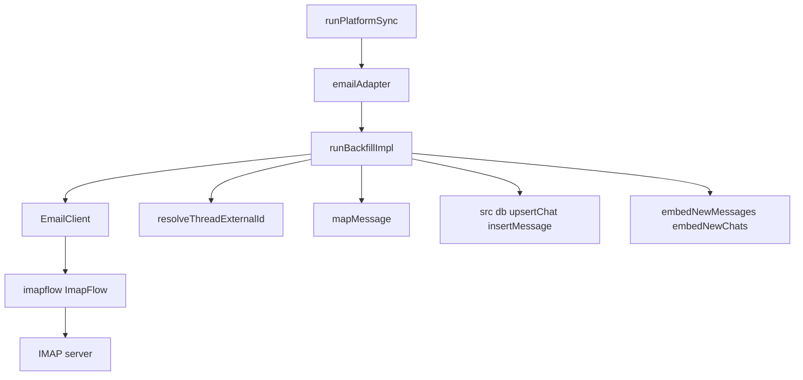
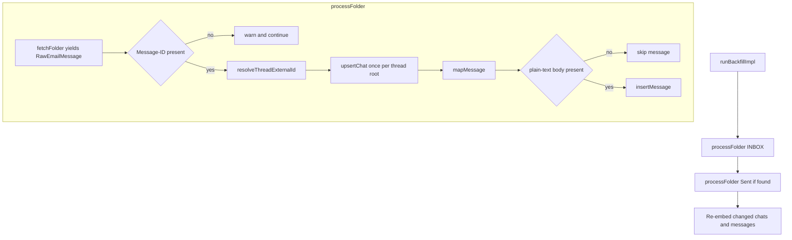

# Design Document — email-sync

## Overview

Email Sync is a platform adapter that connects to an IMAP mailbox via `imapflow`, fetches every message from the INBOX and Sent folders in batches of 200, maps each message to the shared archive schema under `platform = 'email'`, and groups replies into threads using the `Message-ID` and `In-Reply-To` headers. It plugs into the shared sync orchestration (`runPlatformSync`) so it inherits incremental-vs-backfill mode selection, `sync_state` tracking, and FTS + embedding re-indexing without reimplementing them.

The adapter is exercised through the `PlatformAdapter` contract (`runBackfill`, `syncIncremental`, `startListener`) and constructed by an `AdapterFactory` (`createEmailAdapter`) from credentials, matching every other adapter in `src/platforms/`. A thin injectable `EmailClient` interface isolates all `imapflow` I/O so tests run against fixture data with no real IMAP connection.

**Users**: operators running `khipu sync email` (or `npm run sync:email`) to fold their mailbox into the local KhipuChat archive for MCP / CLI / Web querying.

### Goals
- Sync both received (INBOX) and sent email in a single run, memory-bounded via 200-message batches.
- Group replies into threads in one pass, tolerating out-of-order delivery, without a second DB scan.
- Be idempotent: repeated runs create no duplicate records; incremental runs fetch only new mail.
- Keep all IMAP I/O behind an injectable seam so the suite runs without network access.

### Non-Goals
- Sending email, HTML body rendering, attachment download, calendar-invite handling.
- Real-time IMAP IDLE or continuous polling (`startListener` is intentionally a no-op).
- Any change to the `messages` / `chats` schema in `src/db.ts` (consumed read-only).

## Boundary Commitments

### This Spec Owns
- `src/platforms/email/client.ts`: the `EmailClient` / `RawEmailMessage` / `EmailSearchCriteria` contracts and the `imapflow`-backed implementation, including folder discovery, batching, and header extraction.
- `src/platforms/email/sync.ts`: `hashStr`, `resolveThreadExternalId`, `mapMessage`, `runBackfillImpl`, `createEmailAdapter` / `emailAdapter`, and the runnable `main()` entry point.
- The `'email'` literal in the `Platform` union (`src/platforms/types.ts`).
- The `"sync:email"` npm script and the `imapflow` runtime dependency in `package.json`.
- The `email` entry in `LEGACY_ENV_VARS` (`src/account-registry.ts`) declaring `EMAIL_IMAP_HOST` / `EMAIL_IMAP_USER` / `EMAIL_IMAP_PASS`.

### Out of Boundary
- The `messages` / `chats` schema and all persistence primitives in `src/db.ts` (used read-only through `upsertChat` / `insertMessage`).
- Shared sync orchestration (`runPlatformSync`, `sync_state`) and embedding index (`embedNewMessages` / `embedNewChats`): consumed, never modified.
- MCP tools, CLI surfaces, and Web routes: email records flow to them through the shared schema with no email-specific code.

### Allowed Dependencies
- `src/db.ts` (`upsertChat`, `insertMessage`, `initDb`, `Message` type).
- `src/platforms/types.ts` (`Platform`, `PlatformAdapter`).
- `src/sync-runner.ts` (`runPlatformSync`), `src/vec-db.ts` (`isIndexed`), `src/index-embeddings.ts` (`embedNewMessages`, `embedNewChats`), `src/account-registry.ts` (`AccountCredentials`).
- `imapflow` (`^1.3.3`) as the sole new runtime dependency.

### Revalidation Triggers
- Any change to the `Message` or `Chat` interface, or to `upsertChat` / `insertMessage` signatures, in `src/db.ts`.
- Any change to the `PlatformAdapter` contract or the `Platform` union in `src/platforms/types.ts`.
- Any change to `runPlatformSync`'s incremental / backfill selection or its `since` semantics.
- Any change to how `AccountCredentials.fields` are keyed by `AccountRegistry`.

## Architecture

### Existing Architecture Analysis

The adapter conforms to established KhipuChat patterns:
- **Adapter isolation**: all email code lives under `src/platforms/email/` and reaches the database only through `src/db.ts` exports, never touching schema or other adapters (per `structure.md`).
- **Shared runner delegation**: sync-state tracking and mode selection are owned by `runPlatformSync`; the adapter supplies `runBackfill` and `syncIncremental` and lets the runner decide which to call.
- **Injectable I/O seam**: mirroring how other adapters keep external clients separable, `EmailClient` fronts all `imapflow` calls so tests inject a fixture-returning mock (consistent with the `:memory:` real-DB test convention).
- **Stable chat identity by external key**: chats are keyed by a stable `external_id` (the thread-root `Message-ID`); `upsertChat` returns the numeric surrogate `chat_id`. This matches the iMessage / WeChat / Discord identity pattern.

### Architecture Pattern & Boundary Map



**Architecture Integration**:
- **Selected pattern**: pipeline adapter (fetch => resolve thread => map => persist) behind the `PlatformAdapter` contract.
- **Domain boundaries**: `client.ts` owns all IMAP protocol concerns and header extraction; `sync.ts` owns thread resolution, schema mapping, and persistence orchestration. The two never overlap on IMAP details.
- **Existing patterns preserved**: adapter-only-calls-`db.ts`, shared `runPlatformSync`, injectable external client, `hashStr` (FNV-1a) reused verbatim from sibling adapters.
- **Steering compliance**: fully local (no external API beyond the user's own IMAP server), synchronous DB writes, files under the 200-line limit, TypeScript strict with no `any`.

### Technology Stack

| Layer | Choice / Version | Role in Feature | Notes |
|-------|------------------|-----------------|-------|
| CLI / Entry | `tsx` runnable `sync.ts` + `sync:email` script | Invocation surface | Also reachable via `khipu sync email` |
| Backend / Services | `imapflow` `^1.3.3` | IMAP connect, folder list, fetch, SEARCH | Behind `EmailClient` seam |
| Orchestration | `runPlatformSync` (existing) | Mode selection, `sync_state`, re-index | Not modified |
| Data / Storage | `better-sqlite3-multiple-ciphers` via `src/db.ts` | `upsertChat` / `insertMessage` | Read-only consumer of schema |

## File Structure Plan

### Directory Structure
```
src/platforms/email/
├── client.ts   # EmailClient + EmailSearchCriteria + RawEmailMessage; imapflow implementation (connect, listSpecialFolder, batched fetchFolder with optional SEARCH since)
└── sync.ts     # hashStr, resolveThreadExternalId, mapMessage, runBackfillImpl, createEmailAdapter, emailAdapter, main()
tests/
└── email.test.ts   # Unit + integration tests against a mock EmailClient
```

### Modified Files
- `src/platforms/types.ts`: `'email'` present in the `Platform` union.
- `src/account-registry.ts`: `LEGACY_ENV_VARS.email` must list exactly `['EMAIL_IMAP_HOST', 'EMAIL_IMAP_USER', 'EMAIL_IMAP_PASS']` so the legacy no-config-file path passes the same keys `createEmailAdapter` reads. No `IMAP_PORT` entry (port 993 is fixed in `client.ts`).
- `package.json`: `sync:email` script and `imapflow` dependency.

> Each `email/` file has one responsibility: `client.ts` = protocol I/O, `sync.ts` = mapping, threading, and adapter wiring. The boundary above matches this split exactly; no email file writes schema.

## System Flows

Two folders are fetched in sequence (INBOX, then the discovered Sent folder). Each yielded message is resolved to a thread, its chat is upserted once, and the message is either persisted or skipped.



**Key decisions**:
- **Thread resolution** (`resolveThreadExternalId`): if `In-Reply-To` names a `Message-ID` already seen, the message inherits that thread's external id; otherwise the message becomes its own thread root. An unseen parent (out-of-order or cross-batch) is treated as a new root, so partial and reordered fetches stay consistent.
- **Skip on no plain-text** (Requirement 3.3): a message whose extracted body is `null` is skipped before `insertMessage`; the thread's chat may still exist if other messages in the thread carry text.
- **Incremental mode**: when `runPlatformSync` calls `syncIncremental(db, since)`, the same pipeline runs with `EmailSearchCriteria { since }`, which narrows the fetch via IMAP `SEARCH since` before batching.

## Requirements Traceability

| Requirement | Summary | Components | Interfaces / Flows |
|-------------|---------|------------|--------------------|
| 1.1 | Credentials only from the three env vars | `createEmailAdapter`, `emailAdapter` | reads `credentials.fields['EMAIL_IMAP_*']` |
| 1.2 | Exit listing missing vars | `createEmailAdapter` guard | `missing.length > 0` => stderr + `process.exit(1)` |
| 2.1 | Fetch all INBOX messages | `runBackfillImpl` / `EmailClient.fetchFolder` | `processFolder('INBOX')` |
| 2.2 | Fetch all Sent messages | `EmailClient.listSpecialFolder` + `fetchFolder` | discover `\Sent`, then `processFolder` |
| 2.3 | Batch of at most 200 | `EmailClient.fetchFolder` | `BATCH = 200` range loop |
| 3.1 | `Message-ID` as `external_id` | `mapMessage` | `external_id: raw.messageId` |
| 3.2 | `sender_name` from `From` display name | `mapMessage` / `parseSenderName` | display-name regex |
| 3.3 | Store plain text; skip if absent | `runBackfillImpl` guard + `mapMessage` | skip when body `null` |
| 3.4 | `In-Reply-To` as `reply_to_external_id` | `mapMessage` | `reply_to_external_id: raw.inReplyTo` |
| 3.5 | `platform = 'email'` | `mapMessage`, `Platform` union | literal `'email'` |
| 3.6 | `is_sender` from `EMAIL_IMAP_USER` match | `mapMessage` | case-insensitive `from` contains `userEmail` |
| 4.1 | One chat per thread root | `resolveThreadExternalId` + `upsertChat` | root id = own `Message-ID` |
| 4.2 | Replies share `chat_id` | `resolveThreadExternalId`, `seenChats` | inherited thread external id |
| 4.3 | Chat name from subject | `runBackfillImpl` | `name: raw.subject or raw.messageId` |
| 5.1 | Runnable via `npm run sync:email` | `main()` + `package.json` | `runPlatformSync(emailAdapter, ...)` |
| 5.2 | No duplicate records on re-run | `insertMessage` idempotent on `external_id`; `upsertChat` on `external_id` | dedup by `Message-ID` |
| 5.3 | Only new messages on re-sync | `syncIncremental` + `EmailSearchCriteria` | IMAP `SEARCH since` |

## Components and Interfaces

| Component | Layer | Intent | Req Coverage | Key Dependencies | Contracts |
|-----------|-------|--------|--------------|------------------|-----------|
| `EmailClient` (`client.ts`) | I/O | Isolate all IMAP protocol access | 2.1–2.3, 5.3 | imapflow (External, P0) | Service, Batch |
| `sync.ts` orchestration | Domain | Thread resolution, mapping, persistence, adapter wiring | 1.1–5.3 | `EmailClient` (P0), `src/db.ts` (P0), `runPlatformSync` (P0) | Service, Batch, State |

### I/O — Email Client (`client.ts`)

| Field | Detail |
|-------|--------|
| Intent | Front all `imapflow` access; yield normalized `RawEmailMessage` values |
| Requirements | 2.1, 2.2, 2.3, 5.3 |

**Responsibilities & Constraints**
- Own IMAP connection lifecycle (connect on port 993 secure, always `logout` in `finally`), folder discovery, batched fetch, and header extraction.
- Yield `RawEmailMessage` with `Message-ID` and `In-Reply-To` stripped of angle brackets; body text trimmed to `null` when empty or absent.
- Never touch the database; carry no thread or schema knowledge.

**Dependencies**
- External: `imapflow` `ImapFlow` — connect / list / mailboxOpen / fetch / search (P0).

**Contracts**: Service [x] / Batch [x]

##### Service Interface
```typescript
export interface RawEmailMessage {
  messageId: string          // Message-ID, angle brackets stripped
  inReplyTo: string | null   // In-Reply-To, angle brackets stripped
  from: string               // "Display Name <addr>" assembled from envelope
  subject: string
  date: Date
  text: string | null        // plain-text body; null when absent or empty
}

export interface EmailSearchCriteria {
  since?: Date               // narrows fetch via IMAP SEARCH
}

export interface EmailClient {
  fetchFolder(folder: string, criteria?: EmailSearchCriteria): AsyncGenerator<RawEmailMessage>
  listSpecialFolder(use: '\\Sent'): Promise<string | null>
}

export function createEmailClient(host: string, user: string, pass: string): EmailClient
```
- Preconditions: `host` / `user` / `pass` non-empty (validated upstream in the adapter).
- Postconditions: `fetchFolder` yields every message in `folder` (or every message matching `criteria`), in server order, at most 200 fetched per network round trip; messages whose envelope lacks a `messageId` are dropped at the client boundary.
- Invariants: no message is buffered beyond one batch; the connection is always closed via `logout`.

##### Batch / Job Contract
- Trigger: `fetchFolder(folder, criteria?)` iteration.
- Input: folder path; optional `since`.
- Output: async stream of `RawEmailMessage`.
- Idempotency & recovery: read-only (`mailboxOpen` `readOnly: true`); safe to re-run. `Sent` folder resolved by `\Sent` special-use flag with fallback to the names `Sent` / `Sent Items` / `Sent Messages`; returns `null` when none match.

**Implementation Notes**
- Integration: incremental path uses `client.search({ since }, { uid: true })` then fetches by UID in 200-sized slices; full path fetches sequence range `start:end` in 200-sized windows.
- Validation: `bodyParts: ['text']` requests only the plain-text part; the first available text part is used, others ignored.
- Risks: servers vary in Sent-folder naming (mitigated by special-use + fallback names); absent `Message-ID` (dropped here and re-checked in `sync.ts`).

### Domain — Sync Orchestration (`sync.ts`)

| Field | Detail |
|-------|--------|
| Intent | Resolve threads, map to schema, persist, and expose the `PlatformAdapter` |
| Requirements | 1.1, 1.2, 3.1–3.6, 4.1–4.3, 5.1–5.3 |

**Responsibilities & Constraints**
- Resolve each message to a thread external id and upsert its chat exactly once per thread root.
- Map `RawEmailMessage` to `Message`; skip messages with no plain-text body before insertion (3.3).
- Validate credentials, construct the client, and delegate mode selection to `runPlatformSync`.
- Own no IMAP or schema-definition concerns.

**Dependencies**
- Inbound: `runPlatformSync` — calls `runBackfill` / `syncIncremental` (P0).
- Outbound: `EmailClient` — message source (P0); `src/db.ts` `upsertChat` / `insertMessage` — persistence (P0); `embedNewMessages` / `embedNewChats` — re-index changed rows (P1).

**Contracts**: Service [x] / Batch [x] / State [x]

##### Service Interface
```typescript
export function hashStr(s: string): number  // FNV-1a; shared with sibling adapters

export function resolveThreadExternalId(
  messageId: string,
  inReplyTo: string | null,
  threadMap: Map<string, string>,   // messageId -> thread external id (mutated)
): string
// If inReplyTo is a known key, inherit its thread id and record messageId under it.
// Otherwise, this message is a thread root: record and return its own messageId.

export function mapMessage(
  raw: RawEmailMessage,
  chatId: number,
  userEmail: string,
): Message
// external_id: raw.messageId; sender_name: display name from From;
// text: raw.text ?? null; type: raw.text ? 'text' : 'other';
// timestamp: floor(date/1000); is_sender: from contains userEmail (case-insensitive);
// reply_to_external_id: raw.inReplyTo ?? null; platform: 'email'.

export async function runBackfillImpl(
  client: EmailClient,
  userEmail: string,
  criteria?: EmailSearchCriteria,
  account?: string,
): Promise<void>

export function createEmailAdapter(account: string, credentials: AccountCredentials): PlatformAdapter
export const emailAdapter: PlatformAdapter
```
- Preconditions (`runBackfillImpl`): `client` connected-capable; `userEmail` non-empty.
- Postconditions: every text-bearing message with a `Message-ID` is persisted under its thread's `chat_id`; chats exist for every thread root encountered; changed rows re-embedded when the corresponding index exists.
- Invariants: one chat per unique thread external id (`seenChats` guards duplicate upserts); no message is inserted with a `null` body.

##### State Management
- State model: two in-memory maps per run: `threadMap` (`messageId` => thread external id) and `seenChats` (thread external id => numeric `chat_id`). Both are run-scoped and discarded on completion.
- Persistence & consistency: durable state is delegated to `src/db.ts` (chats/messages) and `runPlatformSync` (`sync_state`).
- Concurrency strategy: single-threaded synchronous DB writes; no shared mutable state across runs.

##### Batch / Job Contract
- Trigger: `runPlatformSync(emailAdapter, db, argv)` from `main()` (or `khipu sync email`).
- Input: `process.argv` flags interpreted by the shared runner; credentials from env or `AccountRegistry`.
- Output: chats + messages in SQLite; console summary of thread and message counts.
- Idempotency & recovery: dedup by `Message-ID` (`insertMessage`) and thread external id (`upsertChat`); re-runs converge. Incremental runs bound work to `since`.

**Implementation Notes**
- Integration: `createEmailAdapter` reads only `EMAIL_IMAP_HOST` / `EMAIL_IMAP_USER` / `EMAIL_IMAP_PASS`; on any missing key it writes the missing list to stderr and exits 1 (1.2). `emailAdapter` binds the `default` account from `process.env`.
- Validation: the `raw.text === null` guard sits between `mapMessage` and `insertMessage`; the message counter increments only when a row is actually inserted.
- Risks: a message referencing an as-yet-unseen parent starts a new thread root (accepted trade-off for single-pass, order-tolerant resolution).

## Data Models

Email maps onto the existing shared schema with no migration. Relevant `Message` field derivations:

| Message field | Source | Rule |
|---------------|--------|------|
| `external_id` | `Message-ID` | angle brackets stripped; dedup key |
| `chat_id` | thread root | numeric surrogate from `upsertChat(external_id = thread root Message-ID)` |
| `sender_name` | `From` | display name before `<`, else the raw `From` |
| `text` | plain-text part | `null` when absent => message skipped |
| `type` | body presence | `'text'` when body present, else `'other'` |
| `timestamp` | `Date` header | epoch seconds |
| `is_sender` | `From` vs `EMAIL_IMAP_USER` | `1` when `From` contains the user address (case-insensitive) |
| `reply_to_external_id` | `In-Reply-To` | angle brackets stripped, or `null` |
| `platform` | constant | `'email'` |

Chat record: `upsertChat({ external_id: threadRootMessageId, account, name: subject || messageId, type: 'user', username: null, platform: 'email' })`, created once per thread root.

## Error Handling

| Error | Response | Requirement |
|-------|----------|-------------|
| Missing env var(s) | List missing names on stderr; `process.exit(1)` | 1.2 |
| Message with no `Message-ID` | Warn on stderr; continue (skip message) | 3.1 |
| Message with no plain-text body | Skip before `insertMessage`; no error | 3.3 |
| Sent folder not found | Warn on stderr; sync INBOX only; continue | 2.2 |
| IMAP connection / auth failure | Propagate; `main()` logs and exits 1 | 5.1 |

**Monitoring**: per-run stderr warnings for skipped messages and missing Sent folder; a final stdout summary line reporting thread and message counts.

## Testing Strategy

### Unit Tests
- `resolveThreadExternalId`: root detection (no `In-Reply-To`), reply inherits parent thread id, unknown-parent reply becomes a new root (out-of-order tolerance). Covers 4.1, 4.2.
- `mapMessage`: `is_sender` set by case-insensitive `From` match against `EMAIL_IMAP_USER`; `type: 'other'` and `text: null` when no body; `timestamp` in epoch seconds; `reply_to_external_id` from `In-Reply-To`. Covers 3.2, 3.4, 3.6.
- `parseSenderName`: display name extracted from `Name <addr>`, falls back to raw `From`. Covers 3.2.

### Integration Tests (mock `EmailClient`)
- `runBackfillImpl` with INBOX + Sent fixtures produces correct thread grouping and one chat per root, chat name from subject. Covers 2.1, 2.2, 4.1–4.3.
- Idempotency: running twice against the same fixtures yields no duplicate chats or messages. Covers 5.2.
- Skip on no plain-text: a thread whose only message has `text: null` inserts no message row (chat may or may not persist per the conservative interpretation). Covers 3.3.
- Missing Sent folder: `listSpecialFolder` returns `null` => INBOX-only sync completes without error. Covers 2.2.

### Error-Path Tests
- Missing env var => adapter writes missing list and exits 1 (assert via the guard, not a live process). Covers 1.2.
- Message without `Message-ID` => skipped, not inserted. Covers 3.1.
