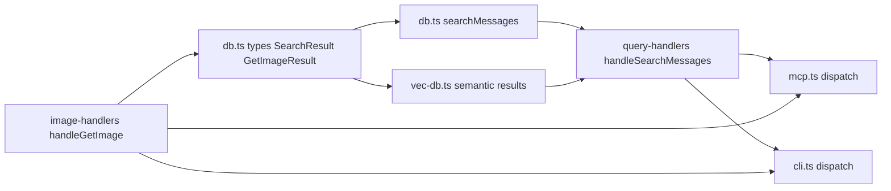
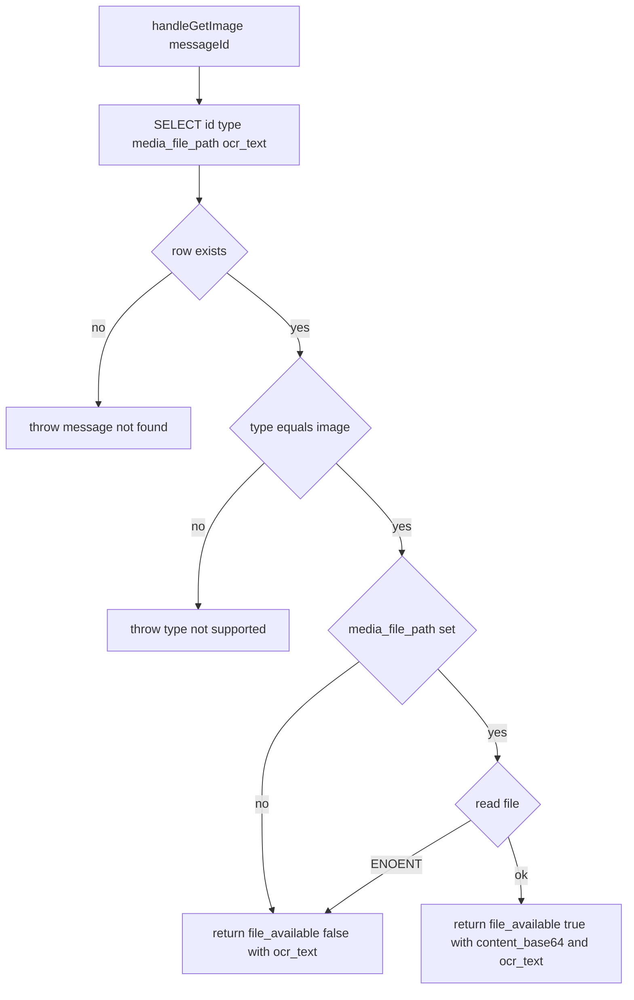

# Design Document

## Overview

**Purpose**: This feature makes Telegram image messages first-class in the KhipuChat archive — downloaded, OCR'd, indexed, and retrievable — reaching feature parity with text messages across the MCP and CLI surfaces.

**Users**: KhipuChat operators querying image-bearing conversations through Claude (MCP) or the CLI.

**Impact**: The bulk of the infrastructure (media storage, OCR worker, FTS/embedding indexing, Telegram sync hooks, schema migration) is already implemented and verified by the gap analysis in `research.md`. This design specifies only the **four remaining gaps** required for full requirements coverage. It is a brownfield gap-closure design, not a greenfield build. No new components, files, or dependencies are introduced; all changes are targeted edits to existing modules.

### Goals
- Expose `get_image` through the CLI query surface (parity with MCP).
- Surface message `type` in search results (both keyword and semantic) so image messages are distinguishable.
- Validate message type in `get_image` and return a precise error for non-image messages.
- Preserve `ocr_text` in the `get_image` response when the local file is unavailable.

### Non-Goals
- Re-designing or re-implementing already-complete infrastructure (media storage, OCR, indexing, Telegram sync, migration).
- Signal / iMessage / WhatsApp / Discord / Slack / email image sync (deferred; research note in `research.md`).
- Video, voice, sticker handling; image editing, compression, or format conversion.
- Any change to the embedding pipeline itself.

## Boundary Commitments

### This Spec Owns
- The CLI `get_image` subcommand and its terminal output format.
- The shape of the `get_image` result contract (`GetImageResult`), including the file-unavailable partial case.
- Message-type validation logic inside `handleGetImage`.
- The presence of a `type` field on the keyword-search and semantic-search read models (`SearchResult`, `SemanticMessageResult`) and the SQL that populates it.

### Out of Boundary
- The embedding pipeline, OCR worker, media storage convention, schema migration, and Telegram sync hooks — all already implemented; this spec depends on them but does not modify them.
- Non-Telegram platform image sync (deferred to a follow-on spec).
- The base64 payload semantics of image content (unchanged; only its packaging into the result union changes).

### Allowed Dependencies
- `src/db.ts` read/query helpers and the `messages` schema (existing `type`, `ocr_text`, `media_file_path` columns).
- `src/image-handlers.ts` `handleGetImage` (existing entry point).
- `src/mcp.ts` and `src/cli.ts` tool dispatch surfaces.
- `better-sqlite3-multiple-ciphers` (existing), `tesseract.js` (existing), `fs` (existing). No new dependencies.

### Revalidation Triggers
- Any change to the `GetImageResult` union shape → MCP and CLI `get_image` consumers must re-check.
- Any change to `SearchResult` / `SemanticMessageResult` field set → MCP `search_messages` / `semantic_search_messages` response consumers and CLI formatters must re-check.
- A change in the throw-vs-return contract of `handleGetImage` (which conditions throw vs return a partial object).

## Architecture

### Existing Architecture Analysis

KhipuChat follows a layered read/query architecture:

```
Types (db.ts interfaces) → DB queries (db.ts, vec-db.ts) → Handlers (query-handlers.ts, image-handlers.ts) → Surfaces (mcp.ts, cli.ts)
```

Each layer imports only from layers to its left. The four gaps live at the lower layers (types + queries) and ripple outward to the surface layer. No layer inversion is introduced. Existing patterns preserved: prepared-statement queries, synchronous DB access, handler functions exported for test, MCP `JSON.stringify` passthrough, CLI `switch(tool)` dispatch.

### Architecture Pattern & Boundary Map



**Architecture Integration**:
- Selected pattern: targeted in-place edits within the existing layered read pipeline (rejected alternative: a new image-query module — over-engineering for four localized gaps, see `research.md`).
- Dependency direction: `Types → Queries → Handlers → Surfaces`; enforced, no upward imports.
- New components rationale: none — all edits land in existing files.
- Steering compliance: agent-native parity (CLI reaches parity with MCP for `get_image`); local-only (no external calls added).

### Technology Stack

| Layer | Choice / Version | Role in Feature | Notes |
|-------|------------------|-----------------|-------|
| CLI | existing `src/cli.ts` (Node) | New `get_image` subcommand | Reuses existing `switch(tool)` + `getUsageText()` |
| Backend / Handlers | existing `src/image-handlers.ts`, `src/query-handlers.ts` | Type validation, partial-result contract | No new modules |
| Data / Storage | `better-sqlite3-multiple-ciphers` (existing) | Add `m.type` to SELECTs | Synchronous; no schema change needed (columns exist) |

No new dependencies. No schema migration (all required columns already exist per gap analysis Req 1.5).

## File Structure Plan

All changes are modifications to existing files. No new files.

### Modified Files
- `src/db.ts` — Add `type: MessageType` to the `SearchResult` interface; add `m.type` to the `searchMessages` SELECT list.
- `src/vec-db.ts` — Add `type: MessageType` to the `SemanticMessageResult` interface; add `m.type` to the semantic result SELECT/assembly.
- `src/image-handlers.ts` — Redefine `GetImageResult` as a discriminated union on `file_available`; add `type` to the row SELECT; validate `row.type !== 'image'` (throw); return the partial object (with `ocr_text`) when the file is missing/unreadable instead of throwing.
- `src/cli.ts` — Add `case 'get_image':` to the dispatch `switch`; document it in `getUsageText()`.
- `README.md` — Reflect the CLI `get_image` subcommand and the `file_available` field in the documented response shape (Req 3.5/3.6).
- Tests: `tests/cli.test.ts` (new `get_image` case), plus updates to existing tests asserting `SearchResult` / `SemanticMessageResult` / `GetImageResult` shapes.

> Each file retains one responsibility. `db.ts`/`vec-db.ts` own read-model types + SQL; `image-handlers.ts` owns retrieval contract; `cli.ts` owns terminal dispatch/format.

## System Flows

`get_image` retrieval decision flow (the only non-trivial branching this feature adds):



Key decisions: message-not-found and non-image type **throw** (caller error, no `ocr_text` to preserve). File-unavailable-but-record-is-image **returns** a partial object carrying `ocr_text` (Req 3.2 + 3.3). Non-`ENOENT` read errors propagate (throw).

## Requirements Traceability

### Full Coverage Summary

Every requirement ID is accounted for. "Existing" = already implemented and verified by the gap analysis in `research.md`; this design does not modify it. "This design" = specified below as a remaining gap.

| Requirement | Disposition | Realized by |
|-------------|-------------|-------------|
| 1.1, 1.2, 1.3 | Existing | `storeMedia()`, `mediaPathFor()`, `MEDIA_DIR`, idempotency check |
| 1.4 | Existing | `.gitignore`, `docker-compose.yml` volume |
| 1.5 | Existing | `db-migrations.ts` (`ocr_text`/`media_file_path` columns, FTS rebuild guard) |
| 2.1, 2.2 | Existing | `ocr.ts` singleton worker, non-throwing `extractText()` |
| 2.3 | Existing | `messages_fts` triggers include `ocr_text` |
| 2.4 | Existing | `index-embeddings.ts` joins `text + ocr_text` |
| 2.5 | Existing | `image-sync.ts` writes `media_width`/`media_height` |
| 3.1 | Existing | `handleGetImage` success path returns path/base64/ocr |
| 3.2 | This design | `handleGetImage` file-unavailable partial result |
| 3.3 | This design | `handleGetImage` retains `ocr_text` on both non-throw arms |
| 3.4 | This design | `handleGetImage` message-type validation |
| 3.5 | This design | CLI `get_image` subcommand |
| 3.6 | Existing (+ doc update) | README documents `get_image`; updated for CLI + `file_available` |
| 4.1 | Existing | FTS match covers `ocr_text` |
| 4.2 | Existing | Semantic search returns image-derived matches, no default filter |
| 4.3 | This design | `type` added to `SearchResult` and `SemanticMessageResult` |
| 4.4 | Existing | `searchMessages` `type` filter |
| 5.1, 5.2, 5.3, 5.4, 5.5 | Existing | Telegram backfill/incremental/listener call `processImageMessages`; per-message try/catch; account-isolated paths |

### Gap Requirements Detail

Only the requirements with remaining gaps are detailed below.

| Requirement | Summary | Components | Interfaces | Flows |
|-------------|---------|------------|------------|-------|
| 3.2 | Informative error when file missing | `handleGetImage` | `GetImageResult` (file_available:false) | get_image flow |
| 3.3 | Include `ocr_text` when file unavailable | `handleGetImage` | `GetImageResult` (ocr_text on both arms) | get_image flow |
| 3.4 | Error for non-image message type | `handleGetImage` | throws typed error | get_image flow |
| 3.5 | `get_image` on CLI surface | `cli.ts` dispatch | CLI `get_image <message_id>` | — |
| 4.3 (search) | Search result includes `type` | `searchMessages` / `SearchResult` | `SearchResult.type` | — |
| 4.3 (semantic) | Semantic result includes `type` | `vec-db` semantic query / `SemanticMessageResult` | `SemanticMessageResult.type` | — |

## Components and Interfaces

| Component | Domain/Layer | Intent | Req Coverage | Key Dependencies (P0/P1) | Contracts |
|-----------|--------------|--------|--------------|--------------------------|-----------|
| `handleGetImage` | Handler | Retrieve image content/OCR, validate type, degrade gracefully | 3.2, 3.3, 3.4 | `getDb` (P0), `fs` (P0) | Service, State |
| `searchMessages` / `SearchResult` | Data/Query | Expose message `type` in keyword search | 4.3 | `messages`/`chats` tables (P0) | Service |
| `SemanticMessageResult` (vec-db) | Data/Query | Expose message `type` in semantic search | 4.3 | `vec_messages` (P0) | Service |
| CLI `get_image` case | Surface | Retrieve image from terminal (MCP parity) | 3.5 | `handleGetImage` (P0) | Service |

### Retrieval Handler

#### `handleGetImage`

| Field | Detail |
|-------|--------|
| Intent | Return image content + OCR for a message, with typed errors and graceful file-missing degradation |
| Requirements | 3.2, 3.3, 3.4 |

**Responsibilities & Constraints**
- Owns the `get_image` retrieval contract for both MCP and CLI.
- Distinguishes three outcomes: hard error (throw), partial availability (return), full success (return).
- Reads only; never mutates the database or filesystem.

**Dependencies**
- Outbound: `getDb()` — single-row lookup by message ID (P0).
- External: `fs.readFileSync` — read the stored image blob (P0).

**Contracts**: Service [x] / State [x]

##### Service Interface
```typescript
import type { MessageType } from './db'

interface GetImageResultAvailable {
  message_id: number
  type: 'image'
  file_available: true
  file_path: string
  content_base64: string
  ocr_text: string | null
  ocr_available: boolean
}

interface GetImageResultUnavailable {
  message_id: number
  type: 'image'
  file_available: false
  file_path: string | null   // null when never downloaded
  ocr_text: string | null
  ocr_available: boolean
  error: string              // informative: identifies message ID, states file unavailable
}

export type GetImageResult = GetImageResultAvailable | GetImageResultUnavailable

export function handleGetImage(messageId: number): Promise<GetImageResult>
```
- Preconditions: `messageId` is a number.
- Postconditions:
  - Row not found → **throws** `message not found: {id}`.
  - `row.type !== 'image'` → **throws** an error naming the actual type as unsupported by `get_image` (Req 3.4).
  - `media_file_path` null, or read fails with `ENOENT` → **returns** `GetImageResultUnavailable` with `ocr_text` preserved and an `error` string (Req 3.2, 3.3).
  - Non-`ENOENT` read error → propagates (throws).
  - File readable → **returns** `GetImageResultAvailable`.
- Invariants: `ocr_text` is present on every non-throwing outcome regardless of file availability.

**Implementation Notes**
- Integration: SELECT expands to `id, type, media_file_path, ocr_text`. MCP already serializes the return via `JSON.stringify`; the union serializes cleanly with no MCP-layer change. CLI branches on `file_available`.
- Validation: check `type` before `media_file_path` so a non-image message never produces a misleading "no media_file_path" error.
- Risks: consumers previously relied on `catch` for the file-missing case — they must now check `file_available`. Enumerated in Revalidation Triggers.

### Search Read Models

#### `SearchResult.type` and `SemanticMessageResult.type`

| Field | Detail |
|-------|--------|
| Intent | Add message `type` to both search read models so callers distinguish image results |
| Requirements | 4.3 |

**Responsibilities & Constraints**
- `SearchResult` (keyword/FTS) and `SemanticMessageResult` (semantic) each gain a `type: MessageType` field.
- The corresponding SQL SELECTs add `m.type`. No filtering behavior changes (Req 4.2 preserved: semantic search still returns image messages by default).

**Contracts**: Service [x]

```typescript
interface SearchResult {
  // ...existing fields...
  type: MessageType   // added
}

interface SemanticMessageResult {
  // ...existing fields...
  type: MessageType   // added
}
```
- Preconditions: none.
- Postconditions: every result row carries its message `type`; image rows are thereby distinguishable by callers.

**Implementation Notes**
- Integration: `searchMessages` SELECT gains `m.type`; `vec-db` semantic SELECT/assembly gains `m.type`. Downstream MCP responses and CLI formatters pass the field through unchanged (formatters may optionally label image rows).
- Validation: existing `type` filter on `search_messages` (Req 4.4, already implemented) is unaffected — this change is about returning `type`, not filtering by it.
- Risks: test fixtures asserting exact result shape need `type` added.

### CLI Surface

#### `get_image` subcommand

| Field | Detail |
|-------|--------|
| Intent | Invoke `handleGetImage` from the terminal, printing path, OCR, and availability |
| Requirements | 3.5 |

**Responsibilities & Constraints**
- Adds `case 'get_image':` to the `cli.ts` dispatch `switch`; parses `<message_id>` like the existing numeric-arg commands (`messages`, `summary`).
- Prints `file_path`, `file_available`, `ocr_text`, and a base64 length/summary (not the full blob, to keep terminal output usable). Full base64 remains available via MCP.
- On `file_available: false`, prints the `error` string and the retained `ocr_text`.

**Contracts**: Service [x]

**Implementation Notes**
- Integration: import `handleGetImage` from `./mcp` (already re-exported there); mirror the `parseInt(query, 10)` + NaN-guard pattern used by `messages`/`summary`.
- Validation: on invalid/missing ID, print `Usage: npm run cli get_image <message_id>` and exit non-zero. On thrown errors (not found / wrong type), the top-level `main().catch` already prints and exits.
- Add the subcommand line to `getUsageText()` and update `README.md`.

## Data Models

No schema change. All required columns (`type`, `ocr_text`, `media_file_path`, `media_width`, `media_height`) already exist on `messages` (verified in gap analysis, Req 1.5). This feature only changes which columns are **selected** into read models and how the retrieval result is **shaped** in memory — no DDL, no migration.

## Error Handling

### Error Strategy
`handleGetImage` uses a two-mode strategy aligned to caller intent:
- **Throw** for caller errors that carry no salvageable data: message-not-found, non-image type (Req 3.4), and unexpected (non-`ENOENT`) I/O failures. At the MCP/CLI boundary these surface as tool errors.
- **Return a partial result** for the expected degraded case: the message is a valid image record but its binary is missing or unreadable (`ENOENT`). This preserves `ocr_text` per Req 3.3 and carries an informative `error` string per Req 3.2.

### Error Categories and Responses
- **User/caller errors**: bad message ID → throw "message not found"; wrong message type → throw "type not supported by get_image". CLI missing arg → usage message + non-zero exit.
- **Degraded availability**: file gone/never downloaded → `file_available:false` object with `ocr_text` + `error`. Never throws.
- **System errors**: non-`ENOENT` read failures propagate unchanged.

### Monitoring
No new monitoring surface. Existing sync-path OCR/download failures are already logged non-fatally (Req 2.2 / 5.4, implemented). `get_image` is a read-time operation; failures are returned/thrown to the caller, not logged as sync errors.

## Testing Strategy

### Unit Tests
- `handleGetImage` returns `GetImageResultAvailable` with `content_base64` + `ocr_text` when the file exists (Req 3.1 regression + 3.3).
- `handleGetImage` returns `file_available:false` with `ocr_text` and an `error` naming the message ID when `media_file_path` is null and when the file is `ENOENT` (Req 3.2, 3.3).
- `handleGetImage` throws a type-not-supported error for a non-image message (Req 3.4).
- `searchMessages` returns `type` on each row; an image message matched by `ocr_text` reports `type: 'image'` (Req 4.3, and 4.1 regression).
- Semantic search result includes `type` for an image-derived match (Req 4.3, 4.2 regression).

### Integration Tests
- CLI `get_image <message_id>` prints `file_path`, `ocr_text`, and `file_available` for a stored image; prints the `error` + `ocr_text` for a missing file; errors clearly for a non-image ID (Req 3.5).
- MCP `search_messages` / `semantic_search_messages` responses include `type` end-to-end (Req 4.3).

### E2E / Regression
- Existing tests asserting `SearchResult`, `SemanticMessageResult`, and `GetImageResult` shapes updated for the added fields; full suite green confirms the read-model change did not break MCP/CLI consumers.

## Migration Strategy

None. No schema or data movement. The pre-existing `db-migrations.ts` already adds `ocr_text` (Req 1.5) for legacy databases; this feature adds no columns.
