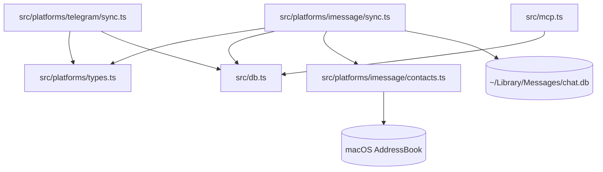
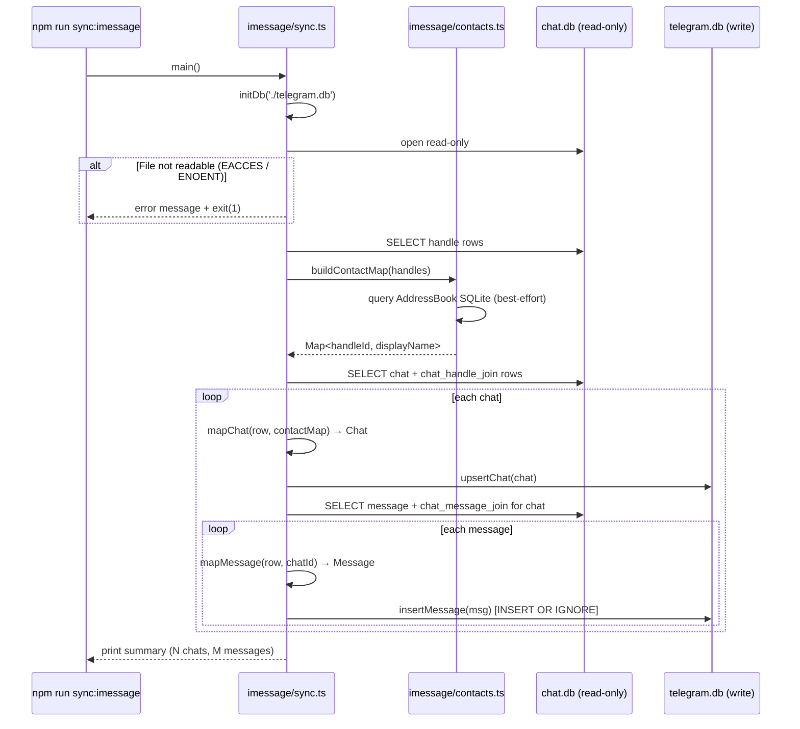

# Design Document — imessage-sync

## Overview

The imessage-sync feature adds a one-shot iMessage import command to KhipuChat. It reads `~/Library/Messages/chat.db` (a SQLite file present on every Mac) using the existing `better-sqlite3` dependency in read-only mode, maps the `chat`, `handle`, and `message` tables to KhipuChat's generic `Chat` and `Message` types (from the platform-abstraction spec), and upserts them into the shared database with `platform: 'imessage'`.

**Purpose**: This feature delivers iMessage conversation history to KhipuChat operators who want to query their messages through MCP tools (`find_chat_by_name`, `list_messages`, `search_messages`, `get_chat_summary`) alongside Telegram conversations.

**Users**: KhipuChat operators running macOS use `npm run sync:imessage` to import all iMessage history. The import is idempotent — re-runs deduplicate by `external_id`. MCP users immediately see iMessage chats returned with `platform: 'imessage'` in tool responses after the first sync.

**Impact**: Adds two new source files under `src/platforms/imessage/`, adds one script to `package.json`, and adds one test file. No changes to `src/db.ts`, `src/mcp.ts`, or any Telegram code.

### Goals

- Read `~/Library/Messages/chat.db` in read-only mode; surface a clear error if Full Disk Access permission is missing
- Map `chat`, `handle`, and `message` rows to `upsertChat` + `insertMessage` with `platform: 'imessage'`
- Resolve phone/email handles to display names with raw handle identifier as fallback; no new npm deps
- Deduplication via `UNIQUE(external_id, chat_id)` + `INSERT OR IGNORE` — re-runs are safe
- Implement `PlatformAdapter` interface from platform-abstraction spec
- All files under 200 lines; tests use in-memory SQLite mocks

### Non-Goals

- Sending iMessages
- Attachment or media sync
- Real-time iMessage listener (`startListener` is a no-op stub)
- Address book write-back
- Any changes to `src/db.ts`, `src/mcp.ts`, or Telegram sync code
- Discord, Slack, or WhatsApp support

---

## Boundary Commitments

### This Spec Owns

- `src/platforms/imessage/sync.ts` — iMessage reader, chat/message mappers, `runBackfill` entry point, `PlatformAdapter` implementation
- `src/platforms/imessage/contacts.ts` — handle → display name resolution logic (isolated for mocking)
- `package.json` — `sync:imessage` script addition
- `tests/imessage.test.ts` — all test coverage for this feature

### Out of Boundary

- `src/db.ts` — owned by platform-abstraction; consumed unchanged
- `src/mcp.ts` — owned by platform-abstraction; consumed unchanged
- `src/platforms/types.ts` — owned by platform-abstraction; imported only
- `src/platforms/telegram/` — no changes; adjacent only
- macOS system files (AddressBook, Messages) — read-only access only
- Any MCP tool changes

### Allowed Dependencies

- `better-sqlite3` (existing) — read-only SQLite access to `chat.db`
- `src/db.ts` (post-platform-abstraction) — `upsertChat`, `insertMessage`, `initDb`, `Chat`, `Message`, `Platform`
- `src/platforms/types.ts` — `PlatformAdapter`, `Platform`
- Node.js built-in `child_process` — for AddressBook SQLite lookup via `sqlite3` CLI
- Node.js built-in `os` — to resolve `~` in `chat.db` path
- No new npm dependencies

### Revalidation Triggers

Changes to any of the following in platform-abstraction would require this spec to re-check integration:

- `PlatformAdapter` method signatures (parameter types, return types)
- `upsertChat` or `insertMessage` function signatures in `src/db.ts`
- `Chat` or `Message` interface field names or types
- `UNIQUE(external_id, chat_id)` constraint semantics on `messages`
- `Platform` union values (removing `'imessage'`)

---

## Architecture

### Existing Architecture Analysis

The Telegram sync (`src/platforms/telegram/sync.ts`) follows a clear mapper pattern:
1. Fetch platform-specific records
2. Map to generic `Chat` / `Message` types via pure functions (`entityToChat`, `msgToRow`)
3. Call `upsertChat` / `insertMessage` from `src/db.ts`

The iMessage sync replicates this exact pattern. The key structural difference is that iMessage uses a local SQLite file (read via `better-sqlite3`) instead of a network API (GramJS). No async I/O is needed for the data-fetch step — `better-sqlite3` is synchronous throughout.

### Architecture Pattern & Boundary Map



- `IMessageSync` is the only module that reads `chat.db`
- `IMessageContacts` is isolated for mocking; it does not import from `DbModule`
- Both iMessage modules are siblings of `telegram/` under `src/platforms/`

### Technology Stack

| Layer | Choice / Version | Role in Feature |
|-------|-----------------|-----------------|
| Data / Storage | `better-sqlite3` v9+ (existing) | Read-only access to `chat.db`; write access to KhipuChat DB |
| Backend | TypeScript strict mode, Node 20 | Mapper functions, type-safe row interfaces |
| Contact resolution | Node.js `child_process.execSync` + macOS `sqlite3` CLI | Best-effort AddressBook lookup; no new deps |
| Platform contract | `PlatformAdapter` from platform-abstraction | Stable interface for `runBackfill` |

---

## File Structure Plan

### Directory Structure

```
src/
└── platforms/
    └── imessage/
        ├── sync.ts        # NEW — runBackfill, chat/message mappers, PlatformAdapter impl
        └── contacts.ts    # NEW — resolveContactName(handleId): string
package.json               # MODIFIED — add sync:imessage script
tests/
└── imessage.test.ts       # NEW — all iMessage sync tests
```

### Modified Files

- `package.json` — add `"sync:imessage": "tsx src/platforms/imessage/sync.ts"` to `scripts`

---

## System Flows

### Sync Flow



The flow is fully synchronous after the `initDb` call. No async/await is needed after setup. `runBackfill` returns `Promise<void>` to satisfy the `PlatformAdapter` interface; the implementation body is synchronous and may use `return Promise.resolve()` or `async` with no `await`.

---

## Requirements Traceability

| Requirement | Summary | Components | Key Interface |
|-------------|---------|------------|---------------|
| 1.1–1.5 | Read `chat.db`; Full Disk Access error; read-only; macOS-only doc | `sync.ts` (openChatDb) | `better-sqlite3` read-only flag |
| 2.1–2.5 | Map chats; name from handles; type from participant count; upsert idempotency; guid-based ID | `sync.ts` (mapChat, hashGuid) | `upsertChat(Chat)` |
| 3.1–3.7 | Map messages; guid as external_id; INSERT OR IGNORE; is_sender; epoch conversion; type; reply_to | `sync.ts` (mapMessage) | `insertMessage(Message)` |
| 4.1–4.5 | Contact resolution; fallback to raw handle; no new deps; isolated in contacts.ts; graceful failure | `contacts.ts` (resolveContactName, buildContactMap) | `Map<string, string>` |
| 5.1–5.5 | Entry point; summary output; PlatformAdapter impl; package.json script; idempotent re-runs | `sync.ts` (main, runBackfill) | `PlatformAdapter.runBackfill` |
| 6.1–6.6 | Test coverage: chat mapping, message mapping, deduplication, contact resolution, in-memory mock | `tests/imessage.test.ts` | Vitest, in-memory SQLite |

---

## Components and Interfaces

### Summary Table

| Component | Layer | Intent | Req Coverage | Key Dependencies |
|-----------|-------|--------|--------------|-----------------|
| `src/platforms/imessage/sync.ts` | Platform | iMessage reader, mappers, PlatformAdapter | 1, 2, 3, 5 | `db.ts`, `contacts.ts`, `platforms/types.ts` |
| `src/platforms/imessage/contacts.ts` | Platform | Handle → display name resolution | 4 | Node.js `child_process`, macOS `sqlite3` |
| `tests/imessage.test.ts` | Test | Full test coverage with mocked chat.db | 6 | `vitest`, `better-sqlite3` |

---

### Platform Layer — `src/platforms/imessage/sync.ts`

| Field | Detail |
|-------|--------|
| Intent | Opens `~/Library/Messages/chat.db` read-only, maps rows to generic types, upserts into KhipuChat DB |
| Requirements | 1.1, 1.2, 1.3, 1.4, 1.5, 2.1, 2.2, 2.3, 2.4, 2.5, 3.1, 3.2, 3.3, 3.4, 3.5, 3.6, 3.7, 5.1, 5.2, 5.3, 5.4, 5.5 |

**Contracts**: Service [x] / Batch [x]

##### Service Interface

```typescript
import type { Platform, PlatformAdapter } from '../types'
import type { Database } from 'better-sqlite3'

// Exported adapter — consumed by npm run sync:imessage entry point
export const iMessageAdapter: PlatformAdapter = {
  platform: 'imessage' as Platform,
  runBackfill(db: Database): Promise<void>,  // reads chat.db, upserts all chats+messages
  startListener(_db: Database): void,        // no-op stub (iMessage is one-shot only)
}

// Pure helper functions (exported for testing)
export function hashGuid(guid: string): number
// Returns a stable positive integer in [1, 2^53) from a UUID string

export function cocoaToUnix(cocoaDate: number): number
// Converts Apple Cocoa epoch (ns since 2001-01-01) to Unix timestamp (s)
// Guard: if cocoaDate < 1e10 treat as seconds already

export interface ChatDbRow {
  ROWID: number
  guid: string
  chat_identifier: string
  display_name: string | null
  room_name: string | null
}

export interface HandleRow {
  ROWID: number
  id: string         // phone number or email
}

export interface MessageDbRow {
  ROWID: number
  guid: string
  text: string | null
  date: number
  is_from_me: 0 | 1
  handle_id: number | null   // null when is_from_me = 1
  reply_to_guid: string | null
}
```

- Preconditions: `db` is an initialized KhipuChat `better-sqlite3` instance; `chat.db` must be readable (EACCES triggers a clear error message + `process.exit(1)`)
- Postconditions: All chats and messages from `chat.db` are upserted into KhipuChat DB; summary printed to stdout
- Invariants: `chat.db` is always opened read-only (never modified); `platform: 'imessage'` on every row written

**Implementation Notes**

- `openChatDb()`: resolve `~/Library/Messages/chat.db` via `os.homedir()`, open with `new Database(path, { readonly: true })`. Catch `EACCES` and `ENOENT` separately to give distinct error messages.
- `mapChat(row, handleIds, contactMap)`: derive `name` from `display_name ?? room_name ?? contactMap.get(primaryHandleId) ?? primaryHandleId`; set `type` based on whether `handleIds.length > 1`; use `hashGuid(row.guid)` as `id`.
- `mapMessage(row, chatId, handleRow, contactMap)`: call `cocoaToUnix(row.date)` for timestamp; set `external_id = row.guid`; set `type = row.text ? 'text' : 'other'`; set `reply_to_external_id = row.reply_to_guid ?? null`; derive `sender_name` from `handleRow` via `contactMap`.
- Keep the file under 200 lines — all helper functions are pure and concise.

---

### Platform Layer — `src/platforms/imessage/contacts.ts`

| Field | Detail |
|-------|--------|
| Intent | Resolves phone number / email handle identifiers to human-readable display names from macOS AddressBook |
| Requirements | 4.1, 4.2, 4.3, 4.4, 4.5 |

**Contracts**: Service [x]

##### Service Interface

```typescript
// Build a lookup map from all handles at once (called once per sync run)
export function buildContactMap(handles: ReadonlyArray<string>): Map<string, string>
// Returns: Map where key = handle.id (phone/email), value = display name
// Falls back to key = value when no name found or when AddressBook is inaccessible

// Lower-level single-handle lookup (used by buildContactMap; exported for unit tests)
export function resolveContactName(handleId: string): string
// Returns display name if found, raw handleId if not found or on any error
```

- Preconditions: none (errors are caught internally; function never throws)
- Postconditions: returns a `string` for every input; never `null` or `undefined`
- Invariants: read-only access to macOS AddressBook; never modifies any file

**Implementation Notes**

- Use `child_process.execSync` to call the macOS system `sqlite3` binary (always available on macOS) against `~/Library/Application Support/AddressBook/Sources/*/AddressBook.sqlitedb`.
- Glob for AddressBook paths using `fs.globSync` (Node 22) or manual `readdirSync` traversal.
- SQL query: `SELECT value, First, Last FROM ABMultiValue JOIN ABPerson ON ... WHERE value = ?`
- Wrap the entire lookup in try/catch; on any error, return `handleId` as-is.
- For bulk efficiency, `buildContactMap` runs one query per handle or a single `IN (...)` query and builds the map in memory before the sync loop starts.
- Keep under 80 lines.

---

## Data Models

### iMessage chat.db Tables (read-only source)

```sql
-- Key columns used by this feature (full schema has many more)
chat         : ROWID, guid, chat_identifier, display_name, room_name, service_name
handle       : ROWID, id (phone/email), service
message      : ROWID, guid, text, date, is_from_me, handle_id, reply_to_guid
chat_handle_join : chat_id, handle_id
chat_message_join: chat_id, message_id
```

### KhipuChat DB (write target — defined by platform-abstraction)

```sql
-- chats (platform-abstraction adds platform column)
INSERT INTO chats (id, name, type, username, platform, last_synced_at, message_count)
-- id = hashGuid(chat.guid)
-- platform = 'imessage'
-- username = NULL (iMessage has no username concept)

-- messages (platform-abstraction renames telegram_id → external_id)
INSERT OR IGNORE INTO messages
  (external_id, chat_id, sender_id, sender_name, text, type, timestamp,
   is_sender, reply_to_external_id, platform)
-- external_id = message.guid
-- platform = 'imessage'
-- sender_id = string(handle.ROWID) or NULL when is_from_me = 1
-- sender_name = contactMap.get(handle.id) ?? handle.id
```

---

## Error Handling

### Error Strategy

| Error | Cause | Response |
|-------|-------|----------|
| `ENOENT` on `chat.db` | File doesn't exist (wrong macOS version, FileVault edge case) | Print: `"chat.db not found at <path>. Is this macOS?"` + `process.exit(1)` |
| `EACCES` on `chat.db` | Full Disk Access not granted | Print: `"Cannot read chat.db. Grant Full Disk Access to Terminal in System Settings → Privacy & Security → Full Disk Access."` + `process.exit(1)` |
| AddressBook query fails | AddressBook inaccessible, wrong path, sqlite3 CLI missing | Silently fall back to raw handle identifiers; log single warning to stderr |
| `insertMessage` ignores duplicate | `UNIQUE(external_id, chat_id)` conflict | Silent `INSERT OR IGNORE` — correct behavior, no error |
| `chat.db` locked by Messages.app | Messages.app holds write lock | `better-sqlite3` read-only mode bypasses write lock in WAL mode; if SQLITE_BUSY, print error and exit |

### Monitoring

- Stdout summary on completion: `"iMessage sync complete: N chats, M messages imported."`
- Stderr for AddressBook fallback warning (single line, non-fatal)
- No new logging infrastructure; consistent with existing `console.log` / `console.error` patterns

---

## Testing Strategy

### Unit Tests — `tests/imessage.test.ts`

All tests use an in-memory `better-sqlite3` database seeded with a minimal `chat.db` schema. The KhipuChat DB is also in-memory.

1. **`hashGuid`**: deterministic, stable output; different GUIDs produce different hashes; hash is a positive integer.
2. **`cocoaToUnix`**: converts a known nanosecond date correctly; handles the seconds-fallback guard.
3. **Chat mapping** (`mapChat`): maps `ChatDbRow` to `Chat` with `platform: 'imessage'`; sets `type: 'group'` for multi-handle chats; `type: 'private'` for single-handle; derives name from contact map; falls back to `chat_identifier` when no display name.
4. **Message mapping** (`mapMessage`): maps `MessageDbRow` to `Message` with `platform: 'imessage'`, correct `external_id`, correct timestamp, correct `is_sender`, correct `type`, correct `reply_to_external_id`.
5. **Deduplication**: insert same message twice via `runBackfill`-equivalent path; assert message count = 1 in KhipuChat DB.
6. **Contact resolution** (`resolveContactName`): returns display name when AddressBook mock returns result; returns raw `handleId` when AddressBook is unavailable.
7. **buildContactMap**: maps an array of handles; unmapped handles retain raw value.
8. **Full Disk Access error**: mock `better-sqlite3` constructor to throw `EACCES`-style error; assert process would exit with non-zero code (test the error branch without calling `process.exit` directly — use a thrown error pattern or dependency injection).
