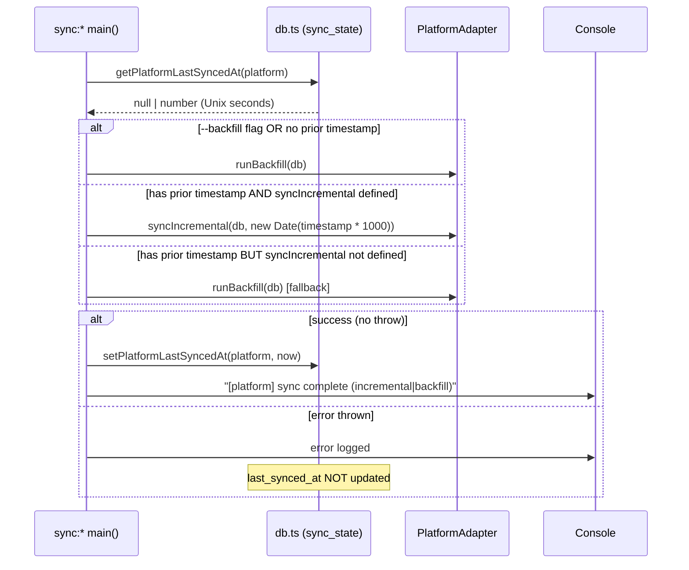

# Design Document: incremental-sync

## Overview

This feature adds a platform-level incremental sync mechanism to KhipuChat. Instead of re-reading all messages from the source on every `sync:*` invocation, each adapter fetches only messages newer than the last clean run. A new `sync_state` table records the completion timestamp per platform; adapters expose an optional `syncIncremental(db, since)` method; all `sync:*` entry points default to incremental mode and accept a `--backfill` flag for forced full scans.

**Purpose**: Eliminate redundant full-history reads that make `sync:wechat` (and others) slow after the first run.

**Users**: KhipuChat operators running `npm run sync:*` manually or via the `sync-watcher` daemon.

**Impact**: The `sync_state` table is added to the DB schema; `PlatformAdapter` gains one optional method; each adapter's `runBackfillImpl` is supplemented (not replaced) by a new `syncIncrementalImpl`; CLI entry points gain `--backfill` flag handling.

### Goals

- Platform-level "last clean run" timestamp stored and used by all adapters.
- All adapters implement `syncIncremental` using the most efficient server-side filter available.
- `--backfill` flag gives operators an escape hatch for full resync.
- `last_synced_at` never advances on a failed or partial run.

### Non-Goals

- Replacing or removing `runBackfill`.
- Real-time push / webhook sync.
- Adding new sync platforms.
- The `sync-watcher` polling daemon (downstream spec).
- Changing how messages are stored or deduplicated.

---

## Boundary Commitments

### This Spec Owns

- `sync_state` table DDL and helper functions (`getPlatformLastSyncedAt`, `setPlatformLastSyncedAt`) in `src/db.ts`.
- `syncIncremental(db, since: Date): Promise<void>` optional method on `PlatformAdapter` in `src/platforms/types.ts`.
- `syncIncrementalImpl` implementations in each adapter (`telegram`, `imessage`, `wechat`, `discord`, `slack`, `email`, `whatsapp`).
- `--backfill` flag handling and mode-selection logic in each adapter's `main()` function.
- Platform-level `last_synced_at` write-on-success in each adapter's `main()` (or shared runner).

### Out of Boundary

- Per-chat `chats.last_synced_at` tracking — already exists, not changed.
- The `runBackfill` method signature and behaviour — unchanged.
- Message storage, deduplication, FTS, or vector indexing logic.
- The `sync-watcher` daemon that will consume `syncIncremental`.
- Adding new platforms.

### Allowed Dependencies

- `better-sqlite3-multiple-ciphers` — synchronous DB operations (existing constraint: all DB ops stay synchronous).
- Existing `db.ts` exports (`insertMessage`, `upsertChat`, `setLastSyncedAt` per-chat, `getDb`).
- Each platform's existing client library (gramjs, imapflow, whatsapp-web.js, etc.).
- `src/index-embeddings.ts` — embedding calls after each chat sync (unchanged pattern).

### Revalidation Triggers

- If `sync_state` table schema changes (column names, types), `sync-watcher` must revalidate.
- If `PlatformAdapter.syncIncremental` signature changes, all adapters and `sync-watcher` must revalidate.
- If `setPlatformLastSyncedAt` / `getPlatformLastSyncedAt` semantics change, downstream consumers must revalidate.

---

## Architecture

### Existing Architecture Analysis

All adapters already perform partial incremental logic via `chats.last_synced_at`:
- Telegram and iMessage: read per-chat `last_synced_at` from `chats` table and skip/filter accordingly.
- WeChat: applies `WHERE create_time > chatLastSync` per table.
- Discord, Slack, Email, WhatsApp: no incremental filtering yet.

The `chats.last_synced_at` column tracks per-chat currency. The new `sync_state.last_synced_at` tracks platform-level clean-run completion — a different semantic.

### Architecture Pattern & Boundary Map

```mermaid
flowchart TD
    CLI[sync:* CLI main()] -->|reads argv| ModeSelect{--backfill?}
    ModeSelect -->|yes| Backfill[runBackfill]
    ModeSelect -->|no| CheckState[getPlatformLastSyncedAt(platform)]
    CheckState -->|null → first run| Backfill
    CheckState -->|number → has prior sync| Incremental["syncIncremental(db, new Date(since * 1000))"]
    Incremental -->|not implemented| Backfill
    Backfill --> Success{success?}
    Incremental --> Success
    Success -->|yes| WriteState[setPlatformLastSyncedAt(platform, now)]
    Success -->|no| Skip[do not write timestamp]

    subgraph DB Layer [src/db.ts]
        WriteState
        CheckState
    end

    subgraph Interface [src/platforms/types.ts]
        Incremental
        Backfill
    end
```

**Architecture Integration**:
- Selected pattern: Optional method extension on existing adapter interface.
- Existing `runBackfill` pattern preserved; `syncIncremental` is additive.
- CLI entry points (each adapter `main()`) own the mode-selection logic.
- DB layer owns `sync_state` persistence; adapters do not touch `sync_state` directly.

### Technology Stack

| Layer | Choice / Version | Role in Feature | Notes |
|-------|------------------|-----------------|-------|
| DB / Storage | better-sqlite3-multiple-ciphers ^11 | `sync_state` table | Synchronous ops required |
| Runtime | Node.js / tsx | CLI entry points | Existing |
| Per-platform API | gramjs, imapflow, whatsapp-web.js, Discord REST, Slack REST | Incremental fetch | Adapter-specific filter params |

---

## File Structure Plan

### Directory Structure

```
src/
├── db.ts                            # + sync_state DDL, getPlatformLastSyncedAt(platform), setPlatformLastSyncedAt(platform, ts)
├── platforms/
│   ├── types.ts                     # + syncIncremental optional method on PlatformAdapter
│   ├── telegram/
│   │   └── sync.ts                  # + syncIncrementalImpl(); main() --backfill flag
│   ├── imessage/
│   │   └── sync.ts                  # + syncIncrementalImpl(); main() --backfill flag
│   ├── wechat/
│   │   └── sync.ts                  # + syncIncrementalImpl(); main() --backfill flag
│   ├── discord/
│   │   └── sync.ts                  # + syncIncrementalImpl(); main() --backfill flag
│   ├── slack/
│   │   └── sync.ts                  # + syncIncrementalImpl(); main() --backfill flag
│   ├── email/
│   │   └── sync.ts                  # + syncIncrementalImpl(); main() --backfill flag
│   └── whatsapp/
│       └── sync.ts                  # + syncIncrementalImpl() (client-side filter); main() --backfill flag
```

### Modified Files

- `src/db.ts` — Add `sync_state` table to `createSchema`, add `getPlatformLastSyncedAt(platform: Platform): number | null`, add `setPlatformLastSyncedAt(platform: Platform, timestamp: number): void` (note: existing `setLastSyncedAt(chatId, timestamp)` is for per-chat; the new platform-level functions use the `Platform` prefix to avoid collision).
- `src/platforms/types.ts` — Add `syncIncremental?(db: Database.Database, since: Date): Promise<void>` to `PlatformAdapter`.
- `src/platforms/telegram/sync.ts` — Add `syncIncrementalImpl`; extend adapter object; add `--backfill` to `main()`.
- `src/platforms/imessage/sync.ts` — Add `syncIncrementalImpl`; extend adapter object; add `--backfill` to `main()`.
- `src/platforms/wechat/sync.ts` — Add `syncIncrementalImpl`; extend adapter object; add `--backfill` to `main()`.
- `src/platforms/discord/sync.ts` — Add `syncIncrementalImpl`; extend adapter object; add `--backfill` to `main()`.
- `src/platforms/slack/sync.ts` — Add `syncIncrementalImpl`; extend adapter object; add `--backfill` to `main()`.
- `src/platforms/email/sync.ts` — Add `syncIncrementalImpl`; extend adapter object; add `--backfill` to `main()`.
- `src/platforms/whatsapp/sync.ts` — Add `syncIncrementalImpl`; extend adapter object; add `--backfill` to `main()`.

---

## System Flows

### Sync mode selection flow



---

## Requirements Traceability

| Requirement | Summary | Components | Interfaces | Flows |
|-------------|---------|------------|------------|-------|
| 1.1 | sync_state table with platform + last_synced_at | DB Layer (sync_state DDL) | — | Schema creation |
| 1.2 | Write last_synced_at on clean completion | CLI mode-select, DB Layer | setPlatformLastSyncedAt(platform) | Sync complete flow |
| 1.3 | Do NOT write on failure | CLI mode-select | — | Error branch |
| 1.4 | Create table in initDb | DB Layer | initDb | Schema creation |
| 1.5 | getPlatformLastSyncedAt(platform) function | DB Layer | getPlatformLastSyncedAt | Mode selection |
| 1.6 | setPlatformLastSyncedAt(platform, ts) function | DB Layer | setPlatformLastSyncedAt(platform) | Write-on-success |
| 2.1 | Optional syncIncremental on PlatformAdapter | PlatformAdapter interface | syncIncremental? | Interface contract |
| 2.2 | Call syncIncremental when available and no --backfill | CLI mode-select | — | Mode selection flow |
| 2.3 | Fall back to runBackfill if syncIncremental absent | CLI mode-select | — | Fallback branch |
| 2.4 | runBackfill signature unchanged | All adapters | runBackfill | — |
| 3.1 | Telegram: fetch only messages after since | TelegramAdapter.syncIncremental | syncIncremental | Incremental sync |
| 3.2 | iMessage: WHERE date > cocoaThreshold | iMessageAdapter.syncIncremental | syncIncremental | Incremental sync |
| 3.3 | WeChat: WHERE create_time > since | WechatAdapter.syncIncremental | syncIncremental | Incremental sync |
| 3.4 | Discord: after snowflake from since | DiscordAdapter.syncIncremental | syncIncremental | Incremental sync |
| 3.5 | Slack: oldest = since in seconds | SlackAdapter.syncIncremental | syncIncremental | Incremental sync |
| 3.6 | Email: IMAP SINCE criterion | EmailAdapter.syncIncremental | syncIncremental | Incremental sync |
| 3.7 | WhatsApp: client-side filter after since | WhatsAppAdapter.syncIncremental | syncIncremental | Incremental sync |
| 3.8 | Graceful fallback when no server filter | CLI mode-select + adapter | — | Fallback branch |
| 4.1 | Default incremental when last_synced_at exists | CLI mode-select | — | Mode selection |
| 4.2 | Fall back to runBackfill on first run | CLI mode-select | — | First-run flow |
| 4.3 | --backfill forces full scan | CLI mode-select | — | Backfill branch |
| 4.4 | Aggregate sync script supports --backfill | package.json / sync runner | — | CLI |
| 4.5 | Log mode to stdout | CLI mode-select | — | Console output |
| 5.1 | Write last_synced_at only on success | CLI mode-select | setPlatformLastSyncedAt(platform) | Write-on-success |
| 5.2 | Do not write on unhandled error | CLI mode-select | — | Error branch |
| 5.3 | Platform-level timestamp (not per-chat) | DB Layer | sync_state table | Semantic boundary |
| 5.4 | Per-chat chats.last_synced_at still updated | All adapters | setLastSyncedAt(chatId) | Existing behaviour |

---

## Components and Interfaces

### Summary

| Component | Layer | Intent | Req Coverage | Key Dependencies |
|-----------|-------|--------|--------------|-----------------|
| sync_state DB helpers | DB | Persist platform-level sync timestamps | 1.1–1.6, 5.1–5.3 | better-sqlite3 |
| PlatformAdapter interface | Interface | Declare optional syncIncremental | 2.1–2.4 | — |
| CLI mode-select | CLI (each adapter main()) | Route to incremental or backfill | 4.1–4.5, 5.1–5.2 | sync_state helpers |
| TelegramAdapter.syncIncremental | Telegram | Fetch dialogs after since | 3.1 | gramjs |
| iMessageAdapter.syncIncremental | iMessage | Query chat.db with cocoa threshold | 3.2 | better-sqlite3 (readonly) |
| WechatAdapter.syncIncremental | WeChat | Apply time filter per table | 3.3 | better-sqlite3 (readonly) |
| DiscordAdapter.syncIncremental | Discord | Pass after-snowflake to API | 3.4 | discord client |
| SlackAdapter.syncIncremental | Slack | Pass oldest param to API | 3.5 | slack client |
| EmailAdapter.syncIncremental | Email | IMAP SINCE search | 3.6 | imapflow |
| WhatsAppAdapter.syncIncremental | WhatsApp | Client-side filter | 3.7 | whatsapp-web.js |

---

### DB Layer

#### sync_state helpers

| Field | Detail |
|-------|--------|
| Intent | Persist and retrieve platform-level last-clean-run timestamp |
| Requirements | 1.1, 1.2, 1.3, 1.4, 1.5, 1.6, 5.1, 5.2, 5.3 |

**Responsibilities & Constraints**
- Own the `sync_state` table DDL inside `createSchema`.
- Provide `getPlatformLastSyncedAt(platform: Platform): number | null` (returns Unix seconds or null).
- Provide `setPlatformLastSyncedAt(platform: Platform, timestamp: number): void` (upserts the row).
- Must NOT rename the existing per-chat `setLastSyncedAt(chatId, timestamp)` — add new platform-level functions with distinct names to avoid collision.
- All operations are synchronous (better-sqlite3 constraint).

**Contracts**: State [ ✓ ]

##### Service Interface

```typescript
// New additions to src/db.ts

/** Returns the Unix-second timestamp of the last clean platform sync, or null. */
export function getPlatformLastSyncedAt(platform: Platform): number | null

/** Upserts sync_state for the given platform. Call only after a clean run. */
export function setPlatformLastSyncedAt(platform: Platform, timestamp: number): void
```

##### State Management
- State model: `sync_state(platform TEXT PRIMARY KEY, last_synced_at INTEGER NOT NULL)`
- Persistence: synchronous SQLite upsert via `INSERT OR REPLACE`.
- Concurrency: single-process, no concurrent writers (better-sqlite3 WAL mode, existing constraint).

**Implementation Notes**
- Add `sync_state` DDL to `createSchema` in `db.ts`.
- The existing `setLastSyncedAt(chatId, ts)` updates `chats.last_synced_at` — keep it unchanged.
- `getPlatformLastSyncedAt` maps to a simple `SELECT last_synced_at FROM sync_state WHERE platform = ?`.

---

### Interface Layer

#### PlatformAdapter interface extension

| Field | Detail |
|-------|--------|
| Intent | Declare optional incremental sync capability on the shared adapter interface |
| Requirements | 2.1, 2.2, 2.3, 2.4 |

**Contracts**: Service [ ✓ ]

##### Service Interface

```typescript
// src/platforms/types.ts (updated)
export interface PlatformAdapter {
  readonly platform: Platform
  runBackfill(db: Database.Database): Promise<void>
  startListener(db: Database.Database): void
  /** Optional. If present, called instead of runBackfill when since is available and --backfill is not set. */
  syncIncremental?(db: Database.Database, since: Date): Promise<void>
}
```

**Implementation Notes**
- `syncIncremental` is optional (`?`). Adapters that cannot meaningfully filter by time omit it and fall back to `runBackfill` automatically via CLI mode-select logic.

---

### CLI Mode-Select (per adapter main())

| Field | Detail |
|-------|--------|
| Intent | Route each sync run to incremental or backfill based on stored state and CLI flags |
| Requirements | 4.1, 4.2, 4.3, 4.4, 4.5, 5.1, 5.2 |

**Responsibilities & Constraints**
- Each adapter's `main()` function owns the mode-selection and platform-level timestamp write.
- Pattern is identical across all adapters:
  1. Parse `--backfill` from `process.argv`.
  2. Call `getPlatformLastSyncedAt(platform)`.
  3. Decide mode; log mode to stdout.
  4. Wrap sync call in try/catch; write `setPlatformLastSyncedAt` only in the success path.

**Implementation Notes**

```typescript
// Pattern repeated in each adapter's main():
async function main(): Promise<void> {
  const backfill = process.argv.includes('--backfill')
  const db = initDb('./khipuchat.db')
  const since = backfill ? null : getPlatformLastSyncedAt('discord')
  const mode = (since !== null && adapter.syncIncremental) ? 'incremental' : 'backfill'
  console.log(`[discord] sync mode: ${mode}`)
  if (mode === 'incremental') {
    await adapter.syncIncremental!(db, new Date(since! * 1000))
  } else {
    await adapter.runBackfill(db)
  }
  setPlatformLastSyncedAt('discord', Math.floor(Date.now() / 1000))
}
```
- Wrap the sync call in try/catch: `setPlatformLastSyncedAt` is called only if no exception is thrown.
- For the aggregate `npm run sync` script: update `package.json` to pass `-- --backfill` through, or introduce a thin `src/sync.ts` runner that reads `--backfill` once and calls each adapter.

---

### Per-Platform Incremental Implementations

Each adapter adds `syncIncrementalImpl(client, since: Date)` and wires it to the adapter object.

#### Telegram

- Convert `since` to Unix seconds: `sinceTs = Math.floor(since.getTime() / 1000)`.
- Reuse existing dialog iteration; filter: skip dialogs where `dialogDate <= sinceTs` (already done in backfill, but explicitly driven by `since` parameter here).
- Paginate forward from `lastId` per chat as already implemented in `runBackfill`.
- `syncIncrementalImpl` is essentially the existing incremental path extracted as a standalone function.

#### iMessage

- Convert `since` to Cocoa nanoseconds: `cocoaThreshold = BigInt(since.getTime() / 1000 - 978307200) * 1_000_000_000n`.
- Query: `WHERE date > ?` with `cocoaThreshold` (existing pattern in `runBackfillImpl`).
- `syncIncrementalImpl` wraps `runBackfillImpl` with `since` injected (or extracts the filtering logic).

#### WeChat

- Use `since.getTime() / 1000` as Unix seconds threshold for `WHERE create_time > ?` (V4) or `WHERE CreateTime > ?` (legacy).
- Existing `runBackfillImpl` already does per-chat `chatLastSync` filtering — `syncIncrementalImpl` drives it with the platform-level `since`.

#### Discord

- Snowflake from Date: `const snowflake = ((BigInt(since.getTime()) - 1420070400000n) << 22n).toString()`.
- Pass `after: snowflake` to `client.getMessages(channelId, { after: snowflake })` in the Discord client wrapper.

#### Slack

- Pass `oldest: (since.getTime() / 1000).toString()` to `conversations.history`.
- Pagination cursor unchanged.

#### Email

- Pass `{ since }` to `imapflow` `client.search(mailbox, { since }, { uid: true })`.
- Fetch and process only the UIDs returned.

#### WhatsApp

- Fetch messages per chat (existing `fetchMessages` call).
- Filter client-side: `messages.filter(m => m.timestamp > since.getTime() / 1000)`.
- Log warning: `[whatsapp] incremental: client-side filter only (WhatsApp Web API has no server-side time filter)`.

---

## Data Models

### Physical Data Model

**New table** added to `createSchema` in `src/db.ts`:

```sql
CREATE TABLE IF NOT EXISTS sync_state (
  platform      TEXT    NOT NULL PRIMARY KEY,
  last_synced_at INTEGER NOT NULL
);
```

- `platform`: matches `Platform` type values (`telegram`, `imessage`, `wechat`, `discord`, `slack`, `email`, `whatsapp`).
- `last_synced_at`: Unix seconds (integer), set to `Math.floor(Date.now() / 1000)` on clean completion.
- No foreign key to `chats` — independent table.

No existing tables are modified.

---

## Error Handling

### Error Strategy

The critical invariant is: `sync_state.last_synced_at` must never advance on a failed run.

### Error Categories and Responses

**Sync error (adapter throws)**:
- `main()` catches the error, logs it to stderr.
- `setPlatformLastSyncedAt` is NOT called.
- Exit code 1.

**Partial chat failure (existing pattern)**:
- Individual chat errors are caught inside `runBackfillImpl` / `syncIncrementalImpl` and logged per-chat.
- The outer run continues to the next chat.
- If the outer run completes without throwing, `setPlatformLastSyncedAt` IS written (some chats may have failed — this is the existing behaviour, unchanged).

**WhatsApp client-side filter**:
- Log warning once per run: `[whatsapp] incremental: client-side filter only`.
- Not an error; messages are still correctly inserted.

### Monitoring

- Console output: `[platform] sync mode: incremental|backfill` at run start.
- Console output: existing per-adapter completion messages (`+N messages`) unchanged.
- Exit code 1 on fatal error (existing behaviour preserved).

---

## Testing Strategy

### Unit Tests

- `getPlatformLastSyncedAt`: returns null for unknown platform; returns stored value for known platform.
- `setPlatformLastSyncedAt`: upserts correctly; subsequent call overwrites.
- `syncIncrementalImpl` (iMessage): with `cocoaThreshold` injected, only messages after threshold are returned from in-memory SQLite fixture.
- `syncIncrementalImpl` (WeChat): with `since` injected, applies correct `WHERE` clause for both V4 and legacy schema.
- Discord snowflake helper: `dateToSnowflake(new Date('2023-01-01'))` produces expected value.

### Integration Tests

- DB schema: `initDb(':memory:')` creates `sync_state` table; `getPlatformLastSyncedAt('telegram')` returns null; after `setPlatformLastSyncedAt('telegram', 123)`, returns 123.
- Mode-selection: adapter with `syncIncremental` → `syncIncremental` called when `since` available; without `syncIncremental` → `runBackfill` called.
- Error path: if `syncIncremental` throws, `setPlatformLastSyncedAt` is not called (spy/mock verification).
- `--backfill` flag: even with prior `last_synced_at`, passing `--backfill` routes to `runBackfill`.

### E2E / CLI Tests

- `npm run sync:imessage -- --backfill` against test DB: runs backfill, writes `sync_state`.
- Subsequent `npm run sync:imessage` (no flag): runs incremental, logs `sync mode: incremental`.

---

## Migration Strategy

`sync_state` is a new table created by `createSchema` — no migration needed for fresh databases. For existing databases with data, `createSchema` uses `CREATE TABLE IF NOT EXISTS`, so existing installs pick up the table on first `initDb` call after upgrade with no data loss.
