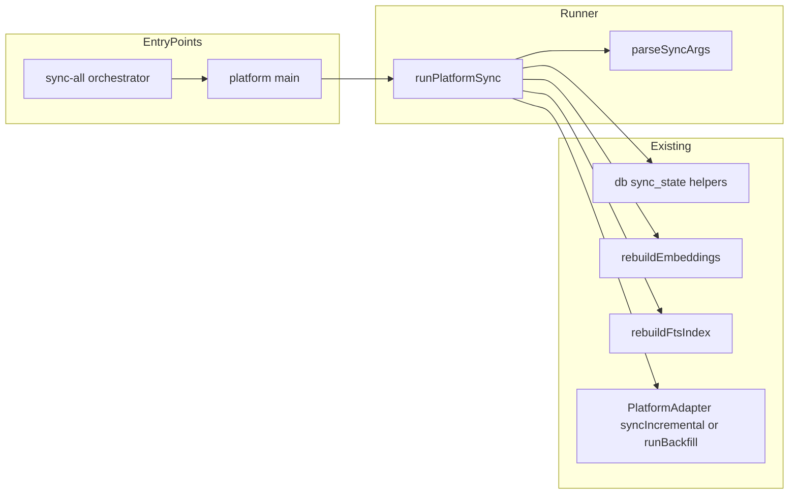
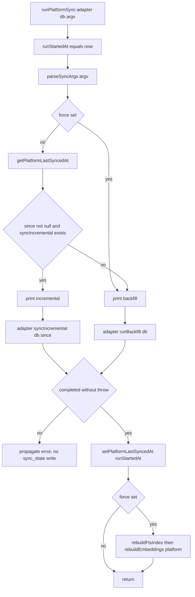
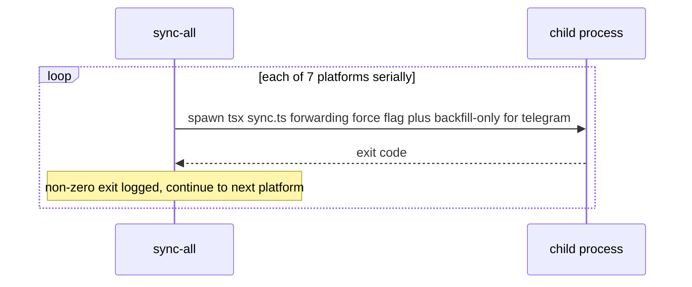

# Technical Design: incremental-sync

## Overview

**Purpose**: This feature makes day-to-day syncs fast by wiring the CLI entry points to the already-implemented per-platform incremental logic. It introduces a single shared sync runner that reads the platform-level `sync_state` marker, routes each run to either `syncIncremental` or `runBackfill`, and writes the marker only on clean completion.

**Users**: KhipuChat operators running `npm run sync` and `npm run sync:<platform>`. After this change a bare `sync:*` invocation catches up only on new messages; `--force` performs a full re-scan and rebuilds the semantic search index.

**Impact**: The adapter layer (all 7 platforms), the `sync_state` schema, and the `PlatformAdapter.syncIncremental` contract already exist and are complete (see `research.md` Gap Analysis). This design changes only the **wiring layer**: seven `main()` entry points, one new shared runner, one new aggregate orchestrator, one extracted embeddings function, and the `package.json` scripts. No adapter logic and no `runBackfill` signature changes.

### Goals

- A single source of truth (`runPlatformSync`) that implements mode selection, atomic `sync_state` write, and the `--force` index rebuild for every platform.
- Default incremental behavior with correct first-run fallback to backfill.
- `--force` (with deprecated `--backfill` alias) forces full backfill plus semantic search index rebuild.
- `npm run sync` covers all 7 platforms and forwards `--force`.

### Non-Goals

- Real-time push / webhook triggering (out of scope).
- Changing or removing the `runBackfill` signature (frozen).
- Adding new platforms or the `sync-watcher` daemon.
- Implementing per-account `sync_state` keying: designed for forward-compatibility only; implementation is owned by the `multi-account` spec (Req 6).
- Changing how messages are stored once fetched.

## Boundary Commitments

### This Spec Owns

- The **sync runner** (`src/sync-runner.ts`): flag parsing, mode routing (`syncIncremental` vs `runBackfill`), atomic platform-level `sync_state` write on clean completion, and `--force` post-sync index rebuild.
- The **aggregate orchestrator** (`src/sync-all.ts`): serial execution of all 7 platform syncs with flag forwarding.
- The **seven `main()` entry points**: reduced to a delegation call into the runner (telegram retains its listener/auth lifecycle).
- The **extracted `rebuildEmbeddings(platform?)`** function surfaced from `index-embeddings.ts`.
- The `package.json` `sync*` script definitions.

### Out of Boundary

- The `PlatformAdapter` interface shape: owned by the `platform-abstraction` spec. This spec only consumes the existing optional `syncIncremental` method; it does not modify the interface.
- Per-adapter incremental fetch logic (Req 3.1–3.8): already implemented; this spec calls it, it does not rewrite it.
- The `sync_state` DDL and the `getPlatformLastSyncedAt` / `setPlatformLastSyncedAt` / `rebuildFtsIndex` helpers: already present in `db.ts`; consumed, not redefined.
- Per-account (platform, account) keying and migration (Req 6): deferred to the `multi-account` spec.
- The telegram listener loop and `--backfill-only` daemon flag semantics.

### Allowed Dependencies

- `src/db.ts`: `getPlatformLastSyncedAt`, `setPlatformLastSyncedAt`, `rebuildFtsIndex`, `initDb`, `getDb`.
- `src/index-embeddings.ts`: the newly extracted `rebuildEmbeddings(platform?)`.
- `src/platforms/types.ts`: the `PlatformAdapter` type and its optional `syncIncremental`.
- Node built-in `child_process` (aggregate orchestrator only).
- Dependency direction: `types.ts => db.ts => index-embeddings.ts => adapters => sync-runner => entry points / sync-all`. Each layer imports only leftward. `sync-runner.ts` must not import any concrete adapter; it operates on the `PlatformAdapter` type.

### Revalidation Triggers

- If the `PlatformAdapter.syncIncremental` signature changes (e.g., `since: Date` becomes an integer), the runner's dispatch must be re-checked.
- If `sync_state` moves to composite (platform, account) keying (multi-account spec), `runPlatformSync` and the helper call sites must be revalidated.
- If `runBackfill` ever gains parameters, the runner's fallback call must be revalidated.
- Any change to the `incremental` / `backfill` stdout contract (Req 4.7) breaks the `sync-watcher` downstream consumer.

## Architecture

### Existing Architecture Analysis

- **Pattern preserved**: adapter-per-platform. Each `src/platforms/<p>/sync.ts` exports a `PlatformAdapter` object (`runBackfill`, `startListener`, `syncIncremental`) and has a thin `main()` runnable via `tsx`.
- **Already complete**: `sync_state(platform TEXT PRIMARY KEY, last_synced_at INTEGER NOT NULL)`; `getPlatformLastSyncedAt`/`setPlatformLastSyncedAt`; all 7 `syncIncremental` implementations; `rebuildFtsIndex()`.
- **Technical debt worked around**: telegram's `runSync` (`src/platforms/telegram/sync.ts:292`) logs a sync mode but always calls `runBackfill`: the incremental path is never reached. This design replaces that ad-hoc logic with the shared runner while keeping telegram's listener/auth flow intact.
- **Constraint**: adapters ignore the `db` argument passed to `syncIncremental`/`runBackfill` (they use the module-level DB singleton via `initDb`). The runner still calls `initDb` and passes the handle to honor the interface.

### Architecture Pattern & Boundary Map


```mermaid
graph LR
    subgraph EntryPoints
        MainP[platform main]
        SyncAll[sync-all orchestrator]
    end
    subgraph Runner
        RPS[runPlatformSync]
        Parse[parseSyncArgs]
    end
    subgraph Existing
        DB[db sync_state helpers]
        Emb[rebuildEmbeddings]
        Fts[rebuildFtsIndex]
        Adapter[PlatformAdapter syncIncremental or runBackfill]
    end
    MainP --> RPS
    SyncAll --> MainP
    RPS --> Parse
    RPS --> DB
    RPS --> Adapter
    RPS --> Emb
    RPS --> Fts
```

**Architecture Integration**:
- **Selected pattern**: shared runner (Strategy-style dispatch over the optional method). Rationale: collapses 7-way duplication into one testable unit; every requirement rule lives in one place.
- **Boundaries**: runner owns orchestration/state; adapters own fetching; `db.ts` owns persistence. No shared ownership.
- **Existing patterns preserved**: adapter object shape, `tsx`-runnable entry points, module-level DB singleton, telegram `--backfill-only` listener control.
- **New components rationale**: `sync-runner.ts` (dedup + single source of truth for Req 2/4/5); `sync-all.ts` (Req 4.6 flag-forwarding aggregate); `rebuildEmbeddings` extraction (Req 4.4 needs a callable full-index rebuild).
- **Steering compliance**: all data stays local (SQLite); no new external services; CLI/MCP parity unaffected (sync surfaces are CLI-only today).

### Technology Stack

| Layer | Choice / Version | Role in Feature | Notes |
|-------|------------------|-----------------|-------|
| CLI / Runtime | Node + `tsx` ^4 | Entry points and orchestrator | No change |
| Orchestration | Node `child_process` (built-in) | Serial subprocess spawning in `sync-all.ts` | New usage, no new dependency |
| Data / Storage | `better-sqlite3-multiple-ciphers` ^11 | `sync_state` read/write (synchronous) | Existing helpers only |
| Search Index | `@huggingface/transformers` ^3 + `sqlite-vec` ^0.1 + FTS5 | `--force` semantic + FTS rebuild | Reuses existing embed/FTS code |

No new runtime dependencies are introduced.

## File Structure Plan

### New Files
```
src/
├── sync-runner.ts     # runPlatformSync + parseSyncArgs: mode routing, atomic sync_state write, --force rebuild
└── sync-all.ts        # Serial subprocess orchestrator for all 7 platforms; forwards --force/--backfill
```

### Modified Files
- `src/index-embeddings.ts` — Extract `rebuildEmbeddings(platform?: Platform): Promise<void>` from `main()`; `main()` calls it with no argument. Runner calls it scoped to a platform on `--force`.
- `src/platforms/discord/sync.ts` — `main()` delegates to `runPlatformSync(discordAdapter, db, process.argv)`.
- `src/platforms/slack/sync.ts` — same pattern as discord.
- `src/platforms/email/sync.ts` — same pattern as discord.
- `src/platforms/whatsapp/sync.ts` — same pattern as discord (client/QR setup retained before the runner call).
- `src/platforms/wechat/sync.ts` — same pattern as discord.
- `src/platforms/imessage/sync.ts` — same pattern as discord.
- `src/platforms/telegram/sync.ts` — replace the broken `runSync` with a `runPlatformSync` call; keep auth wizard, `--backfill-only` listener gating, and `startListener`.
- `package.json` — `sync` becomes `tsx src/sync-all.ts`; each `sync:<platform>` unchanged (delegation happens inside `main()`).

Every component named in this design maps to exactly one file above. `sync-runner.ts` must not import concrete adapters (dependency-direction constraint).

## System Flows

### Per-platform sync decision (runPlatformSync)


```mermaid
flowchart TD
    Start[runPlatformSync adapter db argv] --> Snap[runStartedAt equals now]
    Snap --> ParseFlags[parseSyncArgs argv]
    ParseFlags --> ForceCheck{force set}
    ForceCheck -- yes --> Backfill
    ForceCheck -- no --> ReadState[getPlatformLastSyncedAt]
    ReadState --> HasSince{since not null and syncIncremental exists}
    HasSince -- yes --> Incremental[print incremental]
    HasSince -- no --> Backfill[print backfill]
    Incremental --> CallInc[adapter syncIncremental db since]
    Backfill --> CallBf[adapter runBackfill db]
    CallInc --> Success
    CallBf --> Success
    Success{completed without throw} -- no --> NoWrite[propagate error, no sync_state write]
    Success -- yes --> Write[setPlatformLastSyncedAt runStartedAt]
    Write --> ForceRebuild{force set}
    ForceRebuild -- yes --> Rebuild[rebuildFtsIndex then rebuildEmbeddings platform]
    ForceRebuild -- no --> Done[return]
    Rebuild --> Done
```

Key decisions: `since` is `null` on first run so the runner backfills (Req 4.2). `--force` skips the state read entirely (Req 4.3). The `sync_state` value written is the **run-start** timestamp, not completion time, to prevent skipping messages that arrive mid-run (see `research.md`). The timestamp write is inside the success path only (Req 5.1/5.2).

### Aggregate orchestration (sync-all)


```mermaid
sequenceDiagram
    participant SA as sync-all
    participant CP as child process
    loop each of 7 platforms serially
        SA->>CP: spawn tsx sync.ts forwarding force flag plus backfill-only for telegram
        CP-->>SA: exit code
        Note over SA: non-zero exit logged, continue to next platform
    end
```

Serial execution avoids WeChat decryption resource contention. Telegram receives `--backfill-only` so it syncs and exits instead of blocking on its listener.

## Requirements Traceability

| Requirement | Summary | Components | Interfaces / Contracts | Flows |
|-------------|---------|------------|------------------------|-------|
| 1.1 | `sync_state` table shape | (existing `db.ts` schema) | DDL `sync_state(platform PK, last_synced_at)` | — |
| 1.2 | Update marker on clean completion | SyncRunner | `setPlatformLastSyncedAt` | Per-platform flow |
| 1.3 | No update on failure/interrupt | SyncRunner | success-gated write | Per-platform flow |
| 1.4 | Create table on DB init | (existing `initDb`) | `CREATE TABLE IF NOT EXISTS` | — |
| 1.5 | `getLastSyncedAt` accessor | (existing) `getPlatformLastSyncedAt` | `Platform => number \| null` | — |
| 1.6 | `setLastSyncedAt` atomic write | (existing) `setPlatformLastSyncedAt` | `INSERT OR REPLACE` | — |
| 2.1 | Optional `syncIncremental` on interface | (existing `types.ts`) | `syncIncremental?(db, since: Date)` | — |
| 2.2 | Call `syncIncremental` when since available and not forced | SyncRunner | mode dispatch | Per-platform flow |
| 2.3 | Fall back to `runBackfill` when method absent | SyncRunner | mode dispatch | Per-platform flow |
| 2.4 | `runBackfill` signature unchanged | SyncRunner (consumer) | frozen contract | — |
| 3.1–3.8 | Per-platform incremental fetch | (existing 7 adapters) | each `syncIncremental` | — (out of boundary) |
| 4.1 | Default incremental when since exists | SyncRunner | mode dispatch | Per-platform flow |
| 4.2 | First-run fallback to backfill | SyncRunner | `since === null` branch | Per-platform flow |
| 4.3 | `--force` forces full backfill | SyncRunner / parseSyncArgs | force branch | Per-platform flow |
| 4.4 | `--force` rebuilds search index | SyncRunner + `rebuildEmbeddings` | `rebuildFtsIndex` + `rebuildEmbeddings(platform)` | Per-platform flow |
| 4.5 | `--backfill` deprecated alias | parseSyncArgs | flag parse + warning | — |
| 4.6 | Aggregate forwards `--force` | AggregateOrchestrator | subprocess flag forwarding | Aggregate flow |
| 4.7 | Print `incremental`/`backfill` before sync | SyncRunner | stdout contract | Per-platform flow |
| 5.1 | Write marker after clean insertions | SyncRunner | success-gated write | Per-platform flow |
| 5.2 | No marker write on thrown error | SyncRunner | error propagation | Per-platform flow |
| 5.3 | Platform-level timestamp for the run | SyncRunner | run-start snapshot | Per-platform flow |
| 5.4 | Per-chat timestamps still updated | (existing adapters/`setLastSyncedAt(chatId)`) | unchanged | — |
| 6.1–6.4 | Per-(platform, account) keying | Forward-compat design note | deferred to `multi-account` | — |

## Components and Interfaces

| Component | Domain/Layer | Intent | Req Coverage | Key Dependencies (P0/P1) | Contracts |
|-----------|--------------|--------|--------------|--------------------------|-----------|
| SyncRunner | Orchestration | Route a single platform sync, gate the state write, run `--force` rebuild | 1.2, 1.3, 2.2, 2.3, 2.4, 4.1, 4.2, 4.3, 4.4, 4.7, 5.1, 5.2, 5.3 | db helpers (P0), rebuildEmbeddings (P0), PlatformAdapter type (P0) | Service, Batch |
| parseSyncArgs | Orchestration | Parse `--force`/`--backfill` from argv | 4.3, 4.5 | none | Service |
| AggregateOrchestrator | CLI | Serially run all 7 platform syncs, forward flags | 4.6 | child_process (P0) | Batch |
| rebuildEmbeddings | Search Index | Re-embed messages/chats, optionally scoped to a platform | 4.4 | index-embeddings internals (P0) | Batch |

### Orchestration

#### SyncRunner

| Field | Detail |
|-------|--------|
| Intent | Execute one platform's sync with correct mode, atomicity, and `--force` rebuild |
| Requirements | 1.2, 1.3, 2.2, 2.3, 2.4, 4.1, 4.2, 4.3, 4.4, 4.7, 5.1, 5.2, 5.3 |

**Responsibilities & Constraints**
- Snapshot `runStartedAt` before any fetching; write that value on success (gap-safe resume boundary).
- Select mode: `force` implies backfill; else `since = getPlatformLastSyncedAt(platform)`; incremental iff `since !== null` **and** `typeof adapter.syncIncremental === 'function'`; otherwise backfill.
- Print exactly one of `incremental` or `backfill` before invoking the adapter (Req 4.7).
- Write `setPlatformLastSyncedAt(platform, runStartedAt)` only if the adapter method resolves without throwing; on throw, propagate and write nothing.
- On `--force`, after a successful sync, call `rebuildFtsIndex()` then `await rebuildEmbeddings(adapter.platform)`.
- Must not import concrete adapters; operates solely on the `PlatformAdapter` type.

**Dependencies**
- Inbound: platform `main()` functions, AggregateOrchestrator (via subprocess) invoke the runner (P0).
- Outbound: `getPlatformLastSyncedAt`, `setPlatformLastSyncedAt`, `rebuildFtsIndex` (P0); `rebuildEmbeddings` (P0).
- External: none.

**Contracts**: Service [x] / Batch [x]

##### Service Interface
```typescript
import type Database from 'better-sqlite3-multiple-ciphers'
import type { PlatformAdapter } from './platforms/types'

interface SyncRunOptions {
  force: boolean
}

function parseSyncArgs(argv: readonly string[]): SyncRunOptions

async function runPlatformSync(
  adapter: PlatformAdapter,
  db: Database.Database,
  argv: readonly string[],
): Promise<void>
```
- Preconditions: `initDb` has been called; `adapter.platform` is a valid `Platform`.
- Postconditions: on success, `sync_state[platform] = runStartedAt`; on `--force` success, search index rebuilt; on error, thrown to caller and `sync_state` unchanged.
- Invariants: exactly one of `incremental`/`backfill` printed per call; the marker is never written on a thrown run.

**Implementation Notes**
- Integration: telegram passes its connected client via its existing adapter method; the runner is client-agnostic (adapters own client lifecycle).
- Validation: `parseSyncArgs` treats `--backfill` as `force: true` and emits a one-line deprecation warning to stderr (Req 4.5).
- Risks: adapters that internally catch per-chat errors do not surface them as throws: this is intended (idempotent recovery next run); only a full-run throw blocks the marker write (Req 5 error granularity, see `research.md`).

#### AggregateOrchestrator

| Field | Detail |
|-------|--------|
| Intent | Run all 7 platform syncs serially and forward the force flag |
| Requirements | 4.6 |

**Responsibilities & Constraints**
- Iterate platforms in a fixed order; spawn `tsx src/platforms/<p>/sync.ts` per platform via `child_process`.
- Forward `--force`/`--backfill` from its own argv to every child; additionally pass `--backfill-only` to telegram so it exits after sync.
- Run strictly serially (WeChat contention). A non-zero child exit is logged; orchestration continues to the next platform and exits non-zero overall if any child failed.

**Contracts**: Batch [x]
- Trigger: `npm run sync [-- --force]`.
- Input: process argv.
- Output: per-platform stdout streamed through; aggregate exit code.
- Idempotency & recovery: each child is independently idempotent; re-running is safe.

### Search Index

#### rebuildEmbeddings

| Field | Detail |
|-------|--------|
| Intent | Extracted callable that (re)embeds unindexed messages and chats, optionally scoped to one platform |
| Requirements | 4.4 |

**Responsibilities & Constraints**
- Extract the existing batch loop from `index-embeddings.ts::main()` into `rebuildEmbeddings(platform?: Platform)`.
- With no argument: current whole-database behavior (preserves `npm run index:embeddings`).
- With a platform: restrict the embedding sweep to that platform's chats/messages (Req 4.4 "affected messages").
- `main()` becomes `await rebuildEmbeddings()`.

**Contracts**: Batch [x]
- Trigger: `index:embeddings` script (no arg) or `runPlatformSync` on `--force` (platform arg).
- Idempotency: embeds only rows absent from `vec_messages`/`vec_chats`; safe to re-run.

**Implementation Notes**
- Integration: pairs with `rebuildFtsIndex()` (global, cheap) called by the runner; together they constitute the "semantic search index rebuild."
- Risks: platform-scoped filtering must join messages to chats on `chats.platform`; verify the query uses the existing index on `messages(chat_id)`.

## Data Models

No schema changes. The `sync_state` table already exists (`db.ts:107`):

```sql
CREATE TABLE IF NOT EXISTS sync_state (
  platform       TEXT    NOT NULL PRIMARY KEY,
  last_synced_at INTEGER NOT NULL   -- Unix seconds, run-start timestamp of last clean sweep
);
```

- **Semantics**: platform-level "last clean sweep completed" marker, distinct from `chats.last_synced_at` (per-chat currency, Req 5.4). Written only via `setPlatformLastSyncedAt` on runner success.
- **Consistency**: single-row upsert (`INSERT OR REPLACE`), synchronous under `better-sqlite3`. No multi-row transaction needed.

### Forward-compatibility for per-account keying (Req 6)

Implementation is deferred to the `multi-account` spec; this design commits only to compatibility:
- **6.4 (default)**: today the table is keyed by `platform` alone: single-account backward compatibility is the current, unchanged behavior.
- **6.1/6.2 (extension)**: the `multi-account` spec will add an `account` column, migrate the PRIMARY KEY to `(platform, account)`, and extend the helper signatures to `getPlatformLastSyncedAt(platform, account)` / `setPlatformLastSyncedAt(platform, account, ts)`.
- **6.3 (migration)**: existing rows migrate to `account = 'default'` with no data loss.
- **This spec's constraint**: `runPlatformSync` calls the helpers by platform only and must not encode any assumption that blocks adding an `account` parameter later. This is the sole Req 6 obligation on this spec.

## Error Handling

### Error Strategy

- **Adapter throw**: propagates out of `runPlatformSync`; caller (`main()`) logs and `process.exit(1)`. `sync_state` is left untouched (Req 5.2). Next run re-attempts from the same `since`.
- **Per-chat failure inside an adapter**: already caught/skipped by the adapter and logged; not surfaced as a throw. Recovered on the next run via idempotent inserts (documented tradeoff, Req 5 granularity).
- **Unsupported time filter (Req 3.8)**: adapters that cannot filter (e.g., WhatsApp) fall back internally and log a warning to stdout; the runner is unaffected.
- **Aggregate child failure**: logged; sequence continues; aggregate exits non-zero if any child failed.

### Monitoring

- Mode line (`incremental`/`backfill`) on stdout per run is the primary observability signal and a stable contract for `sync-watcher` (Req 4.7).
- `--backfill` deprecation warning to stderr.
- No new metrics infrastructure (local-only tool).

## Testing Strategy

### Unit Tests
- `parseSyncArgs`: `--force` gives `force:true`; `--backfill` gives `force:true` plus deprecation warning; neither gives `force:false`; both present gives `force:true`.
- `runPlatformSync` mode selection with a fake adapter: (a) `since=null` selects backfill; (b) `since` set + `syncIncremental` present + no force selects incremental; (c) `since` set + adapter lacks `syncIncremental` selects backfill (Req 2.3); (d) `force` + `since` set selects backfill (Req 4.3).
- Stdout assertion: exactly one of `incremental`/`backfill` printed before the adapter call (Req 4.7).

### Integration Tests
- Atomic write: fake adapter resolves so `setPlatformLastSyncedAt` is called with the run-start timestamp (Req 1.2, 5.1); fake adapter throws so `setPlatformLastSyncedAt` is **not** called and the error propagates (Req 1.3, 5.2).
- `--force` path: on success, `rebuildFtsIndex` and `rebuildEmbeddings(platform)` are both invoked (Req 4.4); without `--force`, neither is invoked.
- Incremental dispatch passes `new Date(since * 1000)` to `adapter.syncIncremental` (Req 2.2).

### E2E Tests
- Aggregate `sync-all`: spawns all 7 platform subprocesses serially, forwards `--force` to each and `--backfill-only` to telegram (Req 4.6); a failing child does not abort remaining platforms and yields a non-zero aggregate exit.
- First-run flow against a temp DB: empty `sync_state` gives backfill printed then marker written; second run gives incremental printed (Req 4.1, 4.2).

## Migration Strategy

No data migration in this spec. The `sync_state` schema is unchanged; the only behavioral migration is that a `sync:*` invocation now defaults to incremental once a marker exists. The first run after upgrade has an empty marker and correctly falls back to full backfill (Req 4.2), so upgrade is seamless with no operator action. Per-account migration (Req 6.3) is owned by the `multi-account` spec.
