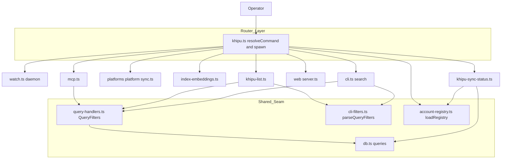
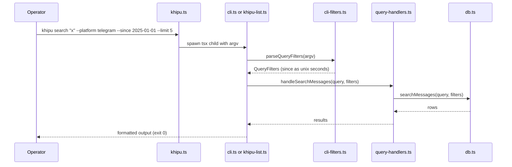
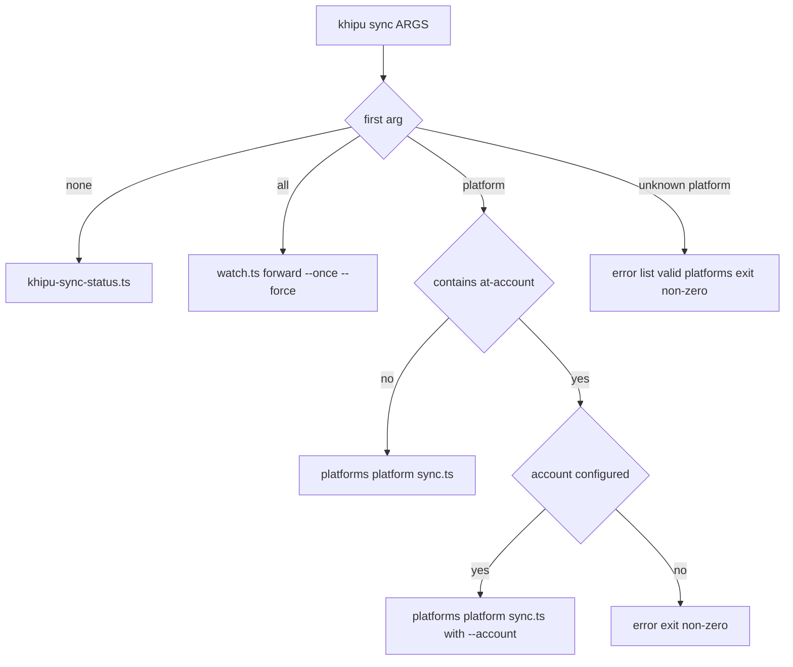

# Design Document

## Overview

**Purpose**: The `khipu` CLI delivers a single, discoverable, globally installable operator entry point that routes to every KhipuChat surface (sync, index, MCP, web, and terminal queries), replacing the fragmented `npm run sync:*` script interface.

**Users**: Operators and developers run `khipu` from the terminal to sync sources, rebuild the embeddings index, launch the MCP server or web UI, and reproduce any MCP query without leaving the shell.

**Impact**: This is an extension of an existing tsx-executed TypeScript codebase. It reroutes two `sync` cases in the pure router (`src/khipu.ts`), formalizes a shared query-filter contract behind the existing `query-handlers.ts` seam so the CLI and MCP server stay at exact parity, and adds two thin child-process entrypoints. No build step is introduced; execution remains direct-TypeScript via `tsx`.

### Goals
- One `khipu` binary routes to all operational and query surfaces with per-subcommand help and correct exit codes.
- CLI query subcommands (`search`, `list chats`, `list messages`) share one filter contract with the MCP server, guaranteeing identical results for identical filters.
- Bare `khipu sync` reports status; `khipu sync all` runs the daemon; `khipu sync <platform>[@account]` runs a one-shot sync.

### Non-Goals
- The sync daemon polling loop, intervals, and incremental/`--force` re-read semantics (owned by `sync-watcher` and `incremental-sync`).
- Multi-account config parsing, account enumeration internals, and honoring `--account` inside per-platform sync scripts (owned by `multi-account`).
- The embeddings computation pipeline (owned by `semantic-search`).
- `setup-claude` / `setup-sync` implementations (already exist; the router only continues to dispatch them).

## Boundary Commitments

### This Spec Owns
- The `khipu` subcommand router (`src/khipu.ts`): route table, `<platform>@<account>` parsing, per-subcommand `--help`, unknown-command and invalid-argument errors with exit codes.
- Sync status display (`khipu sync`) as a read-only composition of `loadRegistry()` and `getPlatformLastSyncedAt()`.
- The canonical `QueryFilters` contract and its enforcement across `search`, `list chats`, and `list messages` on both CLI and MCP surfaces.
- CLI-side filter parsing (`--platform/--account/--since/--until/--type/--limit`) and ISO-date parsing for `--since/--until`.
- MCP `inputSchema` additions and argument wiring required to keep MCP at parity with the CLI (reference implementation).

### Out of Boundary
- Daemon loop behavior, polling intervals, and `--force` re-read effect inside `watch.ts` / `sync-runner.ts`.
- Per-platform sync scripts honoring the forwarded `--account` flag (they currently hardcode `account='default'`).
- Embedding computation, `sync_state` write semantics, and account-config parsing rules.
- Removal or refactor of `sync-all.ts` (retained for its `PLATFORMS` export).

### Allowed Dependencies
- `src/account-registry.ts` (`loadRegistry`, `listAccounts`) — read-only account enumeration for status and `@account` validation.
- `src/db.ts` (`getPlatformLastSyncedAt`, `searchMessages`, and extended query functions) — data access.
- `src/query-handlers.ts` — the single shared handler seam for all query surfaces.
- `src/watch.ts`, `src/index-embeddings.ts`, `src/mcp.ts`, `src/web/server.ts` — spawned as child entrypoints, unchanged except MCP schema/wiring.
- `tsx` runtime and the existing `bin/khipu` shim.

### Revalidation Triggers
- Any change to the `QueryFilters` shape or handler signatures in `query-handlers.ts` (both MCP and CLI adapters must re-sync).
- Making MCP `list_messages.chat_id` required again, or changing cross-chat listing semantics.
- `multi-account` wiring `runAllAccountsSync` / `--account` into sync entrypoints (then `@account` forwarding becomes end-to-end effective).
- Changes to `PLATFORMS`, the `Platform` union, or `MessageType`.
- Router startup dependency changes (e.g., the router beginning to open the DB directly).

## Architecture

### Existing Architecture Analysis
- `src/khipu.ts` is a **pure resolver + spawner**: `resolveCommand(argv)` returns a `run | help | error` resolution, and `spawnScript` runs the target via `tsx` with inherited stdio. It holds no DB or registry state. This purity is preserved.
- `src/query-handlers.ts` is already the **shared query seam**: `src/mcp.ts` (tool dispatch) and `src/cli.ts` both call the same `handle*` functions. This is the anchor for parity.
- Per-platform `sync.ts` entrypoints call `runPlatformSync(singletonAdapter, db, process.argv)` with `account='default'`; they do not iterate accounts or read `--account`.
- `src/watch.ts` already implements the daemon (loop, `--once`, SIGINT/SIGTERM drain, intervals).

### Architecture Pattern & Boundary Map

Selected pattern: **thin router + shared handler seam**. The router owns dispatch only; every query surface is an adapter that translates its input into one `QueryFilters` object and calls shared handlers.



**Architecture Integration**:
- Selected pattern: thin router + shared handler seam — parity is structural, not conventional.
- Domain boundaries: dispatch (router) is separate from query logic (handlers) and from surface-specific parsing (`cli-filters.ts`, MCP arg extraction).
- Existing patterns preserved: pure `resolveCommand`; spawn-a-`tsx`-child for every operational surface; `query-handlers.ts` as the single query authority.
- New components rationale: `khipu-sync-status.ts` and `khipu-list.ts` keep the router pure and files small; `cli-filters.ts` is the single CLI-side parser shared by `search` and `list`.
- Steering compliance: agent-native parity (MCP is the reference surface; CLI mirrors it exactly); fully local, no network dependency added.

### Technology Stack

| Layer | Choice / Version | Role in Feature | Notes |
|-------|------------------|-----------------|-------|
| CLI | Node.js + `tsx` (existing) | Direct-TypeScript execution via `bin/khipu`; no build step | Req 1.5; `bin` already registered |
| Backend / Services | Existing `query-handlers.ts`, `mcp.ts`, `watch.ts` | Shared handlers + spawned entrypoints | No new services |
| Data / Storage | `better-sqlite3-multiple-ciphers` (existing) | `chats`, `messages`, `messages_fts`, `sync_state` queries | `--type/--since/--until/--limit` are WHERE clauses; no schema change |
| Infrastructure / Runtime | `child_process.spawn` (existing) | Router spawns each surface as a child | Unchanged pattern |

## File Structure Plan

### Directory Structure
```
src/
├── khipu.ts                 # MODIFIED: route table, @account parse+validate, per-subcommand --help
├── khipu-sync-status.ts     # NEW: read-only sync status table (registry + last-synced)
├── khipu-list.ts            # NEW: `list chats|messages` entrypoint with QueryFilters
├── cli-filters.ts           # NEW: parseQueryFilters + parseDateArg (shared by cli.ts and khipu-list.ts)
├── cli.ts                   # MODIFIED: `search` case consumes parseQueryFilters -> handleSearchMessages
├── query-handlers.ts        # MODIFIED: QueryFilters type; extend handlers; add handleListArchiveMessages
├── db.ts                    # MODIFIED: extend searchMessages; add listArchiveMessages query
└── mcp.ts                   # MODIFIED: extend inputSchemas + arg wiring; list_messages.chat_id optional
```

### Modified Files
- `src/khipu.ts` — Reroute `sync all` → `watch.ts` and bare `sync` → `khipu-sync-status.ts`; add `list` route → `khipu-list.ts`; parse `<platform>@<account>`, validate the account via injected lookup, forward `--account <name>`; detect `--help`/`-h` after a subcommand and emit subcommand-specific usage. `resolveCommand` gains an injected `listAccounts(platform)` dependency (default backed by `loadRegistry`) to stay pure.
- `src/query-handlers.ts` — Introduce `QueryFilters`; extend `handleSearchMessages` and `handleListChats` to honor `platform/account/since/until/type/limit`; add `handleListArchiveMessages(filters)` for cross-chat message listing.
- `src/db.ts` — Extend `searchMessages` with `type/since/until/limit` conditions; add `listArchiveMessages(filters)` query. No schema change.
- `src/mcp.ts` — Add `since/until/type/limit` to `search_messages`, `list_chats`, `list_messages` `inputSchema`s; make `list_messages.chat_id` optional (omitted → cross-chat listing); wire new args into the shared handlers. Updated first as the reference implementation.
- `src/cli.ts` — Replace ad-hoc `search` parsing with `parseQueryFilters`; pass the resulting `QueryFilters` to `handleSearchMessages`.

Each file has one responsibility: the router dispatches, `cli-filters.ts` parses, `query-handlers.ts` decides, `db.ts` queries. Dependency direction: `db.ts` → `query-handlers.ts` → {`mcp.ts`, `cli.ts`, `khipu-list.ts`, `khipu-sync-status.ts`}; `cli-filters.ts` is a leaf util (depends only on types); `khipu.ts` spawns children and never imports query logic.

## System Flows

### Query parity flow (search / list)

The MCP path is identical from `Handler` onward: `mcp.ts` builds the same `QueryFilters` from tool arguments and calls the same handler, so equal filters yield equal results (Req 8.7, 9.4, 10.4).

### Sync command resolution


## Requirements Traceability

| Requirement | Summary | Components | Interfaces | Flows |
|-------------|---------|------------|------------|-------|
| 1.1 | `bin` registration | `package.json` (existing) | — | — |
| 1.2, 1.4 | Root help / unknown subcommand error | `khipu.ts` | `resolveCommand` | Sync resolution |
| 1.3 | Per-subcommand `--help` | `khipu.ts` | `resolveCommand` (help detection) | — |
| 1.5 | `npm link` / tsx, no build | `bin/khipu`, `khipu.ts` (existing) | — | — |
| 2.1–2.3 | Sync status listing | `khipu-sync-status.ts` | `loadRegistry`, `getPlatformLastSyncedAt` | Sync resolution |
| 3.1–3.4 | Sync daemon + `--once` + `--force` fwd + signals | `khipu.ts` (route), `watch.ts` (existing) | route → `watch.ts` | Sync resolution |
| 4.1–4.5 | One-shot platform / `@account` sync | `khipu.ts` | `resolveCommand` (@account parse + validate + forward) | Sync resolution |
| 5.1–5.3 | Index rebuild + progress | `khipu.ts` (route), `index-embeddings.ts` (existing) | route → `index-embeddings.ts` | — |
| 6.1–6.2 | MCP server start / signals | `khipu.ts` (route), `mcp.ts` (existing) | route → `mcp.ts` | — |
| 7.1–7.3 | Web server start + URL / signals | `khipu.ts` (route), `web/server.ts` (existing) | route → `web/server.ts` | — |
| 8.1–8.9 | Search with filters + parity | `cli.ts`, `cli-filters.ts`, `query-handlers.ts`, `db.ts` | `parseQueryFilters`, `handleSearchMessages` | Query parity |
| 9.1–9.6 | List chats/messages with filters | `khipu-list.ts`, `cli-filters.ts`, `query-handlers.ts`, `db.ts` | `handleListChats`, `handleListArchiveMessages` | Query parity |
| 10.1–10.4 | CLI/MCP filter parity | `query-handlers.ts` (`QueryFilters`), `mcp.ts`, `cli-filters.ts` | `QueryFilters` | Query parity |

## Components and Interfaces

| Component | Domain/Layer | Intent | Req Coverage | Key Dependencies (P0/P1) | Contracts |
|-----------|--------------|--------|--------------|--------------------------|-----------|
| `resolveCommand` (khipu.ts) | Router | Map argv to a run/help/error resolution | 1, 2, 3, 4, 9 | injected `listAccounts` (P0) | Service |
| `khipu-sync-status.ts` | Ops entrypoint | Print per-account last-sync table | 2 | `loadRegistry` (P0), `getPlatformLastSyncedAt` (P0) | Batch |
| `khipu-list.ts` | Query entrypoint | `list chats|messages` with filters | 9, 10 | `cli-filters` (P0), `query-handlers` (P0) | Batch |
| `cli-filters.ts` | Query util | Parse filter flags + ISO dates into `QueryFilters` | 8, 9, 10 | `Platform`/`MessageType` types (P1) | Service |
| `query-handlers.ts` (extended) | Shared seam | Apply `QueryFilters` uniformly for both surfaces | 8, 9, 10 | `db` (P0) | Service |
| `mcp.ts` (extended) | MCP adapter | Expose filters + optional `chat_id`; call shared handlers | 6, 10 | `query-handlers` (P0) | API |

### Router

#### `resolveCommand`

| Field | Detail |
|-------|--------|
| Intent | Pure mapping from argv to a dispatch resolution, including help and validation errors |
| Requirements | 1.2, 1.3, 1.4, 2.1, 3.1, 3.2, 4.1, 4.2, 4.4, 4.5, 9.5 |

**Responsibilities & Constraints**
- Route bare `sync` → `khipu-sync-status.ts`; `sync all` → `watch.ts`; `sync <platform>` → platform sync; `list` → `khipu-list.ts`; existing operational/query commands unchanged.
- Parse `<platform>@<account>`: split on the first `@`; validate the platform against `PLATFORMS` and the account against injected `listAccounts(platform)`.
- Detect `--help`/`-h` immediately following a subcommand and return `kind: 'help'` with that subcommand's usage.
- Remain pure: no DB/registry imports; the account lookup is injected.

**Dependencies**
- Inbound: `main()` in `khipu.ts` — supplies argv and the default lookup (Criticality P0)
- Outbound: injected `listAccounts(platform): readonly string[]` — account validation (P0)
- External: none

**Contracts**: Service [x]

##### Service Interface
```typescript
type Subcommand =
  | 'sync' | 'list' | 'search' | 'index' | 'mcp' | 'web'
  | 'setup-claude' | 'setup-sync' | 'semantic-search' | 'semantic-contacts'
  | 'list-chats' | 'find-chat' | 'messages' | 'summary'

interface ResolveDeps {
  /** Configured account names for a platform; defaults to a loadRegistry-backed impl. */
  listAccounts(platform: string): readonly string[]
}

interface CommandResolution {
  readonly kind: 'run' | 'help' | 'error'
  readonly script?: string
  readonly args?: readonly string[]
  readonly message?: string
  readonly exitCode?: number
}

function resolveCommand(
  argv: readonly string[],
  deps?: ResolveDeps,
): CommandResolution
```
- Preconditions: `argv` is the process arguments after the binary name.
- Postconditions: exactly one of `run` (with `script`+`args`), `help` (with `message`, exit 0), or `error` (with `message`, non-zero exit) is returned.
- Invariants: no side effects; identical `argv`+`deps` always yields identical resolution.

**Implementation Notes**
- Integration: `main()` injects `deps.listAccounts = (p) => loadRegistry().listAccounts(p as Platform)`. For `sync <platform>@<account>`, the child receives `['--account', account, ...rest]`.
- Validation: unknown platform → error listing `PLATFORMS`; unconfigured account → error naming the platform (Req 4.4, 4.5).
- Risks: forwarding `--account` is inert until `multi-account` wires it into sync scripts — documented as a revalidation trigger, not a CLI bug.

### Query Seam

#### `QueryFilters` + extended handlers

| Field | Detail |
|-------|--------|
| Intent | One filter contract enforced identically for CLI and MCP query surfaces |
| Requirements | 8.2–8.7, 9.3, 9.4, 10.1–10.4 |

**Responsibilities & Constraints**
- Define the canonical filter type and apply it in `handleSearchMessages`, `handleListChats`, and the new `handleListArchiveMessages`.
- Own the semantics of each filter; surface adapters only translate their input into this type.
- `--type` semantics: chat type (`user`/`group`) for `list chats`; `MessageType` for `search` and `list messages`.
- Cross-chat `list messages` defaults to `type='text'` when `--type` is omitted (consistent with existing per-chat listing); an explicit `--type` overrides.

**Dependencies**
- Inbound: `mcp.ts`, `cli.ts`, `khipu-list.ts` — build `QueryFilters` and call handlers (P0)
- Outbound: `db.ts` — `searchMessages`, `handleListChats` query, `listArchiveMessages` (P0)
- External: none

**Contracts**: Service [x]

##### Service Interface
```typescript
interface QueryFilters {
  platform?: Platform
  account?: string
  since?: number   // unix seconds, inclusive lower bound
  until?: number   // unix seconds, inclusive upper bound
  type?: string    // MessageType for messages/search; chat type for chats
  limit?: number
}

function handleSearchMessages(query: string, filters?: QueryFilters): SearchResult[]
function handleListChats(filters?: QueryFilters): ChatResult[]
function handleListArchiveMessages(filters?: QueryFilters): {
  messages: MessageResult[]
  has_more: boolean
}
```
- Preconditions: `since <= until` when both present; `limit`, when present, is a positive integer (validated by the caller/parser).
- Postconditions: results reflect all provided filters; omitted filters impose no constraint (except the `type='text'` default noted above).
- Invariants: for equal `QueryFilters`, the CLI and MCP surfaces receive identical rows.

**Implementation Notes**
- Integration: existing `handleSearchMessages(query, chatId?, platform?, account?)` and `handleListChats(platform?, account?, limit?)` signatures are widened to the `QueryFilters` object; the per-chat `handleListMessages(chatId, opts)` is retained unchanged for MCP `list_messages` when `chat_id` is supplied.
- Validation: filter values are validated at the surface boundary (`cli-filters.ts` for CLI, arg coercion in `mcp.ts`); handlers assume validated input.
- Risks: widening handler signatures touches all current call sites — update `mcp.ts` and `cli.ts` in the same change; cover with a parity test.

#### `cli-filters.ts`

| Field | Detail |
|-------|--------|
| Intent | Single CLI-side parser producing a validated `QueryFilters` from argv |
| Requirements | 8.2–8.6, 8.9, 9.3, 10.1, 10.3 |

**Responsibilities & Constraints**
- Parse `--platform/--account/--since/--until/--type/--limit`; convert ISO dates via `parseDateArg`; validate platform against `PLATFORMS` and `--limit` as a positive integer.
- Return a discriminated result: parsed filters, or a structured error (message + non-zero exit) for invalid values (Req 10.3).

**Contracts**: Service [x]

##### Service Interface
```typescript
type FilterParseResult =
  | { ok: true; filters: QueryFilters; rest: string[] }
  | { ok: false; error: string }

function parseQueryFilters(argv: readonly string[]): FilterParseResult
function parseDateArg(value: string): number | undefined // ISO date -> unix seconds
```
- Preconditions: `argv` are the raw subcommand arguments.
- Postconditions: `rest` contains positional args (e.g. the search query / `chats`|`messages`) with all recognized flags removed.
- Invariants: pure; used by both `cli.ts` (`search`) and `khipu-list.ts` so parsing cannot drift between surfaces.

**Implementation Notes**
- Integration: extends the established index-based flag-removal pattern already used by `parseAccountArg`/`parseForceArg` in `cli.ts`.
- Validation: invalid platform, non-numeric/zero/negative `--limit`, or unparseable date → `{ ok: false }` (Req 10.3, 8.9 for missing query handled by the surface).
- Risks: date parsing scope — accept `YYYY-MM-DD` (and full ISO); reject ambiguous inputs rather than guessing.

### Ops Entrypoints

#### `khipu-sync-status.ts`

| Field | Detail |
|-------|--------|
| Intent | Print each configured platform, its accounts, and last successful sync time |
| Requirements | 2.1, 2.2, 2.3 |

**Responsibilities & Constraints**
- For each platform in `PLATFORMS`, list configured accounts from `loadRegistry().listAccounts(platform)`; omit platforms with zero accounts (2.2); show `never` when `getPlatformLastSyncedAt` returns null (2.3). Exit 0.

**Contracts**: Batch [x]
- Trigger: spawned by the router for bare `khipu sync`.
- Input/validation: none (read-only).
- Output/destination: formatted table to stdout.
- Idempotency & recovery: pure read; safe to re-run.

**Implementation Notes**
- Integration: initializes the DB the same way other entrypoints do (`initDb('./khipuchat.db')`) before reading `sync_state`.
- Risks: none material; no writes.

#### `khipu-list.ts`

| Field | Detail |
|-------|--------|
| Intent | Entrypoint for `list chats` / `list messages` with the shared filter set |
| Requirements | 9.1, 9.2, 9.3, 9.5, 9.6 |

**Responsibilities & Constraints**
- Dispatch on the first positional (`chats` | `messages`); anything else (including bare `list`) → usage + non-zero exit (9.5).
- Build `QueryFilters` via `parseQueryFilters`; call `handleListChats` or `handleListArchiveMessages`; print an empty-results message with exit 0 when nothing matches (9.6).

**Contracts**: Batch [x]
- Trigger: spawned by the router for `khipu list ...`.
- Input/validation: sub-subcommand + filter flags via the shared parser.
- Output/destination: formatted rows to stdout.
- Idempotency & recovery: read-only.

**Implementation Notes**
- Integration: reuses `formatPlatformLabel` and the multi-account label logic already in `cli.ts` (extract to a shared spot if needed to avoid duplication).
- Risks: keep output columns aligned with `cli.ts` conventions for a consistent operator experience.

## Data Models

No schema changes. All new filters map to `WHERE` conditions over existing columns:
- `messages.platform`, `chats.account`, `messages.timestamp` (`since`/`until`), `messages.type` (`MessageType`), and result `LIMIT` for `search` / `list messages`.
- `chats.platform`, `chats.account`, `chats.type`, and last-activity timestamp for `list chats`.
- `sync_state(platform, account, last_synced_at)` read via `getPlatformLastSyncedAt` for status.

`Platform = 'telegram' | 'imessage' | 'discord' | 'slack' | 'whatsapp' | 'wechat' | 'email'` and `MessageType = 'text' | 'voice' | 'video' | 'image' | 'sticker' | 'reaction' | 'notice' | 'other'` are reused unchanged.

## Error Handling

### Error Strategy
Fail fast at the surface boundary with actionable messages and correct exit codes; handlers assume validated input.

### Error Categories and Responses
- **User errors (non-zero exit)**: unknown subcommand → error + root usage (1.4); unknown platform → error listing valid platforms (4.4, 10.3); unconfigured `@account` → error naming the platform (4.5); invalid filter value (bad platform, non-numeric limit, unparseable date) → error from `parseQueryFilters` (10.3); missing `search <query>` → search usage (8.9); bare `list` → list usage (9.5).
- **Empty results (exit 0)**: `search`, `list chats`, `list messages` print an empty-results message and exit 0 (8.8, 9.6).
- **Signals (exit 0)**: `sync all`, `mcp`, `web` inherit existing SIGINT/SIGTERM clean-exit behavior from their child entrypoints (3.4, 6.2, 7.3).

### Monitoring
Progress/status output is already emitted by `index-embeddings.ts` (5.3) and the daemon `watch.ts`; the web server logs its URL at startup (7.1). No new monitoring is introduced.

## Testing Strategy

### Unit Tests
- `resolveCommand`: bare `sync` → `khipu-sync-status.ts`; `sync all` → `watch.ts`; `sync all --once`/`--force` forward flags; `list` → `khipu-list.ts`; unknown subcommand → error + non-zero (1.4); `<platform>@<account>` parsing with valid/invalid account via injected `listAccounts` (4.2, 4.5); unknown platform → error listing platforms (4.4); `<sub> --help` → help with exit 0 (1.3).
- `parseQueryFilters`: each of the six flags parsed and stripped from `rest`; invalid platform, non-numeric/zero `--limit`, and unparseable `--since` → `{ ok: false }` (10.3); `parseDateArg('2025-01-01')` → correct unix seconds.

### Integration Tests
- **Parity**: for a fixed dataset, `handleSearchMessages(query, filters)` returns identical rows whether the `QueryFilters` originate from `parseQueryFilters` (CLI) or from MCP arg coercion (8.7, 10.4). Repeat for `handleListChats` and `handleListArchiveMessages` (9.4).
- **Filter application**: `--type`, `--since/--until`, and `--limit` each measurably narrow `search` and `list messages` results; `--type` on `list chats` filters by chat type.
- **MCP schema**: `list_messages` with `chat_id` preserves per-chat behavior; without `chat_id` it lists across the archive with filters (backward compatibility + new mode).

### E2E Tests
- `khipu` and `khipu --help` list subcommands, exit 0 (1.2).
- `khipu sync` prints the status table with a `never` row for an unsynced account and omits platforms with no accounts (2.1–2.3).
- `khipu search "term" --platform telegram --since 2025-01-01 --limit 5` prints matching rows or the empty-results message with exit 0 (8.1, 8.8).
- `khipu list messages --type text --limit 10` and `khipu list` (bare → usage, non-zero) (9.2, 9.5).

## Security Considerations
No new external surface, network calls, or credential handling are introduced. The CLI reads the same local SQLite archive and account registry already used by existing surfaces; `@account` validation reads configured names only and never prints credential values.
</content>
