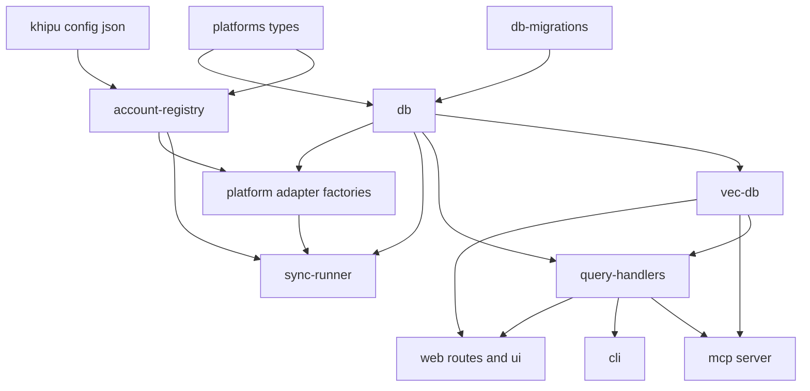
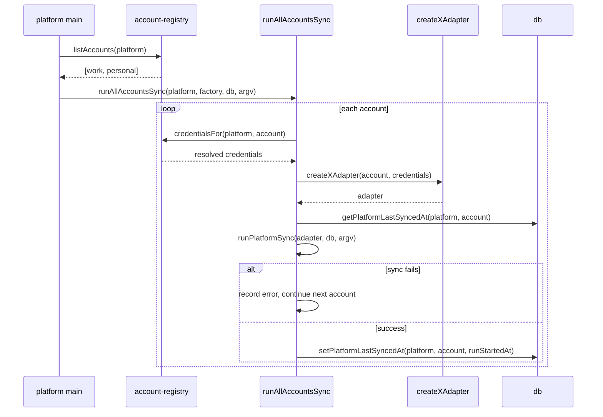
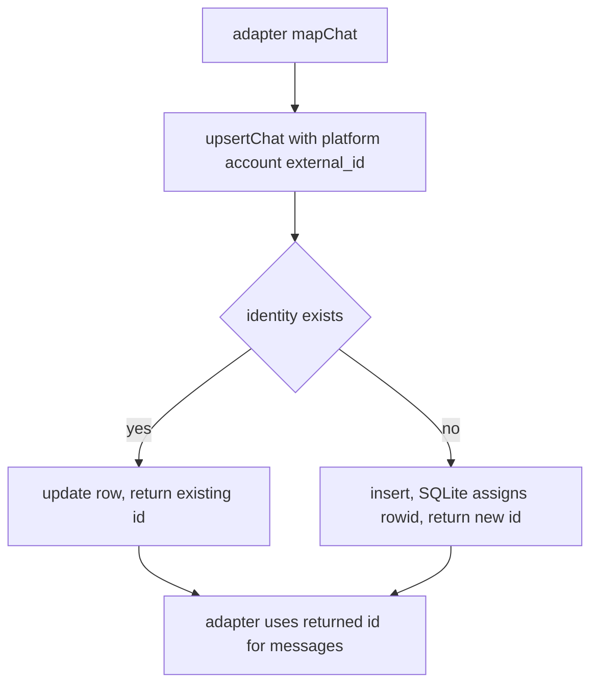
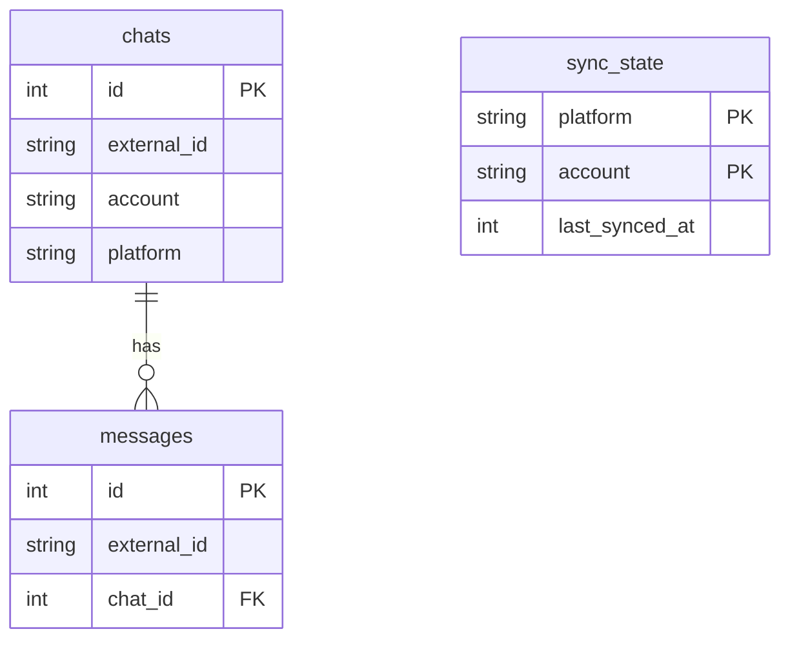
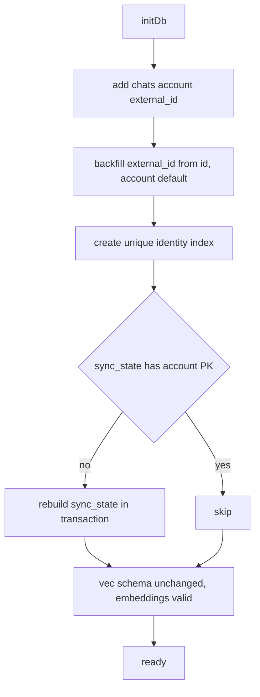

# Technical Design: multi-account

## Overview

**Purpose**: This feature lets a KhipuChat operator archive **multiple named accounts per platform** (for example two Slack workspaces or two Telegram numbers) into one local archive without data collisions, and lets every query surface (MCP, CLI, Web UI) filter and disambiguate results by account.

**Users**: Operators who run more than one account on a platform, and Claude/agents that query the archive through MCP and expect account-scoped results with account identity on every record.

**Impact**: Introduces a `khipu.config.json` account registry, adds an `account` dimension to the archive schema, re-keys sync state by `(platform, account)`, converts platform adapters to per-account factories, and threads an optional account filter through the shared query layer. Existing single-account (`.env`-only) installs continue to work unchanged, with their data attributed to the `"default"` account.

### Goals
- Load any number of named accounts per platform from `khipu.config.json`, falling back to legacy env-var credentials as a single `"default"` account.
- Store chats and sync state per `(platform, account)` so identical external chat ids across accounts never collide.
- Expose one optional account filter and an account field uniformly across MCP, CLI, and Web UI.
- Preserve all existing data, foreign keys, and embeddings through migration with zero re-mapping.

### Non-Goals
- CLI syntax for targeting an account during sync (e.g. `khipu sync slack@work`) — owned by `khipu-cli`; this spec only provides the account enumeration it consumes.
- Credential acquisition flows (OAuth, QR pairing). The registry only resolves and passes existing credentials.
- Modifying the semantic-search embedding pipeline. Embeddings must keep working across accounts; the pipeline itself is untouched.
- Multi-account support for WeChat (explicitly excluded).

## Boundary Commitments

### This Spec Owns
- The `khipu.config.json` schema, its loader, `$VAR` env-reference resolution, validation (duplicate/empty names, WeChat exclusion), and the account-enumeration API (`account-registry.ts`).
- The archive account dimension: `chats.account`, `chats.external_id`, the `(platform, account, external_id)` identity, and per-`(platform, account)` `sync_state`, plus the one-time migration that backfills existing rows to `"default"`.
- The `PlatformAdapter` account contract (`account` field + per-platform adapter factory shape) and the per-account sync-iteration/error-isolation runner.
- The optional `account` filter and `account` result field on all three surfaces (MCP primary, CLI + Web secondary), implemented once in the shared query layer.

### Out of Boundary
- Sync-targeting CLI grammar (`khipu-cli` owns it; this spec exposes `listAccounts(platform)` for it to call).
- The embedding generation/indexing pipeline internals (`index-embeddings.ts`, `embeddings.ts`, vec table creation).
- New platform integrations or changes to how any adapter talks to its upstream API beyond receiving injected credentials.
- Any credential storage, rotation, or acquisition mechanism.

### Allowed Dependencies
- `account-registry.ts` may depend on `platforms/types.ts` and `process.env` only. It must **not** import `db.ts` (persistence must not leak into config).
- Adapters may depend on `account-registry` (credential/account types) and `db.ts`.
- `sync-runner.ts` may depend on `account-registry`, `db.ts`, and adapter factories.
- Query surfaces (`mcp.ts`, `cli.ts`, `web/routes.ts`) may depend on the extracted `query-handlers.ts` and `vec-db.ts`, never directly on adapters.
- Dependency direction (left imports only from left): `types → account-registry → db / db-migrations → query-handlers / vec-db → sync-runner / adapters → mcp / cli / web`.

### Revalidation Triggers
- Change to the `PlatformAdapter` contract (adding/removing `account`, factory signature) → all adapters and `sync-runner` re-check.
- Change to `upsertChat` return contract (surrogate id) → every adapter re-checks.
- Change to the `chats` identity key `(platform, account, external_id)` → migration, embeddings backfill, and all chat-id consumers re-check.
- Change to `listAccounts(platform)` shape or ordering → `khipu-cli` sync-targeting re-checks.
- Addition of an `account` parameter/field to any tool schema or result type → CLI and Web surfaces re-check for parity.

## Architecture

### Existing Architecture Analysis
- `src/db.ts` is the single schema seam; all migrations run through `runMigrations()`. `chats.id` is an adapter-computed integer PK (not a raw external id) referenced by `messages.chat_id` and by `vec_chats.rowid` / `vec_messages.rowid`.
- `src/mcp.ts` holds the reference query handlers (`handle*`); CLI and Web call the same handlers — this is the agent-native parity seam.
- `src/config.ts` is Telegram-only and stays as-is; the registry is a greenfield module beside it.
- `sync-all.ts` spawns each `platforms/<p>/sync.ts` as its own process; each has a `main()` calling `runPlatformSync(adapter, db, argv)`.
- File-size discipline: 200-line target; `db.ts` (230) and `mcp.ts` (302) already exceed it, so this feature **extracts** rather than inflates.

### Architecture Pattern & Boundary Map



**Architecture Integration**:
- Selected pattern: **Registry + factory + shared query layer**. One config registry produces `(account, credentials)` tuples; a per-platform adapter factory consumes them; a single account-filter predicate lives in the query layer and is threaded by every surface.
- Domain boundaries: config (registry) is isolated from persistence (db); identity is owned by the DB (surrogate id) not adapters; query filtering is owned once by `query-handlers`/`vec-db`.
- Existing patterns preserved: `PlatformAdapter` object shape, `runPlatformSync(adapter, ...)` call shape, `handle*` reference handlers, migration-through-`runMigrations`.
- New components rationale: `account-registry.ts` (greenfield config), `db-migrations.ts` and `query-handlers.ts` (extractions to keep `db.ts`/`mcp.ts` within size discipline while adding the account dimension).
- Steering compliance: agent-native parity is structural (single query layer); everything stays local (no new external calls).

### Technology Stack

| Layer | Choice / Version | Role in Feature | Notes |
|-------|------------------|-----------------|-------|
| CLI / Surfaces | Node + TypeScript (existing) | `--account` flag, `?account=` param, account labels | No new deps |
| Backend / Services | `account-registry.ts` (new), adapter factories | Config load, credential injection, per-account sync | Hand-rolled loader; no `zod` |
| Data / Storage | `better-sqlite3-multiple-ciphers@^11` | Account dimension + `RETURNING` on `upsertChat` | RETURNING supported (better-sqlite3 v9+) |
| Config | `khipu.config.json` + `dotenv` (existing) | Account registry + `$VAR` secret resolution | Falls back to legacy env vars |

## File Structure Plan

### Directory Structure
```
src/
├── account-registry.ts        # NEW: khipu.config.json load, $VAR resolution, validation,
│                              #      WeChat exclusion, listAccounts(), credential types
├── db-migrations.ts           # NEW: extracted migration logic — chats account/external_id,
│                              #      sync_state rebuild to (platform, account) PK
├── query-handlers.ts          # NEW: extracted handle* + result types, now account-aware
├── db.ts                      # MODIFIED: Chat/Message types, upsertChat returns id,
│                              #           account-aware sync_state accessors, searchMessages account
├── vec-db.ts                  # MODIFIED: account on filters + result types + join predicate
├── sync-runner.ts             # MODIFIED: runAllAccountsSync + account-aware last-synced
├── mcp.ts                     # MODIFIED: thin server wiring; import handlers, add account to schemas
├── cli.ts                     # MODIFIED: --account parsing, account column in output
├── platforms/
│   ├── types.ts               # MODIFIED: PlatformAdapter.account, AdapterFactory type
│   └── <platform>/sync.ts     # MODIFIED: createXAdapter(account, credentials) factory,
│                              #           external_id + account on mapChat, use returned id
└── web/
    ├── routes.ts              # MODIFIED: ?account= on /api/chats and /api/search
    └── ui.ts                  # MODIFIED: account filter control + conditional account label
```

### Modified Files
- `src/db.ts` — `Chat`/`Message`/`SearchResult` gain `account`; `Chat` gains `external_id`; `upsertChat` resolves by identity and returns the surrogate id; `getChats`/`searchMessages` gain `account?`; `getPlatformLastSyncedAt`/`setPlatformLastSyncedAt` keyed by `(platform, account)`. Migration body moves to `db-migrations.ts`.
- `src/platforms/types.ts` — `PlatformAdapter` gains `readonly account: string`; add `AdapterFactory` and per-platform credential-record typing hook.
- `src/platforms/<platform>/sync.ts` (telegram, imessage, discord, slack, whatsapp, email) — expose `createXAdapter(account, credentials)`; `mapChat` sets `external_id` + `account`; use the id returned by `upsertChat` for messages/last-sync; keep legacy singleton as `createXAdapter('default', legacyCreds)`.
- `src/platforms/wechat/sync.ts` — stays single-account; registry rejects a WeChat account list.
- `src/mcp.ts` — becomes server wiring only (imports `query-handlers`); tool schemas gain `account`; CallTool extracts `account`.
- `src/cli.ts` — parse `--account`; pass to handlers; print account alongside platform when >1 account present.
- `src/web/routes.ts` + `src/web/ui.ts` — `?account=` query param; filter control; conditional label.

> Each file keeps one responsibility. `db-migrations.ts` and `query-handlers.ts` exist specifically so `db.ts`/`mcp.ts` stay within the size budget while gaining the account dimension.

## System Flows

### Per-account sync with error isolation (3.1, 3.3)

A failure on one account is recorded and does not abort the remaining accounts (3.1). Each account's incremental sync reads and writes its own `(platform, account)` last-synced timestamp; a first-time account (no state) triggers a full backfill (3.3).

### Chat identity resolution on write (2.1)

Two accounts on one platform with the same `external_id` resolve to **distinct** surrogate ids, so `messages.chat_id` never collides (2.1).

## Requirements Traceability

| Requirement | Summary | Components | Interfaces | Flows |
|-------------|---------|------------|------------|-------|
| 1.1 | Config load + legacy fallback to `default` | account-registry | `loadRegistry` | — |
| 1.2 | `$VAR` secret resolution + missing-var error | account-registry | `resolveCredential` | — |
| 1.3 | Duplicate/empty-name, case-sensitive validation | account-registry | `validateRegistry` | — |
| 1.4 | WeChat single-account exclusion error | account-registry | `validateRegistry` | — |
| 1.5 | Account enumeration in config order | account-registry | `listAccounts` | — |
| 2.1 | `chats.account` + `external_id` identity, backfill | db-migrations, db | `upsertChat` | Chat identity resolution |
| 2.2 | Per-`(platform, account)` sync_state + rebuild | db-migrations, db | `get/setPlatformLastSyncedAt` | — |
| 3.1 | Per-account sync iteration + error isolation | sync-runner | `runAllAccountsSync` | Per-account sync |
| 3.2 | Credential isolation per account | account-registry, adapters | `createXAdapter` | Per-account sync |
| 3.3 | Per-account incremental state + first-run backfill | sync-runner, db | `runPlatformSync` | Per-account sync |
| 4.1 | Account filter on MCP list/search/semantic | query-handlers, vec-db | `handle*`, `*Filters` | — |
| 4.2 | `account` field in MCP chat/message results | query-handlers, vec-db | result types | — |
| 5.1 | CLI `--account` filter + account in output | cli | `handle*` | — |
| 6.1 | Web account label + filter control | web routes, web ui | `/api/chats?account=` | — |

## Components and Interfaces

| Component | Layer | Intent | Req Coverage | Key Dependencies (P0/P1) | Contracts |
|-----------|-------|--------|--------------|--------------------------|-----------|
| account-registry | Config | Load/validate accounts, resolve secrets, enumerate | 1.1–1.5, 3.2 | process.env (P0), types (P1) | Service |
| db-migrations | Data | Additive schema + sync_state rebuild, backfill | 2.1, 2.2 | db (P0) | Batch |
| db (account) | Data | Account-aware persistence + surrogate identity | 2.1, 2.2, 4.1, 4.2 | db-migrations (P0) | Service, State |
| query-handlers | Query | Account-filtered handlers + result types | 4.1, 4.2, 5.1, 6.1 | db (P0), vec-db (P1) | Service |
| vec-db (account) | Query | Account filter/field on semantic results | 4.1, 4.2 | db (P0) | Service |
| sync-runner | Orchestration | Per-account iteration + error isolation | 3.1, 3.3 | registry (P0), db (P0), adapters (P0) | Service |
| adapter factories | Integration | Per-account credential injection | 3.1, 3.2 | registry (P0), db (P0) | Service |
| mcp / cli / web | Surface | Thread account param + field | 4.1, 4.2, 5.1, 6.1 | query-handlers (P0), vec-db (P1) | Service, API |

### Config

#### account-registry

| Field | Detail |
|-------|--------|
| Intent | Turn `khipu.config.json` (or legacy env) into validated `(account, credentials)` tuples and enumeration |
| Requirements | 1.1, 1.2, 1.3, 1.4, 1.5, 3.2 |

**Responsibilities & Constraints**
- Load and parse `khipu.config.json`; when absent/empty, synthesize a single `"default"` account per platform whose credentials come from legacy env vars (1.1).
- Resolve any credential value beginning with `$` from `process.env`; on a missing referenced variable, fail fast identifying the variable **and** the owning account (1.2).
- Validate: reject duplicate account names on a platform (identify platform + name), reject empty names, treat names case-sensitively (1.3); reject a WeChat account **list** with more than one account (1.4).
- Expose accounts in **config-declared order** (1.5).
- Owns no persistence and must not import `db.ts`.

**Dependencies**
- Outbound: `process.env` — secret resolution (P0)
- Outbound: `platforms/types.ts` — `Platform` union (P1)

**Contracts**: Service [x]

##### Service Interface
```typescript
export interface AccountCredentials {
  readonly name: string;                       // account name, case-sensitive
  readonly fields: Readonly<Record<string, string>>; // resolved credential fields ($VAR expanded)
}

export type RegistryError =
  | { kind: 'missing_env'; account: string; platform: Platform; variable: string }
  | { kind: 'duplicate_name'; platform: Platform; name: string }
  | { kind: 'empty_name'; platform: Platform }
  | { kind: 'wechat_multi_account' };

export interface AccountRegistry {
  listAccounts(platform: Platform): readonly string[];          // 1.5, config order
  credentialsFor(platform: Platform, account: string): AccountCredentials; // 3.2
}

// Fails fast (throws a RegistryError-shaped Error) on any validation error.
export function loadRegistry(configPath?: string, env?: NodeJS.ProcessEnv): AccountRegistry;
```
- Preconditions: `khipu.config.json` is valid JSON when present; env vars referenced by `$VAR` are set at load time.
- Postconditions: every returned account has fully-resolved credential fields; ordering matches config.
- Invariants: no `db` import; WeChat has at most one account; names are unique per platform and non-empty.

**Implementation Notes**
- Integration: consumed by each platform `main()` and by `runAllAccountsSync`; `listAccounts` is the enumeration `khipu-cli` calls.
- Validation: `$` prefix triggers env lookup; a literal `$` value with no env match is a `missing_env` error (fail fast, do not start sync for that account, 1.2).
- Risks: legacy fallback must reproduce today's env-var behavior exactly so single-account installs are unaffected.

### Data

#### db-migrations

| Field | Detail |
|-------|--------|
| Intent | Additive `chats` columns + `(platform, account, external_id)` identity + `sync_state` rebuild, idempotent |
| Requirements | 2.1, 2.2 |

**Responsibilities & Constraints**
- Add `account TEXT NOT NULL DEFAULT 'default'` and `external_id TEXT` to `chats`; backfill `external_id = CAST(id AS TEXT)`, `account = 'default'` for existing rows; create `UNIQUE INDEX ux_chats_identity ON chats(platform, account, external_id)` (2.1).
- **Preserve existing `chats.id` values** so `messages.chat_id` and `vec_*.rowid` remain valid (no re-mapping).
- Rebuild `sync_state` to composite PK `(platform, account)` via `CREATE new / INSERT (account='default') / DROP / RENAME` inside one transaction; existing rows survive (2.2).
- Every step idempotent and guarded (column/index existence, PK-shape check), consistent with existing `runMigrations`.

**Contracts**: Batch [x]

##### Batch / Job Contract
- Trigger: `runMigrations(db)` during `initDb`, before `createVecSchema`.
- Input / validation: current schema shape; guards skip already-applied steps.
- Output / destination: migrated `chats` and `sync_state` tables.
- Idempotency & recovery: guarded per step; `sync_state` rebuild wrapped in a transaction so a failure rolls back cleanly.

**Implementation Notes**
- Integration: extracted from `db.ts:runMigrations`; `db.ts` calls into it.
- Risks: `sync_state` rebuild under WAL — mitigated by single-transaction rebuild and PK-shape guard.

#### db (account persistence)

| Field | Detail |
|-------|--------|
| Intent | Own chat identity (surrogate id) and account-aware persistence + sync-state accessors |
| Requirements | 2.1, 2.2, 4.1, 4.2 |

**Responsibilities & Constraints**
- `upsertChat` resolves the row by `(platform, account, external_id)` and **returns the surrogate id** (via `RETURNING id`), so adapters no longer own identity.
- `searchMessages` accepts an optional `account` and applies `AND c.account = ?` (join already present).
- `sync_state` accessors keyed by `(platform, account)`.
- Account is stored only on `chats`; message account is derived by join (no `messages.account` column).

**Contracts**: Service [x] / State [x]

##### Service Interface
```typescript
export interface Chat {
  id?: number;                 // assigned by DB; omitted on insert
  external_id: string;         // platform-native chat id, as text
  account: string;             // owning account, default 'default'
  name: string;
  type: ChatType;
  username: string | null;
  platform: Platform;
  last_synced_at?: number | null;
  message_count?: number;
}

export interface SearchResult { /* …existing… */ account: string }

export function upsertChat(chat: Chat): number;   // returns resolved surrogate id
export function searchMessages(
  query: string, chatId?: number, platform?: Platform, account?: string,
): SearchResult[];
export function getPlatformLastSyncedAt(platform: Platform, account: string): number | null;
export function setPlatformLastSyncedAt(platform: Platform, account: string, ts: number): void;
```
- Preconditions: `initDb` has run migrations; `chat.external_id` and `chat.account` are set.
- Postconditions: identity `(platform, account, external_id)` maps to exactly one surrogate id; the id is returned for message association.
- Invariants: existing `default` ids are never reassigned; distinct accounts never share a surrogate id.

**Implementation Notes**
- Integration: adapters call `const id = upsertChat(chat)` then use `id` for messages/last-sync.
- Validation: `insertMessage` continues to key on `(external_id, chat_id)`; account is implied by `chat_id`.
- Risks: confirm `RETURNING` on `INSERT … ON CONFLICT … DO UPDATE` returns the id on both insert and update paths in `better-sqlite3-multiple-ciphers@11`.

#### query-handlers (extracted, account-aware)

| Field | Detail |
|-------|--------|
| Intent | Reference query handlers + result types with a single optional account filter |
| Requirements | 4.1, 4.2, 5.1, 6.1 |

**Responsibilities & Constraints**
- Host `handleListChats`, `handleFindChatByName`, `handleListMessages`, `handleSearchMessages`, `handleGetChatSummary`, `handleSemanticFindContacts`, `handleSemanticSearchMessages` and result types (`ChatResult`, `MessageResult`, `SummaryResult`), moved out of `mcp.ts`.
- Each list/search/find/semantic handler accepts `account?: string`; omitted ⇒ all accounts (4.1). `handleListMessages` adds a `JOIN chats` to expose/filter account.
- Every chat/message result type carries `account` (4.2).
- This is the single agent-native parity seam: MCP, CLI, and Web call these unchanged aside from passing `account`.

**Contracts**: Service [x]

##### Service Interface
```typescript
export interface ChatResult { /* …existing… */ account: string }
export interface MessageResult { /* …existing… */ account: string }

export function handleListChats(platform?: Platform, account?: string, limit?: number): ChatResult[];
export function handleFindChatByName(name: string, platform?: Platform, account?: string): ChatResult[];
export function handleListMessages(
  chatId: number, opts?: { before?: number; limit?: number; account?: string },
): { messages: MessageResult[]; has_more: boolean };
export function handleSearchMessages(
  query: string, chatId?: number, platform?: Platform, account?: string,
): SearchResult[];
```

**Implementation Notes**
- Integration: `mcp.ts` imports these; `cli.ts` and `web/routes.ts` already import from `mcp.ts` and switch their import to `query-handlers.ts` (or a re-export).
- Validation: `account` is a plain equality filter; no normalization (case-sensitive, matching registry, 1.3).
- Risks: keep re-exports from `mcp.ts` if needed to avoid churn in existing test imports.

#### vec-db (account filter/field)

| Field | Detail |
|-------|--------|
| Intent | Add account to semantic filters and result rows |
| Requirements | 4.1, 4.2 |

**Responsibilities & Constraints**
- `ContactFilters` and `MessageFilters` gain `account?: string`; the per-row post-filter (which already joins `chats`) adds `c.account` to the select and an account equality check.
- `SemanticContactResult` and `SemanticMessageResult` gain `account`.
- Vec tables and rowids are **unchanged**; account is applied at result-join time, so embeddings keep functioning across accounts with no pipeline change.

**Contracts**: Service [x]

**Implementation Notes**
- Integration: `handleSemanticFindContacts` / `handleSemanticSearchMessages` pass `account` straight through.
- Risks: none to the index; only the enrichment SELECT and filter loop change.

### Orchestration & Integration

#### sync-runner (per-account iteration)

| Field | Detail |
|-------|--------|
| Intent | Iterate configured accounts, inject credentials, isolate per-account failures |
| Requirements | 3.1, 3.3 |

**Responsibilities & Constraints**
- `runAllAccountsSync(platform, factory, db, argv)` enumerates `registry.listAccounts(platform)`, builds an adapter per account via the factory + `registry.credentialsFor`, and runs `runPlatformSync` for each in sequence (3.1).
- A per-account failure is recorded and iteration continues (3.1).
- `runPlatformSync` reads `getPlatformLastSyncedAt(adapter.platform, adapter.account)`; a first-run account (null) backfills; success writes `(platform, account)` state (3.3).

**Contracts**: Service [x]

##### Service Interface
```typescript
export type AdapterFactory = (account: string, credentials: AccountCredentials) => PlatformAdapter;

export interface AccountSyncOutcome { account: string; ok: boolean; error?: string }

export async function runAllAccountsSync(
  platform: Platform, factory: AdapterFactory,
  db: Database.Database, argv: readonly string[],
): Promise<AccountSyncOutcome[]>;
```
- Postconditions: every account attempted; outcomes returned; non-zero if any failed (surfaced by the platform `main()` exit code).
- Invariants: credentials never cross accounts (3.2, enforced by per-account factory instances).

#### PlatformAdapter contract + factories

| Field | Detail |
|-------|--------|
| Intent | Carry account identity; inject per-account credentials |
| Requirements | 3.1, 3.2 |

**Responsibilities & Constraints**
- `PlatformAdapter` gains `readonly account: string`; adapter methods tag all `upsertChat` calls with `account` and use the returned id.
- Each multi-account platform exposes `createXAdapter(account, credentials): PlatformAdapter`; the legacy singleton export becomes `createXAdapter('default', legacyEnvCreds)` for backward compatibility (3.2).
- WeChat retains its existing single-account entry and is not driven by `runAllAccountsSync`.

**Contracts**: Service [x]

##### Service Interface
```typescript
export interface PlatformAdapter {
  readonly platform: Platform;
  readonly account: string;
  runBackfill(db: Database.Database): Promise<void>;
  startListener(db: Database.Database): void;
  syncIncremental?(db: Database.Database, since: Date): Promise<void>;
}
```
- Invariants: an adapter instance is bound to exactly one `(platform, account)` and its credentials.

### Surfaces

#### mcp / cli / web (account threading)

| Field | Detail |
|-------|--------|
| Intent | Accept optional account input and emit account field, parity across surfaces |
| Requirements | 4.1, 4.2, 5.1, 6.1 |

**Responsibilities & Constraints**
- MCP: add `account` string property to `list_chats`, `find_chat_by_name`, `list_messages`, `search_messages`, `semantic_find_contacts`, `semantic_search_messages` input schemas; CallTool extracts `account` and passes it to the handler (4.1); results already carry `account` from the handlers (4.2).
- CLI: parse `--account <name>` (index-based, like `--min-similarity`); pass to `handleListChats`/`handleSearchMessages`/etc.; when output spans >1 account, print the account name beside the platform (5.1).
- Web: `/api/chats` and `/api/search` accept `?account=`; UI adds a filter control and shows the account label only when a platform has more than one account in the archive (6.1).

**Contracts**: Service [x] / API [x]

##### API Contract
| Method | Endpoint | Request | Response | Errors |
|--------|----------|---------|----------|--------|
| GET | /api/chats?account= | optional account | `ChatResult[]` (each with `account`) | 500 |
| GET | /api/search?q=&account= | optional account | `SearchResult[]` (each with `account`) | 500 |

**Implementation Notes**
- Integration: a small helper (e.g. `listArchiveAccounts(): {platform, account}[]` via `SELECT DISTINCT platform, account FROM chats`) drives the "show label only when >1 account" rule for CLI (5.1) and Web (6.1).
- Validation: unknown account ⇒ empty result set (not an error), consistent with unknown platform today.
- Risks: keep MCP tool descriptions updated so agents discover the `account` parameter (agent-native discoverability).

## Data Models

### Logical Data Model
- `chats`: surrogate `id` (preserved), `external_id` (platform-native id as text), `account` (default `'default'`), `platform`; identity = `UNIQUE(platform, account, external_id)`.
- `messages`: unchanged columns; `chat_id → chats.id`; account derived by join (no new column).
- `sync_state`: PK `(platform, account)`, `last_synced_at`.
- `vec_chats` / `vec_messages`: unchanged; rowids remain chat/message ids.



### Physical Data Model (migration deltas)
```sql
ALTER TABLE chats ADD COLUMN account TEXT NOT NULL DEFAULT 'default';
ALTER TABLE chats ADD COLUMN external_id TEXT;
UPDATE chats SET external_id = CAST(id AS TEXT) WHERE external_id IS NULL;
CREATE UNIQUE INDEX IF NOT EXISTS ux_chats_identity ON chats(platform, account, external_id);
-- sync_state rebuild (single transaction):
CREATE TABLE sync_state_new (
  platform TEXT NOT NULL, account TEXT NOT NULL DEFAULT 'default',
  last_synced_at INTEGER NOT NULL, PRIMARY KEY (platform, account));
INSERT INTO sync_state_new (platform, account, last_synced_at)
  SELECT platform, 'default', last_synced_at FROM sync_state;
DROP TABLE sync_state; ALTER TABLE sync_state_new RENAME TO sync_state;
```

### Data Contracts & Integration
- `AccountCredentials.fields` is the serialization boundary between registry and adapters; keys are platform-specific (e.g. `SLACK_USER_TOKEN`), values are resolved secrets.
- `khipu.config.json` shape (contract with operators):
```jsonc
{
  "slack": [
    { "name": "work",     "userToken": "$SLACK_WORK_TOKEN" },
    { "name": "personal", "userToken": "$SLACK_PERSONAL_TOKEN" }
  ],
  "telegram": [ { "name": "default", "apiId": "$TG_API_ID", "apiHash": "$TG_API_HASH", "phoneNumber": "$TG_PHONE" } ]
  // "wechat": [ ... more than one ... ]  → rejected (1.4)
}
```

## Error Handling

### Error Strategy
Fail fast at startup for config errors (before any sync); isolate per-account failures at runtime.

### Error Categories and Responses
- **Config/User errors** (fail fast, non-zero exit): missing `$VAR` (names variable + account, 1.2); duplicate account name (names platform + name, 1.3); empty name (1.3); WeChat multi-account (1.4). None start sync.
- **Runtime per-account errors** (isolated): a platform account whose sync throws is recorded in `AccountSyncOutcome` and skipped; remaining accounts continue (3.1). Platform `main()` exits non-zero if any account failed.
- **Query errors** (unchanged): unknown account ⇒ empty results, not an error.

### Monitoring
- Per-account sync outcome is written to stdout/stderr like existing per-platform logging; `sync-all.ts` aggregates non-zero exits.

## Testing Strategy

### Unit Tests
- `account-registry`: legacy fallback yields one `default` account per env-configured platform (1.1); `$VAR` resolves and missing var errors name variable+account (1.2); duplicate/empty-name and case-sensitivity validation (1.3); WeChat multi-account rejection (1.4); `listAccounts` preserves config order (1.5).
- `db`/`db-migrations`: migrating a pre-account DB backfills `account='default'` + `external_id` without id reassignment (2.1); `sync_state` rebuild preserves rows under composite PK (2.2); `upsertChat` returns distinct ids for same `external_id` under two accounts (2.1).

### Integration Tests
- `runAllAccountsSync`: two accounts synced in sequence; a thrown error on account 1 still syncs account 2 and reports both outcomes (3.1); first-run account backfills, second run goes incremental using per-account state (3.3).
- Adapter factory: `createXAdapter('work', creds)` writes chats under `account='work'` and messages resolve to that chat's surrogate id (3.2).

### E2E / Surface Tests
- MCP `list_chats`/`search_messages` with and without `account` return scoped vs. all-account results, each carrying `account` (4.1, 4.2).
- CLI `--account work` filters and prints the account beside platform when >1 account present (5.1).
- Web `/api/chats?account=work` filters; UI shows account label only for platforms with >1 account (6.1).

## Migration Strategy

- Rollback trigger: identity-index creation failing due to pre-existing duplicate `(platform, external_id)` in current single-account data would indicate corrupt data — abort before dropping `sync_state`.
- Validation checkpoint: after migration, assert row counts on `chats` and `sync_state` are unchanged and all `account='default'`.
