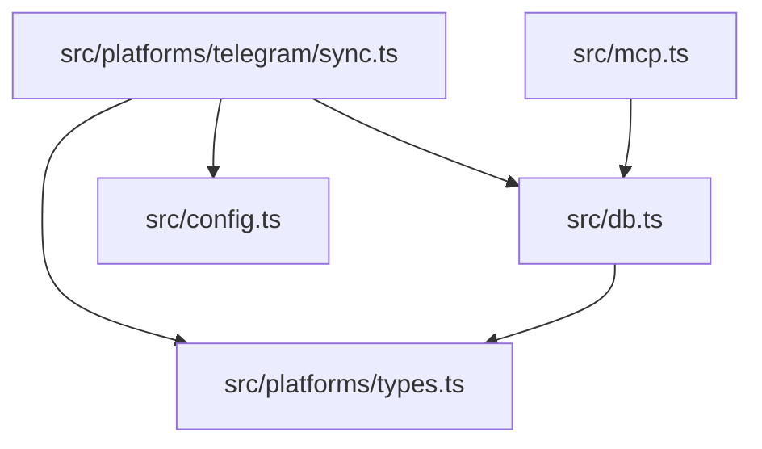
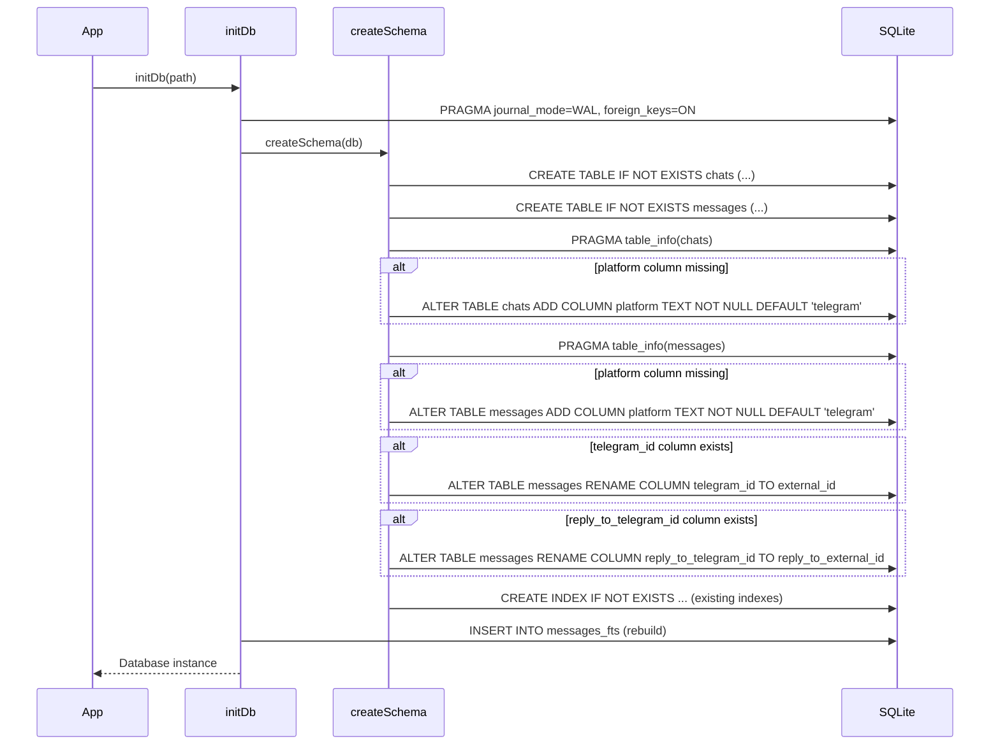

# Design Document — platform-abstraction

## Overview

The platform-abstraction feature generalizes KhipuChat's database schema and source organization to support multiple messaging platforms alongside the existing Telegram integration. It adds a `platform` discriminator column to both the `chats` and `messages` tables, renames the Telegram-specific `telegram_id` column to the generic `external_id`, moves all Telegram sync logic into a dedicated `src/platforms/telegram/` directory, introduces a shared `PlatformAdapter` interface, and makes all four MCP tools platform-aware through additive changes only.

**Purpose**: This feature delivers a platform-neutral foundation that allows iMessage (and future platforms) to share the same database and MCP surface without schema changes or new tools.

**Users**: KhipuChat operators benefit from self-describing records that can be filtered per platform; the `imessage-sync` spec team depends on the `PlatformAdapter` interface and `platform` columns being stable before implementation begins.

**Impact**: Changes the schema of `chats` and `messages` (two additive columns, two column renames), reorganizes `src/sync.ts` into `src/platforms/telegram/sync.ts`, and extends MCP tool input/output shapes additively.

### Goals

- All chat and message rows carry a self-describing `platform` field
- `messages.external_id` replaces `messages.telegram_id` throughout the codebase
- `src/platforms/types.ts` exports `Platform` and `PlatformAdapter` as the stable contract for all platform sync modules
- MCP tools accept an optional `platform` filter and return a `platform` field in every response object
- All existing tests pass; new tests cover the renamed fields and platform filtering

### Non-Goals

- iMessage sync implementation (next spec)
- New MCP tools or renamed existing tools
- Web UI, configuration format, or media download changes
- Migration tooling for production deployments (out of scope per brief)
- Discord, Slack, or WhatsApp sync logic

---

## Boundary Commitments

### This Spec Owns

- `src/db.ts` — schema migration (ADD COLUMN, RENAME COLUMN), updated TypeScript types (`Message`, `Chat`, `SearchResult`), and updated DB function signatures
- `src/platforms/types.ts` — the `Platform` type union and `PlatformAdapter` interface (new file; authoritative for both)
- `src/platforms/telegram/sync.ts` — Telegram sync module (moved from `src/sync.ts`; no behavior change)
- `src/mcp.ts` — additive `platform?` input parameter and `platform` field in all tool response types
- `tests/db.test.ts` — updated fixtures and new assertions for renamed fields and `platform` column
- `tests/mcp.test.ts` — updated fixtures and new assertions for platform filtering

### Out of Boundary

- iMessage, Discord, Slack, WhatsApp sync implementations
- `src/config.ts` and `.env` format (no changes)
- `src/setup-claude.ts` and launchd daemon setup (no changes)
- Any new MCP tools beyond the four existing ones
- Runtime migration of existing deployed SQLite databases (documented as manual step)

### Allowed Dependencies

- `better-sqlite3` (existing) — synchronous SQLite API
- `@modelcontextprotocol/sdk` (existing) — MCP server and tool schemas
- No new npm dependencies are introduced by this spec

### Revalidation Triggers

The following changes would require the `imessage-sync` spec to re-check its integration assumptions:

- Adding or removing values from the `Platform` union in `src/platforms/types.ts`
- Changing the `PlatformAdapter` method signatures (parameter types, return types)
- Renaming or removing columns on `chats` or `messages` that `imessage-sync` inserts into
- Changing the uniqueness constraint on `messages(external_id, chat_id)` to involve `platform`

---

## Architecture

### Existing Architecture Analysis

The Phase 1 implementation has four primary files:

| File | Current Role | Change |
|------|-------------|--------|
| `src/db.ts` | Schema + all DB functions | Modify: add columns, rename columns, update types and functions |
| `src/sync.ts` | Telegram auth, backfill, listener, entry point | Move to `src/platforms/telegram/sync.ts` |
| `src/mcp.ts` | MCP server, four tool handlers | Modify: add `platform?` param, add `platform` to response types |
| `src/config.ts` | Environment config | No change |

The `tests/db.test.ts` and `tests/mcp.test.ts` files use `telegram_id` in fixture objects and must be updated when the column is renamed.

### Architecture Pattern & Boundary Map



Dependency direction (left → right = allowed imports):

`PlatformTypes` → (no deps) | `Config` → (no deps) | `DbModule` → `PlatformTypes` | `TelegramSync` → `PlatformTypes`, `DbModule`, `Config` | `McpServer` → `DbModule`

### Technology Stack

| Layer | Choice / Version | Role in Feature |
|-------|-----------------|-----------------|
| Data / Storage | `better-sqlite3` v9+ (SQLite ≥ 3.39) | Synchronous schema migration (`RENAME COLUMN`, `ADD COLUMN`) |
| Backend | TypeScript strict mode, Node 20 | Type union, interface definitions, updated function signatures |
| MCP | `@modelcontextprotocol/sdk` (existing) | Additive tool schema and response updates |

---

## File Structure Plan

### Directory Structure

```
src/
├── platforms/
│   ├── types.ts                  # NEW — Platform union + PlatformAdapter interface
│   └── telegram/
│       └── sync.ts               # MOVED from src/sync.ts (no behavior change)
├── db.ts                         # MODIFIED — schema migration, renamed types, updated functions
├── mcp.ts                        # MODIFIED — additive platform filter + response field
└── config.ts                     # UNCHANGED
tests/
├── db.test.ts                    # MODIFIED — updated fixtures, new platform assertions
└── mcp.test.ts                   # MODIFIED — updated fixtures, new platform filter tests
```

### Modified Files

- `src/db.ts` — adds `platform` columns to `chats` and `messages`; renames `telegram_id` → `external_id` and `reply_to_telegram_id` → `reply_to_external_id`; updates `Message`, `Chat`, `SearchResult` interfaces; updates all function signatures; adds `columnExists` migration guard
- `src/mcp.ts` — adds optional `platform?` input to `find_chat_by_name` and `search_messages` tool schemas; adds `platform` field to `ChatResult`, `MessageResult`, `SummaryResult`, `SearchResult`; updates SQL queries to join/select `platform`
- `tests/db.test.ts` — replaces `telegram_id` with `external_id` in all fixtures; adds platform default assertions
- `tests/mcp.test.ts` — replaces `telegram_id` with `external_id` in all fixtures; adds platform filtering tests

---

## System Flows

### Schema Migration Flow (startup)



---

## Requirements Traceability

| Requirement | Summary | Components | Key Interface |
|-------------|---------|------------|---------------|
| 1.1–1.5 | `platform` column on chats and messages | `db.ts` schema | `Chat.platform`, `Message.platform` |
| 2.1–2.5 | Rename `telegram_id` → `external_id` | `db.ts` schema + functions | `Message.external_id`, `Message.reply_to_external_id` |
| 3.1–3.3 | `Platform` type and `PlatformAdapter` interface | `src/platforms/types.ts` | `Platform`, `PlatformAdapter` |
| 4.1–4.4 | Move Telegram sync to `src/platforms/telegram/sync.ts` | `src/platforms/telegram/sync.ts` | unchanged function signatures |
| 5.1–5.9 | MCP platform filter + response field | `src/mcp.ts` | `ChatResult.platform`, `SearchResult.platform`, etc. |
| 6.1–6.6 | Test coverage for renamed fields and platform filtering | `tests/db.test.ts`, `tests/mcp.test.ts` | — |

---

## Components and Interfaces

### Summary Table

| Component | Layer | Intent | Req Coverage | Key Dependencies |
|-----------|-------|--------|--------------|-----------------|
| `src/platforms/types.ts` | Shared types | Exports `Platform` union and `PlatformAdapter` interface | 3.1, 3.2, 3.3 | none |
| `src/db.ts` (schema) | Data | Idempotent schema migration; column additions and renames | 1.1–1.5, 2.1–2.5 | `better-sqlite3`, `Platform` |
| `src/db.ts` (functions) | Data | Updated DB function signatures accepting and returning `platform` | 1.1–1.5, 2.1–2.5 | `better-sqlite3` |
| `src/platforms/telegram/sync.ts` | Platform | Telegram sync logic (moved, not changed) | 4.1–4.4 | `db.ts`, `config.ts`, `platforms/types.ts` |
| `src/mcp.ts` | API | Additive platform filter and response field for all four tools | 5.1–5.9 | `db.ts` |

---

### Data Layer — `src/platforms/types.ts`

| Field | Detail |
|-------|--------|
| Intent | Single source of truth for platform identifiers and adapter contracts |
| Requirements | 3.1, 3.2, 3.3 |

**Contracts**: Service [x]

##### Service Interface

```typescript
export type Platform = 'telegram' | 'imessage' | 'discord' | 'slack' | 'whatsapp'

export interface PlatformAdapter {
  readonly platform: Platform
  runBackfill(db: Database.Database): Promise<void>
  startListener(db: Database.Database): void
}
```

- Preconditions: `db` must be an initialized `better-sqlite3` instance
- Postconditions: `runBackfill` resolves when all historical messages have been fetched and inserted; `startListener` registers event handlers and returns synchronously
- Invariants: `platform` is immutable per adapter instance

---

### Data Layer — `src/db.ts`

| Field | Detail |
|-------|--------|
| Intent | Manages SQLite schema, idempotent migration, and all synchronous DB operations |
| Requirements | 1.1–1.5, 2.1–2.5 |

**Contracts**: Service [x] / State [x]

##### Updated TypeScript Interfaces

```typescript
import type { Platform } from './platforms/types'

export interface Chat {
  id: number
  name: string
  type: ChatType
  username: string | null
  platform: Platform
  last_synced_at?: number | null
  message_count?: number
}

export interface Message {
  external_id: string            // renamed from telegram_id
  chat_id: number
  sender_id: string | null
  sender_name: string | null
  text: string | null
  type: MessageType
  timestamp: number
  is_sender: 0 | 1
  reply_to_external_id: string | null  // renamed from reply_to_telegram_id
  platform: Platform
}

export interface SearchResult {
  chat_id: number
  chat_name: string
  sender_name: string | null
  text: string | null
  timestamp: number
  platform: Platform
}
```

##### Migration Guard Interface

```typescript
function columnExists(db: Database.Database, table: string, column: string): boolean
// Uses: SELECT COUNT(*) FROM pragma_table_info(table) WHERE name = column
```

##### Updated DB Function Signatures

```typescript
export function upsertChat(chat: Chat): void
// Now accepts chat.platform; stored in chats.platform

export function insertMessage(msg: Message): void
// Now accepts msg.external_id, msg.platform; stored in messages.external_id, messages.platform

export function getMessages(chatId: number, limit: number, beforeTimestamp?: number): MessageRow[]
// MessageRow now includes external_id and platform

export function searchMessages(query: string, chatId?: number, platform?: Platform): SearchResult[]
// New optional platform parameter filters on messages.platform

export function getLastSyncedId(chatId: number): string | null
// Now queries messages.external_id (was telegram_id)
```

##### Schema DDL (new columns and renames)

```sql
-- chats table migration
ALTER TABLE chats ADD COLUMN platform TEXT NOT NULL DEFAULT 'telegram';
-- (guarded by columnExists check)

-- messages table migration  
ALTER TABLE messages ADD COLUMN platform TEXT NOT NULL DEFAULT 'telegram';
ALTER TABLE messages RENAME COLUMN telegram_id TO external_id;
ALTER TABLE messages RENAME COLUMN reply_to_telegram_id TO reply_to_external_id;
-- (each guarded by columnExists / columnExists-inverse check)
```

**Implementation Notes**

- `columnExists` is a private function in `db.ts`; not exported
- `RENAME COLUMN` guards check for the *old* column name existing (not the new one) to ensure idempotency
- `ADD COLUMN` guards check for the new column name not existing
- FTS triggers reference `new.text` only — unaffected by this change

---

### Data Layer — `src/platforms/telegram/sync.ts`

| Field | Detail |
|-------|--------|
| Intent | Telegram-specific auth wizard, backfill, and real-time listener (moved, not rewritten) |
| Requirements | 4.1–4.4 |

**Contracts**: Service [x]

All exported function signatures (`runAuthWizard`, `runBackfill`, `startListener`) remain identical to the current `src/sync.ts`. The only changes are:

- Field references `telegram_id` → `external_id` and `reply_to_telegram_id` → `reply_to_external_id` in `msgToRow`
- `platform: 'telegram'` added to every `Message` object built by `msgToRow`
- Import path for `db.ts` types updated to reflect the new file location

**Implementation Notes**

- `msgToRow` sets `platform: 'telegram'` statically — no runtime decision needed
- The `main()` entry point in the new file replaces the one in `src/sync.ts`

---

### API Layer — `src/mcp.ts`

| Field | Detail |
|-------|--------|
| Intent | Extends all four MCP tool handlers with optional platform filter input and platform field in responses |
| Requirements | 5.1–5.9 |

**Contracts**: API [x]

##### Updated Result Types

```typescript
export interface ChatResult {
  chat_id: number
  name: string
  type: string
  username: string | null
  message_count: number
  platform: Platform          // NEW
}

export interface MessageResult {
  id: number
  sender_name: string | null
  text: string
  type: string
  timestamp: number
  is_sender: number
  platform: Platform          // NEW
}

export interface SummaryResult {
  name: string
  type: string
  username: string | null
  message_count: number
  first_message_date: number | null
  last_message_date: number | null
  last_5_texts: string[]
  platform: Platform          // NEW
}
```

##### Updated Tool Schemas (MCP JSON Schema)

`find_chat_by_name`:
```json
{
  "type": "object",
  "properties": {
    "name":     { "type": "string" },
    "platform": { "type": "string" }
  },
  "required": ["name"]
}
```

`search_messages`:
```json
{
  "type": "object",
  "properties": {
    "query":    { "type": "string" },
    "chat_id":  { "type": "number" },
    "platform": { "type": "string" }
  },
  "required": ["query"]
}
```

`list_messages` and `get_chat_summary` do not gain a `platform` filter parameter (no per-message platform filtering needed when you already have a chat_id) but their responses gain the `platform` field.

**Implementation Notes**

- `handleFindChatByName(name, platform?)` passes `platform` as an optional SQL `WHERE c.platform = ?` clause
- `handleSearchMessages(query, chatId?, platform?)` passes `platform` as an optional `AND m.platform = ?` clause; delegates to updated `searchMessages` in `db.ts`
- `handleListMessages` SQL selects `m.platform` and includes it in the `MessageResult` rows
- `handleGetChatSummary` SQL selects `c.platform` and includes it in `SummaryResult`

---

## Data Models

### Physical Data Model

**`chats` table (after migration)**

```sql
CREATE TABLE IF NOT EXISTS chats (
  id               INTEGER PRIMARY KEY,
  name             TEXT    NOT NULL,
  type             TEXT    NOT NULL,
  username         TEXT,
  platform         TEXT    NOT NULL DEFAULT 'telegram',   -- NEW
  last_synced_at   INTEGER,
  message_count    INTEGER DEFAULT 0
);
```

**`messages` table (after migration)**

```sql
CREATE TABLE IF NOT EXISTS messages (
  id                    INTEGER PRIMARY KEY AUTOINCREMENT,
  external_id           TEXT    NOT NULL,            -- renamed from telegram_id
  chat_id               INTEGER NOT NULL,
  sender_id             TEXT,
  sender_name           TEXT,
  text                  TEXT,
  type                  TEXT    NOT NULL,
  timestamp             INTEGER NOT NULL,
  is_sender             INTEGER NOT NULL,
  reply_to_external_id  TEXT,                        -- renamed from reply_to_telegram_id
  platform              TEXT    NOT NULL DEFAULT 'telegram',  -- NEW
  UNIQUE(external_id, chat_id)
);
```

**Indexes** (unchanged from Phase 1):
- `idx_messages_chat_timestamp` on `messages(chat_id, timestamp)`
- `idx_messages_chat_type` on `messages(chat_id, type)`

---

## Error Handling

### Error Strategy

- Schema migration errors (e.g., SQLite version too old) bubble up from `initDb` and crash the process at startup — fail fast, no silent degradation
- Invalid `platform` strings passed via MCP `platform?` parameters return an empty result set (no SQL injection risk; parameter-bound queries); no explicit error thrown
- `columnExists` migration guard: if `PRAGMA table_info` returns unexpected results, the error propagates from `better-sqlite3` as a thrown exception

### Monitoring

- No new logging beyond existing `console.log` / `console.error` patterns
- Schema migration operations are synchronous and atomic within SQLite WAL mode

---

## Testing Strategy

### Unit Tests — `tests/db.test.ts`

1. `schema` suite: assert `platform` column exists on `chats` and `messages` after `initDb`
2. `upsertChat`: assert returned chat rows include `platform: 'telegram'` by default
3. `insertMessage`: assert inserted message rows use `external_id` (not `telegram_id`) and include `platform: 'telegram'`
4. `getLastSyncedId`: assert function returns `external_id` value of the most recent message
5. `searchMessages`: assert optional `platform` parameter filters results correctly
6. Migration idempotency: call `initDb` twice on the same in-memory DB; assert no error and schema is correct

### Integration Tests — `tests/mcp.test.ts`

1. `handleFindChatByName`: assert platform filter returns only matching-platform chats; assert all-platform query when omitted
2. `handleSearchMessages`: assert platform filter returns only matching-platform messages; assert cross-platform query when omitted
3. `handleListMessages`: assert `platform` field is present in every returned `MessageResult`
4. `handleGetChatSummary`: assert `platform` field is present in `SummaryResult`
5. Fixture updates: replace all `telegram_id` with `external_id` and `reply_to_telegram_id` with `reply_to_external_id` in seed helpers

### Regression

- All pre-existing test assertions in both test files must pass without modification to their observable claims (only fixture field names change from `telegram_id` to `external_id`)
