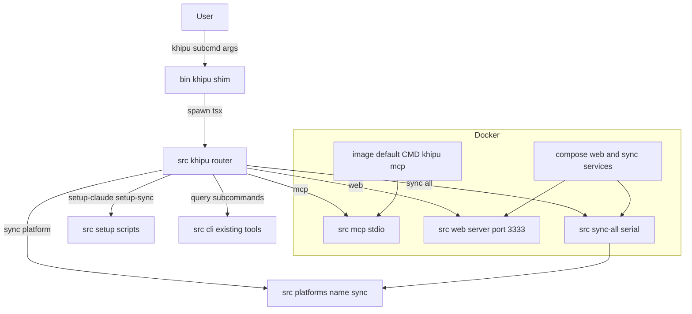
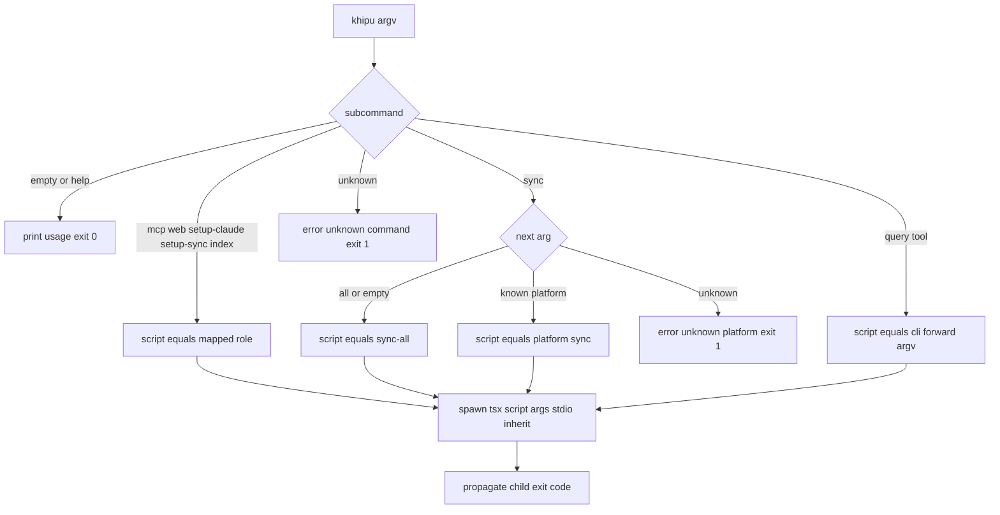
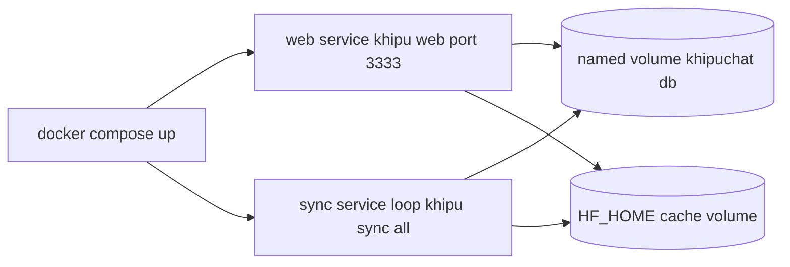

# Technical Design: Release

## Overview

**Purpose**: The Release spec packages KhipuChat for one-command self-hosted deployment. It closes the gap between the existing per-role scripts (`src/mcp.ts`, `src/web/server.ts`, `src/sync-all.ts`, setup scripts) and a shippable artifact: a multi-arch Docker image, a `docker compose up` quickstart, a unified `khipu` command, a real security disclosure address, and README documentation that matches the shipped command surface.

**Users**: Self-hosters run `docker compose up` or `npm install -g` and drive the tool through a single `khipu` command. Contributors use `npm link` for the same command against a working tree. Maintainers push a `v*` tag to publish a multi-arch image to `ghcr.io`.

**Impact**: Most infrastructure already exists (CI/CD workflows, Dockerfile skeleton, `SECURITY.md`, demo asset). The material change is introducing a `khipu` command router that maps subcommands onto the existing entry-point scripts, then wiring Docker, Compose, and the README to that command instead of raw `npm run` / `tsx` invocations.

### Goals
- A single `khipu` command dispatches every operational role: `mcp`, `web`, `sync all`, `sync <platform>`, `setup-claude`, `setup-sync`, plus the existing query tools.
- `docker compose up` starts the web UI and a long-running sync loop against a persisted `khipuchat.db`; the image can also run the stdio MCP server.
- CI/CD and security policy meet requirements with real values (already-passing workflows verified, placeholder email replaced).
- README documents the Docker quickstart, the `khipu`/`npm link` workflow, and `khipu.config.json` multi-account setup.

### Non-Goals
- No new query, sync, or platform features; behavior of existing scripts is unchanged.
- No Kubernetes/Helm, paid registries, auto-update, or cloud hosting.
- No compile-to-`dist` build step: the image continues to run TypeScript via `tsx` (consistent with `tech.md`).
- No fix for WhatsApp-in-Docker (Chromium/QR session); it is documented as unsupported inside the container.

## Boundary Commitments

### This Spec Owns
- The `khipu` command surface: the `bin/khipu` shim, its `package.json` `bin` entry, and the `src/khipu.ts` router that resolves a subcommand to an existing target script.
- Packaging and deployment artifacts: `Dockerfile`, `docker-compose.yml`, `.dockerignore` correctness for the release.
- Release-facing documentation and policy content: `README.md` command references + quickstart + `khipu.config.json` section, `SECURITY.md` contact address.
- Verification that `.github/workflows/ci.yml` and `release.yml` satisfy requirements 2 and 3 (they already do; this spec owns confirming, not rebuilding, them).

### Out of Boundary
- The internal behavior of `src/mcp.ts`, `src/web/server.ts`, `src/sync-all.ts`, `src/platforms/*/sync.ts`, `src/cli.ts`, `src/setup-*.ts`. The router **invokes** these; it does not modify their logic.
- The `khipu.config.json` format and `AccountRegistry` implementation (owned by the multi-account spec). This spec only **documents** the existing format.
- The query-tool argument parsing inside `src/cli.ts` (owned by the khipu-cli spec). The router forwards query subcommands to `cli.ts` unchanged.
- Any schema, sync-state, or embedding logic.

### Allowed Dependencies
- The router may `spawn` the existing entry-point scripts via the project-local `tsx` binary (`node_modules/.bin/tsx`), mirroring the proven pattern in `src/sync-all.ts`.
- Docker/Compose may depend on: Node 20 Alpine base image, the `GITHUB_TOKEN`-authenticated `ghcr.io` registry, `docker/setup-qemu-action` + `docker/build-push-action` (already in `release.yml`), and a named volume for persistence.
- The image relies on `@huggingface/transformers` downloading the ONNX model at first use into `HF_HOME`.

### Revalidation Triggers
- The set of platform names in `src/sync-all.ts` `PLATFORMS` changes → the router's `sync <platform>` resolution and README must be revisited.
- Any entry-point script is renamed or moved (e.g. `src/web/server.ts`) → the router's command→script map breaks.
- `khipu.config.json` format changes (multi-account spec) → the README multi-account section must be re-synced.
- The `khipu` subcommand names change → Dockerfile `CMD`, Compose `command`s, and README all require updates.

## Architecture

### Existing Architecture Analysis

Per `tech.md`, KhipuChat runs **one Node.js process per role**, each executed directly with `tsx` (no build step). Roles today are launched through discrete `npm run` scripts. `src/sync-all.ts` already demonstrates the canonical cross-process pattern: it resolves `node_modules/.bin/tsx` and `spawn`s child scripts with `stdio: 'inherit'`, forwarding flags. The release design reuses this exact mechanism for the `khipu` router rather than inventing a new dispatch approach.

Constraints preserved:
- MCP communicates over **stdio only, never HTTP** (`tech.md`). The container therefore cannot expose MCP as a network port; MCP is run interactively (`docker run -i` / `docker exec -i`).
- The 200-line-per-file limit and `kebab-case.ts` naming apply to `src/khipu.ts`.
- Adapters and roles keep their current interfaces; the router is an additive seam above them.

### Architecture Pattern & Boundary Map

Selected pattern: **thin command dispatcher over existing role scripts** (no refactor of the roles).



**Architecture Integration**:
- Selected pattern: dispatcher/facade. One new component (`src/khipu.ts`) plus one shim (`bin/khipu`); everything else is invoked, not changed.
- Domain boundaries: the router owns **command resolution only**; each role script owns its behavior. No shared mutable state is introduced.
- Existing patterns preserved: `spawn(process.execPath, [tsxBin, script, ...args], { stdio: 'inherit' })` from `src/sync-all.ts`.
- New components rationale: `src/cli.ts` handles query tools exclusively and already exceeds the guideline size; overloading it with operational subcommands would break the 200-line limit and mix concerns. A dedicated router keeps each file single-responsibility.
- Steering compliance: agent-native parity (MCP remains the primary surface, exposed via the image default `CMD`), no build step, one process per role.

### Dependency Direction

`bin/khipu` (shim) → `src/khipu.ts` (router) → existing role scripts. The router imports **nothing** from role modules at load time except the `PLATFORMS` constant from `src/sync-all.ts` (for platform-name validation); it otherwise only resolves a script path and spawns it. Role scripts never import the router. This one-way direction keeps the boundary clean and lets each role continue to run standalone via `npm run`.

### Technology Stack

| Layer | Choice / Version | Role in Feature | Notes |
|-------|------------------|-----------------|-------|
| CLI | Node 20 shim + `tsx` ^4 router | `khipu` command dispatch | Shim spawns project-local `tsx`; no global `tsx` needed |
| Packaging | npm `bin` + `npm link` | Installs `khipu` on PATH | `npm link` in dev and inside the image |
| Infrastructure / Runtime | Docker `node:20-alpine`, multi-stage | Runtime image | Multi-arch build via QEMU in `release.yml` |
| Orchestration | Docker Compose v2 | `web` + `sync` services, named volumes | Sync loop via shell `while` loop |
| CI/CD | GitHub Actions (existing) | Test on push/PR; publish on `v*` | `GITHUB_TOKEN` → `ghcr.io`; no changes required |
| Embeddings runtime | `@huggingface/transformers` ^3 | ONNX model at first use | Cached to `HF_HOME` volume |

## File Structure Plan

### Directory Structure
```
bin/
└── khipu                  # New: executable Node shim; spawns tsx on src/khipu.ts
src/
└── khipu.ts               # New: command router (subcommand -> role script resolution)
```

### New Files
- `bin/khipu` — Node shim with `#!/usr/bin/env node` hashbang. Resolves `node_modules/.bin/tsx` and `src/khipu.ts` relative to `__dirname`, spawns `node tsx khipu.ts <argv>` with `stdio: 'inherit'`, and propagates the child exit code. Must be `chmod +x`. Mirrors the resolution pattern in `src/sync-all.ts`.
- `src/khipu.ts` — the router. Exposes a pure `resolveCommand(argv): CommandResolution` mapping a subcommand to `{ script, args }` or an error/help result, plus a `main()` that spawns the resolved script via `tsx`. Under 200 lines.

### Modified Files
- `package.json` — add `"bin": { "khipu": "bin/khipu" }`. Scripts remain for internal use.
- `Dockerfile` — set `PUPPETEER_SKIP_CHROMIUM_DOWNLOAD=true` before `npm ci`; add `HF_HOME` env; run `npm link` (or `npm install -g .`) in the runtime stage so `khipu` is on PATH; change `CMD` from `npx tsx src/mcp.ts` to `["khipu","mcp"]`.
- `docker-compose.yml` — fix volume target to `/app/khipuchat.db`; add a `web` service (`khipu web`, publish `127.0.0.1:3333:3333`); add a long-running `sync` service running `khipu sync all` on an interval loop; add an `HF_HOME` cache volume; keep the env-var reference comment block; document the stdio-MCP run pattern in comments.
- `SECURITY.md` — replace `security@khipuchat.example.com` with the maintainer disclosure address `yanick.landry@gmail.com`.
- `README.md` — replace all `npm run sync*` / `npx tsx src/...` / `npm run setup-*` references with `khipu ...`; add an `npm link` contributor workflow; add a `khipu.config.json` multi-account section; add the incremental-sync note flagging iMessage as full-scan (cannot filter server-side).

## System Flows

### `khipu` command resolution



Resolution is a pure function so it is unit-testable without spawning. Only `main()` performs the spawn. Unknown platforms and unknown commands fail fast with exit code 1; empty input prints usage with exit 0.

### Docker Compose startup



The `web` and `sync` services share the persisted DB volume. The `sync` service is long-running via a shell loop (`while true; do khipu sync all; sleep $SYNC_INTERVAL; done`), satisfying the "long-running process" requirement while keeping `khipu sync all` itself one-shot. MCP is not a compose network service (stdio only); it is the image default `CMD` and documented for interactive use.

## Requirements Traceability

| Requirement | Summary | Components | Realization |
|-------------|---------|------------|-------------|
| 1.1 | Multi-stage build | Dockerfile | Existing `builder` + runtime stages retained |
| 1.2 | amd64 + arm64 | release.yml | Existing `platforms: linux/amd64,linux/arm64` via QEMU |
| 1.3 | MCP + web functional on compose up | docker-compose.yml, Dockerfile CMD, khipu router | `web` service + image `CMD khipu mcp`; stdio-MCP documented |
| 1.4 | Sync service runs `khipu sync all` long-running | docker-compose.yml `sync` service, khipu router | Shell loop wrapping `khipu sync all` |
| 1.5 | Named volume for `khipuchat.db` | docker-compose.yml | Volume target corrected to `/app/khipuchat.db` |
| 1.6 | Env vars as commented examples | docker-compose.yml | Existing comment block retained |
| 2.1 | `npm test` on push/PR to main | ci.yml | Already met; verified, no change |
| 2.2 | `ubuntu-latest` + Node 20 | ci.yml | Already met; verified, no change |
| 2.3 | Failure blocks merge | ci.yml | Already met; verified, no change |
| 3.1 | Multi-arch publish on `v*` | release.yml | Already met; verified, no change |
| 3.2 | Tag version + `latest` | release.yml | Already met; verified, no change |
| 3.3 | `GITHUB_TOKEN` auth to ghcr.io | release.yml | Already met; verified, no change |
| 4.1 | Private disclosure instructions | SECURITY.md | Existing structure retained |
| 4.2 | Contact email | SECURITY.md | Placeholder replaced with real address |
| 5.1 | `bin` entry for `khipu` | package.json, bin/khipu | New shim + `bin` field |
| 5.2 | README documents `npm link` | README.md | New contributor workflow section |
| 5.3 | Docs reference `khipu` commands | README.md, khipu router | Router provides the surface; docs updated |
| 6.1 | Demo asset in `docs/` linked | README.md | `docs/demo.png` already present and linked |
| 6.2 | Demo under 5 MB | docs/demo.png | 2.7 KB, met |
| 6.3 | Docker quickstart | README.md | Existing section, commands updated to `khipu` |
| 6.4 | `khipu.config.json` docs + slow-sync note | README.md | New multi-account section; iMessage flagged full-scan |

## Components and Interfaces

| Component | Layer | Intent | Req Coverage | Key Dependencies (P0/P1) | Contracts |
|-----------|-------|--------|--------------|--------------------------|-----------|
| `bin/khipu` shim | CLI entry | Launch router under `tsx` | 5.1 | node, node_modules/.bin/tsx (P0) | Batch |
| `src/khipu.ts` router | CLI | Resolve subcommand → role script and spawn | 1.3, 1.4, 5.1, 5.3 | role scripts (P0), tsx (P0) | Service, Batch |
| `docker-compose.yml` | Infra | Start web + sync, persist DB | 1.3, 1.4, 1.5, 1.6 | khipu router (P0), Docker volumes (P0) | Batch |
| `Dockerfile` | Infra | Build runtime image, default MCP role | 1.1, 1.3 | node:20-alpine, khipu router (P0) | Batch |
| `SECURITY.md` | Docs | Disclosure policy + real contact | 4.1, 4.2 | none | — |
| `README.md` | Docs | Quickstart, `khipu`/`npm link`, multi-account | 5.2, 5.3, 6.1, 6.3, 6.4 | khipu router (P1) | — |

### CLI

#### `src/khipu.ts` router

| Field | Detail |
|-------|--------|
| Intent | Map a `khipu` subcommand to an existing role script and spawn it under `tsx` |
| Requirements | 1.3, 1.4, 5.1, 5.3 |

**Responsibilities & Constraints**
- Owns command-name → script-path resolution and process launch only. Contains no query, sync, or MCP business logic.
- `sync` subcommand: `all` (or absent) → `src/sync-all.ts`; a known platform name → `src/platforms/<name>/sync.ts`; unknown → error. Known platform set is imported from `PLATFORMS` in `src/sync-all.ts` (single source of truth; not re-declared).
- Query subcommands (`search`, `semantic-search`, `semantic-contacts`, `list-chats`, `find-chat`, `messages`, `summary`, `index`) forward the full argv to `src/cli.ts` unchanged.
- Fail-fast: unknown command/platform → exit 1 with guidance; empty argv → usage text, exit 0. Child exit code is propagated verbatim.

**Dependencies**
- Inbound: `bin/khipu` shim — spawns this module under `tsx` (P0).
- Outbound: `src/sync-all.ts`, `src/platforms/*/sync.ts`, `src/mcp.ts`, `src/web/server.ts`, `src/cli.ts`, `src/setup-claude.ts`, `src/setup-sync.ts` — spawned as child processes (P0).
- External: `tsx` binary at `node_modules/.bin/tsx` (P0).

**Contracts**: Service [x] / Batch [x]

##### Service Interface
```typescript
// Operational subcommands mapped to a fixed script path.
type OperationalCommand =
  | 'mcp' | 'web' | 'setup-claude' | 'setup-sync' | 'index'

// Query subcommands are forwarded wholesale to src/cli.ts.
type QueryCommand =
  | 'search' | 'semantic-search' | 'semantic-contacts'
  | 'list-chats' | 'find-chat' | 'messages' | 'summary'

interface CommandResolution {
  readonly kind: 'run' | 'help' | 'error'
  readonly script?: string           // absolute path to the target .ts script
  readonly args?: readonly string[]  // args passed to the target script
  readonly message?: string          // help/usage or error text
  readonly exitCode?: number         // 0 for help, 1 for error
}

// Pure, unit-testable: no spawning, no I/O.
export function resolveCommand(argv: readonly string[]): CommandResolution

// Impure entry: resolves then spawns tsx with { stdio: 'inherit' },
// propagating the child's exit code.
export function main(argv: readonly string[]): Promise<number>
```
- Preconditions: `argv` excludes the node/script prefix (subcommand at index 0).
- Postconditions: `resolveCommand` returns exactly one `kind`; `run` always carries `script`.
- Invariants: platform list is derived from `src/sync-all.ts` `PLATFORMS`; no duplicate literal list.

##### Batch / Job Contract
- Trigger: `khipu <subcommand> [...args]` from shell, Docker `CMD`, or Compose `command`.
- Input/validation: subcommand must be a known operational, query, or `sync` command; else exit 1.
- Output/destination: child process stdout/stderr inherited (stdio passthrough); exit code = child exit code.
- Idempotency & recovery: dispatch itself is stateless; recovery semantics belong to the invoked role script.

**Implementation Notes**
- Integration: reuse the `spawn(process.execPath, [tsxBin, script, ...args], { stdio: 'inherit' })` pattern from `src/sync-all.ts`; resolve paths from `__dirname` so it works after `npm link` and inside the image.
- Validation: unit-test `resolveCommand` for each command class, `sync all`, `sync <platform>`, unknown platform, unknown command, and empty argv.
- Risks: stdio MCP requires `stdio: 'inherit'` so the parent does not buffer the protocol stream — covered by the shared spawn pattern.

#### `bin/khipu` shim

Summary-only. Node hashbang script that resolves `node_modules/.bin/tsx` and `src/khipu.ts` from `__dirname`, spawns them with inherited stdio, and exits with the child's status. No logic beyond launch. Marked executable and referenced by `package.json` `bin`.

### Infrastructure

#### `docker-compose.yml`

| Field | Detail |
|-------|--------|
| Intent | Start web UI + long-running sync against a persisted DB |
| Requirements | 1.3, 1.4, 1.5, 1.6 |

**Responsibilities & Constraints**
- `web` service: `command: khipu web`, publishes `127.0.0.1:3333:3333`, mounts the DB and HF cache volumes.
- `sync` service: `command: sh -c "while true; do khipu sync all; sleep ${SYNC_INTERVAL:-3600}; done"`, mounts the same volumes. Long-running per 1.4.
- Named volume `db-data` mounted at `/app/khipuchat.db` (corrected from `telegram.db`); named volume `hf-cache` mounted at `HF_HOME`.
- MCP is not a network service; a comment documents `docker run -i --rm -v khipuchat_db-data:/app/khipuchat.db <image> khipu mcp` for Claude Desktop.
- Retain the existing commented env-var reference block (1.6).

**Contracts**: Batch [x] — service startup only, no code interface.

**Implementation Notes**
- Integration: both services depend on `khipu` being on PATH (provided by `npm link` in the image).
- Validation: `docker compose config` parses; `docker compose up` starts web (reachable on 3333) and sync (logs sync output); DB persists across `down`/`up`.
- Risks: WhatsApp sync fails inside the container (no Chromium) — `sync-all` logs the failure and continues; documented as unsupported.

#### `Dockerfile`

Summary-only (single-responsibility infra change). Retains the multi-stage `builder` + runtime layout (1.1). Adds `ENV PUPPETEER_SKIP_CHROMIUM_DOWNLOAD=true` before `npm ci` to avoid Chromium bloat/failure, `ENV HF_HOME=/app/.cache/huggingface` for model caching, and `RUN npm link` in the runtime stage to place `khipu` on PATH. `CMD` becomes `["khipu","mcp"]` (stdio MCP as the image default role, 1.3). Multi-arch is unchanged (handled by `release.yml`, 1.2).

### Documentation

`README.md` and `SECURITY.md` are content-only edits (no contracts). `SECURITY.md` swaps the placeholder email for `yanick.landry@gmail.com` (4.2). `README.md` updates command references to `khipu` (5.3), adds an `npm link` contributor section (5.2), a `khipu.config.json` multi-account section, and an incremental-sync note stating that most platforms filter server-side but **iMessage** reads the local `chat.db` and always performs a full scan with in-process deduplication (6.4). The Docker quickstart section is retained with commands updated to `khipu` (6.3).

## Error Handling

### Error Strategy
- Router: validate the subcommand before spawning; unknown command or unknown platform → concise stderr message + exit 1. This is fail-fast at the boundary; role scripts keep their own error handling.
- Exit-code propagation: the shim and router return the child's exit status so CI, Compose restart policies, and shell callers observe true success/failure.
- Compose `sync` loop: a failing `khipu sync all` (e.g. WhatsApp in Docker) exits non-zero but the shell loop continues to the next interval; `sync-all` already logs per-platform failures and continues.

### Error Categories and Responses
- **User errors**: unknown subcommand/platform → usage guidance, exit 1.
- **System errors**: `tsx` binary missing → spawn failure surfaces the OS error and exits non-zero (only occurs if `node_modules` is absent — an install error, out of scope to mask).
- **Runtime/first-start**: ONNX model download requires network on first use; failure is surfaced by the role script, not the router. Documented in README.

### Monitoring
- Compose services log to stdout/stderr (inherited); `docker compose logs web|sync` is the observability surface. No new logging infrastructure is introduced.

## Testing Strategy

### Unit Tests
- `resolveCommand(['mcp'])` and each operational subcommand resolve to the correct script path and args.
- `resolveCommand(['sync','all'])` and `resolveCommand(['sync'])` both resolve to `src/sync-all.ts`; `resolveCommand(['sync','telegram'])` resolves to the telegram sync script.
- `resolveCommand(['sync','bogus'])` returns `kind: 'error'`, exit 1; `resolveCommand(['bogus'])` returns `kind: 'error'`, exit 1.
- `resolveCommand([])` returns `kind: 'help'`, exit 0.
- Query subcommands (e.g. `search`) resolve to `src/cli.ts` with argv forwarded unchanged.

### Integration Tests
- Platform-list parity: assert the router's known-platform set equals `PLATFORMS` exported from `src/sync-all.ts` (guards the revalidation trigger).
- Router `main()` propagates a child's non-zero exit code (use a fast, side-effect-free target script to assert passthrough).

### E2E / Deployment Verification (manual, documented in research.md)
- `npm link` then `khipu` (no args) prints usage; `khipu list-chats` runs against a local DB.
- `docker compose config` parses; `docker compose up` starts web on `127.0.0.1:3333` and the sync loop logs output; DB survives `down`/`up` via the named volume.
- `docker run -i --rm <image> khipu mcp` responds to an MCP `initialize` handshake over stdio.

## Security Considerations
- `SECURITY.md` must carry a monitored disclosure address; the maintainer email is used deliberately (public repo — this is an accepted disclosure trade-off, recorded in `research.md`).
- The `web` service binds to `127.0.0.1` only (localhost) as in `src/web/server.ts`; the Compose port mapping preserves this by publishing `127.0.0.1:3333:3333`. Basic-auth (`WEB_USER`/`WEB_PASS`) and `MCP_SECRET` remain optional env layers documented in the compose comment block.
- No secrets are baked into the image; all credentials arrive via `.env` / env vars at runtime (existing behavior).

## Supporting References
- Discovery, gap analysis, and design-decision rationale: `.kiro/specs/release/research.md`.
- Canonical cross-process spawn pattern: `src/sync-all.ts`.
- Platform union / known platforms: `PLATFORMS` in `src/sync-all.ts`, `Platform` type in `src/platforms/types.ts`.
