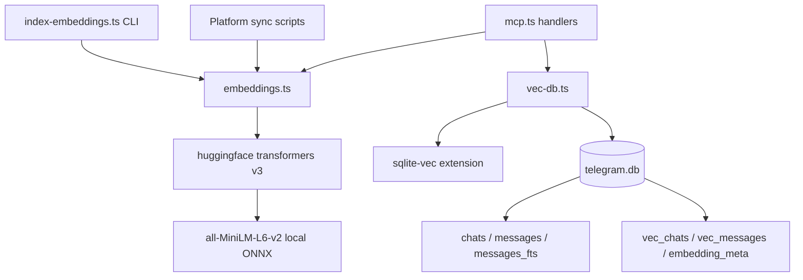
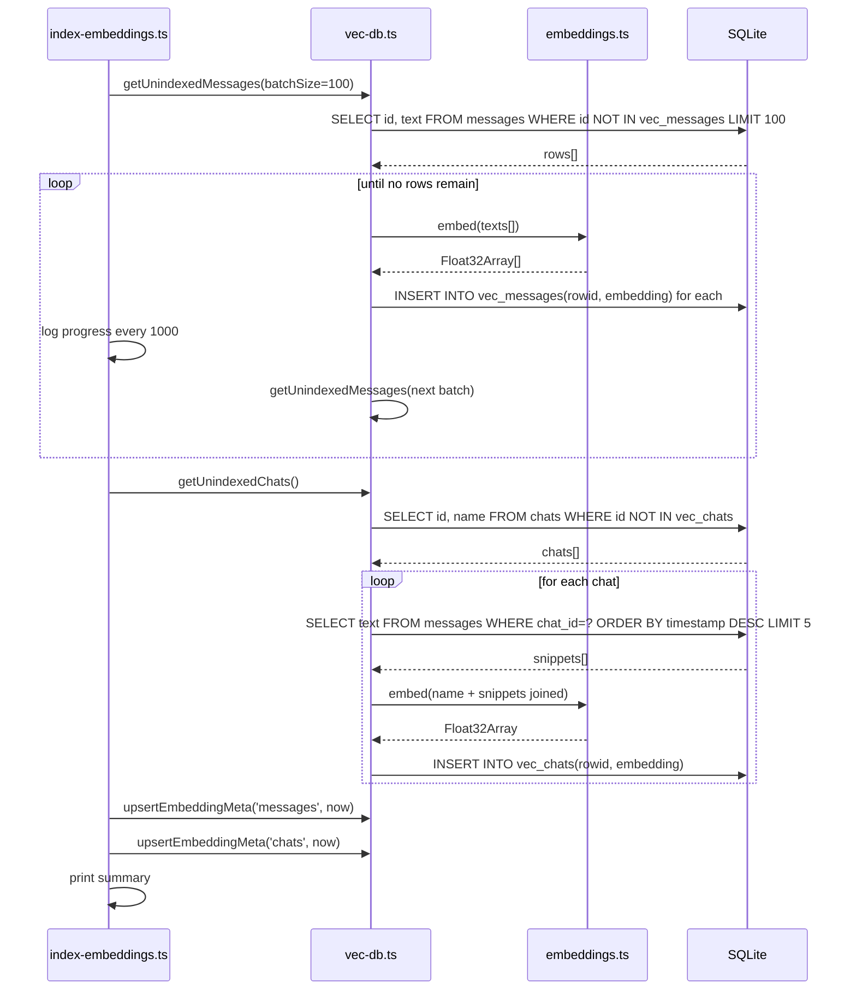
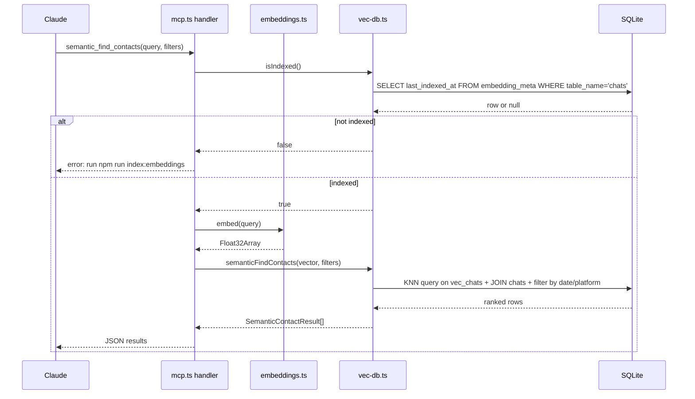

# Design Document: semantic-search

## Overview

This feature adds a local semantic search layer to KhipuChat. Users archive hundreds of thousands of messages across multiple platforms; existing keyword (FTS5) search fails when the exact words are not remembered. Semantic search embeds messages and chats as float32 vectors using a locally-run ONNX model, stores them in the existing SQLite database via the `sqlite-vec` extension, and exposes two new MCP tools — `semantic_find_contacts` and `semantic_search_messages` — that Claude can call to discover relevant people or conversations by meaning without loading all messages into context.

All embedding computation runs on-device. No message text is transmitted to external services.

### Goals
- Enable meaning-based contact and message retrieval via two new MCP tools (Requirements 3, 4)
- Provide a one-time CLI indexing command and incremental sync-time embedding (Requirements 1, 2)
- Stay within 2 GB/1M messages disk budget and return results within 2 seconds (Requirement 5)
- Zero external service calls for embeddings at any stage (Requirement 1.5)

### Non-Goals
- Web UI integration (owned by the web-ui spec)
- Changes to the existing FTS5 keyword search
- Message sending, drafting, or editing
- Cross-platform deduplication

---

## Boundary Commitments

### This Spec Owns
- `src/embeddings.ts` — ONNX model singleton lifecycle, `embed()` batch function
- `src/vec-db.ts` — sqlite-vec extension load, vector table DDL, vector upsert and kNN query functions
- `src/index-embeddings.ts` — CLI entry point for `npm run index:embeddings`
- Two new MCP tool handlers in `src/mcp.ts`: `handleSemanticFindContacts`, `handleSemanticSearchMessages`
- Vector table schema: `vec_chats`, `vec_messages`, `embedding_meta`

### Out of Boundary
- Web UI search surfaces (web-ui spec)
- Existing FTS5 index or `searchMessages()` function — untouched
- Platform sync logic — sync scripts call `embedNewMessages()` as a post-step; they do not own the embedding
- DB encryption (`DB_KEY` / SQLCipher) — vec tables inherit the same encryption via the existing `initDb()` pragma path

### Allowed Dependencies
- `src/db.ts` exports (`getDb`, `initDb`, `Platform`, existing types) — read-only dependency; this spec adds new exports to `db.ts` but does not modify existing functions
- `src/mcp.ts` — adds two new handlers and registers two new tools; does not modify existing tools
- `@huggingface/transformers` v3.x (ONNX model runtime)
- `sqlite-vec` (vector extension for SQLite)

### Revalidation Triggers
- Changes to the `messages` or `chats` table schema (platform-abstraction spec)
- Upgrading `better-sqlite3-multiple-ciphers` past a major version (may affect `loadExtension` compatibility)
- Replacing the embedding model (changes vector dimension, requires full re-index)

---

## Architecture

### Existing Architecture Analysis

`src/db.ts` exports flat synchronous functions and a module-level singleton `_db`. `src/mcp.ts` exports `handleXxx` functions tested directly without the MCP protocol layer. All platform sync scripts import from `../../db` and follow the same `initDb → upsertChat → insertMessage` pattern. Files are kept under 200 lines.

This design follows these exact conventions: flat exported functions, module-level singletons, synchronous DB calls, async only for ONNX inference.

### Architecture Pattern



**Dependency direction**: `index-embeddings.ts` and `mcp.ts` → `embeddings.ts` + `vec-db.ts` → SQLite DB. `embeddings.ts` and `vec-db.ts` do not import from each other.

### Technology Stack

| Layer | Choice / Version | Role |
|-------|-----------------|------|
| Embedding runtime | `@huggingface/transformers` ^3.x | ONNX inference, model download, Float32Array output |
| Vector store | `sqlite-vec` ^0.1.x | vec0 virtual tables, cosine kNN queries in SQLite |
| DB driver | `better-sqlite3-multiple-ciphers` (existing) | All DB I/O; `loadExtension()` called by sqlite-vec |
| Model | `Xenova/all-MiniLM-L6-v2` | 384-dim float32, Apache-2.0, ~90 MB, M4-native ONNX |
| Runtime | Node.js / tsx (existing) | No build step |

---

## File Structure Plan

### New Files
```
src/
├── embeddings.ts         # Model singleton, embed() batch function — no DB imports
├── vec-db.ts             # sqlite-vec load, vector DDL, upsert/query functions — no model imports
└── index-embeddings.ts   # CLI: npm run index:embeddings entry point
```

### Modified Files
- `src/db.ts` — add `loadVecExtension()` called inside `initDb()`; add `embedding_meta` table to `createSchema()`; export new vec types (`SemanticContactResult`, `SemanticMessageResult`)
- `src/mcp.ts` — add `handleSemanticFindContacts`, `handleSemanticSearchMessages`; register two new tools in `ListToolsRequestSchema` handler and dispatch in `CallToolRequestSchema`
- `package.json` — add `"index:embeddings": "tsx src/index-embeddings.ts"` script; add `@huggingface/transformers` and `sqlite-vec` dependencies

---

## System Flows

### Initial / Incremental Indexing Flow



### Semantic Query Flow (MCP)



---

## Requirements Traceability

| Requirement | Summary | Components | Key Interfaces |
|-------------|---------|------------|----------------|
| 1.1 | Index all messages on CLI run | `index-embeddings.ts`, `vec-db.ts`, `embeddings.ts` | `getUnindexedMessages`, `embed`, `upsertMessageVector` |
| 1.2 | Index all chats on CLI run | same | `getUnindexedChats`, `embed`, `upsertChatVector` |
| 1.3 | Report count on completion | `index-embeddings.ts` | stdout print |
| 1.4 | Incremental update on re-run | `vec-db.ts` | `getUnindexedMessages` WHERE NOT IN vec table |
| 1.5 | No external network calls | `embeddings.ts` | `env.allowRemoteModels=false` after first download |
| 1.6 | Log progress every 1000 | `index-embeddings.ts` | counter in batch loop |
| 2.1 | Embed new messages after sync | sync scripts → `embeddings.ts` + `vec-db.ts` | `embedNewMessages(since)` |
| 2.2 | Update chat embedding after sync | same | `embedNewChats(chatIds)` |
| 2.3 | Continue on per-message failure | `vec-db.ts` batch loop | try/catch per row, `console.error` |
| 3.1 | Ranked contact results by query | `handleSemanticFindContacts`, `vec-db.ts` | `semanticFindContacts(vector, filters)` |
| 3.2 | Result includes name, platform, date, count, snippet | `vec-db.ts` JOIN query | `SemanticContactResult` |
| 3.3 | `limit` parameter (default 10, max 50) | `handleSemanticFindContacts` | clamp in handler |
| 3.4 | `before` date filter | `vec-db.ts` | SQL WHERE on `chats.last_synced_at` or message timestamp |
| 3.5 | `after` date filter | `vec-db.ts` | SQL WHERE |
| 3.6 | `platform` filter | `vec-db.ts` | SQL WHERE on `chats.platform` |
| 3.7 | Error if not indexed | `handleSemanticFindContacts`, `vec-db.ts` | `isIndexed('chats')` check |
| 3.8 | Empty list below threshold | `vec-db.ts` | filter `distance > THRESHOLD` (0.7) |
| 4.1–4.8 | Semantic message search (parallel to 3.x) | `handleSemanticSearchMessages`, `vec-db.ts` | `semanticSearchMessages(vector, filters)` |
| 5.1 | Results within 2 seconds at 1M messages | `vec-db.ts` kNN | sqlite-vec HNSW index is sub-100ms |
| 5.2 | ≤ 2 GB / 1M messages | vector schema | 384 × 4B × 1M = 1.46 GB |
| 5.3 | Indexing does not block MCP/sync | `index-embeddings.ts` | separate process; no shared lock beyond WAL |
| 5.4 | Download model once | `embeddings.ts` | `env.cacheDir` set; `env.allowRemoteModels=false` after |
| 5.5 | Re-download on corrupt cache | `embeddings.ts` | `env.allowRemoteModels=true` default; auto-retry |

---

## Components and Interfaces

### Summary Table

| Component | Layer | Intent | Req Coverage | Key Dependencies |
|-----------|-------|--------|--------------|-----------------|
| `embeddings.ts` | Inference | ONNX model singleton + batch embed | 1.5, 2.x, 5.4, 5.5 | `@huggingface/transformers` (P0) |
| `vec-db.ts` | Data | Vector DDL, upsert, kNN query | 1.1–2.3, 3.x, 4.x, 5.1–5.2 | `sqlite-vec` (P0), `src/db.ts` (P0) |
| `index-embeddings.ts` | CLI | Orchestrate full + incremental indexing | 1.1–1.6 | `embeddings.ts`, `vec-db.ts` |
| `mcp.ts` additions | MCP | Two new tool handlers + registrations | 3.x, 4.x | `embeddings.ts`, `vec-db.ts` |

---

### Inference Layer

#### embeddings.ts

| Field | Detail |
|-------|--------|
| Intent | Owns the ONNX model singleton; exposes `embed()` for batch text → vector conversion |
| Requirements | 1.5, 2.1, 5.4, 5.5 |

**Responsibilities & Constraints**
- Loads `Xenova/all-MiniLM-L6-v2` once at first call (lazy singleton)
- Sets `env.cacheDir` to `~/.cache/khipuchat/models`; after first successful load sets `env.allowRemoteModels = false`
- Returns normalized 384-dim float32 vectors with `pooling: 'mean'`
- Must not import from `vec-db.ts` or `db.ts` — pure inference layer

**Dependencies**
- External: `@huggingface/transformers` ^3.x — ONNX runtime + model (P0)

**Contracts**: Batch [ ✓ ]

##### Service Interface
```typescript
// src/embeddings.ts

export interface EmbedOptions {
  batchSize?: number   // default 64
}

/** Embed one or more texts. Returns one Float32Array (384 dims) per input. */
export async function embed(
  texts: string[],
  opts?: EmbedOptions
): Promise<Float32Array[]>

/** Convenience wrapper for a single text. */
export async function embedOne(text: string): Promise<Float32Array>
```
- Preconditions: `texts` non-empty; each element non-empty string
- Postconditions: returned arrays have length 384 each; L2-normalized
- Invariants: model singleton initialized at most once per process

**Implementation Notes**
- Integration: `pipeline('feature-extraction', 'Xenova/all-MiniLM-L6-v2', { dtype: 'fp32', device: 'cpu' })`
- Validation: throw `Error('No texts to embed')` for empty array; log + skip empty individual strings
- Risks: `better-sqlite3-multiple-ciphers` is not involved here; no compatibility concern

---

### Data Layer

#### vec-db.ts

| Field | Detail |
|-------|--------|
| Intent | Loads sqlite-vec extension, owns vector table DDL, upsert, and kNN query functions |
| Requirements | 1.1–2.3, 3.x, 4.x, 5.1–5.3 |

**Responsibilities & Constraints**
- Exports `loadVecExtension(db)` called by `initDb()` in `db.ts`
- Owns DDL for `vec_chats`, `vec_messages`, `embedding_meta` (created in `createVecSchema()`)
- All DB calls synchronous (better-sqlite3 pattern); only `embed()` calls are async
- Must not import from `embeddings.ts`

**Dependencies**
- Outbound: `sqlite-vec` — extension load (P0)
- Outbound: `src/db.ts` → `getDb()` — DB handle access (P0)

**Contracts**: Service [ ✓ ] / Batch [ ✓ ]

##### Vector Schema (SQL)
```sql
-- Indexed chat-level embeddings (cosine distance)
CREATE VIRTUAL TABLE IF NOT EXISTS vec_chats
  USING vec0(rowid INTEGER PRIMARY KEY, embedding float[384] distance_metric=cosine);

-- Indexed message-level embeddings (cosine distance)
CREATE VIRTUAL TABLE IF NOT EXISTS vec_messages
  USING vec0(rowid INTEGER PRIMARY KEY, embedding float[384] distance_metric=cosine);

-- Track last successful indexing timestamp per granularity
CREATE TABLE IF NOT EXISTS embedding_meta (
  table_name    TEXT    PRIMARY KEY,
  last_indexed_at INTEGER NOT NULL
);
```

##### Service Interface
```typescript
// src/vec-db.ts

export interface SemanticContactResult {
  chat_id: number
  name: string
  platform: Platform
  last_message_date: number | null
  message_count: number
  snippet: string | null
  distance: number
}

export interface SemanticMessageResult {
  chat_id: number
  chat_name: string
  sender_name: string | null
  text: string | null
  timestamp: number
  platform: Platform
  distance: number
}

export interface ContactFilters {
  before?: number      // unix timestamp — last message before this date
  after?: number       // unix timestamp — last message after this date
  platform?: Platform
  limit?: number       // default 10, max 50
}

export interface MessageFilters {
  chat_id?: number
  platform?: Platform
  before_timestamp?: number
  after_timestamp?: number
  limit?: number       // default 20, max 100
}

/** Load sqlite-vec extension into db. Called by initDb(). */
export function loadVecExtension(db: Database.Database): void

/** Create vec_chats, vec_messages, embedding_meta tables if not exist. */
export function createVecSchema(): void

/** True if the given table ('chats'|'messages') has been indexed at least once. */
export function isIndexed(table: 'chats' | 'messages'): boolean

/** Return message rows not yet in vec_messages (batched). */
export function getUnindexedMessages(limit: number): Array<{ id: number; text: string }>

/** Return chat ids not yet in vec_chats. */
export function getUnindexedChats(): Array<{ id: number; name: string }>

/** Fetch last N message texts for a chat (for chat embedding input). */
export function getChatSnippets(chatId: number, n?: number): string[]

/** Upsert a message vector. */
export function upsertMessageVector(messageId: number, vector: Float32Array): void

/** Upsert a chat vector. */
export function upsertChatVector(chatId: number, vector: Float32Array): void

/** Record successful indexing timestamp. */
export function upsertEmbeddingMeta(table: string, timestamp: number): void

/** kNN search over vec_chats with optional date/platform filters. */
export function semanticFindContacts(
  queryVector: Float32Array,
  filters: ContactFilters
): SemanticContactResult[]

/** kNN search over vec_messages with optional filters. */
export function semanticSearchMessages(
  queryVector: Float32Array,
  filters: MessageFilters
): SemanticMessageResult[]
```
- `semanticFindContacts`: kNN on `vec_chats`, JOIN `chats`, filter, distance threshold 0.7, clamp limit 1–50
- `semanticSearchMessages`: kNN on `vec_messages`, JOIN `messages` + `chats`, filter, clamp limit 1–100
- **Risk**: `sqliteVec.load(db)` calls `db.loadExtension()` — verify this works with `better-sqlite3-multiple-ciphers` in the integration test

---

### CLI Layer

#### index-embeddings.ts

| Field | Detail |
|-------|--------|
| Intent | CLI entry point: orchestrates full + incremental indexing of messages and chats |
| Requirements | 1.1–1.6 |

**Responsibilities & Constraints**
- Calls `initDb(dbPath)` (which calls `loadVecExtension` and `createVecSchema`)
- Iterates `getUnindexedMessages` in batches of 100, calls `embed()`, calls `upsertMessageVector`
- Logs progress every 1,000 messages to stdout
- On per-message embed failure: `console.error` + continue (Req 2.3)
- Prints final count summary on completion

**Implementation Notes**
- Integration: `npm run index:embeddings` via `tsx src/index-embeddings.ts`; runs in a separate process — MCP server and sync scripts are not blocked
- Validation: exit with code 1 and message if DB not found
- Risks: very first run downloads ~90 MB model — progress indicator should note "downloading model..."

---

### MCP Layer (additions to mcp.ts)

#### handleSemanticFindContacts / handleSemanticSearchMessages

| Field | Detail |
|-------|--------|
| Intent | Thin MCP handlers: validate input, call embed + vec-db query, return typed results |
| Requirements | 3.x, 4.x |

**Contracts**: Service [ ✓ ]

##### Service Interface
```typescript
// Additions to src/mcp.ts

export async function handleSemanticFindContacts(
  query: string,
  filters: ContactFilters
): Promise<SemanticContactResult[] | { error: string }>

export async function handleSemanticSearchMessages(
  query: string,
  filters: MessageFilters
): Promise<SemanticMessageResult[] | { error: string }>
```
- Return `{ error: 'Embedding index not built. Run: npm run index:embeddings' }` when `isIndexed` returns false
- Both handlers are `async` (call `embed()`); existing handlers remain synchronous

---

## Data Models

### Physical Schema (additions)

Vector tables use SQLite virtual table syntax via sqlite-vec:

| Table | Type | Key Columns | Storage |
|-------|------|-------------|---------|
| `vec_chats` | vec0 virtual | `rowid` → `chats.id`, `embedding float[384]` | ~1.5 KB/chat |
| `vec_messages` | vec0 virtual | `rowid` → `messages.id`, `embedding float[384]` | ~1.5 KB/message |
| `embedding_meta` | regular | `table_name TEXT PK`, `last_indexed_at INTEGER` | negligible |

**Indexing**: sqlite-vec builds an HNSW index automatically; no manual index DDL needed.

**Disk budget**: 384 × 4 bytes = 1,536 bytes/vector × 1,000,000 messages ≈ 1.46 GB (within 2 GB Req 5.2).

---

## Error Handling

| Error | Source | Response |
|-------|--------|----------|
| Index not built | `isIndexed()` returns false | MCP tool returns `{ error: 'Run npm run index:embeddings' }` |
| Model download failure | `pipeline()` throws | `index-embeddings.ts` exits with code 1 and error message |
| Per-message embed failure | `embed()` throws on one item | Log error, skip that message, continue batch |
| `loadExtension` incompatible | `sqliteVec.load()` throws | `initDb()` propagates throw — fail fast at startup |
| Empty query | handler input | Return empty array (no embed call) |
| DB not found at startup | `initDb()` throws | CLI exits with code 1 |

---

## Testing Strategy

### Unit Tests (`tests/vec-db.test.ts`)
- `loadVecExtension` registers vec0 tables in an in-memory DB
- `upsertMessageVector` + `semanticSearchMessages` returns correct ranked order for known vectors
- `semanticFindContacts` with `before`/`after` filters excludes out-of-range chats
- `isIndexed` returns false before first `upsertEmbeddingMeta`, true after

### Unit Tests (`tests/embeddings.test.ts`)
- `embedOne` returns Float32Array of length 384
- `embed(['a','b'])` returns two arrays
- Same text embedded twice returns identical vectors (deterministic)

### Integration Tests (`tests/mcp.test.ts` additions)
- `handleSemanticFindContacts` returns `{ error }` when index not built
- `handleSemanticFindContacts` with seeded vectors returns ranked results
- `handleSemanticSearchMessages` with `platform` filter excludes other platforms
- `handleSemanticSearchMessages` with `before_timestamp` excludes later messages

### E2E / CLI Tests
- `npm run index:embeddings` on a seeded test DB exits 0 and prints count summary
- Re-running `index:embeddings` skips already-indexed rows (incremental behavior)

### Performance
- Verify kNN query on 10,000-row vec_messages returns within 200 ms (extrapolates to well under 2 s at 1M)

---

## Security Considerations

- All model inference is local; `env.allowRemoteModels` is set to `false` after the model cache warms up
- Vector tables are stored in the same SQLite file, inheriting any `DB_KEY` encryption via `better-sqlite3-multiple-ciphers`
- MCP tool auth (Bearer token check) already applied at the `CallToolRequestSchema` handler — new tools are dispatched inside the same auth-gated block

---

## Performance & Scalability

- **Batch size 64**: balances ONNX throughput vs memory; ~5,000 embeddings/sec on M4 CPU → ~3 min for 1M messages
- **HNSW index**: sqlite-vec builds HNSW automatically; kNN at 1M rows is expected sub-100 ms
- **Separate process**: `index-embeddings.ts` runs in its own process; WAL mode prevents DB lock contention with MCP server
- **Chat snippets**: chat-level embedding uses 5 most-recent message texts + chat name (≤ 512 tokens) — well within model limit
