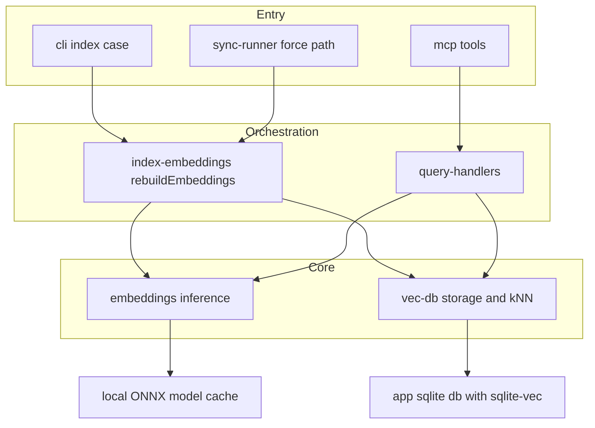
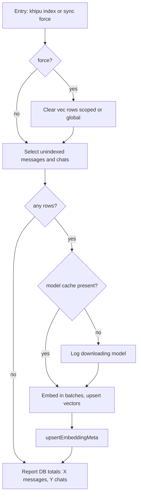

# Design Document

## Overview

**Purpose**: This feature delivers local, meaning-based retrieval to KhipuChat users, letting Claude discover relevant contacts and messages by semantic similarity rather than exact keywords, over an on-device embedding index that never leaves the machine.

**Users**: Claude (via MCP) is the primary consumer, invoking `semantic_find_contacts` and `semantic_search_messages`. The KhipuChat operator is the secondary user, running `khipu index` to build the index and relying on automatic incremental embedding after each platform sync.

**Impact**: The core semantic pipeline (ONNX embeddings, `sqlite-vec` vector tables, kNN query handlers, both MCP tools, and the query-side CLI) is **already implemented and tested**. This design closes the remaining additive gaps so the feature satisfies its requirements end to end: a first-class `khipu index [--force]` CLI subcommand, a force-rebuild capability in the shared indexing pipeline, force pass-through on `sync --force`, total-count reporting, model-download logging, and operator-facing messages that point at `khipu index`. No schema changes, no new dependencies, no architectural shifts.

### Goals
- Provide a named `khipu index` / `khipu index --force` CLI subcommand as the operator entry point for indexing.
- Add a single force-rebuild path in the shared `rebuildEmbeddings` pipeline that fully re-embeds from scratch.
- Keep semantic search current automatically after each sync, including forced per-platform rebuilds.
- Satisfy all indexing, reporting, and model-cache requirements without transmitting any data externally.

### Non-Goals
- Web UI integration (owned by the `web-ui` spec).
- Changes to keyword/FTS search, message sending/drafting, or cross-platform deduplication.
- Account-scoped embedding / full multi-account indexing (deferred to a future multi-account spec; the existing `account` passthrough filter is retained but not extended).
- Re-architecting the already-working embedding, vector-store, or MCP-tool layers.

## Boundary Commitments

### This Spec Owns
- The embedding indexing pipeline: initial full index, incremental sweep, and forced full rebuild (`rebuildEmbeddings`, `embedNewMessages`, `embedNewChats`).
- The `khipu index [--force]` CLI subcommand surface.
- The two semantic MCP tools (`semantic_find_contacts`, `semantic_search_messages`) and their query handlers.
- The vector storage contract inside the app DB: `vec_chats`, `vec_messages`, and `embedding_meta` (structure, upsert semantics, index-state tracking).
- The local embedding-model lifecycle: one-time download, cache location, offline-after-load behavior, and download logging.

### Out of Boundary
- Web UI surfacing of these tools (`web-ui` spec).
- The `messages` and `chats` table schemas (owned by the platform-abstraction spec); this spec reads them and stores vectors keyed by their row IDs but does not alter them.
- Multi-account scoping of the index; single-account indexing only.
- Keyword/FTS search behavior and the `sync` command's non-embedding responsibilities.

### Allowed Dependencies
- `messages` and `chats` tables remaining stable, keyed by integer `id`.
- The shared DB connection (`getDb`) with the `sqlite-vec` extension loaded at `initDb` time.
- `@huggingface/transformers` (ONNX runtime) for local inference; `sqlite-vec` for vector storage.
- The sync runner (`sync-runner.ts`) as the caller that triggers incremental/forced embedding after a sync.

### Revalidation Triggers
- Any change to the `messages`/`chats` primary-key shape or the meaning of their `id` columns (vector rowids depend on it).
- A change to the embedding dimension (384) or distance metric (cosine) — invalidates stored vectors and the `vec0` column declaration.
- A change to the `rebuildEmbeddings` signature or the `embedNewMessages`/`embedNewChats` contract consumed by `sync-runner.ts`.
- A change to either MCP tool's input schema or result shape (consumed by MCP clients and, later, the web-ui spec).
- Introduction of account-scoped indexing (would change how vectors are partitioned and queried).

## Architecture

### Existing Architecture Analysis

The feature is an **extension** of a largely complete implementation. Current, verified state:

- **Synchronous DB, async inference**: All DB access uses `better-sqlite3-multiple-ciphers` synchronously; embedding inference is async and wrapped around a synchronous-first DB shell. This split is preserved.
- **Flat-function modules, no DI**: `embeddings.ts` (inference), `vec-db.ts` (storage + kNN), `index-embeddings.ts` (orchestration), `query-handlers.ts` (tool logic), `mcp.ts` (tool registration), `cli.ts` (terminal dispatch). No service classes.
- **Model singleton**: `embeddings.ts` holds a module-level pipeline loaded once per process; `env.allowRemoteModels` flips to `false` after first load to guarantee no re-download.
- **Vector storage**: `vec0` virtual tables (`vec_chats`, `vec_messages`) with `float[384] distance_metric=cosine`; upsert is DELETE-then-INSERT because `vec0` has no `INSERT OR REPLACE`. `embedding_meta` records "indexed at least once" per table, gating the MCP tools via `isIndexed()`.
- **Dependency direction (must be preserved)**: `db` → `vec-db` / `embeddings` → `index-embeddings` / `query-handlers` → `mcp` / `cli` / `sync-runner`. `vec-db.ts` and `embeddings.ts` do not import each other, keeping storage and inference independently testable.

The gaps are additive and isolated; no existing boundary moves.

### Architecture Pattern & Boundary Map


```mermaid
graph TB
    subgraph Entry
        CLI[cli index case]
        Sync[sync-runner force path]
        MCP[mcp tools]
    end
    subgraph Orchestration
        IndexEmb[index-embeddings rebuildEmbeddings]
        QH[query-handlers]
    end
    subgraph Core
        Emb[embeddings inference]
        VecDb[vec-db storage and kNN]
    end
    DB[app sqlite db with sqlite-vec]
    Model[local ONNX model cache]

    CLI --> IndexEmb
    Sync --> IndexEmb
    MCP --> QH
    IndexEmb --> Emb
    IndexEmb --> VecDb
    QH --> Emb
    QH --> VecDb
    VecDb --> DB
    Emb --> Model
```

**Architecture Integration**:
- **Selected pattern**: Layered pipeline (Entry → Orchestration → Core → Storage), matching the existing codebase. Retained because it already satisfies the separation and testability needs.
- **Domain boundaries**: Inference (`embeddings.ts`) and storage (`vec-db.ts`) stay decoupled; orchestration (`index-embeddings.ts`) is the only module that composes both for write paths, and `query-handlers.ts` the only one for read paths.
- **Existing patterns preserved**: synchronous DB, flat functions, model singleton, DELETE-then-INSERT upsert, `isIndexed()` gating.
- **New components rationale**: No new modules. The `force` behavior extends an existing function; the `index` command extends an existing dispatch switch, keeping a single source of truth for rebuild logic and a single admin+query CLI surface.
- **Steering compliance**: All embedding is strictly local (no network at inference/index time); MCP is the primary surface; CLI maintains parity.

### Technology Stack

| Layer | Choice / Version | Role in Feature | Notes |
|-------|------------------|-----------------|-------|
| CLI | Node + `tsx` (`src/cli.ts`) | Hosts the new `index` subcommand | Existing dispatch switch; add one case |
| Backend / Services | `@huggingface/transformers` ^3.x, `Xenova/all-MiniLM-L6-v2` | Local 384-dim feature extraction | Already integrated; ONNX CPU, offline after first load |
| Data / Storage | `sqlite-vec` ^0.1.x on `better-sqlite3-multiple-ciphers` ^11.x | `vec0` KNN tables + upsert | Loaded via `sqliteVec.load(db)` at `initDb` |
| Infrastructure / Runtime | Local model cache at `~/.cache/khipuchat/models` | One-time model download | Add explicit download logging on cache miss |

> No new dependencies. Extended rationale and dependency-version verification live in `research.md`.

## File Structure Plan

### Directory Structure
```
src/
├── cli.ts                 # MODIFY: add `index` case (parse --force, call rebuildEmbeddings)
├── index-embeddings.ts    # MODIFY: rebuildEmbeddings gains force param + total-count reporting
├── sync-runner.ts         # MODIFY: pass force through to rebuildEmbeddings on --force sync
├── embeddings.ts          # MODIFY: log model download on cache miss (Req 5.5)
├── query-handlers.ts      # MODIFY: point INDEX_NOT_BUILT_MSG at `khipu index`
├── mcp.ts                 # MODIFY: tool descriptions reference `khipu index`
└── vec-db.ts              # MODIFY (small): add force-wipe helpers (clear vec rows, scoped/global)
```

### Modified Files
- `src/vec-db.ts` — Add `clearMessageVectors(platform?)` and `clearChatVectors(platform?)` that delete `vec0` rows (global, or scoped to a platform via rowids collected from `messages`/`chats`). One responsibility: vector-store mutation.
- `src/index-embeddings.ts` — Add `force?: boolean` to `rebuildEmbeddings(platform?, force?)`. When `force`, call the clear helpers before the sweep. Report DB totals on completion (Req 1.3).
- `src/cli.ts` — Add `case 'index'`: parse `--force` from args, call `rebuildEmbeddings(undefined, force)`, exit. Extend usage text.
- `src/sync-runner.ts` — Pass the already-parsed `force` flag into `rebuildEmbeddings(adapter.platform, force)` (Req 2.3).
- `src/embeddings.ts` — Before first `pipeline()` load, detect an absent/incomplete model cache and log that a download is occurring (Req 5.5).
- `src/query-handlers.ts` — Change `INDEX_NOT_BUILT_MSG` to instruct `khipu index` (Req 3.7, 4.8).
- `src/mcp.ts` — Update both tool descriptions to reference `khipu index` instead of `npm run index:embeddings`.

> Dependency direction is unchanged: new helpers live in the layer that already owns their concern; no upward imports are introduced. No new files are created.

## System Flows

### Indexing flow (initial, incremental, forced)


```mermaid
flowchart TD
    Start[Entry: khipu index or sync force] --> Force{force?}
    Force -->|yes| Clear[Clear vec rows scoped or global]
    Force -->|no| Sweep
    Clear --> Sweep[Select unindexed messages and chats]
    Sweep --> Empty{any rows?}
    Empty -->|no| Report
    Empty -->|yes| DL{model cache present?}
    DL -->|no| Log[Log downloading model]
    DL -->|yes| Batch
    Log --> Batch[Embed in batches, upsert vectors]
    Batch --> Meta[upsertEmbeddingMeta]
    Meta --> Report[Report DB totals: X messages, Y chats]
```

Key decisions:
- **Force = clear then sweep**: after clearing, every record is "unindexed", so the existing incremental sweep re-embeds everything with no separate full-scan code path.
- **Per-record failure isolation**: individual embed failures are logged and skipped; the run continues (Req 2.5). This is existing behavior and is preserved on the force path.
- **Gating unchanged**: `embedding_meta` is written after each sweep; `isIndexed()` continues to gate the MCP tools.

## Requirements Traceability

| Requirement | Summary | Components | Interfaces | Flows |
|-------------|---------|------------|------------|-------|
| 1.1 | `khipu index` embeds all messages | IndexCli, IndexPipeline | `rebuildEmbeddings()` | Indexing |
| 1.2 | `khipu index` embeds all chats | IndexPipeline, VecStore | `rebuildEmbeddings()`, `getChatSnippets` | Indexing |
| 1.3 | Report total indexed on completion | IndexPipeline | completion report | Indexing |
| 1.4 | Incremental by default | IndexPipeline, VecStore | `getUnindexedMessages`, `getUnindexedChats` | Indexing |
| 1.5 | `--force` re-embeds from scratch | IndexCli, IndexPipeline, VecStore | `rebuildEmbeddings(_, force)`, `clear*Vectors` | Indexing |
| 1.6 | No network transmission | Embeddings | offline-after-load | — |
| 1.7 | Progress at least every 1,000 msgs | IndexPipeline | progress bar (per 100-batch) | Indexing |
| 2.1 | Embed new messages after sync | SyncEmbedHook, IndexPipeline | `embedNewMessages` / `rebuildEmbeddings` | Indexing |
| 2.2 | Update chat embedding after sync | IndexPipeline, VecStore | `embedNewChats` | Indexing |
| 2.3 | `--force` sync rebuilds affected embeddings | SyncEmbedHook, IndexPipeline | `rebuildEmbeddings(platform, force)` | Indexing |
| 2.4 | Programmatic pipeline API | IndexPipeline | exported `rebuildEmbeddings` | — |
| 2.5 | Per-message failure isolation | IndexPipeline | try/catch per record | Indexing |
| 3.1 | Ranked contacts by query | SemanticTools, VecStore | `semanticFindContacts` | — |
| 3.2 | Contact result fields | VecStore | `SemanticContactResult` | — |
| 3.3 | `limit` (def 10, max 50) | SemanticTools, VecStore | clamp in `semanticFindContacts` | — |
| 3.4 | `before` filter | VecStore | `ContactFilters.before` | — |
| 3.5 | `after` filter | VecStore | `ContactFilters.after` | — |
| 3.6 | `platform` filter | VecStore | `ContactFilters.platform` | — |
| 3.7 | Error when index not built | SemanticTools | `isIndexed('chats')`, `INDEX_NOT_BUILT_MSG` | — |
| 3.8 | Empty list below threshold | VecStore | `CONTACT_DISTANCE_THRESHOLD` | — |
| 4.1 | Ranked messages by query | SemanticTools, VecStore | `semanticSearchMessages` | — |
| 4.2 | Message result fields | VecStore | `SemanticMessageResult` | — |
| 4.3 | `chat_id` filter | VecStore | `MessageFilters.chat_id` | — |
| 4.4 | `platform` filter | VecStore | `MessageFilters.platform` | — |
| 4.5 | `limit` (def 20, max 100) | SemanticTools, VecStore | clamp in `semanticSearchMessages` | — |
| 4.6 | `before_timestamp` filter | VecStore | `MessageFilters.before_timestamp` | — |
| 4.7 | `after_timestamp` filter | VecStore | `MessageFilters.after_timestamp` | — |
| 4.8 | Error when index not built | SemanticTools | `isIndexed('messages')`, `INDEX_NOT_BUILT_MSG` | — |
| 5.1 | 2s query ceiling | VecStore | in-process kNN | — |
| 5.2 | ≤ 2 GB / 1M messages | VecStore | 384×4 bytes + HNSW | — |
| 5.3 | Concurrent operation during indexing | Storage | WAL mode, separate process | — |
| 5.4 | Model downloaded once, cached | Embeddings | `env.cacheDir`, offline-after-load | — |
| 5.5 | Re-download on absent/corrupt cache + log | Embeddings | cache-miss detection + log | Indexing |

## Components and Interfaces

| Component | Domain/Layer | Intent | Req Coverage | Key Dependencies (P0/P1) | Contracts |
|-----------|--------------|--------|--------------|--------------------------|-----------|
| IndexPipeline (`index-embeddings.ts`) | Orchestration | Full/incremental/forced embedding sweep | 1.1–1.7, 2.1–2.5, 5.5 | Embeddings (P0), VecStore (P0) | Service, Batch |
| VecStore (`vec-db.ts`) | Core / Storage | Vector upsert, clear, kNN, index-state | 1.4, 1.5, 3.1–3.8, 4.1–4.8, 5.2 | app DB (P0) | Service, State |
| Embeddings (`embeddings.ts`) | Core | Local ONNX inference + model lifecycle | 1.6, 5.4, 5.5 | model cache (P0) | Service |
| IndexCli (`cli.ts` index case) | Entry | Operator command surface | 1.1, 1.4, 1.5 | IndexPipeline (P0) | Service |
| SyncEmbedHook (`sync-runner.ts`) | Entry | Trigger embedding after sync | 2.1–2.3 | IndexPipeline (P0) | Service |
| SemanticTools (`query-handlers.ts` + `mcp.ts`) | Entry | MCP tool logic + registration | 3.1–3.8, 4.1–4.8 | VecStore (P0), Embeddings (P0) | Service, API |

Only components with a changed boundary get a full block below. `SemanticTools` are already implemented and tested; their contracts are documented for completeness (only the not-built message text and tool descriptions change).

### Orchestration

#### IndexPipeline (`rebuildEmbeddings`)

| Field | Detail |
|-------|--------|
| Intent | Embed unindexed (or, with force, all) messages and chats and record index state |
| Requirements | 1.1, 1.2, 1.3, 1.4, 1.5, 1.7, 2.1, 2.2, 2.3, 2.4, 2.5, 5.5 |

**Responsibilities & Constraints**
- Owns the write-side embedding sweep and completion reporting.
- With `force`, clears the relevant vectors (scoped to `platform` when provided, else global) before sweeping, so re-embedding starts from scratch.
- Preserves per-record failure isolation: a failed embed is logged and skipped; the run does not abort.
- Writes `embedding_meta` after each of the messages and chats phases.

**Dependencies**
- Outbound: `embeddings.embed` / `embedOne` — inference (P0).
- Outbound: `vec-db` upsert, clear, and unindexed-query helpers — storage (P0).

**Contracts**: Service [x] / Batch [x]

##### Service Interface
```typescript
type Platform = 'telegram' | 'imessage' | 'discord' | 'slack' | 'whatsapp' | 'wechat' | 'email';

/**
 * Embed unindexed messages and chats.
 * - platform omitted: whole-database scope.
 * - platform set: restrict to that platform's chats/messages.
 * - force=true: clear existing vectors in scope, then re-embed everything in scope.
 */
export function rebuildEmbeddings(platform?: Platform, force?: boolean): Promise<void>;

// sync-integration helpers (unchanged signatures)
export function embedNewMessages(chatIds: number[]): Promise<void>;
export function embedNewChats(chatIds: number[]): Promise<void>;
```
- Preconditions: `initDb()` has run; `sqlite-vec` extension loaded.
- Postconditions: every in-scope message/chat with non-empty text has a current vector; `embedding_meta` updated; completion line reports DB totals in scope.
- Invariants: no external network calls; DB writes remain synchronous around async inference.

##### Batch / Job Contract
- Trigger: `khipu index [--force]` (operator), `sync --force` (per-platform), or a direct programmatic call (Req 2.4).
- Input / validation: optional `platform`, optional `force`; an empty scope reports "already up-to-date".
- Output / destination: `vec_messages`, `vec_chats`, `embedding_meta` in the app DB.
- Idempotency & recovery: incremental sweep is idempotent (skips already-indexed rows); force clears then re-embeds, also idempotent by result. Failed records are logged and retried on the next run.

**Implementation Notes**
- Integration: `force` composes with the existing sweep by making all in-scope rows "unindexed" via the clear helpers — no separate full-scan branch.
- Validation: the completion report must count rows present in `vec_messages`/`vec_chats` for the scope (Req 1.3), not just rows embedded this run.
- Risks: clearing then failing mid-sweep leaves the index partially rebuilt; acceptable because the next `khipu index` (incremental) fills the remainder, and the operator is expected to re-run after a forced failure.

### Core / Storage

#### VecStore (`vec-db.ts`)

| Field | Detail |
|-------|--------|
| Intent | Vector upsert/clear, kNN retrieval, and index-state tracking |
| Requirements | 1.4, 1.5, 3.1–3.8, 4.1–4.8, 5.2 |

**Responsibilities & Constraints**
- Sole owner of `vec_chats`, `vec_messages`, and `embedding_meta` mutations and reads.
- New: clear helpers that remove vectors globally or scoped to a platform.
- kNN queries fetch an over-scan candidate set, then apply metadata/temporal/platform filters and the similarity threshold in application code (existing behavior).

**Dependencies**
- Outbound: `getDb()` — shared connection with `sqlite-vec` loaded (P0).

**Contracts**: Service [x] / State [x]

##### Service Interface
```typescript
// existing (unchanged)
export function upsertMessageVector(id: number, vector: Float32Array): void;
export function upsertChatVector(id: number, vector: Float32Array): void;
export function getUnindexedMessages(limit: number): Array<{ id: number; text: string }>;
export function getUnindexedChats(): Array<{ id: number; name: string }>;
export function isIndexed(table: 'chats' | 'messages'): boolean;
export function upsertEmbeddingMeta(table: string, timestamp: number): void;
export function semanticFindContacts(q: Float32Array, f: ContactFilters): SemanticContactResult[];
export function semanticSearchMessages(q: Float32Array, f: MessageFilters): SemanticMessageResult[];

// new (force-rebuild support)
/** Delete message vectors: all rows, or only those whose chat is on `platform`. */
export function clearMessageVectors(platform?: Platform): void;
/** Delete chat vectors: all rows, or only chats on `platform`. */
export function clearChatVectors(platform?: Platform): void;
```
- Preconditions: `initDb()` has run.
- Postconditions: after `clear*Vectors`, the in-scope rows are absent from the `vec0` table.
- Invariants: `vec0` mutation stays DELETE-based (no `INSERT OR REPLACE`); rowids equal `messages.id` / `chats.id`.

##### State Management
- State model: `embedding_meta(table_name, last_indexed_at)` records whether a table has ever been indexed.
- Persistence & consistency: same DB, WAL mode; concurrent readers (MCP, sync) tolerated (Req 5.3).
- Concurrency strategy: single writer per process; indexing typically runs in its own process.

**Implementation Notes**
- Integration: platform-scoped clear collects target rowids via a plain SQL SELECT over `messages`/`chats`, then deletes per rowid (the proven upsert idiom), avoiding reliance on unverified `DELETE ... WHERE rowid IN (subquery)` on `vec0` tables (see `research.md`). Global clear may use `DELETE FROM vec_messages` / `DELETE FROM vec_chats`.
- Validation: a Vitest test must confirm force-rebuild restores identical row counts from scratch.
- Risks: none new; deletion is scoped and idempotent.

### Core

#### Embeddings (`embeddings.ts`)

| Field | Detail |
|-------|--------|
| Intent | Local ONNX feature extraction and model-cache lifecycle |
| Requirements | 1.6, 5.4, 5.5 |

**Responsibilities & Constraints**
- Loads the model once per process; goes offline (`allowRemoteModels = false`) after first successful load so no re-download or leak occurs (Req 1.6, 5.4).
- New: on an absent/incomplete cache, logs that a download is occurring before loading (Req 5.5); if the cache is present and valid, loads silently.

**Contracts**: Service [x]

##### Service Interface
```typescript
export function embed(texts: string[]): Promise<Float32Array[]>;   // 384-dim, normalized
export function embedOne(text: string): Promise<Float32Array>;
```
- Preconditions: a writable cache directory.
- Postconditions: one normalized 384-dim vector per non-empty input.
- Invariants: after first load, no network access.

**Implementation Notes**
- Integration: cache-miss detection checks the model files under `env.cacheDir` before `pipeline()`; keeps the existing `KHIPUCHAT_EMBED_MOCK` test hook intact.
- Validation: assert a log line is emitted when the cache is absent and suppressed when present.
- Risks: over-eager "missing cache" detection could log spuriously; scope the check to the model's own subdirectory.

### Entry

#### SemanticTools (`query-handlers.ts` + `mcp.ts`)

| Field | Detail |
|-------|--------|
| Intent | Contact/message semantic-search tool logic and MCP registration |
| Requirements | 3.1–3.8, 4.1–4.8 |

**Responsibilities & Constraints** (already implemented; only messaging text changes)
- `handleSemanticFindContacts` / `handleSemanticSearchMessages` embed the query, run kNN, join metadata, apply filters, and enforce defaults/maxima (contacts default 10/max 50; messages default 20/max 100).
- Return `INDEX_NOT_BUILT_MSG` when the relevant table is not indexed — updated to instruct `khipu index` (Req 3.7, 4.8).
- Empty result when nothing meets the similarity threshold (Req 3.8).

**Contracts**: Service [x] / API [x]

##### Service Interface
```typescript
export function handleSemanticFindContacts(
  query: string, filters: ContactFilters,
): Promise<SemanticContactResult[] | { error: string }>;

export function handleSemanticSearchMessages(
  query: string, filters: MessageFilters,
): Promise<SemanticMessageResult[] | { error: string }>;
```

##### API Contract (MCP tool inputs)
| Tool | Required | Optional | Result item |
|------|----------|----------|-------------|
| `semantic_find_contacts` | `query` | `limit` (≤50, def 10), `before`, `after`, `platform`, `account` | chat name, platform, last message date, message count, snippet |
| `semantic_search_messages` | `query` | `limit` (≤100, def 20), `chat_id`, `platform`, `before_timestamp`, `after_timestamp`, `account` | chat name, sender name, text, timestamp, platform |

**Implementation Notes**
- Integration: only the not-built message string and the two tool descriptions change; result shapes and filters are unchanged.
- Validation: existing `mcp.ts` / `query-handlers.ts` tests continue to pass; assert the new message text references `khipu index`.
- Risks: none; text-only change.

## Data Models

No schema changes. The relevant persisted structures (already present, owned here) are:

### Physical Data Model
```sql
CREATE VIRTUAL TABLE vec_chats
  USING vec0(rowid INTEGER PRIMARY KEY, embedding float[384] distance_metric=cosine);
CREATE VIRTUAL TABLE vec_messages
  USING vec0(rowid INTEGER PRIMARY KEY, embedding float[384] distance_metric=cosine);
CREATE TABLE embedding_meta (
  table_name      TEXT    PRIMARY KEY,
  last_indexed_at INTEGER NOT NULL
);
```
- **Keys**: `vec_*.rowid` equals the corresponding `messages.id` / `chats.id`. Referential integrity is enforced by convention (vectors are keyed by, but not FK-constrained to, source rows).
- **Consistency**: upserts are DELETE-then-INSERT; force-clear deletes in scope before re-insert.
- **Sizing**: 384 × 4 bytes = 1,536 bytes/vector; ~1.47 GB per 1M messages + ~20% index overhead ≈ 1.77 GB, within the 2 GB/1M ceiling (Req 5.2).

## Error Handling

### Error Strategy
- **Per-record embed failure** (indexing): catch, log to stderr, continue (Req 2.5). Never aborts the sweep or the enclosing sync.
- **Index-not-built** (query): return a structured `{ error }` with actionable text pointing at `khipu index` (Req 3.7, 4.8) rather than throwing.
- **Model cache absent/corrupt**: log the download and let `@huggingface/transformers` fetch the model, then go offline (Req 5.5). If the download fails (no network), the error surfaces to the operator with the underlying cause.

### Error Categories and Responses
- **User/operator errors**: unindexed archive → descriptive "run `khipu index`" message; unknown CLI tool → usage help + non-zero exit (existing).
- **System errors**: embedding-inference exceptions are isolated per record; storage errors propagate (fail fast) since they indicate a corrupt DB.
- **Business-logic**: below-threshold similarity yields an empty list, not an error.

### Monitoring
- Progress bar updates at least every 100-message batch (satisfies the ≥1,000-message logging cadence, Req 1.7).
- Completion line reports total messages and chats indexed (Req 1.3).
- Download notice logged on cache miss (Req 5.5); per-record failures logged to stderr.

## Testing Strategy

### Unit Tests
- `clearMessageVectors` / `clearChatVectors`: global clear empties the `vec0` table; platform-scoped clear removes only in-scope rows and leaves others intact.
- `rebuildEmbeddings(_, force=true)`: after seeding + indexing, a forced rebuild restores identical row counts from scratch (extends `tests/rebuild-embeddings.test.ts`).
- Completion report counts DB totals in scope, not rows embedded this run (Req 1.3).
- `embeddings.ts`: logs a download line on simulated cache miss and stays silent when the cache is present (Req 5.5), preserving the `KHIPUCHAT_EMBED_MOCK` hook.

### Integration Tests
- `cli.ts index`: `khipu index` triggers a whole-DB sweep; `khipu index --force` triggers a clear-then-rebuild; usage text lists the command (`tests/cli.test.ts`).
- `sync-runner.ts` force path: `sync --force` calls `rebuildEmbeddings(platform, true)` so already-indexed messages are re-embedded (Req 2.3) (`tests/sync-runner.test.ts`).
- MCP tools return the updated `khipu index` not-built message when the index is absent (`tests/mcp.test.ts`, `tests/query-handlers.test.ts`).

### Performance / Load (manual validation)
- Query latency: on a ~1M-message indexed DB, confirm `semantic_find_contacts` and `semantic_search_messages` return within 2 s (Req 5.1). No automated benchmark exists; treat as a manual checkpoint, per `research.md`.
- Storage: verify index size stays under 2 GB per 1M messages (Req 5.2).
- Concurrency: confirm indexing does not block the MCP server or sync (WAL mode, separate process) (Req 5.3).

## Security Considerations
- **Local-only guarantee**: after the one-time model download, `env.allowRemoteModels = false` ensures no message text, metadata, or identifiers ever leave the device during indexing or querying (Req 1.6). The cache-miss download path fetches only model weights, never archive data.
- **No new attack surface**: no new endpoints, no new dependencies, no schema changes; force-clear only deletes vectors derived from local data.

## Performance & Scalability
- **Query**: in-process `sqlite-vec` kNN with an over-scan candidate set keeps the 2 s ceiling reachable without a separate vector-DB process (Req 5.1).
- **Index build**: batched inference (batch 64 in `embed`, 100-row DB batches in the sweep) bounds memory; progress/ETA reported live.
- **Force rebuild cost**: clearing is O(rows in scope) deletes; re-embedding dominates runtime and is bounded by the same batching as initial indexing.
