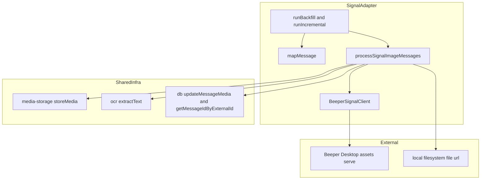
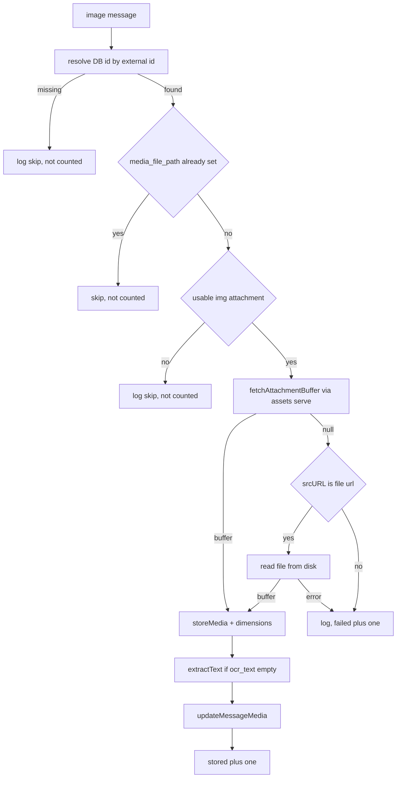

# Design Document

## Overview

**Purpose**: Signal Image Sync gives Signal image attachments the same download → store → OCR → index treatment that Telegram images already receive, so image content routed through Beeper Desktop becomes retrievable and searchable in the KhipuChat archive.

**Users**: KhipuChat operators running Signal sync, and end users (and Claude via MCP) who query the archive and retrieve images through the existing `get_image` tool.

**Impact**: Extends the existing `signal-platform` adapter. Signal `IMAGE` messages currently map to `type: 'other'` and are never downloaded. After this change they map to `type: 'image'`, their binary is fetched (Beeper Desktop primary, local filesystem fallback), stored under the shared media path convention, OCR'd, and persisted onto the already-inserted message record. No schema changes; no changes to shared media, OCR, search, or `get_image` code.

### Goals

- Detect Signal image messages during backfill and incremental sync and process only those.
- Fetch attachment bytes via Beeper Desktop, falling back to a local `file://` read, best-effort.
- Store images using the shared `media-storage` path convention so `get_image` works unmodified.
- Extract OCR text with the shared `ocr` pipeline and persist it on the message record.
- Keep all image work non-fatal to text sync, and report `{ stored, failed }` counts.

### Non-Goals

- Non-image Signal attachments (video, audio, voice, file, sticker).
- Any schema change to `messages`, or changes to `get_image`, FTS, or semantic-search pipelines.
- Owning the Beeper Desktop connection, Signal credentials, or the shared `media-storage` / `ocr` modules.
- Re-fetching or repairing images that failed in a prior run beyond ordinary idempotent re-run behavior.

## Boundary Commitments

### This Spec Owns

- The Signal image-sync module (`src/platforms/signal/image-sync.ts`): image detection, two-strategy fetch, store, OCR, persist, and `{ stored, failed }` accounting for one chat.
- The `mapMessage` classification change (`IMAGE` → `type: 'image'`).
- The `fetchAttachmentBuffer` method added to `BeeperSignalClient` and its Beeper `assets.serve` wrapping.
- Wiring image-sync into `runBackfillImpl` and `runIncrementalImpl`, including surfacing counts in the summary line.

### Out of Boundary

- Shared infrastructure behavior: `storeMedia` / `mediaPathFor`, `extractText`, `updateMessageMedia`, `getMessageIdByExternalId`, `handleGetImage`. Used as-is, not modified.
- Message record creation. Signal text sync must have already inserted the message row (with `external_id`) before image-sync runs.
- Full-text and semantic search indexing. Searchability is a consequence of writing `ocr_text` via the existing `updateMessageMedia` path, not new indexing work here.

### Allowed Dependencies

- `src/media-storage.ts` (`storeMedia`, `mediaPathFor`), `src/ocr.ts` (`extractText`), `src/db.ts` (`getMessageIdByExternalId`, `updateMessageMedia`, `getDb`).
- `@beeper/desktop-api` `assets.serve`: accessed only through the new `fetchAttachmentBuffer` client method; the `BeeperDesktop` instance stays private to `client.ts`.
- Node `fs` for the local filesystem fallback read.
- Dependency direction: `image-sync.ts` → (`client` interface, `media-storage`, `ocr`, `db`). It must not be imported by shared infra, and must not import the sync-runner.

### Revalidation Triggers

- Any change to the media path convention in `media-storage.ts` (would affect `get_image` retrieval parity).
- Any change to `updateMessageMedia`'s allowed keys or the `messages` media columns.
- A change to `BeeperMessage.attachments` shape or `assets.serve` semantics in the Beeper SDK.
- A change to how `handleGetImage` resolves `type`/`media_file_path` (currently platform-agnostic).

## Architecture

### Existing Architecture Analysis

- The Signal adapter (`src/platforms/signal/`) is split into `client.ts` (Beeper SDK boundary, exposes a narrow `BeeperSignalClient` interface) and `sync.ts` (`mapChat`/`mapMessage` + `runBackfillImpl`/`runIncrementalImpl`). This is the exact separation the Telegram adapter uses.
- Telegram already implements this feature in `src/platforms/telegram/image-sync.ts` with the pipeline: resolve DB id → skip if already stored → download buffer → `storeMedia` → dimensions → `extractText` → `updateMessageMedia`, with per-message try/catch isolation. Signal reuses this structure verbatim, swapping only the fetch step.
- The one structural difference: Signal's fetch has a two-strategy fallback (Beeper then filesystem) where Telegram has a single `client.downloadMedia`. And Signal returns counts to satisfy Req 6.4, where Telegram returns `void`.

### Architecture Pattern & Boundary Map



**Architecture Integration**:
- Selected pattern: extend the existing per-adapter pipeline; one new module plus a client method, matching the Telegram precedent.
- Domain boundaries: fetch strategy is owned by `image-sync` (orchestration) + `client` (Beeper transport); storage/OCR/persistence stay in shared infra.
- Existing patterns preserved: narrow client interface hides the SDK; per-message error isolation; per-chat processing inside the sync loop.
- New components rationale: `image-sync.ts` (Signal has none yet); `fetchAttachmentBuffer` (expose `assets.serve` without leaking the SDK type).
- Steering compliance: all data stays local (no cloud); OCR via local Tesseract; agent-native retrieval via existing `get_image`.

### Technology Stack

| Layer | Choice / Version | Role in Feature | Notes |
|-------|------------------|-----------------|-------|
| Backend / Services | TypeScript (existing) | Image-sync orchestration + client method | Strict typing; no `any` |
| Data / Storage | `media-storage` + SQLite `messages` (existing) | On-disk image files + media columns | No schema change |
| Messaging / Events | `@beeper/desktop-api` `assets.serve` | Fetch attachment bytes | Wrapped by `fetchAttachmentBuffer` |
| Infrastructure / Runtime | Node `fs`, Tesseract via `ocr` | Filesystem fallback read + OCR | Both best-effort |

New dependency surface: none. `@beeper/desktop-api` and `tesseract.js` are already in use.

## File Structure Plan

### Directory Structure
```
src/platforms/signal/
├── image-sync.ts     # NEW: processSignalImageMessages + fetch strategy + ext/detection helpers
├── client.ts         # MODIFIED: add fetchAttachmentBuffer to interface + impl
└── sync.ts           # MODIFIED: mapMessage IMAGE=>'image'; wire image-sync into both run*Impl
```

### Modified Files
- `src/platforms/signal/client.ts`: add `fetchAttachmentBuffer(url: string): Promise<Buffer | null>` to the `BeeperSignalClient` interface and implement it by wrapping `beeper.assets.serve({ url })`, returning `null` on any failure.
- `src/platforms/signal/sync.ts`: `mapMessage`: emit `type: 'image'` when `m.type === 'IMAGE'`. `runBackfillImpl` / `runIncrementalImpl`: collect the raw `BeeperMessage`s classified as image per chat, call `processSignalImageMessages` after inserting that chat's messages, accumulate `{ stored, failed }`, and include them in the completion log (Req 6.4).

### New Files
- `src/platforms/signal/image-sync.ts`: owns `processSignalImageMessages`, the internal `fetchSignalAttachment` two-strategy resolver, `pickImageAttachment`, and `extFromMime`.

## System Flows

Per-message fetch/store/OCR flow (executed for each collected image message; the whole body is wrapped so a throw is isolated and counted as `failed`):



Key decisions: Beeper is always tried first (Req 2.1); the `file://` disk read is the fallback only when Beeper returns nothing (Req 2.2); a message reaching `Fail` increments `failed` and the loop continues (Req 2.3, 6.1). Skips (already stored / no usable attachment / DB row missing) are logged but not counted as failures.

## Requirements Traceability

| Requirement | Summary | Components | Interfaces | Flows |
|-------------|---------|------------|------------|-------|
| 1.1 | Identify image messages | mapMessage, sync loop | `mapMessage` | Detection at map time |
| 1.2 | Skip non-image messages unchanged | mapMessage | `mapMessage` |: |
| 1.3 | Skip already-stored images | processSignalImageMessages | `media_file_path` guard | Guard node |
| 2.1 | Fetch via Beeper Desktop | processSignalImageMessages, BeeperSignalClient | `fetchAttachmentBuffer` | Beeper node |
| 2.2 | Local filesystem fallback | processSignalImageMessages | `fetchSignalAttachment` | FileUrl/Disk nodes |
| 2.3 | Both fail → record + continue | processSignalImageMessages | return `{ stored, failed }` | Fail node |
| 2.4 | No Beeper/credential config change | BeeperSignalClient | existing `createBeeperSignalClient` |: |
| 3.1 | Store via shared path convention | processSignalImageMessages | `storeMedia` | Store node |
| 3.2 | Record file location on message | processSignalImageMessages | `updateMessageMedia` | Persist node |
| 3.3 | Do not overwrite existing file | processSignalImageMessages | guard + deterministic path | Guard node |
| 4.1 | OCR stored image | processSignalImageMessages | `extractText` | Ocr node |
| 4.2 | Persist OCR text | processSignalImageMessages | `updateMessageMedia` | Persist node |
| 4.3 | OCR failure → empty, continue | processSignalImageMessages | `extractText` (never throws) | Ocr node |
| 4.4 | Skip OCR when already present | processSignalImageMessages | `ocr_text` guard | Ocr node |
| 5.1 | OCR text in FTS results | (consequence) updateMessageMedia write | existing FTS |: |
| 5.2 | Retrievable via `get_image` | (consequence) `media_file_path` + `type='image'` | existing `handleGetImage` |: |
| 5.3 | No changes to get_image/FTS/vec | mapMessage, processSignalImageMessages |: |: |
| 6.1 | Fetch failure non-fatal | processSignalImageMessages | per-message try/catch | Fail node |
| 6.2 | OCR failure non-fatal | processSignalImageMessages | `extractText` | Ocr node |
| 6.3 | No rollback of text data | sync loop | insert precedes image-sync |: |
| 6.4 | Report stored/failed counts | processSignalImageMessages, sync loop | `{ stored, failed }` |: |

## Components and Interfaces

| Component | Domain/Layer | Intent | Req Coverage | Key Dependencies (P0/P1) | Contracts |
|-----------|--------------|--------|--------------|--------------------------|-----------|
| `mapMessage` (patch) | Adapter/mapping | Classify `IMAGE` as `type: 'image'` | 1.1, 1.2, 5.3 |: | State |
| `BeeperSignalClient.fetchAttachmentBuffer` | Adapter/transport | Fetch attachment bytes via Beeper, isolate SDK + errors | 2.1, 2.4 | `assets.serve` (P0) | Service |
| `processSignalImageMessages` | Adapter/image-sync | Detect→fetch→store→OCR→persist per chat, count results | 1.3, 2.1–2.3, 3.1–3.3, 4.1–4.4, 6.1–6.4 | client (P0), media-storage (P0), ocr (P1), db (P0) | Service, Batch |
| Sync-loop wiring | Adapter/runtime | Collect image msgs, invoke image-sync, surface counts | 6.3, 6.4 | processSignalImageMessages (P0) | Batch |

### Adapter / Mapping

#### mapMessage (patch)

| Field | Detail |
|-------|--------|
| Intent | Emit `type: 'image'` for Beeper `IMAGE` messages so image-sync collects them and `get_image` accepts them |
| Requirements | 1.1, 1.2, 5.3 |

**Responsibilities & Constraints**
- Change the type expression only: `m.type === 'IMAGE'` → `'image'`; else existing `TEXT`-with-text → `'text'`; else `'other'`.
- All media columns remain `null` at map time; image-sync fills them later. Non-image messages are untouched (1.2).

**Contracts**: State [x]

**Implementation Notes**
- Integration: pure function; existing Signal test asserting `IMAGE` → `'other'` must be updated to expect `'image'`.
- Risks: low. Downstream `handleGetImage` already keys on `type === 'image'`.

### Adapter / Transport

#### BeeperSignalClient.fetchAttachmentBuffer

| Field | Detail |
|-------|--------|
| Intent | Fetch raw attachment bytes for a Beeper asset URL, returning `null` on any failure |
| Requirements | 2.1, 2.4 |

**Dependencies**
- External: `@beeper/desktop-api` `assets.serve({ url })`: streams bytes for `mxc://` / `localmxc://` / `file://`, downloading if uncached (P0).

**Contracts**: Service [x]

##### Service Interface
```typescript
interface BeeperSignalClient {
  // ...existing members...
  fetchAttachmentBuffer(url: string): Promise<Buffer | null>;
}
```
- Preconditions: `url` is a non-empty Beeper-recognized URL (`attachment.srcURL ?? attachment.id`).
- Postconditions: resolves to a `Buffer` on success, or `null` if `assets.serve` throws or yields no body.
- Invariants: never throws; the private `BeeperDesktop` instance is not exposed.

**Implementation Notes**
- Integration: `Buffer.from(await (await beeper.assets.serve({ url })).arrayBuffer())`, wrapped in try/catch returning `null`; log at warn on failure.
- Validation: treat an empty/zero-length body as `null`.
- Risks: `assets.serve` may return a stale/expired asset for old Signal messages (P1); mitigated by the filesystem fallback in `processSignalImageMessages`. Adds no new credential/config surface (2.4).

### Adapter / Image-Sync

#### processSignalImageMessages

| Field | Detail |
|-------|--------|
| Intent | For one chat's image messages: fetch, store, OCR, persist; isolate every failure; return counts |
| Requirements | 1.3, 2.1, 2.2, 2.3, 3.1, 3.2, 3.3, 4.1, 4.2, 4.3, 4.4, 6.1, 6.2, 6.3, 6.4 |

**Responsibilities & Constraints**
- Iterate messages; per message resolve DB id via `getMessageIdByExternalId(chatId, m.id)`; skip (uncounted) if missing or if `media_file_path` already set (1.3, 3.3).
- Select the usable image attachment via `pickImageAttachment` (first `type === 'img'` with a `srcURL` or `id`); if none, log and skip uncounted.
- Fetch via `fetchSignalAttachment`: Beeper first (`fetchAttachmentBuffer(srcURL ?? id)`), then, if `null` and `srcURL` is a `file://` URL, read it from disk. Both failing → `failed++`, continue (2.3, 6.1).
- On buffer: `storeMedia({ platform: 'signal', chatId, externalId: m.id, ext: extFromMime(att.mimeType), data })`; dimensions from `att.size`; OCR via `extractText(buffer)` only if `ocr_text` not already set (4.1, 4.3, 4.4); persist with `updateMessageMedia`; `stored++`.
- Per-message try/catch so any throw increments `failed` and does not abort the chat or the sync run (6.1, 6.2). Never rolls back inserted text rows (6.3).

**Dependencies**
- Inbound: sync-loop wiring: invokes per chat (P0).
- Outbound: `storeMedia`/`mediaPathFor` (P0), `updateMessageMedia`/`getMessageIdByExternalId`/`getDb` (P0), `extractText` (P1).
- External: `BeeperSignalClient.fetchAttachmentBuffer` (P0), Node `fs` for fallback (P1).

**Contracts**: Service [x] / Batch [x]

##### Service Interface
```typescript
interface SignalImageSyncResult {
  stored: number;
  failed: number;
}

function processSignalImageMessages(
  client: Pick<BeeperSignalClient, 'fetchAttachmentBuffer'>,
  chatId: number,
  imageMsgs: readonly BeeperMessage[],
): Promise<SignalImageSyncResult>;
```
- Preconditions: each `imageMsgs[i]` was mapped to `type: 'image'` and its row already inserted.
- Postconditions: `stored + failed <= imageMsgs.length` (skips are neither); every element attempted; function resolves (never rejects).
- Invariants: idempotent: a second run over the same messages performs no re-download when `media_file_path` is set and no re-OCR when `ocr_text` is set.

##### Batch / Job Contract
- Trigger: called once per chat by `runBackfillImpl` / `runIncrementalImpl` after that chat's inserts.
- Input / validation: raw `BeeperMessage[]` collected during the insert loop where mapped `type === 'image'`.
- Output / destination: `{ stored, failed }` accumulated into the run's summary line (6.4); side effects are files on disk + media columns.
- Idempotency & recovery: DB `media_file_path` / `ocr_text` guards + deterministic `mediaPathFor` make re-runs safe and resumable.

**Implementation Notes**
- Integration: helpers `fetchSignalAttachment`, `pickImageAttachment`, `extFromMime` are private to this module. `extFromMime`: `image/png`→`png`, `image/gif`→`gif`, `image/webp`→`webp`, default `jpg`.
- Validation: strip the `file://` scheme before `fs.readFileSync`; guard against empty buffers.
- Risks: the concrete `srcURL` scheme Beeper emits for Signal (`mxc://` vs `file://`) is the one design-time unknown; the two-strategy resolver covers both. Optionally sleep between fetches to mirror Telegram's pacing (non-essential; Beeper is local).

### Adapter / Runtime

#### Sync-loop wiring (runBackfillImpl / runIncrementalImpl)

| Field | Detail |
|-------|--------|
| Intent | Collect image messages per chat, run image-sync, surface counts, never disturb text data |
| Requirements | 6.3, 6.4 |

**Responsibilities & Constraints**
- In each chat loop, when a message maps to `type: 'image'`, push the raw `BeeperMessage` into a per-chat `imageMsgs` array while still inserting the row as today.
- After the chat's insert loop, `await processSignalImageMessages(client, chatId, imageMsgs)`; accumulate `stored`/`failed` into run totals.
- Extend the existing completion `console.log` to include `images: N stored, M failed` (6.4). Image-sync runs after inserts, so text rows are already durable (6.3).

**Contracts**: Batch [x]

**Implementation Notes**
- Integration: mirror `src/platforms/telegram/sync.ts` collect-then-process; `client` already flows into both `run*Impl`.
- Risks: low; per-chat error isolation for text sync is preserved and image-sync itself never throws.

## Error Handling

### Error Strategy
Best-effort, layered, never-fatal: matching the Telegram precedent and Req 6:
- **Transport (Beeper)**: `fetchAttachmentBuffer` catches all `assets.serve` errors and returns `null`, converting failure into the fallback trigger rather than an exception.
- **Fallback (filesystem)**: `fs` read wrapped in try/catch; failure yields `null`.
- **Per-message**: the whole detect→persist body is wrapped; a throw is logged and counted as `failed`, then the loop continues.
- **OCR**: `extractText` already never throws and returns `null` on failure (4.3).

### Error Categories and Responses
- **Fetch unavailable / both strategies fail** (Req 2.3, 6.1): log `[signal image-sync] failed to fetch message <id>`, `failed++`, continue.
- **Skip conditions** (Req 1.3, 3.3, no usable attachment): log at debug/info, uncounted; media fields unchanged.
- **OCR failure** (Req 4.3, 6.2): `ocr_text` left `null`, image still stored and retrievable.

### Monitoring
`console.log`/`console.error` with a `[signal image-sync]` prefix, consistent with Telegram. The run summary emits total `stored` / `failed` for operator visibility (6.4).

## Testing Strategy

### Unit Tests
- `mapMessage`: `type: 'IMAGE'` now yields `'image'` (update the existing `'other'` assertion); `TEXT` with text → `'text'`; other types → `'other'` unchanged (1.1, 1.2).
- `extFromMime`: `image/png`→`png`, unknown/undefined→`jpg`.
- `pickImageAttachment`: returns first `img` attachment with `srcURL`/`id`; returns none when only non-img or reference-less attachments exist.

### Integration Tests (`:memory:` DB, mocked `media-storage` + `ocr`, per `tests/telegram-image-sync.test.ts`)
- Already stored (`media_file_path` set) → skipped, no fetch, counted in neither (1.3, 3.3).
- Beeper fetch success → stored, dimensions + OCR persisted, `{ stored: 1, failed: 0 }` (2.1, 3.1, 3.2, 4.1, 4.2, 6.4).
- Beeper returns `null` + `file://` fallback read succeeds → stored (2.2).
- Both strategies fail → logged, `{ stored: 0, failed: 1 }`, loop continues to next message (2.3, 6.1).
- OCR returns `null` → image stored with empty `ocr_text`, still counted as stored (4.3, 6.2).
- `ocr_text` already present → `extractText` not called (4.4).

### E2E / Cross-Component
- `runBackfillImpl` / `runIncrementalImpl`: a chat with mixed text + image messages inserts all text rows, triggers image-sync, reports counts in the summary, and leaves text rows intact when an image fails (6.3, 6.4).
- After a successful store, `handleGetImage(messageId)` returns `file_available: true` and the OCR text is found via existing FTS query: proving `get_image`/search parity with zero changes (5.1, 5.2, 5.3).
