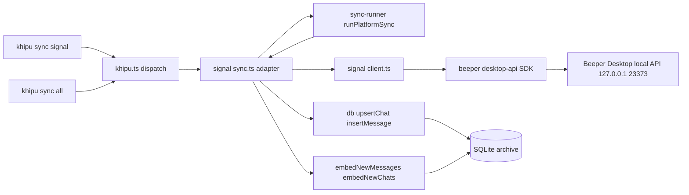
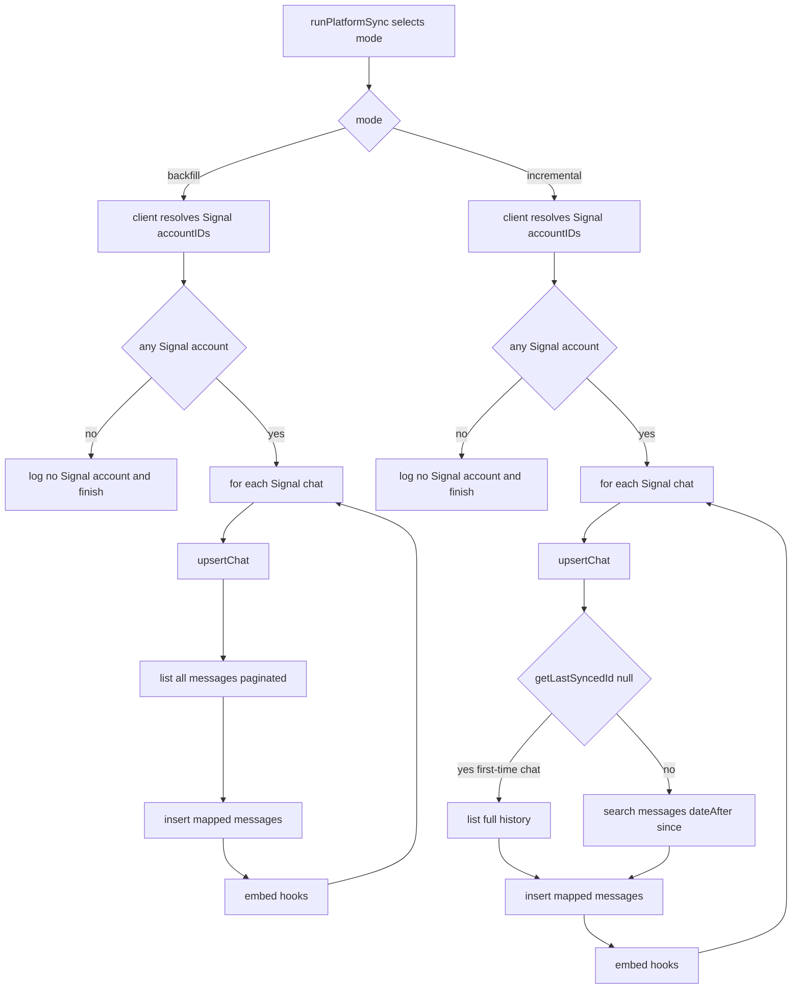
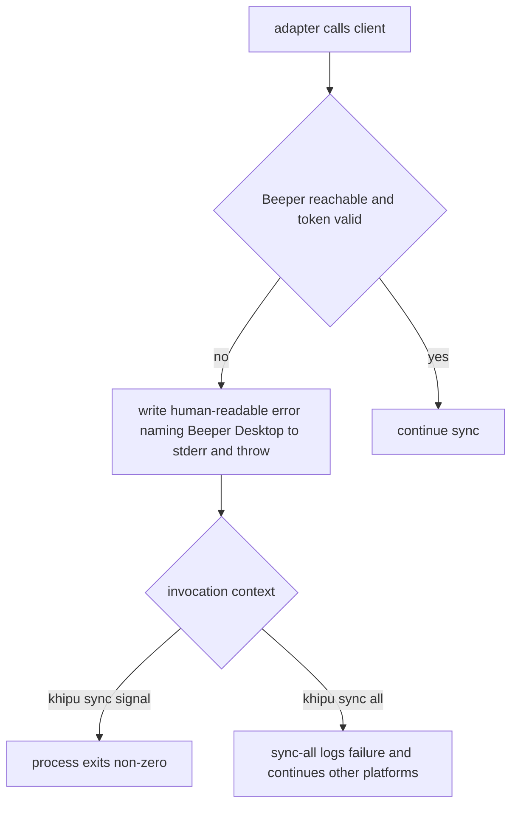

# Technical Design

## Overview

**Purpose**: This feature makes Signal a first-class KhipuChat platform, ingesting Signal chats and text messages into the local SQLite archive so they are queryable through the same MCP, CLI, and Web UI surfaces as every other platform.

**Users**: The operator (self-hosting user) runs `khipu sync signal` (or `khipu sync`) to backfill and incrementally refresh Signal history; agents and the operator then query that history through existing surfaces with no Signal-specific handling.

**Impact**: Signal is added to the `Platform` union and the `PLATFORMS` dispatch list (two surgical edits), and a new `src/platforms/signal/` adapter is introduced. Signal data is sourced through **Beeper Desktop's local HTTP API** (via the official `@beeper/desktop-api` SDK) rather than the encrypted Signal Desktop database. No shared interface, sync runner, MCP tool, CLI, or Web UI code changes.

### Goals

- Register `signal` as a recognized platform dispatched by the existing sync runner (R1).
- Ingest Signal chats and text messages through Beeper Desktop, scoped strictly to Signal (R2, R3).
- Support idempotent full backfill and efficient incremental sync (R3, R4).
- Store accurate per-message metadata: sender, timestamp, ownership, reply reference, text-only content (R5).
- Achieve query parity in existing MCP/CLI/Web surfaces with zero changes to them (R6).
- Degrade gracefully when Beeper Desktop is unavailable (R2.3, R7).

### Non-Goals

- Signal image/attachment ingestion — deferred to `signal-image-sync` (R5.5, R5.6).
- Ingesting any non-Signal platform through Beeper (WhatsApp/Telegram/iMessage) — scoping prevents dual-sourcing (R2.2).
- Real-time listener support — `startListener` is a no-op; `/v1/ws` is noted for a future spec.
- Any modification to `PlatformAdapter`, `sync-runner`, `db.ts` write APIs, MCP tools, CLI, or Web UI.
- Any change to Beeper Desktop itself.

## Boundary Commitments

### This Spec Owns

- The `src/platforms/signal/` adapter: `client.ts` (Beeper access layer) and `sync.ts` (`PlatformAdapter` implementation + CLI entrypoint).
- The mapping from Beeper `Account`/`Chat`/`Message` shapes to KhipuChat `Chat`/`Message` rows.
- Signal-only query scoping via Beeper account `network === 'signal'`.
- Backfill, incremental, and graceful-degradation behavior for the Signal adapter.
- Population of `platform='signal'` chat and message rows (text content only).

### Out of Boundary

- Media/attachment columns (`media_file_path`, `media_url`, `media_width`, `media_height`, `ocr_text`) — always written as `NULL` here; owned by `signal-image-sync`.
- The `PlatformAdapter` interface, `sync-runner.ts`, `sync-all.ts` dispatch mechanics, and `db.ts` write functions (`upsertChat`, `insertMessage`) — used as-is, never modified.
- MCP tools, CLI query commands, and Web UI — inherit Signal automatically; no edits.
- Beeper access-token acquisition — a one-time operator setup step outside adapter runtime.

### Allowed Dependencies

- `PlatformAdapter` / `AdapterFactory` from `src/platforms/types.ts` (implement, do not modify).
- `runPlatformSync` from `src/sync-runner.ts` (call, do not modify).
- `db.ts` public API: `initDb`, `upsertChat`, `insertMessage`, `getLastSyncedId`, plus embedding hooks `embedNewMessages` / `embedNewChats` and `isIndexed` — all read/used as existing adapters use them.
- `account-registry` `AccountCredentials` for the `BEEPER_ACCESS_TOKEN` field.
- New npm dependency: `@beeper/desktop-api` (^5.0.0, zero transitive deps).

### Revalidation Triggers

- A change to the `PlatformAdapter` interface or `runPlatformSync` contract.
- A change to the `Message`/`Chat` row shapes or `db.ts` write signatures.
- A change to how Beeper exposes Signal (network name, account model, or REST/SDK contract).
- `signal-image-sync` beginning to write `media_*` columns onto rows this spec creates — that spec must re-check that these rows exist and carry stable `external_id`s.

## Architecture

### Existing Architecture Analysis

Every platform lives under `src/platforms/<name>/` with an optional `client.ts` (data-source wrapper) and a `sync.ts` that exports a default adapter, a `create<Name>Adapter(account, credentials)` factory, and a `main()` calling `runPlatformSync`. The runner (`sync-runner.ts`) selects backfill vs. incremental from the recorded platform+account sync point and persists the new sync point after success. `khipu.ts` dispatches `khipu sync <platform>` to `src/platforms/<platform>/sync.ts` purely by convention, gated on membership in `PLATFORM_SET` (derived from `PLATFORMS`). `sync-all.ts` spawns each platform in `PLATFORMS` serially and continues past per-platform failures.

The closest analogs are **Discord** and **Slack**: both call a remote data source with no local DB, upsert each chat, stream messages per chat, and run embedding hooks after each chat loop. Signal follows this pattern exactly, substituting Beeper for the Slack/Discord HTTP API.

### Architecture Pattern & Boundary Map



**Architecture Integration**:
- **Selected pattern**: Adapter + thin client, identical to Discord/Slack. `client.ts` isolates the Beeper SDK behind a narrow, Signal-scoped, mockable interface; `sync.ts` owns mapping and the backfill/incremental loops.
- **Domain boundaries**: client layer knows Beeper shapes only; adapter layer knows KhipuChat `Chat`/`Message` only. Neither reaches into MCP/CLI/Web.
- **Existing patterns preserved**: default-adapter export, factory, `main()`+`runPlatformSync`, per-chat embedding hooks, no-op `startListener`, credential-missing fatal error.
- **New components rationale**: `client.ts` and `sync.ts` are new because no existing code speaks to Beeper; both stay well under the 200-line guideline.
- **Steering compliance**: all data stays local (Beeper API is `127.0.0.1`, `remote_access:false`); no external cloud API; parity achieved by writing to the shared tables so MCP/CLI/Web see Signal with zero changes.

### Dependency Direction

`types (Platform) → client.ts (Beeper access) → sync.ts (adapter + mapping) → sync-runner/db (shared runtime)`. `sync.ts` imports `client.ts`; `client.ts` never imports `sync.ts`. Mapping functions in `sync.ts` depend only on client output types and `db.ts` `Chat`/`Message` types.

### Technology Stack

| Layer | Choice / Version | Role in Feature | Notes |
|-------|------------------|-----------------|-------|
| CLI | existing `khipu.ts` dispatch | Routes `sync signal` to the adapter | No change beyond `PLATFORMS`/union edits |
| Backend / Adapter | new `src/platforms/signal/{client,sync}.ts` (TypeScript) | Beeper access + mapping + sync loops | Mirrors Discord/Slack |
| External data source | `@beeper/desktop-api` ^5.0.0 | Typed client for Beeper local REST API | **New dependency**; zero transitive deps; static `accessToken` auth |
| Data / Storage | existing SQLite via `db.ts` | Idempotent chat/message persistence | No schema or write-API changes |

## File Structure Plan

### Directory Structure
```
src/platforms/signal/
├── client.ts     # BeeperSignalClient: wraps @beeper/desktop-api, resolves Signal accountIDs,
│                 # exposes listChats / listChatMessages / listNewChatMessages returning typed
│                 # Beeper Chat/Message shapes scoped to Signal only. No DB, no KhipuChat types.
└── sync.ts       # SignalAdapter: mapChat / mapMessage, runBackfillImpl / runIncrementalImpl,
                  # createSignalAdapter factory, default adapter export, main() → runPlatformSync.
tests/
└── signal.test.ts   # Unit tests for mapChat/mapMessage + backfill/incremental against a mock client.
```

### Modified Files
- `src/platforms/types.ts` — add `| 'signal'` to the `Platform` union (line 4).
- `src/sync-all.ts` — add `'signal'` to the `PLATFORMS` array (line 4); this transitively registers it in `khipu.ts`'s `PLATFORM_SET`.
- `package.json` — add `@beeper/desktop-api` to `dependencies`.

> No other files change. MCP tools, CLI query commands, Web UI, `sync-runner.ts`, and `db.ts` are untouched.

## System Flows

### Backfill vs. Incremental dispatch (per chat)



**Key decisions**: Signal scoping happens once by resolving `network === 'signal'` account IDs and passing them to every query. A per-chat try/catch isolates a failing chat so the sync continues (R2.4). A brand-new chat in incremental mode (`getLastSyncedId` returns `null`) is fetched in full, honoring R4.3 without a per-chat cursor store.

### Beeper-unavailable degradation



## Requirements Traceability

| Requirement | Summary | Components | Interfaces | Flows |
|-------------|---------|------------|------------|-------|
| 1.1, 1.2, 1.3 | Register `signal`; dispatch single + all-platform sync | `types.ts`, `sync-all.ts`, `sync.ts` | `PlatformAdapter`, `runPlatformSync` | Dispatch flow |
| 2.1 | Retrieve chats/messages via Beeper | `client.ts` | `BeeperSignalClient` | Backfill flow |
| 2.2 | Scope to Signal only | `client.ts` | account `network` filter | Dispatch flow |
| 2.3, 7.1, 7.3, 7.4 | Clear error + non-zero exit when Beeper down | `sync.ts`, `client.ts` | fatal error path | Degradation flow |
| 2.4 | Per-chat error isolation | `sync.ts` | backfill/incremental loop | Backfill flow |
| 3.1, 3.2 | Backfill chats + text messages | `sync.ts` | `runBackfillImpl` | Backfill flow |
| 3.3, 3.4 | No duplicate chats/messages | `db.ts` (existing) | `upsertChat`, `insertMessage` idempotency | — |
| 4.1, 4.2 | Incremental only new messages; record sync point | `sync.ts`, `sync-runner` (existing) | `syncIncremental`, `setPlatformLastSyncedAt` | Incremental flow |
| 4.3 | New chat treated as first-time | `sync.ts` | `getLastSyncedId` guard | Incremental flow |
| 5.1, 5.2, 5.3, 5.4 | Sender, timestamp, platform, ownership, reply, chat association | `sync.ts` | `mapMessage` | — |
| 5.5, 5.6 | Text-only; omit media | `sync.ts` | `mapMessage` (media fields left null) | — |
| 6.1–6.5 | Query parity via existing surfaces | shared tables (existing) | none (writes `platform='signal'` rows) | — |
| 7.2 | All-platform sync continues past Signal failure | `sync-all.ts` (existing) | `runAllPlatforms` | Degradation flow |

## Components and Interfaces

| Component | Domain/Layer | Intent | Req Coverage | Key Dependencies (P0/P1) | Contracts |
|-----------|--------------|--------|--------------|--------------------------|-----------|
| `BeeperSignalClient` | External integration | Signal-scoped access to Beeper data | 2.1, 2.2, 2.3, 4.1 | `@beeper/desktop-api` (P0) | Service |
| `SignalAdapter` | Platform adapter | Map Beeper data to rows; run backfill/incremental | 1, 3, 4, 5 | `BeeperSignalClient` (P0), `db.ts` (P0), `sync-runner` (P0) | Service, Batch |
| `Platform`/`PLATFORMS` edits | Registration | Recognize `signal` for dispatch | 1.1, 1.3 | none | State |

### External Integration

#### BeeperSignalClient

| Field | Detail |
|-------|--------|
| Intent | Wrap the Beeper SDK and expose only Signal-scoped chat/message reads |
| Requirements | 2.1, 2.2, 2.3, 4.1 |

**Responsibilities & Constraints**
- Construct `BeeperDesktop({ accessToken })` and resolve Signal `accountID`s once via `accounts.list()` filtered to `network === 'signal'`.
- Scope every `chats.search` / `messages.search` call with those `accountID`s (R2.2). Never expose non-Signal data.
- Own pagination (cursor + `direction:'before'`) and yield typed Beeper shapes; do not touch the DB or KhipuChat types.
- Surface Beeper unreachable / invalid-token as a typed fatal condition (R2.3); do not swallow it.

**Dependencies**
- Outbound: `@beeper/desktop-api` `BeeperDesktop` client — Beeper local REST API (External, P0).
- Inbound: `SignalAdapter` — the only consumer (P0).

**Contracts**: Service [x] / API [ ] / Event [ ] / Batch [ ] / State [ ]

##### Service Interface
```typescript
import type { Account, Chat as BeeperChat, Message as BeeperMessage } from '@beeper/desktop-api'

export interface BeeperSignalClient {
  /** Signal account IDs resolved from network === 'signal'. Empty ⇒ no Signal connected. */
  signalAccountIds(): Promise<readonly string[]>
  /** All Signal chats, paginated internally. */
  listChats(): AsyncGenerator<BeeperChat>
  /** All messages for one chat, newest→oldest, paginated internally. */
  listChatMessages(chatId: string): AsyncGenerator<BeeperMessage>
  /** Messages in one chat strictly after `since` (incremental). */
  listNewChatMessages(chatId: string, since: Date): AsyncGenerator<BeeperMessage>
}

export function createBeeperSignalClient(accessToken: string): BeeperSignalClient
```
- **Preconditions**: `accessToken` non-empty; Beeper Desktop running and reachable at its local API.
- **Postconditions**: every yielded chat/message belongs to a Signal account; generators complete when Beeper reports no more pages.
- **Invariants**: no query is issued without the Signal `accountIDs` filter; the client never writes to the DB.

**Implementation Notes**
- Integration: `signalAccountIds()` memoizes the resolved IDs; `listNewChatMessages` maps to `messages.search({ chatIDs:[chatId], accountIDs, dateAfter: since.toISOString() })`; `listChatMessages` to `chats.messages.list({ chatID, direction:'before' })` looped on cursor.
- Validation: missing/empty token → throw a fatal error before any network call; SDK connection errors (ECONNREFUSED / 401) → wrap with a message naming Beeper Desktop.
- Risks: Beeper `linkedMessageID` semantics for replies verified against `/v1/spec`; if a future Beeper version renames it, mapping breaks (Revalidation Trigger).

#### SignalAdapter

| Field | Detail |
|-------|--------|
| Intent | Implement `PlatformAdapter`; map Beeper shapes to rows; drive backfill/incremental |
| Requirements | 1.2, 2.4, 3.1–3.4, 4.1–4.3, 5.1–5.6 |

**Responsibilities & Constraints**
- Implement `runBackfill`, `syncIncremental`, and no-op `startListener`; expose `createSignalAdapter` + default export + `main()`.
- Map each Beeper chat/message via pure `mapChat`/`mapMessage` functions (unit-testable, no I/O).
- Populate only text content; leave all `media_*` columns `null` (R5.5, R5.6).
- Per-chat try/catch: log and continue on a single chat's failure (R2.4); a client-level fatal (Beeper down) propagates to the runner (R7).
- Run `embedNewMessages`/`embedNewChats` per chat, guarded by `isIndexed`, exactly as Discord/Slack do.

**Dependencies**
- Outbound: `BeeperSignalClient` (P0); `db.ts` `upsertChat`/`insertMessage`/`getLastSyncedId` (P0); `runPlatformSync` (P0); `embedNew*`/`isIndexed` (P1).
- External: none directly (Beeper reached only through the client).

**Contracts**: Service [x] / API [ ] / Event [ ] / Batch [x] / State [ ]

##### Batch / Job Contract
- **Trigger**: `khipu sync signal` / `khipu sync` → `main()` → `runPlatformSync(signalAdapter, db, argv)`.
- **Input / validation**: `BEEPER_ACCESS_TOKEN` credential; `--force` selects backfill, else runner picks incremental when a prior sync point exists.
- **Output / destination**: `chats` and `messages` rows with `platform='signal'`; sync point persisted by the runner.
- **Idempotency & recovery**: `upsertChat` (unique `platform,account,external_id`) and `insertMessage` (`INSERT ... ON CONFLICT(external_id, chat_id)`) make re-runs duplicate-free (R3.3, R3.4). Per-chat isolation bounds the blast radius of a transient error.

##### Mapping contract
```typescript
export function mapChat(c: BeeperChat, account: string): Chat        // id→external_id, title→name, type→private|group
export function mapMessage(m: BeeperMessage, chatId: number): Message // see table §6.5; media_* omitted
```
- `mapMessage`: `type = m.type === 'TEXT' && m.text ? 'text' : 'other'`; `is_sender = m.isSender ? 1 : 0`; `timestamp = Math.floor(Date.parse(m.timestamp)/1000)`; `reply_to_external_id = m.linkedMessageID ?? null`; `text = m.text ?? null`.
- Skip messages where `m.isDeleted` or `m.isHidden` is true.

**Implementation Notes**
- Integration: factory reads `credentials.fields['BEEPER_ACCESS_TOKEN']`; empty → `stderr` message + `process.exit(1)` (mirrors Slack/Discord token guard, satisfies 7.1/7.3).
- Validation: when `signalAccountIds()` is empty, log a clear "no Signal account connected in Beeper" notice and finish without error (clean no-op).
- Risks: message rows for media-only Signal messages are still inserted with `text=null` so `signal-image-sync` can later attach media to a stable `external_id`.

### Registration edits

`Platform` union gains `'signal'`; `PLATFORMS` gains `'signal'`. `khipu.ts` derives `PLATFORM_SET` from `PLATFORMS`, so `khipu sync signal` dispatch and validation work with no further edits. `account-registry` needs no code change: a `signal` entry in `khipu.config.json` (or a legacy `BEEPER_ACCESS_TOKEN` env fallback) supplies credentials through the existing config path.

## Data Models

No schema changes. Signal reuses the existing `chats` and `messages` tables.

- **`chats`**: identity `(platform='signal', account, external_id=BeeperChat.id)`; `name=title`, `type ∈ {private, group}`.
- **`messages`**: identity `(external_id=BeeperMessage.id, chat_id)`; `platform='signal'`; content fields per §6.5; `media_file_path/media_url/media_width/media_height/ocr_text` always `NULL` (owned by `signal-image-sync`).
- **Referential integrity**: `messages.chat_id` references the row returned by `upsertChat`; a message is only inserted after its chat is upserted in the same loop iteration.

Full Beeper field-to-row mapping tables live in `research.md` §6.5 and are summarized in the `mapMessage` contract above.

## Error Handling

### Error Strategy
- **Missing token** (user setup error): write a human-readable line to `stderr` and `process.exit(1)` in the factory before any network call (7.1, 7.3).
- **Beeper unreachable / 401** (system dependency error): the client throws an error naming Beeper Desktop; the adapter lets it propagate so `runPlatformSync` records failure and the process exits non-zero for explicit `khipu sync signal` (2.3, 7.4).
- **Per-chat query failure** (partial degradation): caught inside the chat loop, logged, and skipped so remaining chats still sync (2.4).
- **All-platform run**: unchanged `runAllPlatforms` logs the Signal child's non-zero exit and continues other platforms (7.2).

### Monitoring
- Console progress line per sync (`[signal] Sync complete: N chats, M messages`), matching Discord/Slack, plus per-chat error logs for skipped chats.

## Testing Strategy

### Unit Tests
- `mapMessage` maps `senderID/senderName/timestamp/isSender/linkedMessageID` correctly and sets `type='text'` only for `TEXT` with text; verifies all `media_*` fields are `null` (5.1, 5.2, 5.4, 5.5, 5.6).
- `mapChat` maps `single→private` and `group→group` and uses `title` as name (3.1).
- `mapMessage` drops `isDeleted`/`isHidden` messages and coerces missing `text` to `null` (5.5).

### Integration Tests (adapter against a mock `BeeperSignalClient`)
- `runBackfillImpl` upserts each Signal chat and inserts its messages; a second run inserts zero duplicates (3.1–3.4).
- `runIncrementalImpl` fetches only messages after `since` for existing chats and full history for a chat where `getLastSyncedId` returns `null` (4.1, 4.3).
- A client that throws on one chat's message fetch still processes the remaining chats (2.4); a client whose `signalAccountIds()` is empty completes as a clean no-op.
- Factory with empty `BEEPER_ACCESS_TOKEN` exits non-zero with a Beeper-naming message (7.1, 7.3).

### Parity Tests
- After a mocked Signal sync into an in-memory DB, existing MCP/CLI query paths (`list_chats`, `list_messages`, `search_messages`, FTS) return the Signal rows with no Signal-specific arguments (6.1–6.5).

## Security Considerations

- All Beeper access is over `127.0.0.1` (`remote_access:false`); no Signal data leaves the machine, consistent with steering.
- `BEEPER_ACCESS_TOKEN` is a secret: supplied via env/`khipu.config.json` `$VAR` resolution (existing registry mechanism), never logged. The client sends it only as the SDK `accessToken`.
- Scoping to `network === 'signal'` accounts is a hard privacy boundary preventing accidental ingestion of other Beeper-bridged conversations.

## Supporting References

- `research.md` §6 — full evidence for the transport probe, SDK inspection, OAuth model, Signal scoping, message field schemas, and incremental cursor decisions.
