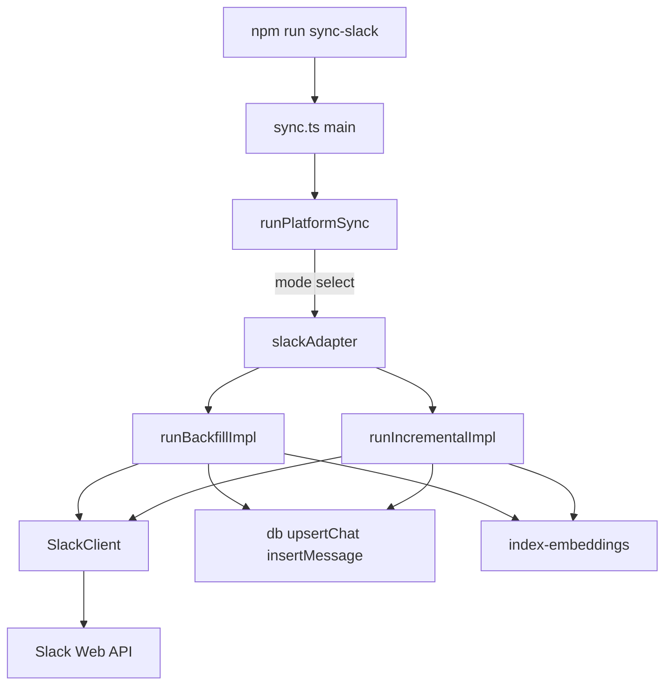
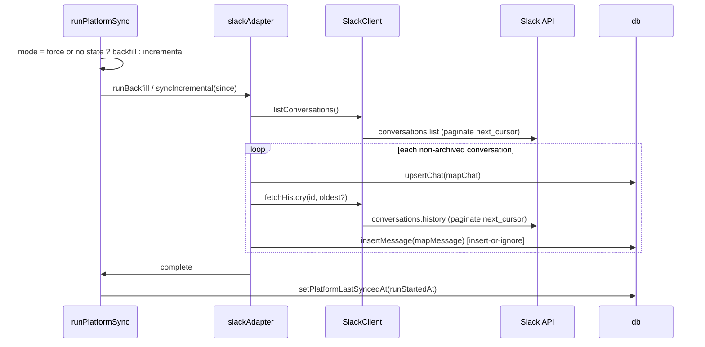

# Design Document — slack-sync

## Overview

Slack Sync is a read-only platform adapter that fetches all DMs and joined channels from the Slack Web API using a personal user token, maps them into the shared archive schema under `platform = 'slack'`, and is idempotent across runs. It follows the existing Discord adapter pattern: a thin `SlackClient` factory over native `fetch` drives `conversations.list` and `conversations.history` with cursor pagination, while `runBackfillImpl` / `runIncrementalImpl` accept an injected client for deterministic testing.

The adapter plugs into the shared `runPlatformSync` orchestrator, which selects backfill vs. incremental mode from `sync_state`. Persistence (`upsertChat`, `insertMessage`) and embedding (`embedNewMessages`, `embedNewChats`) reuse existing infrastructure unchanged. No new runtime dependencies are introduced (Node 18+ global `fetch`); `'slack'` is already present in the `Platform` union.

### Goals
- Discover all non-archived DMs and joined channels via `conversations.list`.
- Backfill and incrementally sync message history idempotently under `platform = 'slack'`.
- Respect Slack Tier 3 rate limits (~50 req/min) and honor `429 Retry-After`.

### Non-Goals
- Real-time event subscriptions, sending messages, file/attachment download.
- Workspace admin features and slash commands.
- Schema or `Platform` union changes (both already accommodate Slack).

## Boundary Commitments

### This Spec Owns
- `src/platforms/slack/` — `SlackClient` factory (client.ts), mappers, backfill/incremental runners, and `PlatformAdapter` factory (sync.ts).
- The `"sync:slack"` npm script entry point.
- Translation of Slack API shapes into the shared `Chat` / `Message` records.

### Out of Boundary
- `src/platforms/types.ts` — `'slack'` and `PlatformAdapter` already defined; consumed, not modified.
- `src/db.ts` schema and `upsertChat` / `insertMessage` semantics — consumed as-is.
- `src/sync-runner.ts` mode selection and `sync_state` tracking — consumed as-is.
- Embedding pipeline (`src/index-embeddings.ts`) — invoked, not altered.

### Allowed Dependencies
- `src/db.ts` (`Chat`, `Message`, `upsertChat`, `insertMessage`).
- `src/platforms/types.ts` (`Platform`, `PlatformAdapter`).
- `src/sync-runner.ts` (`runPlatformSync`), `src/account-registry.ts` (`AccountCredentials`), `src/index-embeddings.ts`, `src/vec-db.ts` (`isIndexed`).
- Node 18+ global `fetch`; environment via `process.env`.

### Revalidation Triggers
- Slack Web API contract changes (`conversations.list`/`conversations.history`/`users.info` shapes or pagination).
- Changes to the shared `Chat` / `Message` interfaces or `PlatformAdapter` contract.
- Changes to `runPlatformSync` mode-selection or `sync_state` semantics.

## Architecture

### Existing Architecture Analysis
The codebase already establishes a per-platform adapter pattern (Discord is the closest analogue). Each adapter exposes a `PlatformAdapter` (backfill + optional incremental + no-op listener), delegates orchestration to `runPlatformSync`, and persists through the shared `db.ts` helpers. Slack conforms to this pattern with zero deviations; the only Slack-specific concerns are the API client and the field mapping.

### Architecture Pattern & Boundary Map



**Architecture Integration**:
- Selected pattern: injectable-client adapter behind the shared `PlatformAdapter` contract.
- Boundaries: `client.ts` owns Slack HTTP/pagination/rate-limit concerns; `sync.ts` owns mapping and orchestration wiring. No shared ownership with other adapters.
- Dependency direction: `types` → `db` / `account-registry` / `sync-runner` → `client.ts` → `sync.ts` (runtime entry). Slack modules import only leftward; nothing imports from Slack.
- Steering compliance: fully self-hosted, local-only, no external services beyond the Slack API the user explicitly configures.

### Technology Stack

| Layer | Choice / Version | Role in Feature | Notes |
|-------|------------------|-----------------|-------|
| Runtime | Node 18+ (`tsx`) | Executes `sync:slack` entry | Global `fetch`, no HTTP client dep |
| External API | Slack Web API (Tier 3) | Conversation + message source | User token (`xoxp-`) via env |
| Data / Storage | SQLite via `better-sqlite3-multiple-ciphers` | Persist chats/messages | Reused; no schema change |

## File Structure Plan

### Directory Structure
```
src/platforms/slack/
├── client.ts   # SlackClient factory: fetch wrapper, pagination, 429 handling, user-name cache
└── sync.ts     # mapChat, mapMessage, runBackfillImpl, runIncrementalImpl, createSlackAdapter, main()
tests/
└── slack.test.ts  # unit + integration coverage
```

### Modified Files
- `package.json` — `"sync:slack": "tsx src/platforms/slack/sync.ts"` script (already present).

> `client.ts` isolates all Slack transport concerns; `sync.ts` isolates mapping + adapter wiring. Each file has a single responsibility and maps 1:1 to the components below.

## System Flows

The runner gates mode on prior sync state: first run (no `sync_state` row) or `--force` runs a full backfill; subsequent runs pass the last-synced timestamp to `fetchHistory(channelId, oldest)` so only newer messages are fetched. `insertMessage` uses INSERT-OR-IGNORE on `(platform, external_id)`, making overlapping windows idempotent.



## Requirements Traceability

| Requirement | Summary | Components | Interfaces |
|-------------|---------|------------|------------|
| 1.1, 1.2 | Token from `SLACK_USER_TOKEN` only; exit 1 if absent | `createSlackAdapter` | credentials check + `process.exit(1)` |
| 2.1 | List all conversation types | `SlackClient.listConversations` | `conversations.list` types param |
| 2.2 | Cursor pagination | `SlackClient.listConversations` | `next_cursor` loop |
| 2.3 | Skip archived | `SlackClient.listConversations` + `runBackfillImpl` | `exclude_archived` + `is_archived` guard |
| 3.1 | History with pagination | `SlackClient.fetchHistory` | `conversations.history` `next_cursor` |
| 3.2 | `ts` as `external_id` | `mapMessage` | `external_id: msg.ts` |
| 3.3 | `ts` → integer seconds | `mapMessage` | `Math.floor(parseFloat(ts))` |
| 3.4 | `user` → `sender_id`, resolve name | `mapMessage` + `SlackClient.getUserName` | cached `users.info` |
| 3.5 | Service messages stored as `type='other'` | `mapMessage` | `subtype` branch |
| 3.6 | `platform = 'slack'` | `mapChat` + `mapMessage` | literal platform field |
| 4.1 | Honor `429 Retry-After` | `SlackClient` (slackFetch) | retry after header delay |
| 4.2 | Stay within Tier 3 pacing | `SlackClient` (slackFetch) | 1200ms pre-request delay |
| 5.1 | `npm run sync:slack` | `main` + package script | entry point |
| 5.2 | No duplicates on re-run | `insertMessage` | INSERT-OR-IGNORE on `external_id` |
| 5.3 | Only new messages on subsequent runs | `runIncrementalImpl` + `runPlatformSync` | `oldest` cursor from `sync_state` |

## Components and Interfaces

| Component | Layer | Intent | Req Coverage | Contracts |
|-----------|-------|--------|--------------|-----------|
| `SlackClient` (client.ts) | Transport | Paginate Slack API, rate-limit, resolve user names | 2.1–2.3, 3.1, 3.4, 4.1, 4.2 | Service |
| `mapChat` / `mapMessage` (sync.ts) | Mapping | Translate Slack shapes to `Chat` / `Message` | 3.2–3.6 | Service |
| `runBackfillImpl` / `runIncrementalImpl` (sync.ts) | Orchestration | Drive discovery → fetch → persist → embed | 2.3, 3.1, 5.3 | Batch |
| `createSlackAdapter` (sync.ts) | Wiring | `PlatformAdapter` factory + token guard | 1.1, 1.2, 5.1 | Service |

### Transport

#### SlackClient

| Field | Detail |
|-------|--------|
| Intent | Encapsulate Slack HTTP, cursor pagination, 429 handling, and user-name caching |
| Requirements | 2.1, 2.2, 2.3, 3.1, 3.4, 4.1, 4.2 |

**Responsibilities & Constraints**
- Owns all Slack Web API transport; callers never touch `fetch` or cursors.
- Emits domain shapes via async generators for streaming, bounded-memory iteration.
- Applies a fixed 1200ms pre-request delay (≈50 req/min) and a single `Retry-After` retry on `429`.

**Dependencies**
- External: Slack Web API — `conversations.list`, `conversations.history`, `users.info` (P0).
- Inbound: `runBackfillImpl` / `runIncrementalImpl` — consume generators (P0).

**Contracts**: Service [x]

##### Service Interface
```typescript
export interface SlackConversation {
  id: string
  name: string | null
  is_im: boolean
  is_mpim: boolean
  is_archived: boolean
  user?: string          // DM counterpart user id
}

export interface SlackMessage {
  ts: string             // external_id and Unix-seconds source
  user?: string          // sender id
  text: string
  subtype?: string       // present on service messages
}

export interface SlackClient {
  listConversations(): AsyncGenerator<SlackConversation>
  fetchHistory(channelId: string, oldest?: string): AsyncGenerator<SlackMessage>
  getUserName(userId: string): Promise<string>   // cached; falls back to userId
}

export function createSlackClient(token: string): SlackClient
```
- Preconditions: non-empty bearer token.
- Postconditions: generators exhaust all pages; `getUserName` never throws (returns `userId` on failure).
- Invariants: at most one in-flight request; non-`ok` responses raise an `Error` with the Slack `error` code.

**Implementation Notes**
- Integration: `listConversations` requests `types=public_channel,private_channel,im,mpim&exclude_archived=true&limit=200`.
- Validation: `data.ok` checked per page; user-name lookups swallow errors and cache the id.
- Risks: 1200ms fixed pacing is conservative but simple; acceptable for a local backfill tool.

### Mapping & Orchestration

#### mapChat / mapMessage / runners

| Field | Detail |
|-------|--------|
| Intent | Convert Slack shapes to shared records and drive discovery→persist→embed |
| Requirements | 2.3, 3.1, 3.2, 3.3, 3.4, 3.5, 3.6, 5.3 |

**Contracts**: Service [x] / Batch [x]

##### Service Interface
```typescript
export function mapChat(conv: SlackConversation, account: string): Chat
// external_id = conv.id
// name        = conv.name ?? conv.user ?? conv.id
// type        = conv.is_im ? 'private' : conv.is_mpim ? 'group' : 'user'
// platform    = 'slack'

export function mapMessage(msg: SlackMessage, chatId: number, senderName: string | null): Message
// external_id = msg.ts
// timestamp   = Math.floor(parseFloat(msg.ts))
// sender_id   = msg.user ?? null
// type        = (msg.subtype || !msg.text) ? 'other' : 'text'
// platform    = 'slack'

export async function runBackfillImpl(client: SlackClient, account?: string): Promise<void>
export async function runIncrementalImpl(client: SlackClient, since: Date, account?: string): Promise<void>
```

##### Batch / Job Contract
- Trigger: `runPlatformSync` selects `runBackfill` (full) or `syncIncremental(since)` per `sync_state`.
- Input: streamed conversations/messages from `SlackClient`.
- Output: `upsertChat` + `insertMessage`; embeddings refreshed per chat when indexed.
- Idempotency & recovery: `insertMessage` ignores duplicate `(platform, external_id)`; incremental passes `oldest = since` so only newer messages are fetched. Archived conversations are skipped in-loop as defense-in-depth.

**Implementation Notes**
- Integration: after each conversation, `embedNewMessages`/`embedNewChats` run only when `isIndexed` reports the vector store is present.
- Validation: `runBackfillImpl` and `runIncrementalImpl` re-check `conv.is_archived` even though the client already excludes archived.
- Risks: none material; mapping is pure and unit-testable.

#### createSlackAdapter

| Field | Detail |
|-------|--------|
| Intent | Build a `PlatformAdapter` bound to an account; enforce token presence |
| Requirements | 1.1, 1.2, 5.1 |

**Contracts**: Service [x]

##### Service Interface
```typescript
export function createSlackAdapter(account: string, credentials: AccountCredentials): PlatformAdapter
export const slackAdapter: PlatformAdapter   // default account from process.env.SLACK_USER_TOKEN
```
- Preconditions: `credentials.fields['SLACK_USER_TOKEN']` non-empty; otherwise writes to stderr and `process.exit(1)`.
- Postconditions: returns adapter with `runBackfill`, `syncIncremental`, and a no-op `startListener`.
- Invariants: token read exclusively from `SLACK_USER_TOKEN`; never hardcoded or logged.

## Error Handling

### Error Strategy
- **Missing token** (fail fast): stderr message + `process.exit(1)` before any network call.
- **Slack API error** (`ok: false`): throw `Error` with the Slack error code, aborting the run; `main()` logs and exits 1.
- **Rate limit** (`429`): wait `Retry-After` seconds then retry once; steady-state pacing avoids most 429s.
- **User-name resolution failure**: degrade gracefully — cache and use the raw `userId`.

### Monitoring
- Progress and completion logged to stdout (`[slack] Sync complete: N channels, M messages`). No external telemetry (self-hosted).

## Testing Strategy

### Unit Tests
- `mapChat`: type derivation (`is_im`→private, `is_mpim`→group, else user); name fallback chain.
- `mapMessage`: `ts`→integer seconds; `external_id = ts`; `subtype`/empty-text → `type='other'`.

### Integration Tests
- `runBackfillImpl` with a mock `SlackClient`: correct chat/message records; archived conversations skipped.
- Idempotency: running backfill twice against the same mock produces no duplicate messages.
- `runIncrementalImpl`: `oldest` passed to `fetchHistory`; only newer messages stored.

### Error Paths
- `createSlackAdapter` with missing `SLACK_USER_TOKEN`: writes stderr and exits 1 (mirror Discord adapter test).
- `SlackClient` on `429`: honors `Retry-After` and retries (stub `globalThis.fetch`).
