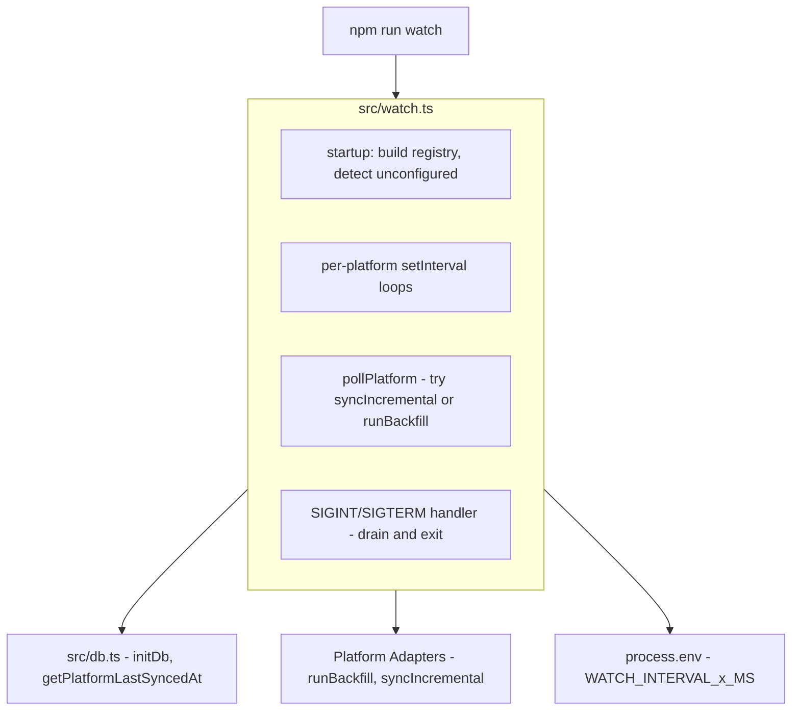
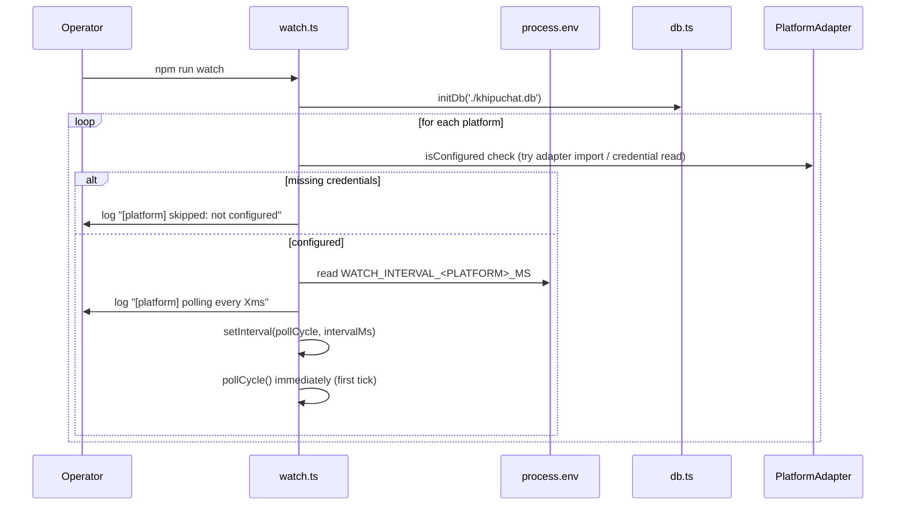
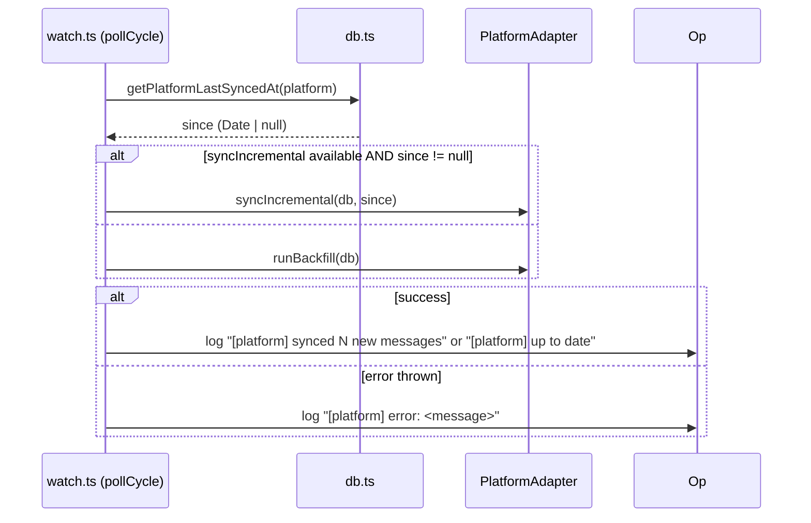
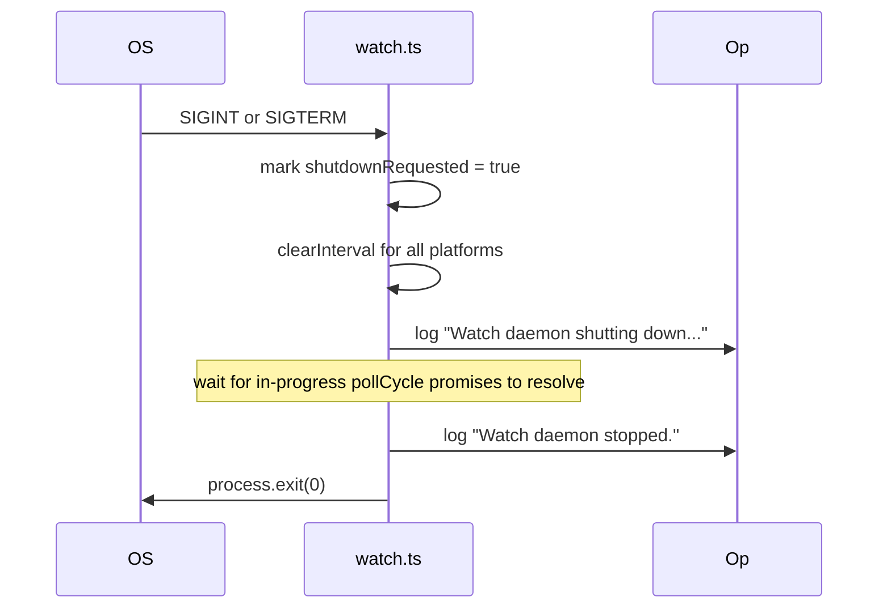

# Design Document: sync-watcher

## Overview

This feature adds a long-running polling daemon to KhipuChat, invoked via `npm run watch`. The daemon polls each configured messaging platform at a per-platform configurable interval, calling `syncIncremental` (or `runBackfill` as a fallback) on each cycle. It logs results clearly, isolates per-platform errors, silently skips unconfigured platforms, and shuts down cleanly on SIGINT/SIGTERM.

**Purpose**: Eliminate the need for operators to manually run `npm run sync:*` or configure OS-level daemons to keep the message archive current.

**Users**: KhipuChat operators running a self-hosted instance who want continuous, automatic message archiving across all configured platforms.

**Impact**: Adds one new entry point (`src/watch.ts`) and one new `package.json` script. No existing files are modified.

### Goals

- Continuous incremental sync for all configured platforms via a single `npm run watch` command.
- Per-platform polling interval configurable via environment variables with a sensible 5-minute default.
- Resilient: one platform's failure does not affect others or crash the daemon.
- Zero new dependencies — uses Node.js built-in timers and process signals.

### Non-Goals

- Real-time push/webhook sync (still polling only).
- Modifying or replacing any `sync:*` scripts.
- Adding new platform adapters.
- Exposing a status endpoint or web UI for watcher state.
- Replacing the macOS LaunchAgent setup path (`src/setup-sync.ts`).
- Changing message storage, deduplication, FTS, or vector indexing logic.

---

## Boundary Commitments

### This Spec Owns

- `src/watch.ts` — the watcher entry point, platform registry loop, interval management, error isolation, and shutdown handler.
- `package.json` `watch` script — the `tsx src/watch.ts` invocation.
- Per-platform interval resolution via `WATCH_INTERVAL_<PLATFORM>_MS` env vars with a 5-minute default.
- Skip-if-unconfigured detection at startup (by catching errors from adapter credential checks).

### Out of Boundary

- Platform adapter internals (`src/platforms/*/sync.ts`) — not modified.
- `src/db.ts`, `sync_state` table, `getPlatformLastSyncedAt`, `setPlatformLastSyncedAt` — owned by `incremental-sync`.
- `PlatformAdapter.syncIncremental` interface — owned by `incremental-sync`.
- `src/setup-sync.ts` and LaunchAgent setup — unchanged.
- Individual `sync:*` package.json scripts — unchanged.

### Allowed Dependencies

- `src/platforms/types.ts` — `PlatformAdapter` interface and `Platform` type (read-only, no modification).
- `src/db.ts` — `initDb` and `getPlatformLastSyncedAt` (read-only consumption of incremental-sync outputs).
- Each platform adapter module (`src/platforms/*/sync.ts`) — imports the exported adapter object.
- Node.js built-ins: `process` (signals, env), `setInterval`, `clearInterval`.
- `dotenv` — already in dependencies, loaded at entry.

### Revalidation Triggers

- If `PlatformAdapter` interface changes (new required method, renamed `syncIncremental`), `src/watch.ts` must revalidate.
- If `getPlatformLastSyncedAt` signature or semantics change, the poll-cycle logic must revalidate.
- If a new platform is added to `src/platforms/types.ts` `Platform` type, the platform registry in `src/watch.ts` must be updated to include it.
- If `initDb` signature changes, the watcher startup must revalidate.

---

## Architecture

### Existing Architecture Analysis

All platform adapters implement `PlatformAdapter` (`src/platforms/types.ts`) with `runBackfill` and optionally `syncIncremental` (added by `incremental-sync`). Credential checks are implicit: adapters read config/env at module load or in the body of their sync functions and throw if credentials are absent. The `initDb` call in each adapter's `main()` is the shared DB init pattern.

The existing `npm run sync` script calls each adapter's `main()` sequentially; there is no shared runner abstraction. The watcher can consume adapters directly without going through their `main()` functions.

### Architecture Pattern & Boundary Map



**Architecture Integration**:
- Selected pattern: Thin orchestrator — `src/watch.ts` is a loop coordinator that delegates all sync work to existing adapters. No new abstraction layer.
- Dependency direction: `watch.ts` → adapter modules → `db.ts`. Unidirectional, no circular imports.
- Existing patterns preserved: `initDb` at startup, per-adapter error handling via try/catch, `console.log` for operator-visible output.
- No new components beyond `src/watch.ts`.

### Technology Stack

| Layer | Choice / Version | Role in Feature | Notes |
|-------|------------------|-----------------|-------|
| Runtime | Node.js / tsx | Entry point execution | Existing pattern — `tsx src/watch.ts` |
| Timer | Node.js `setInterval` / `clearInterval` | Per-platform polling loops | Built-in, no library needed |
| Signals | Node.js `process.on('SIGINT'/'SIGTERM')` | Graceful shutdown | Built-in |
| DB / Storage | better-sqlite3-multiple-ciphers ^11 | `initDb`, `getPlatformLastSyncedAt` | Synchronous ops — existing constraint |
| Config | `dotenv` | Load `.env` at startup | Already in dependencies |

---

## File Structure Plan

### Directory Structure

```
src/
└── watch.ts          # New: watcher daemon entry point (≤ 200 lines)
```

### Modified Files

- `package.json` — Add `"watch": "tsx src/watch.ts"` to the `scripts` section.

---

## System Flows

### Startup and polling loop



### Poll cycle (per platform, per interval)



### Graceful shutdown



---

## Requirements Traceability

| Requirement | Summary | Components | Interfaces | Flows |
|-------------|---------|------------|------------|-------|
| 1.1 | Startup log listing platforms and intervals | watch.ts startup | — | Startup flow |
| 1.2 | Skip unconfigured platforms with one-time log | watch.ts startup (isConfigured) | — | Startup flow |
| 1.3 | Immediate first poll on startup | watch.ts startup (initial pollCycle call) | — | Startup flow |
| 2.1 | Poll each platform at configured interval | watch.ts (setInterval per platform) | — | Poll cycle flow |
| 2.2 | Log "synced N new messages" | watch.ts pollCycle | — | Poll cycle flow |
| 2.3 | Log "up to date" | watch.ts pollCycle | — | Poll cycle flow |
| 2.4 | Use syncIncremental when available | watch.ts pollCycle | PlatformAdapter.syncIncremental | Poll cycle flow |
| 2.5 | Fall back to runBackfill | watch.ts pollCycle | PlatformAdapter.runBackfill | Poll cycle flow |
| 3.1 | Catch and log per-platform errors | watch.ts pollCycle (try/catch) | — | Poll cycle flow |
| 3.2 | Error in one platform doesn't stop others | watch.ts (independent setInterval per platform) | — | Poll cycle flow |
| 3.3 | Retry failing platform on next interval | watch.ts (setInterval continues) | — | Poll cycle flow |
| 4.1 | Stop on SIGINT/SIGTERM, drain in-flight cycles | watch.ts shutdown handler | — | Shutdown flow |
| 4.2 | Log shutdown confirmation | watch.ts shutdown handler | — | Shutdown flow |
| 5.1 | Read WATCH_INTERVAL_<PLATFORM>_MS env var | watch.ts (getIntervalMs) | — | Startup flow |
| 5.2 | Default 5-minute interval | watch.ts (getIntervalMs default) | — | Startup flow |
| 5.3 | Use env var value in ms when set | watch.ts (getIntervalMs) | — | Startup flow |

---

## Components and Interfaces

### Summary

| Component | Layer | Intent | Req Coverage | Key Dependencies |
|-----------|-------|--------|--------------|-----------------|
| watch.ts | Runtime / Orchestrator | Long-running daemon: registry, loop, error isolation, shutdown | 1.1–5.3 | PlatformAdapter, db.ts, process.env |
| getIntervalMs | watch.ts helper | Resolve per-platform interval from env with default | 5.1, 5.2, 5.3 | process.env |
| isConfigured | watch.ts helper | Detect whether a platform has required credentials | 1.2 | Platform adapter module |
| pollCycle | watch.ts helper | Execute one sync cycle for a platform with error isolation | 2.1–3.3 | PlatformAdapter, db.ts |
| shutdown handler | watch.ts | Drain in-flight cycles on signal and exit | 4.1, 4.2 | process signals |

---

### Watcher Entry Point (watch.ts)

| Field | Detail |
|-------|--------|
| Intent | Orchestrate per-platform polling loops: build registry, detect unconfigured, schedule intervals, handle shutdown |
| Requirements | 1.1, 1.2, 1.3, 2.1, 2.2, 2.3, 2.4, 2.5, 3.1, 3.2, 3.3, 4.1, 4.2, 5.1, 5.2, 5.3 |

**Responsibilities & Constraints**
- Load `.env` via `dotenv` at the top of the file.
- Call `initDb` once at startup.
- Build a platform registry: an array of `{ adapter, platform }` entries for all platforms defined in `Platform` type.
- For each entry, call `isConfigured(adapter)` to detect whether credentials are available; log and skip if not.
- For each configured platform, call `getIntervalMs(platform)` to resolve the polling interval.
- Log startup summary: `[platform] polling every Xms` for each active platform.
- For each configured platform, call `pollCycle` once immediately, then schedule `setInterval(pollCycle, intervalMs)`.
- Register `SIGINT` and `SIGTERM` handlers to clear all intervals and await in-flight promises before `process.exit(0)`.
- Total file length must not exceed 200 lines (steering constraint).
- No new npm dependencies.

**Contracts**: State [ ✓ ] (per-platform interval timers, in-flight poll count for drain)

##### Service Interface

```typescript
// Internal helpers within src/watch.ts

/** Returns the polling interval in ms for the given platform. */
function getIntervalMs(platform: Platform): number
// reads process.env[`WATCH_INTERVAL_${platform.toUpperCase()}_MS`]
// returns parsed integer or DEFAULT_INTERVAL_MS (300_000)

/** Returns true if the adapter appears to be configured (credentials present). */
async function isConfigured(adapter: PlatformAdapter, db: Database.Database): Promise<boolean>
// tries a lightweight credential check; catches errors and returns false

/** Executes one poll cycle for the given adapter; catches and logs all errors. */
async function pollCycle(
  adapter: PlatformAdapter,
  db: Database.Database
): Promise<void>
// calls getPlatformLastSyncedAt, routes to syncIncremental or runBackfill,
// logs result; never throws
```

**Implementation Notes**
- `isConfigured`: The lightest available check is to read the platform-specific config/env vars and return `false` if required keys are absent (e.g., `!process.env.TELEGRAM_SESSION`). Attempting a live connection is not required and should be avoided to keep startup fast.
- `pollCycle` must track in-flight count for graceful drain: increment before async call, decrement in a `finally` block.
- Shutdown drain: after `clearInterval` for all platforms, `await` until in-flight count reaches zero before calling `process.exit(0)`. A 30-second hard timeout is acceptable.
- For platforms that expose a message-count delta (e.g., by counting `insertMessage` calls), log `[platform] synced N new messages`; if count is 0 or unavailable, log `[platform] up to date`.

---

## Data Models

No new data models. The watcher reads from `sync_state` via `getPlatformLastSyncedAt` (owned by `incremental-sync`). No writes to `sync_state` — that responsibility stays with each adapter's `syncIncremental` / `runBackfill` success path as designed in `incremental-sync`.

---

## Error Handling

### Error Strategy

Per-platform errors are caught and logged; they never propagate to the top-level event loop. The daemon remains running regardless of individual platform failures.

### Error Categories and Responses

**Unconfigured platform (startup)**:
- Detected in `isConfigured`; platform omitted from registry.
- Log: `[platform] skipped: not configured (missing credentials)`.
- Not an error; exit code unaffected.

**Poll cycle error (runtime)**:
- Caught in `pollCycle` try/catch.
- Log: `[platform] error: <error.message>`.
- `setInterval` continues; platform is retried on next tick.
- In-flight counter decremented in `finally` to unblock shutdown drain.

**initDb failure (startup)**:
- Not caught — fatal error; process exits with non-zero code.
- Rationale: DB unavailable means no sync is possible.

**Shutdown drain timeout**:
- If in-flight cycles do not complete within 30 seconds, `process.exit(0)` is called anyway to prevent hanging.

### Monitoring

- All logs go to stdout/stderr via `console.log` / `console.error` (compatible with LaunchAgent log redirection).
- Log format: `[platform] <message>` for easy grep filtering.

---

## Testing Strategy

### Unit Tests

- `getIntervalMs`: returns 300_000 when no env var set; returns parsed value when env var is a positive integer; returns default when env var is missing or invalid.
- `pollCycle`: when adapter has `syncIncremental` and `getPlatformLastSyncedAt` returns a value, `syncIncremental` is called; when adapter lacks `syncIncremental`, `runBackfill` is called; when `syncIncremental` throws, error is logged and promise resolves without re-throwing.
- `isConfigured`: returns `false` when required env var is absent; returns `true` when env var is present.

### Integration Tests

- Full startup with a mock adapter registry: configured adapters are polled immediately; unconfigured adapters are skipped and logged.
- Graceful shutdown: after SIGINT mock, `clearInterval` is called for all platforms and the process exits after in-flight cycles complete.
- Error isolation: if one adapter throws on every poll, other adapters' poll cycles are unaffected.

---

## Migration Strategy

No schema migrations. No changes to existing files beyond adding a `watch` entry to `package.json` scripts. `src/watch.ts` is a pure addition.
