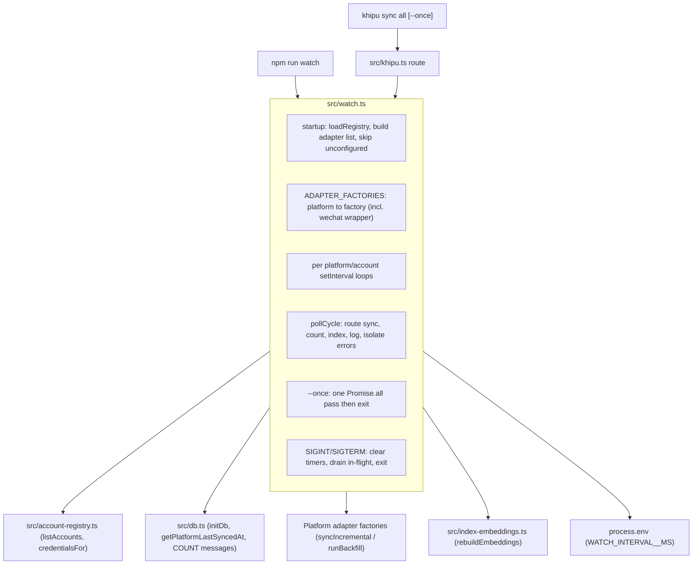
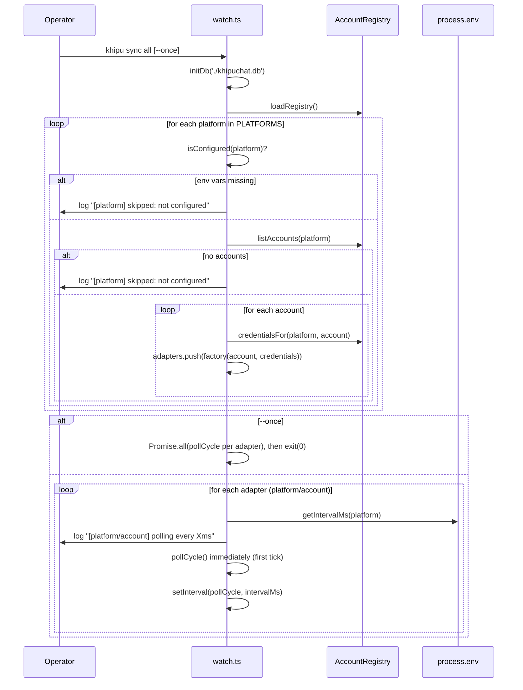
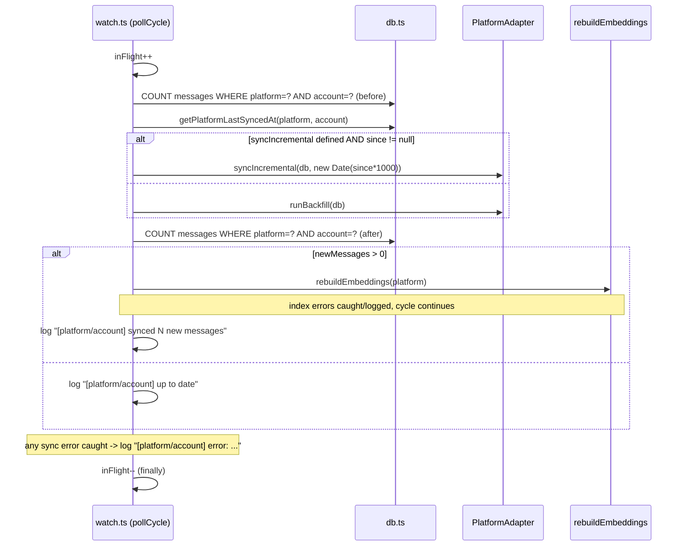

# Design Document: sync-watcher

## Overview

This feature adds a long-running polling daemon to KhipuChat, invoked via `khipu sync all` (with `npm run watch` as a thin wrapper during the transition). The daemon iterates every configured platform/account, polling each on a per-platform configurable interval. Each poll cycle selects `syncIncremental` when the adapter supports it and a prior sync state exists, otherwise falls back to `runBackfill`; when new messages are fetched, it runs the embedding indexing step so new messages become searchable without a manual pass. It logs results clearly, isolates per-platform/account errors, skips unconfigured platforms/accounts, and shuts down cleanly on SIGINT/SIGTERM. A `--once` flag performs a single sync+index pass and exits for cron-based scheduling.

**Purpose**: Eliminate the need for operators to manually run `khipu sync` or configure OS-level daemons to keep the message archive current across all platforms.

**Users**: KhipuChat operators running a self-hosted instance who want continuous, automatic message archiving.

**Impact**: Adds one new entry point (`src/watch.ts`), one `package.json` script, and one routing change in `src/khipu.ts` (routes `sync all` to the daemon). Adds a small `createWechatAdapter` factory so the platform loop is uniform. No adapter sync internals are modified.

### Goals

- Continuous incremental sync for all configured platforms/accounts via a single `khipu sync all` command.
- Per-platform polling interval configurable via environment variables with a sensible 5-minute default.
- Index newly synced messages within each cycle (sync then index then wait).
- Resilient: one platform/account failure does not affect others or crash the daemon.
- Single-pass `--once` mode for cron/scripts.
- Zero new dependencies: Node.js built-in timers and process signals only.

### Non-Goals

- Real-time push/webhook sync (still polling only).
- Modifying any `sync:*` scripts or platform adapter sync internals.
- Adding new platform adapters.
- Exposing a status endpoint or web UI for watcher state.
- Replacing the macOS LaunchAgent setup path (`src/setup-sync.ts`).
- Changing message storage, deduplication, FTS, or vector indexing logic.

---

## Boundary Commitments

### This Spec Owns

- `src/watch.ts` : the watcher entry point: platform/account registry loop, interval resolution, poll-cycle routing, per-cycle indexing trigger, message-count logging, error isolation, `--once` mode, and the shutdown handler.
- `package.json` `watch` script : the `tsx src/watch.ts` invocation.
- `src/khipu.ts` routing of `sync all` to `src/watch.ts`.
- Per-platform interval resolution via `WATCH_INTERVAL_<PLATFORM>_MS` env vars with a 5-minute default.
- Skip-if-unconfigured detection at startup (env-var check plus empty account list from the registry).
- The `createWechatAdapter` factory wrapper needed to make WeChat participate in the uniform factory loop.

### Out of Boundary

- Platform adapter sync internals (`src/platforms/*/sync.ts` sync logic) : not modified. Existing `create<Platform>Adapter` factories and the `wechatAdapter` singleton are consumed as-is.
- `src/db.ts`, the `sync_state` table, `getPlatformLastSyncedAt`, `setPlatformLastSyncedAt` : owned by `incremental-sync`. The watcher only reads `getPlatformLastSyncedAt` and reads the `messages` count.
- `PlatformAdapter.syncIncremental` interface : owned by `incremental-sync`.
- `src/index-embeddings.ts` / `rebuildEmbeddings` : owned by the embeddings subsystem. The watcher only calls it.
- `src/account-registry.ts` : owned upstream. The watcher only consumes `loadRegistry`, `listAccounts`, `credentialsFor`.
- `src/setup-sync.ts`, LaunchAgent setup, and individual `sync:*` scripts : unchanged.

### Allowed Dependencies

- `src/platforms/types.ts` : `PlatformAdapter`, `AdapterFactory`, `Platform` (read-only, no modification).
- `src/db.ts` : `initDb`, `getPlatformLastSyncedAt`, and a read-only `SELECT COUNT(*)` over `messages`.
- `src/account-registry.ts` : `loadRegistry`, `listAccounts`, `credentialsFor`.
- `src/index-embeddings.ts` : `rebuildEmbeddings`.
- `src/sync-all.ts` : `PLATFORMS` constant (the canonical ordered platform list).
- Each platform adapter factory module (`src/platforms/*/sync.ts`).
- Node.js built-ins: `process` (signals, env, argv), `setInterval`, `clearInterval`, `setTimeout`.
- `dotenv` : already in dependencies, loaded at entry.

### Revalidation Triggers

- If the `PlatformAdapter` or `AdapterFactory` contract changes (new required method, renamed `syncIncremental`, changed factory signature), `src/watch.ts` must revalidate.
- If `getPlatformLastSyncedAt` signature or unit semantics (currently Unix seconds) change, the poll-cycle routing must revalidate.
- If `rebuildEmbeddings` signature or platform-scoping semantics change, the indexing step must revalidate.
- If `AccountRegistry` (`listAccounts` / `credentialsFor`) shape changes, the startup loop must revalidate.
- If a new platform is added to `PLATFORMS` / the `Platform` union, the `ADAPTER_FACTORIES` map and `REQUIRED_ENV_VARS` in `src/watch.ts` must be extended.

---

## Architecture

### Existing Architecture Analysis

All platform adapters implement `PlatformAdapter` (`src/platforms/types.ts`) with `runBackfill`, `startListener`, and optionally `syncIncremental` (added by `incremental-sync`). Six of seven adapters export an `AdapterFactory` (`create<Platform>Adapter(account, credentials)`); WeChat exports only a `wechatAdapter` singleton, so the watcher wraps it in a factory to keep the loop uniform. `AccountRegistry` (`src/account-registry.ts`) is the canonical multi-account source: `listAccounts(platform)` returns `[]` for unconfigured platforms, providing a natural skip-if-unconfigured hook, and `credentialsFor(platform, account)` supplies credentials to each factory. `rebuildEmbeddings(platform)` (`src/index-embeddings.ts`) is the platform-scoped indexing sweep. The `khipu` binary routes subcommands through `src/khipu.ts`; `sync all` routes to `src/watch.ts`.

Because adapters own their own `sync_state` write-back on success, the watcher never writes sync state: it reads `getPlatformLastSyncedAt(platform, account)` to compute the incremental `since` and to decide the routing branch.

### Architecture Pattern & Boundary Map


```mermaid
flowchart TD
    CLI["khipu sync all [--once]"] --> Khipu[src/khipu.ts route]
    NPM["npm run watch"] --> Watch
    Khipu --> Watch[src/watch.ts]

    subgraph Watch [src/watch.ts]
        Startup["startup: loadRegistry, build adapter list, skip unconfigured"]
        Route["ADAPTER_FACTORIES: platform to factory (incl. wechat wrapper)"]
        PollLoop["per platform/account setInterval loops"]
        PollCycle["pollCycle: route sync, count, index, log, isolate errors"]
        Once["--once: one Promise.all pass then exit"]
        Shutdown["SIGINT/SIGTERM: clear timers, drain in-flight, exit"]
    end

    Watch --> Registry["src/account-registry.ts (listAccounts, credentialsFor)"]
    Watch --> DB["src/db.ts (initDb, getPlatformLastSyncedAt, COUNT messages)"]
    Watch --> Adapters["Platform adapter factories (syncIncremental / runBackfill)"]
    Watch --> Index["src/index-embeddings.ts (rebuildEmbeddings)"]
    Watch --> Env["process.env (WATCH_INTERVAL_<PLATFORM>_MS)"]
```

**Architecture Integration**:
- Selected pattern: Thin orchestrator. `src/watch.ts` coordinates loops and delegates all sync/index work to existing subsystems. No new abstraction layer, no state machine, no registry class.
- Domain boundaries: sync logic stays in adapters; state tracking stays in `sync_state`/`db.ts`; indexing stays in `index-embeddings.ts`; account resolution stays in `account-registry.ts`. The watcher only sequences them.
- Existing patterns preserved: `initDb` once at startup; `create<Platform>Adapter` factories; `AccountRegistry` iteration; `console.log`/`console.error` for operator-visible output with a `[platform/account]` prefix.
- New components rationale: `src/watch.ts` (the daemon) and a trivial `createWechatAdapter` wrapper (so the uniform factory map has no special case).
- Steering compliance: no new dependencies; `src/watch.ts` kept within the 200-line file limit; adapters call `db.ts` only.

### Technology Stack

| Layer | Choice / Version | Role in Feature | Notes |
|-------|------------------|-----------------|-------|
| CLI / Runtime | Node.js 20+ / tsx | Entry point execution | `khipu sync all` -> `tsx src/watch.ts` |
| Timer | Node.js `setInterval` / `clearInterval` | Per-platform/account polling loops | Built-in, no library |
| Signals | Node.js `process.on('SIGINT'/'SIGTERM')` | Graceful shutdown | Built-in |
| DB / Storage | better-sqlite3-multiple-ciphers ^11 | `initDb`, `getPlatformLastSyncedAt`, message count | Synchronous ops (existing constraint) |
| Indexing | `rebuildEmbeddings` (ONNX + sqlite-vec) | Post-cycle embedding index | Consumed, not owned |
| Accounts | `AccountRegistry` (`khipu.config.json` or legacy env) | Per-account iteration and credentials | Consumed, not owned |
| Config | `dotenv` | Load `.env` at startup | Already in dependencies |

---

## File Structure Plan

### Directory Structure

```
src/
└── watch.ts          # Watcher daemon entry point (<= 200 lines)
```

### Modified Files

- `package.json` : add `"watch": "tsx src/watch.ts"` to `scripts`.
- `src/khipu.ts` : route `sync all` to `src/watch.ts`; expose `--once` in usage.
- `src/platforms/wechat/sync.ts` : add a `createWechatAdapter` factory export (thin wrapper over the singleton) so `ADAPTER_FACTORIES` needs no WeChat special case. If not added there, the wrapper lives inline in `watch.ts`.

> Each file has one clear responsibility. `src/watch.ts` owns all daemon orchestration; adapter/registry/index/db modules are consumed unchanged.

---

## System Flows

### Startup and scheduling


```mermaid
sequenceDiagram
    participant Op as Operator
    participant W as watch.ts
    participant R as AccountRegistry
    participant Env as process.env

    Op->>W: khipu sync all [--once]
    W->>W: initDb('./khipuchat.db')
    W->>R: loadRegistry()
    loop for each platform in PLATFORMS
        W->>W: isConfigured(platform)?
        alt env vars missing
            W->>Op: log "[platform] skipped: not configured"
        else
            W->>R: listAccounts(platform)
            alt no accounts
                W->>Op: log "[platform] skipped: not configured"
            else
                loop for each account
                    W->>R: credentialsFor(platform, account)
                    W->>W: adapters.push(factory(account, credentials))
                end
            end
        end
    end
    alt --once
        W->>W: Promise.all(pollCycle per adapter), then exit(0)
    else
        loop for each adapter (platform/account)
            W->>Env: getIntervalMs(platform)
            W->>Op: log "[platform/account] polling every Xms"
            W->>W: pollCycle() immediately (first tick)
            W->>W: setInterval(pollCycle, intervalMs)
        end
    end
```

### Poll cycle (per platform/account, per interval)


```mermaid
sequenceDiagram
    participant W as watch.ts (pollCycle)
    participant DB as db.ts
    participant A as PlatformAdapter
    participant IX as rebuildEmbeddings

    W->>W: inFlight++
    W->>DB: COUNT messages WHERE platform=? AND account=?  (before)
    W->>DB: getPlatformLastSyncedAt(platform, account)
    alt syncIncremental defined AND since != null
        W->>A: syncIncremental(db, new Date(since*1000))
    else
        W->>A: runBackfill(db)
    end
    W->>DB: COUNT messages WHERE platform=? AND account=?  (after)
    alt newMessages > 0
        W->>IX: rebuildEmbeddings(platform)
        note over W,IX: index errors caught/logged, cycle continues
        W->>W: log "[platform/account] synced N new messages"
    else
        W->>W: log "[platform/account] up to date"
    end
    note over W: any sync error caught -> log "[platform/account] error: ..."
    W->>W: inFlight-- (finally)
```

Sync errors and index errors are both caught inside `pollCycle`; the cycle always resolves and `inFlight` is always decremented in `finally`, so a failing platform/account is retried on the next interval without affecting others.

### Graceful shutdown

```mermaid
sequenceDiagram
    participant OS as OS
    participant W as watch.ts

    OS->>W: SIGINT or SIGTERM
    W->>W: if shutdownRequested return; else set true
    W->>W: clearInterval for all timers
    W->>W: log "Watch daemon shutting down..."
    loop while inFlight > 0 and within 30s deadline
        W->>W: await 100ms
    end
    W->>W: log "Watch daemon stopped."
    W->>OS: process.exit(0)
```

---

## Requirements Traceability

| Requirement | Summary | Components | Interfaces | Flows |
|-------------|---------|------------|------------|-------|
| 1.1 | Startup log listing each platform/account and interval | main() startup loop | AccountRegistry.listAccounts | Startup flow |
| 1.2 | Skip unconfigured platform/account with one-time log | isConfigured + empty-account check | AccountRegistry.listAccounts | Startup flow |
| 1.3 | Immediate first poll on startup | main() (fire-and-forget pollCycle) | — | Startup flow |
| 1.4 | `npm run watch` behaves as `khipu sync all` | package.json script; khipu.ts route | — | Startup flow |
| 2.1 | Poll each platform/account at its interval | setInterval per adapter | — | Startup / Poll cycle |
| 2.2 | Log "synced N new messages" (account-scoped count) | pollCycle count delta | COUNT messages WHERE platform=? AND account=? | Poll cycle |
| 2.3 | Log "up to date" when no new messages | pollCycle | — | Poll cycle |
| 2.4 | Use syncIncremental when available and since exists | pollCycle routing | PlatformAdapter.syncIncremental, getPlatformLastSyncedAt | Poll cycle |
| 2.5 | Fall back to runBackfill | pollCycle routing | PlatformAdapter.runBackfill | Poll cycle |
| 2.6 | Iterate accounts per platform via registry | main() startup loop | AccountRegistry.listAccounts, credentialsFor, AdapterFactory | Startup flow |
| 3.1 | Catch and log per-platform/account errors | pollCycle try/catch | — | Poll cycle |
| 3.2 | One failure does not stop other loops | independent setInterval per adapter | — | Poll cycle |
| 3.3 | Failing platform/account retried each interval | setInterval continues | — | Poll cycle |
| 4.1 | Stop scheduling and drain in-flight on signal | shutdown handler | process signals | Shutdown flow |
| 4.2 | Log shutdown confirmation | shutdown handler | — | Shutdown flow |
| 5.1 | Read `WATCH_INTERVAL_<PLATFORM>_MS` | getIntervalMs | process.env | Startup flow |
| 5.2 | Default 5-minute interval | getIntervalMs (DEFAULT_INTERVAL_MS) | process.env | Startup flow |
| 5.3 | Use env value (ms) when a positive integer | getIntervalMs | process.env | Startup flow |
| 6.1 | Index after cycles that fetch new messages | pollCycle indexing step | rebuildEmbeddings | Poll cycle |
| 6.2 | Skip indexing when no new messages | pollCycle (newMessages > 0 guard) | — | Poll cycle |
| 6.3 | Isolate indexing errors like sync errors | pollCycle inner try/catch | — | Poll cycle |
| 7.1 | `--once`: one sync+index pass then exit | main() once branch | — | Startup flow |
| 7.2 | Emit completion log and exit on `--once` | main() once branch | — | Startup flow |
| 7.3 | `--once` continues past per-platform errors | per-adapter try/catch in Promise.all | — | Startup flow |

---

## Components and Interfaces

### Summary

| Component | Layer | Intent | Req Coverage | Key Dependencies | Contracts |
|-----------|-------|--------|--------------|------------------|-----------|
| watch.ts `main` | Runtime / Orchestrator | Build adapter list, skip unconfigured, schedule loops or run `--once` | 1.1–1.4, 2.1, 2.6, 7.1–7.3 | AccountRegistry, ADAPTER_FACTORIES, process.argv | State |
| `getIntervalMs` | watch.ts helper | Resolve per-platform interval from env with default | 5.1, 5.2, 5.3 | process.env | Service |
| `isConfigured` | watch.ts helper | Detect whether a platform has required credentials | 1.2 | process.env, REQUIRED_ENV_VARS | Service |
| `pollCycle` | watch.ts helper | One sync+index cycle for one adapter, with error isolation and count logging | 2.2–2.5, 3.1–3.3, 6.1–6.3 | PlatformAdapter, db.ts, rebuildEmbeddings | Service, State |
| `shutdown` | watch.ts | Clear timers, drain in-flight, exit | 4.1, 4.2 | process signals | State |
| `ADAPTER_FACTORIES` | watch.ts map | Map each `Platform` to its `AdapterFactory` (WeChat via wrapper) | 2.6 | Platform adapter factories | — |

---

### Watcher Entry Point (watch.ts)

| Field | Detail |
|-------|--------|
| Intent | Orchestrate per-platform/account polling: build adapter list, skip unconfigured, schedule intervals or run one `--once` pass, handle shutdown |
| Requirements | 1.1, 1.2, 1.3, 1.4, 2.1, 2.6, 7.1, 7.2, 7.3, 4.1, 4.2 |

**Responsibilities & Constraints**
- Load `.env` via `dotenv` at the top of the file; call `initDb('./khipuchat.db')` once.
- Call `loadRegistry()` and iterate `PLATFORMS` (the canonical ordered list from `sync-all.ts`).
- For each platform: skip with a one-time log if `isConfigured(platform)` is false OR `listAccounts(platform)` is empty.
- For each configured account: build the adapter via `ADAPTER_FACTORIES[platform](account, credentialsFor(platform, account))` and push to the active list.
- `ADAPTER_FACTORIES` maps every `Platform` (including `signal` and a `wechat` wrapper over the singleton) so the loop has no special cases.
- If `process.argv` includes `--once`: run one `pollCycle` per adapter via `Promise.all` (each wrapped in its own try/catch), log completion, `process.exit(0)`.
- Otherwise, for each adapter: resolve `getIntervalMs(platform)`, log `[platform/account] polling every Xms`, fire one immediate `pollCycle` (fire-and-forget), and register `setInterval`, storing the timer handle.
- Register `SIGINT`/`SIGTERM` handlers that drain and exit.
- Total file length must not exceed 200 lines; no new npm dependencies.

**Contracts**: State [✓] (per-adapter interval timers, `inFlight` counter, `shutdownRequested` flag)

##### Service Interface

```typescript
// Internal helpers within src/watch.ts

export const DEFAULT_INTERVAL_MS = 300_000 // 5 minutes

/** Returns the polling interval in ms for the given platform. */
export function getIntervalMs(platform: Platform): number
// reads process.env[`WATCH_INTERVAL_${platform.toUpperCase()}_MS`];
// returns the parsed integer when finite and > 0, else DEFAULT_INTERVAL_MS.

/** Returns true if the platform appears configured (credentials present). */
export function isConfigured(platform: Platform): boolean
// local-only platforms (imessage, whatsapp, wechat) -> true;
// otherwise true iff at least one of REQUIRED_ENV_VARS[platform] is a non-empty string.

/** Executes one sync+index cycle for the adapter; catches and logs all errors. */
export async function pollCycle(
  adapter: PlatformAdapter,
  database: Database.Database
): Promise<void>
// never throws; always increments/decrements inFlight.

// Map from platform to adapter factory (wechat wrapped so it satisfies AdapterFactory).
const ADAPTER_FACTORIES: Record<Platform, AdapterFactory>
```

**Implementation Notes**
- **Account-scoped message count (Req 2.2)**: count `SELECT COUNT(*) FROM messages WHERE platform = ? AND account = ?` bound to `adapter.platform` and `adapter.account` before and after the sync. Account scoping is required because multiple accounts of the same platform run concurrently; a platform-only count over-/under-reports each account's delta. `newMessages = countAfter - countBefore`.
- **Routing (Req 2.4/2.5)**: `since = getPlatformLastSyncedAt(adapter.platform, adapter.account)` (Unix seconds or `null`). Call `syncIncremental(db, new Date(since * 1000))` when `adapter.syncIncremental !== undefined && since !== null`; otherwise `runBackfill(db)`.
- **Indexing (Req 6.1–6.3)**: when `newMessages > 0`, call `rebuildEmbeddings(adapter.platform)` inside its own try/catch that logs `[platform/account] index error: <msg>` and continues. Skip indexing entirely when `newMessages === 0`. Sequence is sync -> index -> log -> return (then the interval waits).
- **Error isolation (Req 3.1–3.3)**: the whole cycle body is wrapped in try/catch logging `[platform/account] error: <msg>` to stderr; `inFlight++`/`inFlight--` bracket the body via `finally` so shutdown drain is never blocked by a failed cycle.
- **Startup log (Req 1.1)**: include the account, `[platform/account] polling every Xms`, so multi-account setups are distinguishable.
- **Shutdown (Req 4.1/4.2)**: on first signal set `shutdownRequested`, `clearInterval` every stored timer, log the shutting-down line, poll `inFlight` every 100ms until zero or a 30s deadline, log the stopped line, then `process.exit(0)`.

---

## Data Models

No new data models. The watcher reads `sync_state` via `getPlatformLastSyncedAt(platform, account)` (owned by `incremental-sync`) and performs a read-only `COUNT(*)` over the existing `messages` table scoped by `platform` and `account`. It never writes `sync_state`: that stays with each adapter's success path.

---

## Error Handling

### Error Strategy

Per-platform/account errors (sync and index) are caught inside `pollCycle` and logged; they never propagate to the top-level event loop. The daemon keeps running regardless of individual failures, and each failing pair is retried on its next interval.

### Error Categories and Responses

**Unconfigured platform/account (startup)**:
- Detected by `isConfigured(platform) === false` or `listAccounts(platform).length === 0`.
- Log: `[platform] skipped: not configured (missing credentials)`. Not an error; exit code unaffected.

**Sync error (runtime)**:
- Caught in `pollCycle` outer try/catch. Log: `[platform/account] error: <message>` to stderr.
- `setInterval` continues; the pair is retried on the next tick. `inFlight` decremented in `finally`.

**Index error (runtime)**:
- Caught in the inner try/catch around `rebuildEmbeddings`. Log: `[platform/account] index error: <message>`.
- The cycle still resolves normally (same isolation as sync errors).

**`--once` per-platform error**:
- Each adapter's `pollCycle` in the `Promise.all` pass is wrapped so one failure logs `[platform] once-pass error: <message>` and the remaining platforms still complete before exit.

**initDb failure (startup)**:
- Not caught: fatal, non-zero exit. Rationale: no DB means no sync is possible.

**Shutdown drain timeout**:
- If in-flight cycles do not finish within 30 seconds, `process.exit(0)` is called anyway to avoid hanging. Safe because `sync_state.last_synced_at` is only written by the adapter on success.

### Monitoring

- All logs go to stdout/stderr via `console.log`/`console.error` (compatible with LaunchAgent/Docker log redirection).
- Log format: `[platform/account] <message>` for easy grep filtering.

---

## Testing Strategy

### Unit Tests

- `getIntervalMs`: returns `300000` when the env var is unset; returns the parsed value when the env var is a positive integer string; returns `300000` when the env var is non-numeric or non-positive (Req 5.1–5.3).
- `isConfigured`: returns `false` when a network platform's required env vars are all empty; returns `true` when at least one is present; returns `true` for local-only platforms (imessage, whatsapp, wechat) (Req 1.2).
- `pollCycle` routing: calls `syncIncremental` when the adapter defines it and `getPlatformLastSyncedAt` returns a number; calls `runBackfill` when `syncIncremental` is absent (Req 2.4, 2.5).
- `pollCycle` counting: logs `synced N new messages` when the account-scoped count increases and `up to date` when it does not (Req 2.2, 2.3).
- `pollCycle` isolation: when sync throws, the error is logged and the promise resolves; `inFlight` returns to its prior value regardless of success or error (Req 3.1).
- `pollCycle` indexing: `rebuildEmbeddings` is called only when `newMessages > 0` and skipped otherwise; when indexing throws, the cycle still resolves and logs an index error (Req 6.1, 6.2, 6.3).

### Integration Tests

- Startup skip: with a mock registry of one configured and one unconfigured platform/account, the configured pair's `pollCycle` runs immediately and the unconfigured pair is skipped with a log (Req 1.2, 1.3).
- Error isolation across pairs: if one adapter throws on every poll, a second adapter's cycles still execute normally (Req 3.2, 3.3).
- Single-pass mode: running with `--once` executes exactly one pass over all configured pairs, logs completion, and exits without scheduling intervals; a throwing adapter does not prevent the others from completing (Req 7.1, 7.2, 7.3).
- Graceful shutdown: on a simulated SIGINT, every timer is cleared and the process exits after in-flight cycles complete, emitting both shutdown log lines (Req 4.1, 4.2).

---

## Migration Strategy

No schema migrations. `src/watch.ts` is a pure addition; `package.json` gains a `watch` script; `src/khipu.ts` routes `sync all` to the daemon; `src/platforms/wechat/sync.ts` gains a small `createWechatAdapter` factory export. Existing `sync:*` scripts, `src/sync-all.ts`, and adapter sync internals are untouched, so `npm run sync` and the LaunchAgent path continue to work unchanged.
