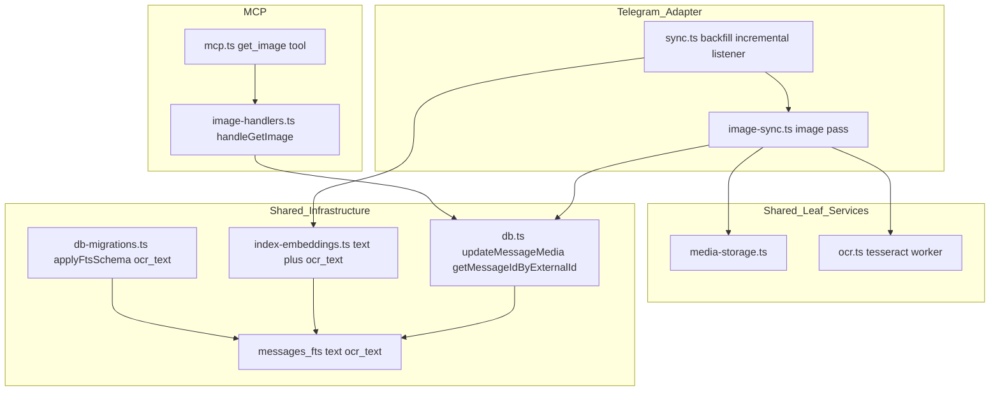
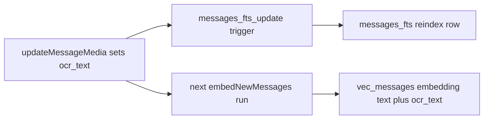

# Design Document

## Overview

**Purpose**: This feature makes Telegram image content visible to search, semantic search, and MCP clients by downloading photo messages to local storage, extracting their text via OCR, feeding that text into the full-text and semantic indexes, and exposing a `get_image` MCP tool.

**Users**: KhipuChat operators gain persistent local image archives; KhipuChat users and Claude agents gain the ability to find and inspect image messages by their visible text and by natural-language intent.

**Impact**: Telegram photo messages are currently inserted with `text = null` and `media_file_path = null`, leaving them invisible to every query surface. This feature adds a download + OCR pass to the Telegram sync flow, one new `messages.ocr_text` column, an `ocr_text` column in the FTS index, an extension of the embedding pipeline to consume `ocr_text`, and a new MCP tool. The media storage helper, OCR module, and `get_image` tool are built platform-agnostically so downstream Signal/WeChat specs can reuse them without owning them.

### Goals
- Download Telegram photos during backfill, incremental sync, and the live listener, storing them under a platform-agnostic path convention.
- Extract OCR text best-effort and persist it in a new nullable `ocr_text` column.
- Make `ocr_text` discoverable through `search_messages` (FTS) and `semantic_search_messages` (embeddings).
- Expose a `get_image` MCP tool returning file path, base64 content, and `ocr_text`.
- Keep image download and OCR strictly best-effort: individual failures are logged and skipped without interrupting the sync run.

### Non-Goals
- Image sync for any other platform (Signal, iMessage, WhatsApp, WeChat download, Discord, Slack, email).
- Video, voice-note, and sticker handling; image editing, compression, or format conversion.
- CLI and Web UI surfaces for `get_image` (deferred to a later agent-native-parity spec).
- Re-embedding of messages that were already embedded from `text` before `ocr_text` existed (explicitly excluded by 5.4).

## Boundary Commitments

### This Spec Owns
- The Telegram image download pass across all three sync paths (backfill, incremental, live listener).
- The platform-agnostic media storage convention and helper (`src/media-storage.ts`).
- The platform-agnostic OCR module (`src/ocr.ts`).
- The `messages.ocr_text` schema migration and the `messages_fts` two-column migration.
- Extension of the FTS index and embedding pipeline to consume `ocr_text`.
- The `get_image` MCP tool and its handler.
- Git ignore and Docker volume configuration for the media directory.

### Out of Boundary
- Any non-Telegram platform's image download (downstream specs are consumers, not co-owners, of `media-storage.ts`, `ocr.ts`, and `get_image`).
- The existing `media_file_path`, `media_url`, `media_width`, `media_height` columns' definition (owned by wechat-image-sync; reused as-is, no redefinition).
- OCR language configuration, accuracy tuning, and non-image media types.
- CLI/Web surfaces for image retrieval.

### Allowed Dependencies
- `src/db.ts` shared functions (the only DB entry point for adapters) — extended here with `updateMessageMedia` and `getMessageIdByExternalId`.
- `src/db-migrations.ts` migration helpers (`columnExists`, new `applyFtsSchema`).
- The GramJS `TelegramClient.downloadMedia` API (already available, never previously called).
- `tesseract.js` (new dependency) for WASM OCR — consistent with the local-only, no-external-API steering principle.
- Node.js `fs`/`path` builtins for storage.

### Revalidation Triggers
Downstream specs (Signal, WeChat download) or the search/embedding subsystems must re-check integration if any of these change:
- The `storeMedia` signature or the `media/<platform>/<chat_id>/<external_id>.<ext>` path convention.
- The `extractText` signature or its `string | null` failure contract.
- The `updateMessageMedia` field set.
- The FTS column list (`text, ocr_text`) or the embedding input composition rule.
- The `get_image` request/response shape.

## Architecture

### Existing Architecture Analysis

- **Adapter isolation**: Platform adapters call `src/db.ts` exports only; they never touch schema directly (steering `structure.md`). This design adds two `db.ts` functions and keeps all Telegram-specific logic under `src/platforms/telegram/`.
- **Synchronous DB, async OCR**: DB operations are synchronous (`better-sqlite3`). OCR and Telegram downloads are async. The image pass is an `async` function that interleaves sync DB writes with awaited downloads/OCR — matching the existing pattern where `embedNewMessages` (async) is awaited inside the sync loop.
- **FTS is external-content, rebuilt at startup**: `messages_fts` indexes only `messages`, and `initDb()` runs `rebuild` unconditionally after migrations, so FTS schema changes are safe to apply by drop-and-recreate.
- **200-line file limit**: `sync.ts` (363 lines) and `query-handlers.ts` (258 lines) already exceed it; new logic lands in new files rather than growing them.

### Architecture Pattern & Boundary Map

Selected pattern: **shared leaf services + platform-specific orchestrator**. `media-storage.ts` and `ocr.ts` are dependency-free leaf modules; the Telegram `image-sync.ts` orchestrator composes them with the GramJS client and `db.ts`. This keeps the reusable pieces free of Telegram coupling (3.5, 2.1).



**Architecture Integration**:
- Dependency direction: `types/config` → `db` / `media-storage` / `ocr` (leaf) → `image-sync` / `index-embeddings` → `mcp` / handlers → runtime. No module imports upward; `media-storage` and `ocr` import only Node builtins + `tesseract.js`.
- Existing patterns preserved: adapter-calls-db-only, external-content FTS with startup rebuild, async-embed-inside-sync-loop, `columnExists` migration guards.
- New components rationale: storage + OCR are new capabilities with no existing home; a Telegram orchestrator keeps `sync.ts` under control; a dedicated MCP handler file respects the line limit.

### Technology Stack

| Layer | Choice / Version | Role in Feature | Notes |
|-------|------------------|-----------------|-------|
| CLI / MCP | `@modelcontextprotocol/sdk` (existing) | Registers and dispatches `get_image` | stdio only |
| Services | `tesseract.js` ^5 (new) | WASM OCR, no native binary, no external API | Self-typed (>=4); lazy singleton worker |
| Services | `telegram` ^2.22 (existing) | `client.downloadMedia(msg)` returns `Buffer` | Raw GramJS msg required |
| Data / Storage | `better-sqlite3-multiple-ciphers` (existing) | `ocr_text` column, FTS two-column table, `updateMessageMedia` | Synchronous |
| Data / Storage | Node `fs`/`path` (builtin) | Deterministic media file writes | `mkdirSync({recursive:true})` |
| Infrastructure | Docker Compose + `.gitignore` (existing) | Persistent `media-data` volume; exclude `media/` from git | 2.3, 2.4 |

## File Structure Plan

### New Files
```
src/
├── media-storage.ts        # Platform-agnostic media path + write helper (2.1, 2.2)
├── ocr.ts                  # Platform-agnostic tesseract.js wrapper, singleton worker (3.5)
├── image-handlers.ts       # handleGetImage: read file, base64, ocr_text (6.1-6.4)
└── platforms/telegram/
    └── image-sync.ts       # Telegram image pass: download + OCR + persist (1.1-1.6, 3.1-3.4, 7.1-7.3)
```

### Modified Files
- `src/db.ts` — Add `ocr_text` to `Message`/`MessageRow` interface and `messages` DDL; use shared `applyFtsSchema` for the two-column FTS table; add `updateMessageMedia()` and `getMessageIdByExternalId()`. (3.3, 4.1, 4.3)
- `src/db-migrations.ts` — Add `ocr_text` column migration; add `applyFtsSchema(db)` (table + insert/delete/update triggers); add FTS-recreate guard that drops the stale one-column table + triggers when `ocr_text` is absent from `messages_fts`. (3.3, 4.1, 7.4)
- `src/index-embeddings.ts` — Extend the unindexed-message predicate to include `ocr_text`; build embedding input from `text` + `ocr_text`; consolidate the shared predicate/columns. (5.1, 5.3, 5.4)
- `src/platforms/telegram/sync.ts` — After each per-chat insert loop and before `embedNewMessages`, invoke the image pass in all three paths (backfill, incremental, listener). (1.1-1.3)
- `src/config.ts` — Add `mediaDir` (env `MEDIA_DIR`, default `<root>/media`). (2.1)
- `src/mcp.ts` — Register `get_image` in the tools list and dispatch to `handleGetImage`. (6.1)
- `docker-compose.yml` — Add named `media-data` volume mounted at `/app/media` on `web` and `sync`. (2.4)
- `.gitignore` — Add `media/`. (2.3)
- `README.md` — Document `get_image` in the MCP tools list. (6.5)
- `package.json` — Add `tesseract.js` dependency. (3.5)

Each file has one responsibility; `media-storage.ts`, `ocr.ts`, and `image-handlers.ts` carry no Telegram coupling so downstream specs reuse them directly.

## System Flows

### Telegram image pass (backfill / incremental)

```mermaid
sequenceDiagram
    participant Loop as sync insert loop
    participant Pass as image-sync pass
    participant TG as TelegramClient
    participant Store as media-storage
    participant OCR as ocr
    participant DB as db.ts
    participant Embed as embedNewMessages
    Loop->>Loop: insertMessage(row) for each msg
    Loop->>Pass: processImageMessages(client, chatId, imageMsgs)
    loop each image msg
        Pass->>DB: getMessageIdByExternalId(chatId, externalId)
        Pass->>DB: read media_file_path (skip if set)
        Pass->>TG: downloadMedia(msg)
        alt download ok
            Pass->>Store: storeMedia(platform chatId externalId ext buffer)
            Pass->>OCR: extractText(path)
            Pass->>DB: updateMessageMedia(id, path,w,h,ocr_text)
        else download or OCR fails
            Pass->>Pass: log error, continue
        end
        Pass->>Pass: sleep(rateLimitMs)
    end
    Loop->>Embed: embedNewMessages([chatId])
```

Key decisions: the image pass runs after the insert loop but before `embedNewMessages`, so freshly-OCR'd rows are embedded in the same run (5.1). Idempotency is enforced by skipping any message whose `media_file_path` is already set (1.4) and, for OCR, whose `ocr_text` is already non-null (3.4). A per-image `sleep` bounds the Telegram request rate (7.1). Every download/OCR failure is caught, logged, and skipped (1.5, 3.2, 7.2). The live listener calls the same `processImageMessages` with a single-element array — no batching, no rate concern.

### OCR text becomes searchable (FTS + embeddings)



The `AFTER UPDATE OF ocr_text` trigger keeps FTS current inside long-running processes (4.1); the startup `rebuild` covers restarts. The embedding pass picks the row up because image rows have `text = null` and are absent from `vec_messages` until `ocr_text` is set (5.1).

## Requirements Traceability

| Requirement | Summary | Components | Interfaces | Flows |
|-------------|---------|------------|------------|-------|
| 1.1, 1.2, 1.3 | Download on backfill/incremental/listener | image-sync.ts, sync.ts | `processImageMessages` | Image pass |
| 1.4 | Skip already-downloaded | image-sync.ts, db.ts | `getMessageIdByExternalId`, media_file_path read | Image pass |
| 1.5 | Download failure logged & skipped | image-sync.ts | try/catch per image | Image pass |
| 1.6 | Record path + width/height | image-sync.ts, db.ts | `updateMessageMedia` | Image pass |
| 2.1, 2.2 | Platform-agnostic path + mkdir | media-storage.ts, config.ts | `storeMedia`, `mediaDir` | Image pass |
| 2.3, 2.4 | git ignore + Docker volume | .gitignore, docker-compose.yml | — | — |
| 3.1, 3.2, 3.4 | OCR best-effort, skip re-OCR | image-sync.ts, ocr.ts | `extractText` | Image pass |
| 3.3 | `ocr_text` migration | db.ts, db-migrations.ts | column migration | — |
| 3.5 | OCR platform-agnostic | ocr.ts | `extractText` | — |
| 4.1, 4.2, 4.3 | FTS includes ocr_text | db.ts, db-migrations.ts | `applyFtsSchema`, triggers | FTS/embeddings |
| 5.1, 5.2, 5.3, 5.4 | Semantic includes ocr_text, no regen | index-embeddings.ts | shared predicate, combined input | FTS/embeddings |
| 6.1-6.4 | get_image tool | mcp.ts, image-handlers.ts | `handleGetImage` | — |
| 6.5 | README documentation | README.md | — | — |
| 7.1 | Rate limiting | image-sync.ts | per-image sleep | Image pass |
| 7.2 | Continue on failure | image-sync.ts | try/catch | Image pass |
| 7.3 | No side effects on text/embeddings | db.ts | `updateMessageMedia` writes only media/ocr fields | — |
| 7.4 | Migration safe on populated DB | db-migrations.ts | `columnExists` guard, FTS drop+rebuild | — |

## Components and Interfaces

| Component | Domain/Layer | Intent | Req Coverage | Key Dependencies (P0/P1) | Contracts |
|-----------|--------------|--------|--------------|--------------------------|-----------|
| media-storage.ts | Shared leaf | Deterministic media path + write | 2.1, 2.2 | Node fs/path (P0), config (P1) | Service |
| ocr.ts | Shared leaf | WASM OCR text extraction | 3.1, 3.5 | tesseract.js (P0) | Service |
| db.ts additions | Data | Persist media/ocr fields, id lookup, FTS schema | 1.6, 3.3, 4.1, 7.3 | better-sqlite3 (P0), db-migrations (P0) | Service, State |
| db-migrations.ts additions | Data | ocr_text + FTS migration | 3.3, 4.1, 7.4 | better-sqlite3 (P0) | Batch |
| index-embeddings.ts changes | Data | Embed text + ocr_text | 5.1, 5.3, 5.4 | embeddings, vec-db (P0) | Service |
| image-sync.ts | Telegram adapter | Orchestrate download + OCR + persist | 1.1-1.6, 3.1-3.4, 7.1-7.3 | media-storage, ocr, db (P0), TelegramClient (P0) | Service |
| image-handlers.ts | MCP | Return image content + ocr_text | 6.1-6.4 | db, fs (P0) | Service |
| mcp.ts change | MCP | Register/dispatch get_image | 6.1 | image-handlers (P0) | API |

### Shared Leaf Services

#### media-storage.ts

| Field | Detail |
|-------|--------|
| Intent | Compute a platform-agnostic media path and write bytes to disk |
| Requirements | 2.1, 2.2 |

**Responsibilities & Constraints**
- Owns the path convention `<mediaDir>/<platform>/<chat_id>/<external_id>.<ext>`.
- Creates parent directories with `fs.mkdirSync(dir, { recursive: true })` before writing (2.2).
- No platform coupling; caller supplies `platform`, `chatId`, `externalId`, `ext`, and `data` (3.5-aligned reuse).

**Dependencies**
- Outbound: `config.mediaDir` — storage root (P1)
- External: Node `fs`, `path` — filesystem (P0)

**Contracts**: Service [x]

```typescript
export interface StoreMediaInput {
  platform: string
  chatId: number | string
  externalId: string
  ext: string          // e.g. 'jpg' — caller-provided so other platforms pass their own
  data: Buffer
}
// Returns the absolute path written; throws on write failure (caller catches).
export function storeMedia(input: StoreMediaInput): string
export function mediaPathFor(input: Omit<StoreMediaInput, 'data'>): string
```
- Preconditions: `data` is a non-empty Buffer; `ext` has no leading dot.
- Postconditions: file exists at the returned absolute path; parent dirs created.
- Invariants: same inputs always resolve to the same path (idempotent overwrite).

#### ocr.ts

| Field | Detail |
|-------|--------|
| Intent | Extract text from an image best-effort via a shared tesseract.js worker |
| Requirements | 3.1, 3.2, 3.5 |

**Responsibilities & Constraints**
- Lazily initializes a single `tesseract.js` worker per process and reuses it (avoids ~500ms init per image).
- Returns extracted text, or `null` on any failure after logging (never throws to the caller) (3.2).
- Platform-agnostic: accepts a file path or Buffer only (3.5).

**Dependencies**
- External: `tesseract.js` — WASM OCR engine (P0)

**Contracts**: Service [x]

```typescript
// Returns trimmed OCR text, or null if extraction yields nothing or fails.
export async function extractText(input: string | Buffer): Promise<string | null>
// Terminates the singleton worker; called at process shutdown.
export async function terminateOcr(): Promise<void>
```
- Preconditions: `input` references a readable image.
- Postconditions: returns non-empty string or `null`; worker remains alive for reuse.
- Invariants: at most one worker instance per process.

**Implementation Notes**
- Integration: `terminateOcr()` is invoked after the sync run completes so the process can exit cleanly.
- Validation: empty/whitespace OCR output normalizes to `null` so downstream `IS NOT NULL` checks stay meaningful.
- Risks: OCR latency dominates the image pass; acceptable because it is best-effort and off the insert path.

### Data Layer

#### db.ts additions

| Field | Detail |
|-------|--------|
| Intent | Persist media/ocr fields post-insert, resolve message id, own two-column FTS schema |
| Requirements | 1.6, 3.3, 4.1, 4.3, 7.3 |

**Responsibilities & Constraints**
- `updateMessageMedia` writes only `media_file_path`, `media_width`, `media_height`, `ocr_text` — never `text`, embeddings, or other fields (7.3).
- `getMessageIdByExternalId` resolves the auto-increment id from the unique `(external_id, chat_id)` key.
- `createSchema` delegates FTS DDL to `applyFtsSchema` and adds `ocr_text TEXT` to the `messages` table.

**Contracts**: Service [x] / State [x]

```typescript
export interface MediaUpdate {
  media_file_path?: string | null
  media_width?: number | null
  media_height?: number | null
  ocr_text?: string | null
}
// Updates only the provided media/ocr fields for the given message id.
export function updateMessageMedia(id: number, fields: MediaUpdate): void
// Returns the message id for a (chat_id, external_id) pair, or null if absent.
export function getMessageIdByExternalId(chatId: number, externalId: string): number | null
```
- Preconditions: `id` references an existing message (no-op if absent).
- Postconditions: only supplied columns change; unspecified columns retained (partial update via COALESCE-style set on provided keys).
- Invariants: `text` and `vec_messages` are never touched here (7.3).

**Implementation Notes**
- Integration: `Message`/`MessageRow` gain `ocr_text?: string | null`; `insertMessage` still inserts image rows with `text=null, ocr_text=null` (unchanged path).
- Validation: `updateMessageMedia` builds its SET clause from the keys actually present in `fields`.

#### db-migrations.ts additions

| Field | Detail |
|-------|--------|
| Intent | Add `ocr_text` and migrate the FTS table to two columns, loss-free |
| Requirements | 3.3, 4.1, 7.4 |

**Responsibilities & Constraints**
- Add `ocr_text TEXT` via `columnExists` guard (idempotent, leaves existing rows untouched) (3.3, 7.4).
- `applyFtsSchema(db)` owns the FTS table + `messages_fts_insert`/`messages_fts_delete`/`messages_fts_update` triggers over `(text, ocr_text)`.
- FTS recreate guard: when `messages_fts` lacks an `ocr_text` column, `DROP TABLE messages_fts` and its two legacy triggers, then call `applyFtsSchema`. Startup `rebuild` (db.ts:96) repopulates automatically — no data loss (7.4).

**Contracts**: Batch [x]

```typescript
// Shared FTS DDL used by createSchema (fresh DB) and the migration (existing DB).
export function applyFtsSchema(db: Database.Database): void
```
- Trigger: `initDb()` on every startup.
- Idempotency: column guard + `columnExists(db,'messages_fts','ocr_text')` guard make re-runs no-ops.
- Recovery: FTS is rebuilt from `messages` on every startup, so a partially applied FTS migration self-heals.

**Implementation Notes**
- Migration ordering: `createSchema` runs before `runMigrations`; on an existing DB the new FTS definition is skipped by `IF NOT EXISTS`, so the migration must itself recreate the FTS objects via `applyFtsSchema`.
- The `messages_fts_update` trigger issues an FTS `'delete'` with OLD values then an insert with NEW values (required for external-content FTS5). It fires only `AFTER UPDATE OF ocr_text`, so the `is_sender`-only conflict update in `insertMessage` does not trigger spurious reindexing.

#### index-embeddings.ts changes

| Field | Detail |
|-------|--------|
| Intent | Include image messages once OCR text exists; embed text + ocr_text together |
| Requirements | 5.1, 5.2, 5.3, 5.4 |

**Responsibilities & Constraints**
- Extend every unindexed-message predicate (5 sites) from `text IS NOT NULL AND text != ''` to `((text IS NOT NULL AND text != '') OR (ocr_text IS NOT NULL AND ocr_text != ''))`.
- Compose embedding input as `[row.text, row.ocr_text].filter(Boolean).join(' ')` (5.3).
- Preserve idempotency via the existing `id NOT IN (SELECT rowid FROM vec_messages)` guard — no regeneration for already-embedded rows (5.4).

**Contracts**: Service [x]

**Implementation Notes**
- Integration: consolidate the shared WHERE predicate and the `SELECT id, text, ocr_text` column list into module constants so the five call sites stay consistent.
- Validation: image rows (`text=null`) enter the index only after `ocr_text` is set, so they appear as unindexed exactly once (5.1).
- Risks: a message previously embedded from a caption will not be re-embedded when `ocr_text` is later added; this is the accepted 5.4 trade-off. `rebuildEmbeddings(platform, force=true)` remains the full-reindex escape hatch.

### Telegram Adapter

#### image-sync.ts

| Field | Detail |
|-------|--------|
| Intent | Download image photos, OCR them, and persist results best-effort |
| Requirements | 1.1-1.6, 3.1-3.4, 7.1-7.3 |

**Responsibilities & Constraints**
- Consumes raw GramJS image messages collected during the sync insert loop; for each, resolves the DB id, skips if `media_file_path` is set (1.4), downloads via `client.downloadMedia`, stores via `storeMedia`, OCRs via `extractText` (only when `ocr_text` is null, 3.4), and persists via `updateMessageMedia` (1.6).
- Extracts `media_width`/`media_height` from the largest `msg.media.photo.sizes[]` entry where available (1.6).
- Wraps each image in try/catch: any download or OCR failure is logged and skipped, leaving `media_file_path`/`ocr_text` unset (1.5, 3.2, 7.2).
- Sleeps a configurable interval between downloads to avoid Telegram rate limits (7.1).

**Dependencies**
- Outbound: `storeMedia`, `extractText`, `updateMessageMedia`, `getMessageIdByExternalId` (P0)
- External: `TelegramClient.downloadMedia(msg)` → `Buffer | undefined` (P0)

**Contracts**: Service [x]

```typescript
// Processes image messages for one chat: download -> store -> OCR -> persist.
// Never throws; each image's failure is isolated and logged.
export async function processImageMessages(
  client: TelegramClient,
  chatId: number,
  imageMsgs: RawTelegramMessage[],
  sleep?: (ms: number) => Promise<void>,
): Promise<void>
```
- Preconditions: `imageMsgs` are `detectType(msg) === 'image'` messages already inserted into `messages`.
- Postconditions: each successfully processed message has `media_file_path` set and `ocr_text` set-or-null; failures leave both unset.
- Invariants: runs before `embedNewMessages([chatId])` in the same sync path so OCR'd rows embed in the same run.

**Implementation Notes**
- Integration: `sync.ts` collects image `msg` objects during the insert loop and passes them here after the loop, in all three paths. The listener passes a single-element array.
- Validation: the raw GramJS msg is cast through `unknown` to a minimal typed shape for `downloadMedia`; the buffer output uses the default in-memory return.
- Risks: msg objects are held in memory per chat (bounded by page size, 100–200); acceptable.

### MCP

#### image-handlers.ts / mcp.ts change

| Field | Detail |
|-------|--------|
| Intent | Return image file path, base64 content, and ocr_text for a message id |
| Requirements | 6.1, 6.2, 6.3, 6.4 |

**Responsibilities & Constraints**
- `handleGetImage(messageId)` reads the message row; if `media_file_path` is null or the file is missing on disk, returns an error indicating the image is unavailable (6.3); otherwise base64-encodes the file (6.2) and includes `ocr_text` with an availability flag when null (6.4).
- `mcp.ts` registers the tool and dispatches to the handler (6.1).

**Contracts**: Service [x] / API [x]

```typescript
export interface GetImageResult {
  message_id: number
  file_path: string
  content_base64: string
  ocr_text: string | null
  ocr_available: boolean   // false when ocr_text is null (6.4)
}
export async function handleGetImage(messageId: number): Promise<GetImageResult>
```

##### API Contract
| Tool | Input | Output | Errors |
|------|-------|--------|--------|
| get_image | `{ message_id: number }` | `GetImageResult` (JSON in MCP text content) | message not found; image not available (no `media_file_path` or file missing) |

**Implementation Notes**
- Integration: dispatch mirrors existing handlers (`else if (name === 'get_image') result = await handleGetImage(Number(args['message_id']))`).
- Validation: unavailable-image conditions throw a descriptive `Error`, consistent with the existing unknown-tool error path; the SDK surfaces it to the client (6.3).
- Risks: base64 of a multi-MB JPEG travels over stdio; acceptable per 6.1, typical size 100 KB–2 MB.

## Error Handling

### Error Strategy
- **Best-effort media pipeline**: every download and OCR call is individually guarded; failures log to stderr and are skipped so the sync run always completes (1.5, 3.2, 7.2).
- **Migration safety**: `columnExists` guards make the `ocr_text` and FTS migrations idempotent; the FTS drop+recreate is loss-free because startup `rebuild` repopulates from `messages` (7.4).
- **MCP retrieval**: missing message / missing file / null `media_file_path` produce descriptive errors (6.3); null `ocr_text` is a success with `ocr_available: false` (6.4).

### Error Categories and Responses
- **Transient external (Telegram/OCR)**: log and skip the single image; retried on the next sync run because `media_file_path`/`ocr_text` remain unset.
- **Client errors (get_image)**: image-not-available and message-not-found returned as MCP errors.
- **System (filesystem)**: `storeMedia` write failure propagates to the per-image try/catch in the pass and is treated as a skipped download.

### Monitoring
- Failures log with message id and phase (`[tg-image] download`/`[ocr]`) to stderr, matching the existing `[embed]` logging convention.

## Testing Strategy

### Unit Tests
- `media-storage.storeMedia` writes to `<mediaDir>/telegram/<chat>/<external>.jpg`, creates missing parent dirs, and returns the absolute path (2.1, 2.2).
- `ocr.extractText` returns `null` (not throw) on an unreadable/garbage input and reuses a single worker across calls (3.2, 3.5).
- `db.updateMessageMedia` sets only media/ocr columns and leaves `text` and other fields unchanged (7.3).
- `db-migrations` FTS guard: on a DB with a one-column `messages_fts`, migration recreates it with `ocr_text` and search over OCR text works after startup rebuild (4.1, 7.4).

### Integration Tests
- Image pass on an in-memory DB: a fake client returns a buffer, an image message gets `media_file_path` + `ocr_text` set, and a re-run skips it (1.1, 1.4, 1.6, 3.4).
- Best-effort isolation: a download that throws leaves `media_file_path` unset and does not abort processing of a following image in the same batch (1.5, 7.2).
- FTS discovery: after `ocr_text` is set, `searchMessages('<ocr term>')` returns the image message even though `text` is null (4.2, 4.3).
- Semantic discovery: an image message with only `ocr_text` is embedded on the next `embedNewMessages` run and returned by `semantic_search_messages`; a message already in `vec_messages` is not re-embedded (5.1, 5.4).

### E2E Tests
- `get_image` for a stored image returns base64 content and `ocr_text` (6.1, 6.2); for a message with null `ocr_text` returns content with `ocr_available: false` (6.4); for a message with no `media_file_path` returns an image-not-available error (6.3).

## Performance & Scalability
- **Off the hot path**: downloads and OCR run after the insert loop, so message ingestion latency is unchanged (7.1, 7.3).
- **OCR worker reuse**: one `tesseract.js` worker per process amortizes the ~500ms WASM init across all images.
- **Rate limiting**: a per-image sleep (default configurable) keeps Telegram download volume below MTProto limits (7.1).

## Security Considerations
- Consistent with the local-only steering principle: `tesseract.js` performs OCR in-process via WASM with no external API calls; downloaded media stays on local disk under `mediaDir`, excluded from git (2.3) and persisted only in the Docker volume (2.4).
