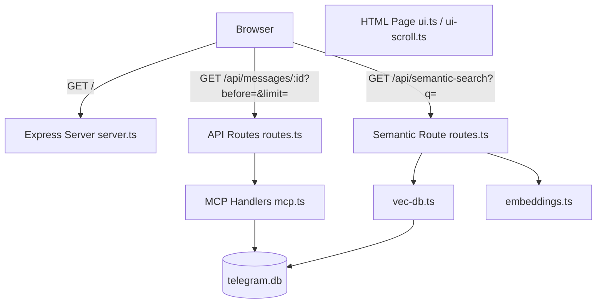
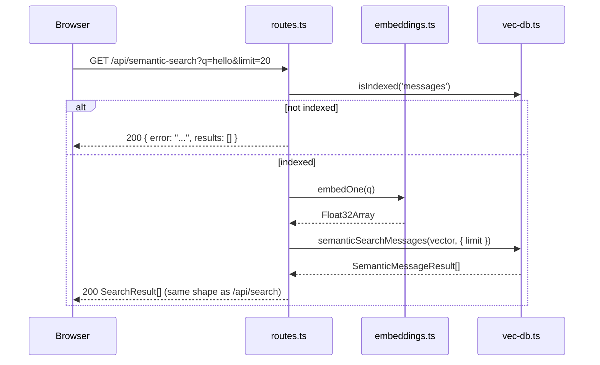

# Design Document — web-ui-enhancements

## Overview

This feature enhances the existing KhipuChat web UI with two focused improvements: proper chat-window scroll behavior (paginated messages, auto-scroll to newest, load-older on scroll-up) and a semantic search toggle backed by a new API route. Both improvements are confined to `src/web/routes.ts` and `src/web/ui.ts` — the two files already owned by the `web-ui` spec.

**Purpose**: Deliver a usable chat-browsing experience (correct scroll layout, paged history) and expose the already-implemented semantic search capability to browser users.

**Users**: Local users of the KhipuChat web UI who want to scroll through large chat histories and search by meaning rather than exact keywords.

**Impact**: Modifies the existing `/api/messages/:chatId` route to support pagination and adds a new `/api/semantic-search` route. The UI gains an IntersectionObserver-driven scroll manager and a search-mode toggle, both in vanilla JS.

### Goals

- Oldest messages at top, newest at bottom; auto-scroll to bottom on thread open.
- Infinite-scroll-upward: prepend older pages without scroll jump.
- Surface semantic search in the browser with a simple keyword/semantic pill toggle.
- Zero new dependencies; no build step; no changes outside `src/web/`.

### Non-Goals

- Infinite scroll downward or real-time message push.
- Sending messages on any platform.
- Redesigning the full UI layout, sidebar, or platform badges.
- Changes to `src/embeddings.ts`, `src/index-embeddings.ts`, `src/mcp.ts`, or DB schema.
- Mobile-optimised layout.

---

## Boundary Commitments

### This Spec Owns

- Pagination logic on `GET /api/messages/:chatId` (`?before=<id>&limit=<n>`).
- New `GET /api/semantic-search?q=<query>&limit=<n>` route.
- Scroll management in the thread view (auto-scroll to bottom, IntersectionObserver sentinel, scroll-anchor restore after prepend).
- Keyword/semantic search mode toggle in the search bar area.
- Splitting `src/web/routes.ts` or `src/web/ui.ts` into sub-modules if the 200-line limit is breached.

**Modified files owned by this spec:**
- `src/web/routes.ts` — extend `GET /api/messages/:chatId` with `?before=<timestamp>` and `?limit=<n>` query params; add `GET /api/semantic-search` handler.
- `src/web/ui.ts` — search toggle markup/JS; import and embed `SCROLL_JS`.
- `src/web/ui-scroll.ts` (new) — scroll management JS string constant.

### Out of Boundary

- `src/vec-db.ts` — `semanticSearchMessages`, `semanticFindContacts`, `isIndexed` consumed read-only; signatures must not change.
- `src/mcp.ts` — MCP tool definitions untouched.
- `src/web/server.ts` — Express app factory and `initDb` call untouched.
- `src/web/icons.ts` — untouched.
- Database schema — no new tables or columns.
- `src/embeddings.ts`, `src/index-embeddings.ts` — untouched.

### Allowed Dependencies

- `src/web/routes.ts` already depends on `src/mcp.ts` handlers and `src/db.ts`; this spec adds a dependency on `src/vec-db.ts` (`semanticSearchMessages`, `isIndexed`) and `src/embeddings.ts` (`embedOne`) for the semantic search route.
- `src/web/ui.ts` — vanilla JS only; no new server-side imports.

### Revalidation Triggers

- Signature changes to `semanticSearchMessages` or `isIndexed` in `src/vec-db.ts`.
- Signature change to `embedOne` in `src/embeddings.ts`.
- Changes to `handleListMessages` in `src/mcp.ts` (affects pagination response shape).
- Changes to `SearchResult` / `MessageResult` types (affects UI rendering).
- Port or bind-address changes in `src/web/server.ts`.

---

## Architecture

### Existing Architecture Analysis

`src/web/routes.ts` currently exposes three routes (`/api/chats`, `/api/search`, `/api/messages/:chatId`) by delegating to `src/mcp.ts` handlers. `src/web/ui.ts` exports a single `HTML_PAGE` string constant (vanilla JS SPA). The 200-line per-file rule means `ui.ts` at 233 lines is already at the limit; adding substantial JS will require extracting a helper module. `routes.ts` at 53 lines has room to absorb two route additions cleanly.

### Architecture Pattern & Boundary Map



**Dependency direction**: `db.ts` → `mcp.ts` / `vec-db.ts` → `routes.ts` → `server.ts`. `ui.ts` / `ui-scroll.ts` have no server-side imports.

### Technology Stack

| Layer | Choice | Role | Notes |
|-------|--------|------|-------|
| HTTP server | Express v4 (existing) | Route mounting | No change |
| Data access — messages | `src/mcp.ts` `handleListMessages` | Paginated message query | Signature extended; see component detail |
| Data access — semantic | `src/vec-db.ts` `semanticSearchMessages` + `isIndexed` | Semantic kNN query | Read-only |
| Embedding | `src/embeddings.ts` `embedOne` | Query vectorization | Read-only |
| UI | Inline HTML/CSS/vanilla JS | SPA scroll + toggle | No framework, no build step |

---

## File Structure Plan

### Modified Files

- `src/web/routes.ts` — Add `?before` + `?limit` pagination to `/api/messages/:chatId`; add `GET /api/semantic-search` handler. Stays under 200 lines (currently 53 L + ~40 L additions = ~93 L).
- `src/web/ui.ts` — Add keyword/semantic toggle markup and JS; refactor scroll logic. Currently 233 L — extract scroll helpers to `src/web/ui-scroll.ts` to keep each file under 200 lines.

### New Files

```
src/web/
└── ui-scroll.ts   # Exported JS snippet string: IntersectionObserver sentinel logic,
                   # scroll-to-bottom helper, scroll-anchor-restore helper.
                   # Inlined into HTML_PAGE by ui.ts at build-read time.
```

> `ui-scroll.ts` exports a `SCROLL_JS: string` constant (raw JS for inclusion in the `<script>` block). It has no server-side runtime imports — same pattern as `ui.ts`.

### Directory Structure (web/)

```
src/web/
├── server.ts      # Unchanged
├── routes.ts      # Modified: pagination + semantic-search route
├── ui.ts          # Modified: toggle markup/JS, imports SCROLL_JS from ui-scroll.ts
├── ui-scroll.ts   # New: scroll management JS string constant
└── icons.ts       # Unchanged
```

---

## System Flows

### Paginated Thread Load (initial open)

```mermaid
sequenceDiagram
    participant B as Browser
    participant R as routes.ts
    participant H as mcp.ts handleListMessages

    B->>R: GET /api/messages/42 (no before, limit=50)
    R->>H: handleListMessages(42, { limit: 50 })
    H-->>R: { messages: MessageResult[], has_more: boolean }
    R-->>B: 200 JSON
    Note over B: render messages; scrollIntoView(lastMessage)
```

### Infinite Scroll — Load Older

```mermaid
sequenceDiagram
    participant B as Browser
    participant R as routes.ts

    Note over B: User scrolls up; IntersectionObserver fires on top sentinel
    B->>B: record firstVisibleMessageId; show loading indicator
    B->>R: GET /api/messages/42?before=<firstId>&limit=50
    R-->>B: 200 JSON { messages, has_more }
    Note over B: prepend messages; restore scroll to firstVisibleMessage
    Note over B: if !has_more: remove sentinel
```

### Semantic Search



---

## Requirements Traceability

| Requirement | Summary | Component | File |
|-------------|---------|-----------|------|
| 1.1 | Accept `before` + `limit` params | API Routes | routes.ts |
| 1.2 | Default: last `limit` messages | API Routes | routes.ts |
| 1.3 | Invalid `before` → 400 | API Routes | routes.ts |
| 1.4 | Invalid `limit` → 400 | API Routes | routes.ts |
| 1.5 | `has_more` in response | API Routes + mcp.ts | routes.ts |
| 2.1 | Auto-scroll to bottom on chat select | UI Page | ui.ts, ui-scroll.ts |
| 2.2 | Scroll after render | UI Page | ui-scroll.ts |
| 2.3 | Re-scroll on re-select | UI Page | ui-scroll.ts |
| 3.1 | Fetch older on scroll-up | UI Page | ui-scroll.ts |
| 3.2 | Loading indicator + debounce | UI Page | ui-scroll.ts |
| 3.3 | Restore scroll position after prepend | UI Page | ui-scroll.ts |
| 3.4 | Remove sentinel when no more | UI Page | ui-scroll.ts |
| 3.5 | Error + retry on fetch failure | UI Page | ui-scroll.ts |
| 4.1 | `/api/semantic-search` route | API Routes | routes.ts |
| 4.2 | Empty `q` → 200 `[]` | API Routes | routes.ts |
| 4.3 | Index not built → 200 error object | API Routes | routes.ts |
| 4.4 | Search failure → 500 | API Routes | routes.ts |
| 4.5 | `limit` param on semantic route | API Routes | routes.ts |
| 5.1 | Keyword/semantic toggle control | UI Page | ui.ts |
| 5.2 | Keyword mode → `/api/search` | UI Page | ui.ts |
| 5.3 | Semantic mode → `/api/semantic-search` | UI Page | ui.ts |
| 5.4 | Semantic results same render as keyword | UI Page | ui.ts |
| 5.5 | Display index-not-built error | UI Page | ui.ts |
| 5.6 | Mode persists across searches | UI Page | ui.ts |
| 6.1 | No external JS libs / no build step | UI Page | ui.ts, ui-scroll.ts |
| 6.2 | Files under 200 lines | All web files | routes.ts, ui.ts, ui-scroll.ts |
| 6.3 | Semantic search ≤ 3 s | API Routes | routes.ts (delegates to vec-db) |
| 6.4 | No external network from browser | UI Page | ui.ts |

---

## Components and Interfaces

### Summary

| Component | Layer | Intent | Req Coverage | Contracts |
|-----------|-------|--------|--------------|-----------|
| API Routes (`routes.ts`) | HTTP | Pagination on messages route + new semantic-search route | 1.x, 4.x, 6.3 | API |
| UI Page (`ui.ts`) | UI | Search toggle markup + mode-aware search fetch | 5.x, 6.x | — |
| Scroll Manager (`ui-scroll.ts`) | UI | Thread scroll behavior, IntersectionObserver, scroll-anchor restore | 2.x, 3.x, 6.1 | — |

---

### HTTP Layer

#### API Routes — Pagination Extension (`routes.ts`)

| Field | Detail |
|-------|--------|
| Intent | Extend `GET /api/messages/:chatId` with `?before` and `?limit`; validate params; return `has_more` |
| Requirements | 1.1, 1.2, 1.3, 1.4, 1.5 |

**Responsibilities & Constraints**
- Parse `before` as a positive integer; reject with 400 if present and invalid.
- Parse `limit` as a positive integer ≤ 100 (default 50); reject with 400 if invalid.
- Delegate to `handleListMessages(chatId, { before, limit })` — this function must be extended to accept pagination options and return `{ messages: MessageResult[], has_more: boolean }`.
- All existing behaviour (400 on non-integer chatId, 500 on handler error) preserved.

**Contracts**: API [ x ]

| Method | Path | Query/Params | Response | Errors |
|--------|------|-------------|----------|--------|
| GET | /api/messages/:chatId | `before?` (int), `limit?` (int, 1–100, default 50) | `{ messages: MessageResult[], has_more: boolean }` | 400 (bad param), 500 |

**Implementation Notes**
- `handleListMessages` in `src/mcp.ts` must be updated to support `{ before?: number; limit?: number }` options and return `{ messages, has_more }`. This is a signature extension inside the `web-ui` ownership boundary; the web-ui-enhancements spec coordinates this change.
- Risk: `handleListMessages` currently returns `MessageResult[]` directly. The response shape change to `{ messages, has_more }` is a breaking change for the existing web test. Update `tests/web.test.ts` accordingly.

---

#### API Routes — Semantic Search (`routes.ts`)

| Field | Detail |
|-------|--------|
| Intent | New route: embed query, call `semanticSearchMessages`, return same shape as `/api/search` |
| Requirements | 4.1, 4.2, 4.3, 4.4, 4.5 |

**Responsibilities & Constraints**
- `GET /api/semantic-search`: validate `q` and `limit`.
- If `q` missing/empty: respond `200 []`.
- Call `isIndexed('messages')`; if false: respond `200 { error: "...", results: [] }`.
- Call `embedOne(q)` then `semanticSearchMessages(vector, { limit })`.
- Map `SemanticMessageResult[]` to `SearchResult[]` shape (same fields as `/api/search`).
- Catch all errors → `500 { error: message }`.

**Contracts**: API [ x ]

| Method | Path | Query | Response | Errors |
|--------|------|-------|----------|--------|
| GET | /api/semantic-search | `q` (string), `limit?` (int, 1–100, default 20) | `SearchResult[]` or `{ error, results: [] }` | 400, 500 |

**Dependencies**
- Outbound: `src/vec-db.ts` — `isIndexed`, `semanticSearchMessages` (P0)
- Outbound: `src/embeddings.ts` — `embedOne` (P0)

**Consumed Interface — `src/vec-db.ts`**

| Item | Detail |
|------|--------|
| Import path | `../vec-db` |
| `isIndexed` signature | `isIndexed(table: 'chats' \| 'messages'): boolean` |
| `semanticSearchMessages` signature | `semanticSearchMessages(queryVector: Float32Array, filters: MessageFilters): SemanticMessageResult[]` |
| `MessageFilters` shape | `{ chat_id?: number; platform?: Platform; before_timestamp?: number; after_timestamp?: number; limit?: number }` — route passes `{ limit }` only |
| `SemanticMessageResult` shape | `{ chat_id: number; chat_name: string; sender_name: string \| null; text: string \| null; timestamp: number; platform: Platform; distance: number }` |
| Mapping to `SearchResult` | Drop `distance`; coerce `sender_name ?? ''` and `text ?? ''`; pass remaining fields through unchanged |

**Implementation Notes**
- `SemanticMessageResult` fields: `chat_id`, `chat_name`, `sender_name`, `text`, `timestamp`, `platform`, `distance`. Map to `SearchResult`: `{ chat_id, chat_name, sender_name: sender_name ?? '', text: text ?? '', timestamp, platform }`. Drop `distance` from the API response (not part of `SearchResult`).
- `embedOne` is `async`; the route handler must be `async`.

---

### UI Layer

#### UI Page — Search Toggle (`ui.ts`)

| Field | Detail |
|-------|--------|
| Intent | Add pill toggle (keyword/semantic) to search bar; wire mode to conditional fetch URL |
| Requirements | 5.1, 5.2, 5.3, 5.4, 5.5, 5.6, 6.1, 6.4 |

**Responsibilities & Constraints**
- Toggle is a `<button>` pair or single pill rendered inside the existing search bar container.
- JS state variable `searchMode: 'keyword' | 'semantic'` (default `'keyword'`).
- On search submit: if `searchMode === 'keyword'` fetch `/api/search?q=`; else fetch `/api/semantic-search?q=`.
- On semantic result: check for `error` field; if present render error banner instead of empty list.
- Render semantic results with the same HTML template as keyword results (sender, text, timestamp, platform badge, click-to-load-thread).
- `searchMode` persists in JS module state; does not require `localStorage`.
- No external CSS or JS resources.

**Implementation Notes**
- Keep `ui.ts` under 200 lines by extracting scroll JS to `ui-scroll.ts` (imported as a string constant and embedded in the `<script>` block).
- Toggle styling: two adjacent `<button>` elements styled as a pill with `.active` class on the selected mode.

---

#### Scroll Manager (`ui-scroll.ts`)

| Field | Detail |
|-------|--------|
| Intent | Exports `SCROLL_JS: string` — vanilla JS code string embedded in the HTML page's `<script>` block by `ui.ts` |
| Requirements | 2.1, 2.2, 2.3, 3.1, 3.2, 3.3, 3.4, 3.5, 6.1 |

**Responsibilities & Constraints**
- `scrollToBottom(container)`: scrolls `container` to `scrollHeight` after a `requestAnimationFrame` (ensures DOM is painted before scroll, satisfying Req 2.2).
- IntersectionObserver on a top sentinel `<div id="scroll-sentinel">`: fires when sentinel enters the viewport.
- Observer callback: if `isFetching` flag is set, skip (Req 3.2). Otherwise: record `firstVisibleMessage` (first `.message` element in DOM), set `isFetching = true`, show loading indicator, call `loadOlderMessages(chatId, oldestMessageId)`.
- `loadOlderMessages`: fetches `GET /api/messages/:chatId?before=<oldestId>&limit=50`. On success: prepend messages to thread, restore scroll to `firstVisibleMessage.scrollIntoView()` with `{ block: 'start' }` (Req 3.3). On `has_more === false`: disconnect observer, remove sentinel (Req 3.4). On error: show inline error with retry button (Req 3.5).
- All state (`isFetching`, `currentObserver`) scoped to the `openThread(chatId)` closure to avoid cross-chat contamination.
- No imports; pure self-contained JS string.

**Implementation Notes**
- Sentinel element inserted as the first child of the thread container when a thread is opened.
- IntersectionObserver threshold `0` with `rootMargin: '100px'` (pre-loads one page before the user reaches the very top).
- On thread switch: disconnect and null out the previous observer before creating a new one.
- Risk: `scrollIntoView` with `{ block: 'start' }` may scroll the page body on some browsers. Use `container.scrollTop = firstVisible.offsetTop - container.offsetTop` as fallback.

---

## Error Handling

| Error | Response | Requirement |
|-------|----------|-------------|
| Non-integer or negative `before` | HTTP 400 `{ error: 'invalid before parameter' }` | 1.3 |
| Non-integer, negative, or > 100 `limit` | HTTP 400 `{ error: 'invalid limit parameter' }` | 1.4 |
| Embedding index not built | HTTP 200 `{ error: '...', results: [] }` | 4.3 |
| `embedOne` or `semanticSearchMessages` throws | HTTP 500 `{ error: message }` | 4.4 |
| Older-message fetch fails in browser | Inline error + retry button in thread view | 3.5 |
| Semantic search returns error object | Error banner in search results panel | 5.5 |

---

## Testing Strategy

### Unit Tests (`tests/web.test.ts` additions)

- `GET /api/messages/1?limit=2` returns 2 messages and a `has_more` field.
- `GET /api/messages/1?before=99999` returns an empty array and `has_more: false`.
- `GET /api/messages/1?before=abc` returns 400.
- `GET /api/messages/1?limit=200` returns 400.
- `GET /api/semantic-search` (no `q`) returns 200 `[]`.
- `GET /api/semantic-search?q=hello` returns 200 results array when index is built.
- `GET /api/semantic-search?q=hello` returns 200 `{ error, results: [] }` when index not built.
- `GET /api/semantic-search?q=hello&limit=abc` returns 400.

### UI Tests (manual / browser)

- Selecting a chat: thread scrolls to bottom; oldest message is at top.
- Scrolling to the top: older messages are prepended; view does not jump.
- When all messages are loaded: sentinel disappears and further scrolling does not trigger fetches.
- Switching search mode to semantic: search calls `/api/semantic-search`; results render identically.
- Switching back to keyword: search calls `/api/search`.
- Semantic search with no index: error banner appears.

### Integration Regression

- All existing `tests/web.test.ts` tests still pass (no route regression).
- `GET /api/messages/:chatId` without pagination params continues to return messages (backward-compatible default).
