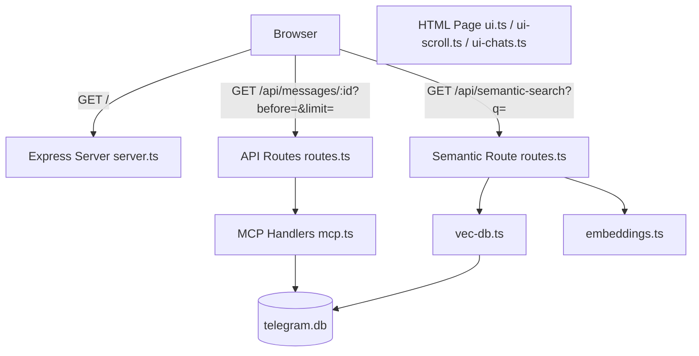
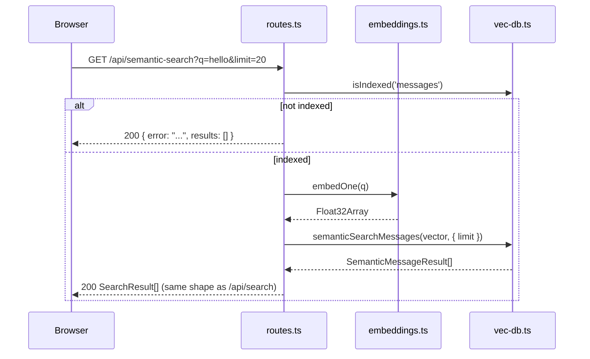

# Design Document — web-ui-enhancements

## Overview

This feature enhances the existing KhipuChat web UI with two focused improvements: proper chat-window scroll behavior (paginated messages, auto-scroll to newest, load-older on scroll-up) and a semantic search toggle backed by a new API route. Both improvements are confined to `src/web/routes.ts` and `src/web/ui.ts` — the two files already owned by the `web-ui` spec.

**Purpose**: Deliver a usable chat-browsing experience (correct scroll layout, paged history) and expose the already-implemented semantic search capability to browser users.

**Users**: Local users of the KhipuChat web UI who want to scroll through large chat histories and search by meaning rather than exact keywords.

**Impact**: Modifies the existing `/api/messages/:chatId` route to support pagination and adds a new `/api/semantic-search` route. The UI gains an IntersectionObserver-driven scroll manager and a search-mode toggle, both in vanilla JS. To keep every web file under 200 lines, UI JavaScript is split into two extracted string modules (`ui-scroll.ts`, `ui-chats.ts`) that `ui.ts` inlines into the page.

> **Design revision (post-implementation gap analysis, 2026-07-13):** After partial implementation all server-side routes are complete and passing, but three client-side defects were found (see `research.md`). This design has been updated to specify the corrected approach: (a) `ui.ts` must extract chat-list/account-filter code into a new `ui-chats.ts` to satisfy the 200-line limit; (b) the scroll manager must own message insertion relative to the sentinel (iterating in reverse) so the sentinel stays the container's first child and batch order is preserved; (c) the IntersectionObserver must scope its `root` to the scroll container, not the viewport.

### Goals

- Oldest messages at top, newest at bottom; auto-scroll to bottom on thread open.
- Infinite-scroll-upward: prepend older pages without scroll jump.
- Surface semantic search in the browser with a simple keyword/semantic pill toggle.
- Zero new dependencies; no build step; no changes outside `src/web/`.

### Non-Goals

- Infinite scroll downward or real-time message push.
- Sending messages on any platform.
- Redesigning the full UI layout, sidebar, or platform badges.
- Changes to `src/embeddings.ts`, `src/index-embeddings.ts`, `src/mcp.ts`, or DB schema.
- Mobile-optimised layout.

---

## Boundary Commitments

### This Spec Owns

- Pagination logic on `GET /api/messages/:chatId` (`?before=<id>&limit=<n>`).
- New `GET /api/semantic-search?q=<query>&limit=<n>` route.
- Scroll management in the thread view (auto-scroll to bottom, IntersectionObserver sentinel, scroll-anchor restore after prepend).
- Keyword/semantic search mode toggle in the search bar area.
- Splitting `src/web/routes.ts` or `src/web/ui.ts` into sub-modules if the 200-line limit is breached.

**Modified files owned by this spec:**
- `src/web/routes.ts` — extend `GET /api/messages/:chatId` with `?before=<timestamp>` and `?limit=<n>` query params; add `GET /api/semantic-search` handler.
- `src/web/ui.ts` — search toggle markup/JS; import and embed `SCROLL_JS` and `CHATS_JS`; orchestrate thread open + search. Must stay under 200 lines.
- `src/web/ui-scroll.ts` (new) — scroll management JS string constant.
- `src/web/ui-chats.ts` (new) — `buildAccountFilterHtml` server helper + `CHATS_JS` string constant (platform-filter and chat-list rendering), extracted from `ui.ts` to satisfy the 200-line limit.

### Out of Boundary

- `src/vec-db.ts` — `semanticSearchMessages`, `semanticFindContacts`, `isIndexed` consumed read-only; signatures must not change.
- `src/mcp.ts` — MCP tool definitions untouched.
- `src/web/server.ts` — Express app factory and `initDb` call untouched.
- `src/web/icons.ts` — untouched.
- Database schema — no new tables or columns.
- `src/embeddings.ts`, `src/index-embeddings.ts` — untouched.

### Allowed Dependencies

- `src/web/routes.ts` already depends on `src/mcp.ts` handlers and `src/db.ts`; this spec adds a dependency on `src/vec-db.ts` (`semanticSearchMessages`, `isIndexed`) and `src/embeddings.ts` (`embedOne`) for the semantic search route.
- `src/web/ui.ts` — vanilla JS only; no new server-side imports.

### Revalidation Triggers

- Signature changes to `semanticSearchMessages` or `isIndexed` in `src/vec-db.ts`.
- Signature change to `embedOne` in `src/embeddings.ts`.
- Changes to `handleListMessages` in `src/mcp.ts` (affects pagination response shape).
- Changes to `SearchResult` / `MessageResult` types (affects UI rendering).
- Port or bind-address changes in `src/web/server.ts`.

---

## Architecture

### Existing Architecture Analysis

`src/web/routes.ts` currently exposes three routes (`/api/chats`, `/api/search`, `/api/messages/:chatId`) by delegating to `src/mcp.ts` handlers. `src/web/ui.ts` builds the vanilla-JS SPA page as a template literal. The 200-line per-file rule means `ui.ts` cannot hold all of the scroll, chat-list, account-filter, and search-toggle code at once. Scroll JS was extracted to `ui-scroll.ts`, but that alone left `ui.ts` at 256 lines (over the limit); a second extraction of the chat-list/account-filter code into `ui-chats.ts` is required to bring it back under 200. `routes.ts` at 135 lines has absorbed both route changes cleanly and stays under the limit.

### Architecture Pattern & Boundary Map


```mermaid
graph TB
    Browser[Browser]
    Server[Express Server server.ts]
    Routes[API Routes routes.ts]
    SemanticRoute[Semantic Route routes.ts]
    UI[HTML Page ui.ts / ui-scroll.ts / ui-chats.ts]
    MCP[MCP Handlers mcp.ts]
    VecDb[vec-db.ts]
    Embed[embeddings.ts]
    DB[(telegram.db)]

    Browser -->|GET /| Server
    Browser -->|GET /api/messages/:id?before=&limit=| Routes
    Browser -->|GET /api/semantic-search?q=| SemanticRoute
    Routes --> MCP
    SemanticRoute --> VecDb
    SemanticRoute --> Embed
    MCP --> DB
    VecDb --> DB
```

**Dependency direction**: `db.ts` → `mcp.ts` / `vec-db.ts` → `routes.ts` → `server.ts`. `ui-scroll.ts` and `ui-chats.ts` export plain string/HTML helpers with no server-side runtime imports; `ui.ts` imports them and inlines their output into the page.

### Technology Stack

| Layer | Choice | Role | Notes |
|-------|--------|------|-------|
| HTTP server | Express v4 (existing) | Route mounting | No change |
| Data access — messages | `src/mcp.ts` `handleListMessages` | Paginated message query | Signature extended; see component detail |
| Data access — semantic | `src/vec-db.ts` `semanticSearchMessages` + `isIndexed` | Semantic kNN query | Read-only |
| Embedding | `src/embeddings.ts` `embedOne` | Query vectorization | Read-only |
| UI — page shell | `src/web/ui.ts` | Page markup, search toggle, thread orchestration | Inlines `SCROLL_JS` + `CHATS_JS`; < 200 lines |
| UI — scroll | `src/web/ui-scroll.ts` `SCROLL_JS` | IntersectionObserver sentinel + scroll helpers | No framework, no build step |
| UI — chat list | `src/web/ui-chats.ts` `CHATS_JS` + `buildAccountFilterHtml` | Platform-filter / chat-list rendering + account-filter markup | Extracted from `ui.ts` for 200-line limit |

---

## File Structure Plan

### Modified Files

- `src/web/routes.ts` — Add `?before` + `?limit` pagination to `/api/messages/:chatId`; add `GET /api/semantic-search` handler. Implemented at 135 L; under 200 lines.
- `src/web/ui.ts` — Keyword/semantic toggle markup + JS, thread-open orchestration; inlines `SCROLL_JS` and `CHATS_JS`. Currently 256 L (over limit) — extract chat-list/account-filter code to `src/web/ui-chats.ts` to bring it back to ~195 L. `ui.ts` passes a message-**builder** callback (not a DOM-prepend callback) to `attachScrollSentinel`.

### New Files

```
src/web/
├── ui-scroll.ts   # Exported JS snippet string: IntersectionObserver sentinel logic
│                  # (root = scroll container), scroll-to-bottom helper,
│                  # reverse-order insertion relative to the sentinel, scroll-anchor
│                  # restore. Inlined into the page by ui.ts.
└── ui-chats.ts    # buildAccountFilterHtml(accounts, selectedAccount): string (server
                   # helper) + CHATS_JS: string (platform-filter + chat-list rendering).
                   # Extracted from ui.ts to keep every web file under 200 lines.
```

> Both `ui-scroll.ts` and `ui-chats.ts` export raw-JS `string` constants (`SCROLL_JS`, `CHATS_JS`) for inclusion in the `<script>` block; `ui-chats.ts` additionally exports the `buildAccountFilterHtml` server-side helper. Neither has server-side runtime imports beyond `ui-chats.ts` re-using `./icons` for platform labels if needed.

### Directory Structure (web/)

```
src/web/
├── server.ts      # Unchanged
├── routes.ts      # Modified: pagination + semantic-search route
├── ui.ts          # Modified: toggle markup/JS, thread orchestration; inlines SCROLL_JS + CHATS_JS
├── ui-scroll.ts   # New: scroll management JS string constant
├── ui-chats.ts    # New: chat-list/account-filter rendering (CHATS_JS + buildAccountFilterHtml)
└── icons.ts       # Unchanged
```

---

## System Flows

### Paginated Thread Load (initial open)

```mermaid
sequenceDiagram
    participant B as Browser
    participant R as routes.ts
    participant H as mcp.ts handleListMessages

    B->>R: GET /api/messages/42 (no before, limit=50)
    R->>H: handleListMessages(42, { limit: 50 })
    H-->>R: { messages: MessageResult[], has_more: boolean }
    R-->>B: 200 JSON
    Note over B: render messages; scrollIntoView(lastMessage)
```

### Infinite Scroll — Load Older

```mermaid
sequenceDiagram
    participant B as Browser
    participant R as routes.ts

    Note over B: User scrolls up; IntersectionObserver fires on top sentinel
    B->>B: record firstVisibleMessageId; show loading indicator
    B->>R: GET /api/messages/42?before=<oldestId>&limit=50
    R-->>B: 200 JSON { messages (ascending), has_more }
    Note over B: insert batch in reverse before sentinel.nextSibling<br/>(sentinel stays first child; ascending order preserved)
    Note over B: restore scroll to firstVisibleMessage
    Note over B: if !has_more: disconnect observer, remove sentinel
```

### Semantic Search


```mermaid
sequenceDiagram
    participant B as Browser
    participant R as routes.ts
    participant E as embeddings.ts
    participant V as vec-db.ts

    B->>R: GET /api/semantic-search?q=hello&limit=20
    R->>V: isIndexed('messages')
    alt not indexed
        R-->>B: 200 { error: "...", results: [] }
    else indexed
        R->>E: embedOne(q)
        E-->>R: Float32Array
        R->>V: semanticSearchMessages(vector, { limit })
        V-->>R: SemanticMessageResult[]
        R-->>B: 200 SearchResult[] (same shape as /api/search)
    end
```

---

## Requirements Traceability

| Requirement | Summary | Component | File |
|-------------|---------|-----------|------|
| 1.1 | Accept `before` + `limit` params | API Routes | routes.ts |
| 1.2 | Default: last `limit` messages | API Routes | routes.ts |
| 1.3 | Invalid `before` → 400 | API Routes | routes.ts |
| 1.4 | Invalid `limit` → 400 | API Routes | routes.ts |
| 1.5 | `has_more` in response | API Routes + mcp.ts | routes.ts |
| 2.1 | Auto-scroll to bottom on chat select | UI Page | ui.ts, ui-scroll.ts |
| 2.2 | Scroll after render | UI Page | ui-scroll.ts |
| 2.3 | Re-scroll on re-select | UI Page | ui-scroll.ts |
| 3.1 | Fetch older on scroll-up (observer `root` = container) | Scroll Manager | ui-scroll.ts |
| 3.2 | Loading indicator + debounce | Scroll Manager | ui-scroll.ts |
| 3.3 | Restore scroll position after prepend (reverse insert vs. sentinel) | Scroll Manager | ui-scroll.ts |
| 3.4 | Remove sentinel when no more (sentinel stays first child) | Scroll Manager | ui-scroll.ts |
| 3.5 | Error + retry on fetch failure | Scroll Manager | ui-scroll.ts |
| 4.1 | `/api/semantic-search` route | API Routes | routes.ts |
| 4.2 | Empty `q` → 200 `[]` | API Routes | routes.ts |
| 4.3 | Index not built → 200 error object | API Routes | routes.ts |
| 4.4 | Search failure → 500 | API Routes | routes.ts |
| 4.5 | `limit` param on semantic route | API Routes | routes.ts |
| 5.1 | Keyword/semantic toggle control | UI Page | ui.ts |
| 5.2 | Keyword mode → `/api/search` | UI Page | ui.ts |
| 5.3 | Semantic mode → `/api/semantic-search` | UI Page | ui.ts |
| 5.4 | Semantic results same render as keyword | UI Page | ui.ts |
| 5.5 | Display index-not-built error | UI Page | ui.ts |
| 5.6 | Mode persists across searches | UI Page | ui.ts |
| 6.1 | No external JS libs / no build step | UI Page | ui.ts, ui-scroll.ts, ui-chats.ts |
| 6.2 | Files under 200 lines | All web files | routes.ts, ui.ts, ui-scroll.ts, ui-chats.ts |
| 6.3 | Semantic search ≤ 3 s | API Routes | routes.ts (delegates to vec-db) |
| 6.4 | No external network from browser | UI Page | ui.ts |

---

## Components and Interfaces

### Summary

| Component | Layer | Intent | Req Coverage | Contracts |
|-----------|-------|--------|--------------|-----------|
| API Routes (`routes.ts`) | HTTP | Pagination on messages route + new semantic-search route | 1.x, 4.x, 6.3 | API |
| UI Page (`ui.ts`) | UI | Page shell, search toggle + mode-aware fetch, thread-open orchestration | 5.x, 6.x | — |
| Scroll Manager (`ui-scroll.ts`) | UI | Thread scroll behavior, IntersectionObserver (root = container), sentinel-relative insertion, scroll-anchor restore | 2.x, 3.x, 6.1 | — |
| UI Chats (`ui-chats.ts`) | UI | Account-filter markup + platform-filter/chat-list rendering | 6.1, 6.2 | — |

---

### HTTP Layer

#### API Routes — Pagination Extension (`routes.ts`)

| Field | Detail |
|-------|--------|
| Intent | Extend `GET /api/messages/:chatId` with `?before` and `?limit`; validate params; return `has_more` |
| Requirements | 1.1, 1.2, 1.3, 1.4, 1.5 |

**Responsibilities & Constraints**
- Parse `before` as a positive integer; reject with 400 if present and invalid.
- Parse `limit` as a positive integer ≤ 100 (default 50); reject with 400 if invalid.
- Delegate to `handleListMessages(chatId, { before, limit })` — this function must be extended to accept pagination options and return `{ messages: MessageResult[], has_more: boolean }`.
- All existing behaviour (400 on non-integer chatId, 500 on handler error) preserved.

**Contracts**: API [ x ]

| Method | Path | Query/Params | Response | Errors |
|--------|------|-------------|----------|--------|
| GET | /api/messages/:chatId | `before?` (int), `limit?` (int, 1–100, default 50) | `{ messages: MessageResult[], has_more: boolean }` | 400 (bad param), 500 |

**Implementation Notes**
- `handleListMessages` in `src/mcp.ts` must be updated to support `{ before?: number; limit?: number }` options and return `{ messages, has_more }`. This is a signature extension inside the `web-ui` ownership boundary; the web-ui-enhancements spec coordinates this change.
- Risk: `handleListMessages` currently returns `MessageResult[]` directly. The response shape change to `{ messages, has_more }` is a breaking change for the existing web test. Update `tests/web.test.ts` accordingly.

---

#### API Routes — Semantic Search (`routes.ts`)

| Field | Detail |
|-------|--------|
| Intent | New route: embed query, call `semanticSearchMessages`, return same shape as `/api/search` |
| Requirements | 4.1, 4.2, 4.3, 4.4, 4.5 |

**Responsibilities & Constraints**
- `GET /api/semantic-search`: validate `q` and `limit`.
- If `q` missing/empty: respond `200 []`.
- Call `isIndexed('messages')`; if false: respond `200 { error: "...", results: [] }`.
- Call `embedOne(q)` then `semanticSearchMessages(vector, { limit })`.
- Map `SemanticMessageResult[]` to `SearchResult[]` shape (same fields as `/api/search`).
- Catch all errors → `500 { error: message }`.

**Contracts**: API [ x ]

| Method | Path | Query | Response | Errors |
|--------|------|-------|----------|--------|
| GET | /api/semantic-search | `q` (string), `limit?` (int, 1–100, default 20) | `SearchResult[]` or `{ error, results: [] }` | 400, 500 |

**Dependencies**
- Outbound: `src/vec-db.ts` — `isIndexed`, `semanticSearchMessages` (P0)
- Outbound: `src/embeddings.ts` — `embedOne` (P0)

**Consumed Interface — `src/vec-db.ts`**

| Item | Detail |
|------|--------|
| Import path | `../vec-db` |
| `isIndexed` signature | `isIndexed(table: 'chats' \| 'messages'): boolean` |
| `semanticSearchMessages` signature | `semanticSearchMessages(queryVector: Float32Array, filters: MessageFilters): SemanticMessageResult[]` |
| `MessageFilters` shape | `{ chat_id?: number; platform?: Platform; before_timestamp?: number; after_timestamp?: number; limit?: number }` — route passes `{ limit }` only |
| `SemanticMessageResult` shape | `{ chat_id: number; chat_name: string; sender_name: string \| null; text: string \| null; timestamp: number; platform: Platform; distance: number }` |
| Mapping to `SearchResult` | Drop `distance`; coerce `sender_name ?? ''` and `text ?? ''`; pass remaining fields through unchanged |

**Implementation Notes**
- `SemanticMessageResult` fields: `chat_id`, `chat_name`, `sender_name`, `text`, `timestamp`, `platform`, `distance`. Map to `SearchResult`: `{ chat_id, chat_name, sender_name: sender_name ?? '', text: text ?? '', timestamp, platform }`. Drop `distance` from the API response (not part of `SearchResult`).
- `embedOne` is `async`; the route handler must be `async`.

---

### UI Layer

#### UI Page — Search Toggle (`ui.ts`)

| Field | Detail |
|-------|--------|
| Intent | Add pill toggle (keyword/semantic) to search bar; wire mode to conditional fetch URL |
| Requirements | 5.1, 5.2, 5.3, 5.4, 5.5, 5.6, 6.1, 6.4 |

**Responsibilities & Constraints**
- Toggle is a `<button>` pair or single pill rendered inside the existing search bar container.
- JS state variable `searchMode: 'keyword' | 'semantic'` (default `'keyword'`).
- On search submit: if `searchMode === 'keyword'` fetch `/api/search?q=`; else fetch `/api/semantic-search?q=`.
- On semantic result: check for `error` field; if present render error banner instead of empty list.
- Render semantic results with the same HTML template as keyword results (sender, text, timestamp, platform badge, click-to-load-thread).
- `searchMode` persists in JS module state; does not require `localStorage`.
- Owns `openThread(chatId)`: fetches the first page, appends messages, calls `scrollToBottom`, then calls `attachScrollSentinel` passing a **message-builder** callback (`m => buildMsgEl(m, currentChatType === 'group')`) — not a DOM-prepend callback. Insertion is owned by the Scroll Manager (see Gap 2 fix).
- No external CSS or JS resources.

**Implementation Notes**
- Keep `ui.ts` under 200 lines by inlining `SCROLL_JS` (from `ui-scroll.ts`) and `CHATS_JS` (from `ui-chats.ts`) as string constants embedded in the `<script>` block, and by importing `buildAccountFilterHtml` from `ui-chats.ts`. Extracting only `ui-scroll.ts` left `ui.ts` at 256 lines; the `ui-chats.ts` extraction is required (Gap 1).
- Toggle styling: two adjacent `<button>` elements styled as a pill with `.active` class on the selected mode.

---

#### Scroll Manager (`ui-scroll.ts`)

| Field | Detail |
|-------|--------|
| Intent | Exports `SCROLL_JS: string` — vanilla JS code string embedded in the HTML page's `<script>` block by `ui.ts` |
| Requirements | 2.1, 2.2, 2.3, 3.1, 3.2, 3.3, 3.4, 3.5, 6.1 |

**Exported functions** (embedded via `SCROLL_JS`): `scrollToBottom(container)`, `attachScrollSentinel(container, chatId, oldestId, buildEl, hasMore)`, `disconnectScroll()`.

**Responsibilities & Constraints**
- `scrollToBottom(container)`: scrolls `container` to `scrollHeight` after a `requestAnimationFrame` (ensures DOM is painted before scroll, satisfying Req 2.2).
- `attachScrollSentinel` inserts a `<div id="scroll-sentinel">` as the container's first child and observes it. The observer **must set `root: container`** (the `#panel` scroll container), not the default viewport — otherwise it never fires because `#panel` is an inner `overflow-y:auto` element (Gap 3 / Req 3.1, 3.2).
- Observer options: `{ root: container, threshold: 0, rootMargin: '100px' }`.
- Observer callback: if `isFetching` flag is set, skip (Req 3.2). Otherwise: record `firstVisible` (first `.msg` element still at/below the container top), set `isFetching = true`, show loading indicator, fetch `GET /api/messages/:chatId?before=<oldestId>&limit=50`.
- **Insertion is owned here, not by the caller.** The caller passes a `buildEl(msg)` builder. The fetched batch arrives in ascending timestamp order; insert it in **reverse** relative to the sentinel so the sentinel remains the first child and ascending order is preserved (Gap 2 / Req 3.1, 3.4):
  ```js
  for (var i = msgs.length - 1; i >= 0; i--) {
    container.insertBefore(buildEl(msgs[i]), sentinel.nextSibling);
  }
  ```
  Never insert relative to `container.firstChild` (that would displace the sentinel and reverse batch order).
- Track the batch's new oldest id: `_oldestId = msgs[0].timestamp` (msgs[0] is the oldest of the ascending batch).
- After insertion, restore scroll so `firstVisible` stays in view (Req 3.3): `firstVisible.scrollIntoView({ block: 'start' })` with `container.scrollTop = firstVisible.offsetTop - container.offsetTop` as fallback.
- On `has_more === false`: disconnect observer and remove the sentinel (Req 3.4). On error: hide loading, clear `isFetching`, show inline error with a retry button (Req 3.5).
- Module-scoped `_observer` / `_isFetching`; `disconnectScroll()` is called by the caller before opening a new thread to avoid cross-chat contamination.
- No imports; pure self-contained JS string.

**Implementation Notes**
- Sentinel element inserted as the first child of the thread container when a thread is opened; it must remain the first child across prepends (do not insert new messages before it).
- IntersectionObserver threshold `0` with `rootMargin: '100px'` (pre-loads one page before the user reaches the very top).
- On thread switch: `disconnectScroll()` (disconnect + null the observer) before creating a new one.
- Risk: `scrollIntoView` with `{ block: 'start' }` may scroll the page body on some browsers. The `container.scrollTop = firstVisible.offsetTop - container.offsetTop` fallback covers this.

---

#### UI Chats (`ui-chats.ts`)

| Field | Detail |
|-------|--------|
| Intent | Extract chat-list/account-filter code out of `ui.ts` so every web file stays under 200 lines (Gap 1) |
| Requirements | 6.1, 6.2 |

**Responsibilities & Constraints**
- Exports `buildAccountFilterHtml(accounts, selectedAccount?): string` — the server-side helper (moved verbatim from `ui.ts`) that renders the account `<select>` markup, returning `''` when no platform has multiple accounts.
- Exports `CHATS_JS: string` — vanilla-JS string with the client-side rendering helpers `renderPlatformFilter`, `renderChatList`, `platformLabel`, and `isDirectChat`, embedded by `ui.ts` in the page `<script>` block.
- `CHATS_JS` operates on the same DOM ids and module-level state (`allChats`, `activeType`, `activePlatform`, `PLATFORM_ICONS`, `MULTI_ACCOUNT_PLATFORMS`) that `ui.ts` defines; the extraction is a pure move, no behavioral change.
- Chat-item click still calls `openThread(chatId)` defined in `ui.ts`.
- No new external CSS or JS resources.

**Implementation Notes**
- This extraction must recover ~60 lines from `ui.ts` (256 → ~195). Verify final `ui.ts` line count is under 200 as part of the task (Req 6.2).
- Keep the `CHATS_JS`/`SCROLL_JS` pattern identical (raw string inlined at `<script>` build-read time) so no bundler or new route is introduced.

---

## Error Handling

| Error | Response | Requirement |
|-------|----------|-------------|
| Non-integer or negative `before` | HTTP 400 `{ error: 'invalid before parameter' }` | 1.3 |
| Non-integer, negative, or > 100 `limit` | HTTP 400 `{ error: 'invalid limit parameter' }` | 1.4 |
| Embedding index not built | HTTP 200 `{ error: '...', results: [] }` | 4.3 |
| `embedOne` or `semanticSearchMessages` throws | HTTP 500 `{ error: message }` | 4.4 |
| Older-message fetch fails in browser | Inline error + retry button in thread view | 3.5 |
| Semantic search returns error object | Error banner in search results panel | 5.5 |

---

## Testing Strategy

### Unit Tests (`tests/web.test.ts` additions)

- `GET /api/messages/1?limit=2` returns 2 messages and a `has_more` field.
- `GET /api/messages/1?before=99999` returns an empty array and `has_more: false`.
- `GET /api/messages/1?before=abc` returns 400.
- `GET /api/messages/1?limit=200` returns 400.
- `GET /api/semantic-search` (no `q`) returns 200 `[]`.
- `GET /api/semantic-search?q=hello` returns 200 results array when index is built.
- `GET /api/semantic-search?q=hello` returns 200 `{ error, results: [] }` when index not built.
- `GET /api/semantic-search?q=hello&limit=abc` returns 400.

### UI Tests (manual / browser)

- Selecting a chat: thread scrolls to bottom; oldest message is at top.
- Scrolling to the top of `#panel`: older messages are prepended; view does not jump. **The observer must actually fire inside the `#panel` scroll container** (Gap 3 regression).
- Prepended batch preserves ascending order — the newly loaded block reads oldest-at-top, newest-at-bottom, contiguous with the previously-oldest message (Gap 2 regression: no reversed block).
- After a prepend, the sentinel is still the container's first child, so a second scroll-up triggers the next page (Gap 2 regression: sentinel not buried).
- When all messages are loaded (`has_more === false`): sentinel disappears and further scrolling does not trigger fetches.
- Switching search mode to semantic: search calls `/api/semantic-search`; results render identically.
- Switching back to keyword: search calls `/api/search`.
- Semantic search with no index: error banner appears.

### Static / Constraint Checks

- `wc -l src/web/*.ts` confirms `ui.ts`, `ui-scroll.ts`, `ui-chats.ts`, and `routes.ts` are each under 200 lines (Req 6.2, Gap 1).

### Integration Regression

- All existing `tests/web.test.ts` tests still pass (no route regression).
- `GET /api/messages/:chatId` without pagination params continues to return messages (backward-compatible default).
