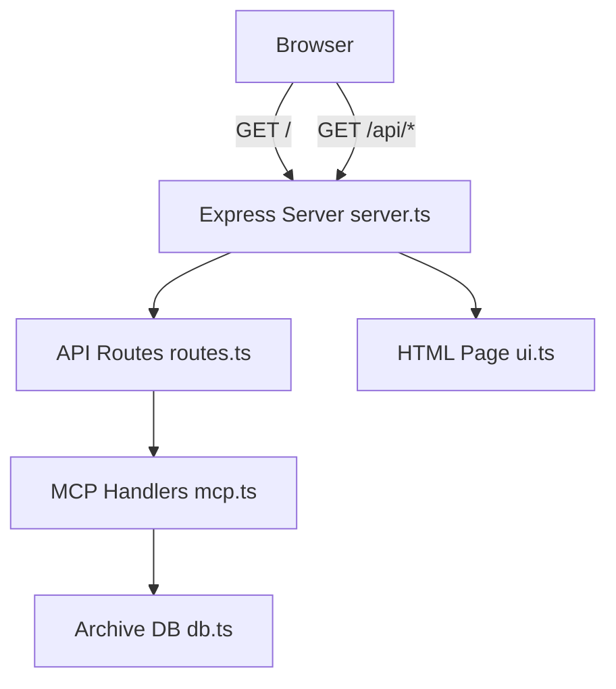
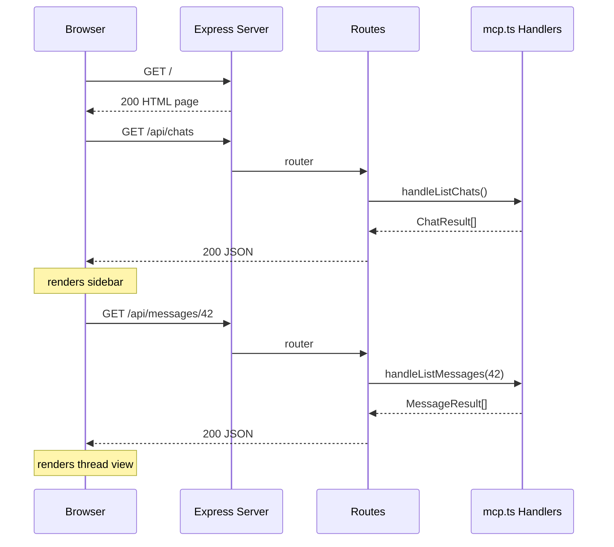

# Design Document — web-ui

## Overview

The Web UI adds a thin HTTP layer over the existing MCP handler functions. An Express server at `127.0.0.1:3333` serves one static HTML page and three JSON API routes. The single-page UI uses inline CSS and vanilla JavaScript to render a chat sidebar, message thread view, and search box — no framework, no build step, no external network calls.

The feature introduces three new files (`src/web/server.ts`, `src/web/routes.ts`, `src/web/ui.ts`) plus minor changes to `package.json`. No existing code is modified.

### Goals

- Give users a local browser UI to browse and search synced messages without an AI assistant.
- Reuse all existing data access logic from `src/mcp.ts` with zero modifications.
- Load in any browser with a single `npm run web` and no prior setup.

### Non-Goals

- Authentication (security-hardening spec owns that).
- Sending messages on any platform.
- Media rendering (images, audio, video).
- Real-time message push / live updates.
- Mobile-optimised layout.
- Any new database schema or MCP tool changes.

---

## Boundary Commitments

### This Spec Owns

- `src/web/` — all web server code (Express setup, route handlers, static HTML).
- The `"sync:web"` / `"web"` script added to `package.json`.
- The `express` runtime dependency and `@types/express`, `supertest`, `@types/supertest` dev dependencies added to `package.json`.
- The `127.0.0.1`-only bind constraint (not deferred to security-hardening).

### Out of Boundary

- `src/mcp.ts` handler functions — consumed read-only; signatures must not change.
- `src/db.ts` — consumed read-only; no schema changes.
- Authentication middleware — security-hardening spec.
- Any platform-specific sync logic.

### Allowed Dependencies

- `src/mcp.ts` — `handleListChats`, `handleSearchMessages`, `handleListMessages`, `ChatResult`, `MessageResult`.
- `src/db.ts` — `initDb`.
- `express` (v4, new runtime dependency).

### Revalidation Triggers

- Signature changes to `handleListChats`, `handleSearchMessages`, or `handleListMessages` in `src/mcp.ts`.
- Changes to `ChatResult`, `MessageResult`, or `SearchResult` types.
- Port number or bind address changes.

---

## Architecture

### Architecture Pattern & Boundary Map



**Dependency direction**: `db.ts` → `mcp.ts` → `routes.ts` → `server.ts`. `ui.ts` has no runtime imports.

### Technology Stack

| Layer | Choice | Role | Notes |
|-------|--------|------|-------|
| HTTP server | Express v4 | Route mounting, request/response handling | New runtime dep |
| Data access | src/mcp.ts handlers | All query logic | Read-only, no modifications |
| UI | Inline HTML/CSS/vanilla JS | Single-page client | No framework, no build step |
| Testing | supertest + Vitest | HTTP-level integration tests | New dev deps |

---

## File Structure Plan

### New Files

```
src/web/
├── server.ts   # Express app factory, initDb, listen on 127.0.0.1:3333, main()
├── routes.ts   # GET /api/chats, /api/search, /api/messages/:chatId handlers
└── ui.ts       # Exported HTML string constant (full SPA with inline CSS+JS)
tests/
└── web.test.ts # supertest integration tests against the Express app
```

### Modified Files

- `package.json` — add `"web": "tsx src/web/server.ts"` script; add `express` runtime dep; add `@types/express`, `supertest`, `@types/supertest` dev deps.

---

## System Flows

### Page Load + Chat Thread



---

## Requirements Traceability

| Requirement | Summary | Component | File |
|-------------|---------|-----------|------|
| 1.1 | Server starts, binds to 127.0.0.1:3333 | Express Server | server.ts |
| 1.2 | Refuses non-localhost connections | Express Server | server.ts |
| 1.3 | GET / returns full three-zone HTML page | Express Server + UI Page | server.ts, ui.ts |
| 1.4 | Port conflict → clear error on exit | Express Server | server.ts |
| 1.5 | API responses within 2 seconds | API Routes (delegates to fast sync handlers) | routes.ts |
| 2.1 | Chat list sorted by recent activity | API Routes + UI Page | routes.ts, ui.ts |
| 2.2 | Chat entry shows name, platform badge, count | UI Page | ui.ts |
| 2.3 | Click chat → load thread view | UI Page | ui.ts |
| 2.4 | GET /api/chats → JSON | API Routes | routes.ts |
| 3.1 | Submit search → display results | UI Page | ui.ts |
| 3.2 | Search result shows chat, sender, text, timestamp, badge | UI Page | ui.ts |
| 3.3 | Click search result → load thread | UI Page | ui.ts |
| 3.4 | Empty query → no search, no error | UI Page | ui.ts |
| 3.5 | GET /api/search?q= → JSON | API Routes | routes.ts |
| 4.1 | Thread displays messages chronologically | UI Page | ui.ts |
| 4.2 | Message shows sender, text, timestamp | UI Page | ui.ts |
| 4.3 | Sent vs received visually distinguished | UI Page | ui.ts |
| 4.4 | Media-only message shows placeholder | UI Page | ui.ts |
| 4.5 | GET /api/messages/:chatId → JSON | API Routes | routes.ts |
| 5.1 | Platform badge on each sidebar chat entry | UI Page | ui.ts |
| 5.2 | Platform badge on each message | UI Page | ui.ts |
| 5.3 | Badge displays raw platform identifier | UI Page | ui.ts |
| 6.1 | No external network calls from the HTML page | UI Page | ui.ts |
| 6.2 | No build step required | UI Page + Server | ui.ts, server.ts |
| 6.3 | Plain HTML/CSS/vanilla JS only | UI Page | ui.ts |

---

## Components and Interfaces

### Summary

| Component | Domain | Intent | Req Coverage | Contracts |
|-----------|--------|--------|-------------|-----------|
| Express Server | HTTP | App factory, bind, initDb, main() | 1.1–1.5 | Service |
| API Routes | HTTP | Three JSON endpoints wrapping mcp.ts handlers | 2.4, 3.5, 4.5 | API |
| UI Page | UI | Self-contained HTML/CSS/JS SPA served at GET / | 1.3, 2.1–2.3, 3.1–3.4, 4.1–4.4, 5.1–5.3, 6.1–6.3 | API |

---

### HTTP Layer

#### Express Server (`server.ts`)

| Field | Detail |
|-------|--------|
| Intent | Create and configure the Express app; bind to 127.0.0.1:3333; provide main() entry point |
| Requirements | 1.1, 1.2, 1.4 |

**Responsibilities & Constraints**
- Calls `initDb('./telegram.db')` before the server starts accepting requests.
- Binds explicitly to `'127.0.0.1'` (not `'0.0.0.0'`) to satisfy Req 1.2.
- On `EADDRINUSE`: logs a clear message identifying port 3333 and exits with code 1.
- Exports `createApp(): express.Application` for use in tests without starting a real listener.

**Contracts**: Service [ x ]

```typescript
export function createApp(): express.Application
// Mounts API routes and the GET / handler; does NOT call initDb or listen.

async function main(): Promise<void>
// Calls initDb, createApp(), then app.listen('3333', '127.0.0.1', ...)
```

---

#### API Routes (`routes.ts`)

| Field | Detail |
|-------|--------|
| Intent | Three Express route handlers exposing JSON endpoints that delegate to mcp.ts handlers |
| Requirements | 1.5, 2.4, 3.5, 4.5 |

**Responsibilities & Constraints**
- `GET /api/chats`: calls `handleListChats()`; responds `200 application/json`.
- `GET /api/search?q=<query>`: validates `q` is present and non-empty; calls `handleSearchMessages(q)`; responds `200`. If `q` is missing or empty, responds `200` with `[]` (no error, consistent with Req 3.4).
- `GET /api/messages/:chatId`: parses `:chatId` as integer; responds `400` if `NaN`; calls `handleListMessages(chatId)`; responds `200`.
- All routes catch handler errors and respond `500` with `{ error: message }`.
- No platform filtering on the API surface (UI shows all platforms).

**Contracts**: API [ x ]

| Method | Path | Query/Params | Response | Errors |
|--------|------|-------------|----------|--------|
| GET | /api/chats | — | `ChatResult[]` | 500 |
| GET | /api/search | `?q=<string>` | `SearchResult[]` | 500 |
| GET | /api/messages/:chatId | `:chatId` integer | `MessageResult[]` | 400 (NaN), 500 |

---

#### UI Page (`ui.ts`)

| Field | Detail |
|-------|--------|
| Intent | Self-contained HTML document with inline CSS and vanilla JS; served at GET / |
| Requirements | 1.3, 2.1–2.3, 3.1–3.4, 4.1–4.4, 5.1–5.3, 6.1–6.3 |

**Responsibilities & Constraints**
- Exports a single `HTML_PAGE: string` constant (template literal).
- Contains no `<link>` to external stylesheets, no `<script src="https://...">`, no external font references.
- Vanilla JS (no `import`, no bundler syntax) inside a `<script>` block.
- Three-zone CSS layout: search bar at top full width; below that, sidebar (chat list) and main panel (thread/results) side by side.
- Platform badge: `<span class="badge">platform</span>` derived from the `platform` field in API responses.
- Messages sent by the user (`is_sender === 1`) are right-aligned; received messages are left-aligned.
- Media-only messages (`text === null`) render with the placeholder text `[media]`.
- Empty search: the submit handler checks for a non-empty trimmed value before calling `fetch`.

**Implementation Notes**
- The JS `fetch('/api/chats')` call on page load populates the sidebar.
- Chat list items include `data-chat-id` attributes for click handling.
- Search results include `data-chat-id` for click-to-load-thread behaviour.

---

## Error Handling

| Error | Response | Requirement |
|-------|----------|-------------|
| Port 3333 in use at startup | stderr message identifying conflict; process.exit(1) | 1.4 |
| Non-integer `:chatId` | HTTP 400 `{ error: 'invalid chatId' }` | 4.5 |
| Handler or DB error in any route | HTTP 500 `{ error: message }` | 1.5 |
| Empty or missing `q` parameter | HTTP 200 `[]` (no error) | 3.4 |

---

## Testing Strategy

### Unit Tests (in-memory, no HTTP)

- `ui.ts` exports a non-empty string containing `<html`, `<style`, and `<script` tags.
- Route handler for `/api/search` with missing `q` returns an empty array without calling the search handler.
- Route handler for `/api/messages/abc` returns 400.

### Integration Tests (supertest against `createApp()`)

- `GET /` returns 200 with `Content-Type: text/html`.
- `GET /api/chats` returns 200 with a JSON array when the DB has chats; shape matches `ChatResult`.
- `GET /api/search?q=hello` returns 200 with a JSON array; shape matches `SearchResult`.
- `GET /api/messages/1` returns 200 with a JSON array when the DB has messages; shape matches `MessageResult`.
- `GET /api/messages/not-a-number` returns 400.
- `GET /api/search` (no `q`) returns 200 with `[]`.
