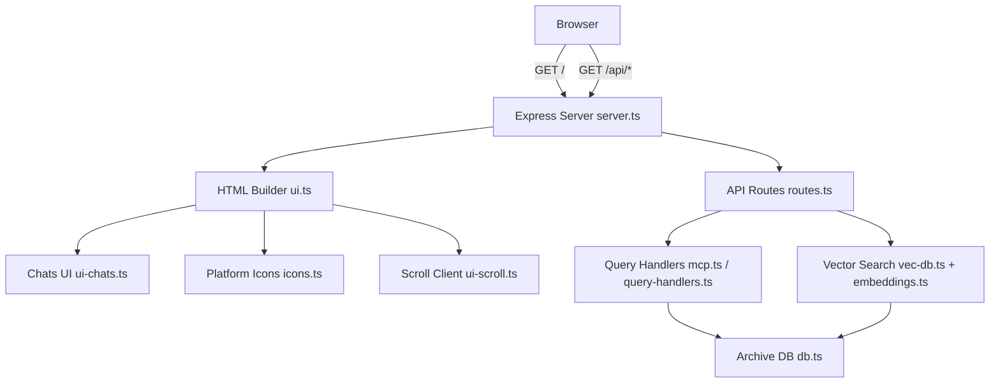
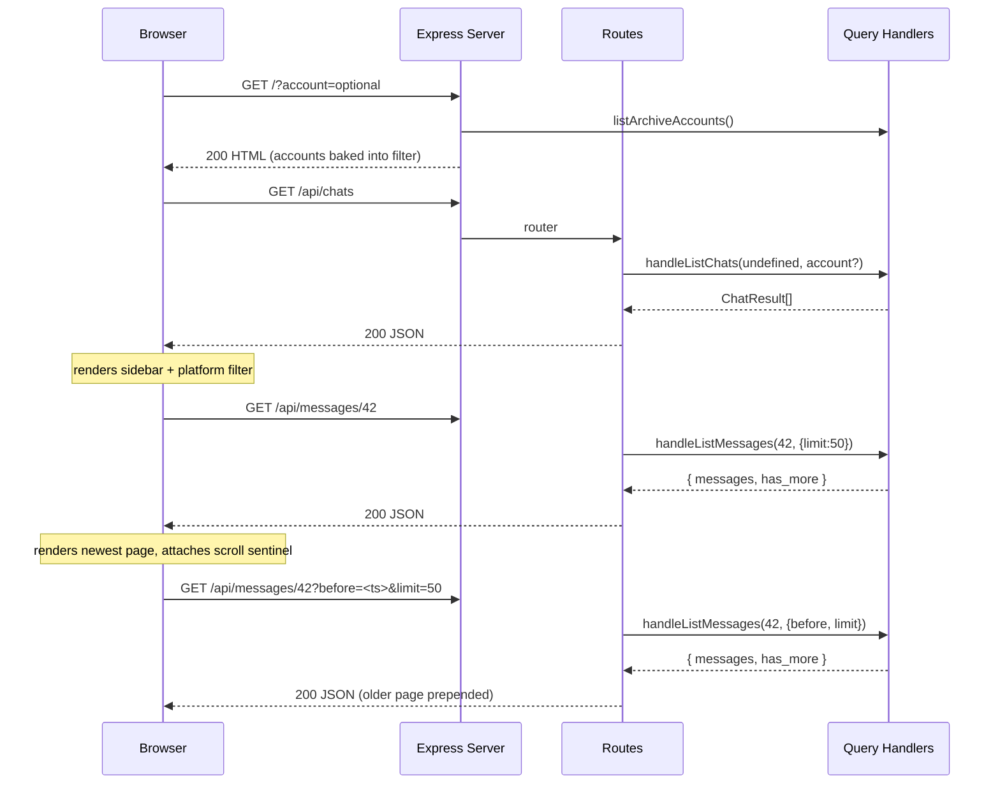
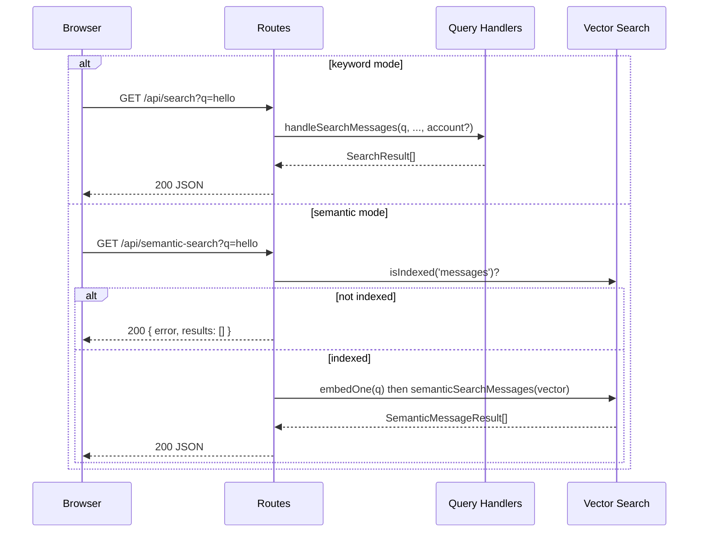

# Design Document : web-ui

## Overview

The Web UI adds a thin HTTP layer over the existing archive query handlers. An Express server at `127.0.0.1:3333` serves one dynamically generated HTML page and a set of JSON API routes. The single-page UI uses inline CSS and vanilla JavaScript to render a chat sidebar, message thread view, and search box : no framework, no build step, no external network calls at runtime.

The feature introduces six files under `src/web/` (`server.ts`, `routes.ts`, `ui.ts`, `ui-chats.ts`, `icons.ts`, `ui-scroll.ts`) plus additions to `package.json`. No existing query logic is modified; the web layer consumes the handler functions read-only.

> **Note (as-built sync, 2026-07-13):** This design has been reconciled with the shipped implementation. The delivered feature extends the original three-file plan with platform icons, infinite-scroll pagination, semantic search, per-account filtering, sidebar type/platform filters, and optional HTTP Basic Auth. `ui-chats.ts` was split out of `ui.ts` to hold the account-filter markup and sidebar-rendering client script, keeping each UI file under the 200-line limit. These additive capabilities are documented in the sections below and in `research.md`. Items that reach into authentication are called out explicitly because they partially overlap the future security-hardening spec.

### Goals

- Give users a local browser UI to browse and search synced messages without an AI assistant.
- Reuse all existing data access logic (`src/query-handlers.ts`, re-exported through `src/mcp.ts`) with zero modifications.
- Load in any browser with a single `npm run web` and no prior setup.

### Non-Goals

- Full authentication and access control (security-hardening spec owns that). An optional, opt-in HTTP Basic Auth guard exists for local convenience but is not a security boundary.
- Sending messages on any platform.
- Media rendering (images, audio, video). Media-only messages show a placeholder.
- Real-time message push / live updates.
- Mobile-optimised layout.
- Any new database schema.

---

## Boundary Commitments

### This Spec Owns

- `src/web/` : all web server code (Express setup, route handlers, HTML generation, platform icons, account-filter markup, sidebar-rendering and scroll pagination client scripts).
- The `"web": "tsx src/web/server.ts"` script in `package.json`.
- The runtime dependencies added for the web layer: `express`, `express-basic-auth`, `simple-icons`.
- The `127.0.0.1`-only bind constraint (not deferred to security-hardening).

### Out of Boundary

- `src/query-handlers.ts` and `src/mcp.ts` handler functions : consumed read-only; signatures must not change.
- `src/db.ts` : consumed read-only; no schema changes.
- `src/vec-db.ts` and `src/embeddings.ts` : consumed read-only for semantic search.
- Full authentication middleware and credential management : security-hardening spec. (The optional Basic Auth guard here is a thin convenience wrapper, not the hardened solution.)
- Any platform-specific sync logic.

### Allowed Dependencies

- `src/mcp.ts` re-exports : `handleListChats`, `handleSearchMessages`, `handleListMessages`, `ChatResult`, `MessageResult`.
- `src/query-handlers.ts` : `listArchiveAccounts`.
- `src/vec-db.ts` : `isIndexed`, `semanticSearchMessages`.
- `src/embeddings.ts` : `embedOne`.
- `src/db.ts` : `initDb`.
- `express` (v5), `express-basic-auth`, `simple-icons` (new runtime dependencies).

### Revalidation Triggers

- Signature changes to `handleListChats`, `handleSearchMessages`, or `handleListMessages`.
- Changes to `ChatResult` or `MessageResult` types, or to the `{ messages, has_more }` shape returned by `handleListMessages`.
- Changes to the semantic search contract (`isIndexed`, `semanticSearchMessages`, `embedOne`).
- Port number or bind address changes.
- Promotion of the optional Basic Auth guard into a real authentication requirement (hands ownership to security-hardening).

---

## Architecture

### Architecture Pattern & Boundary Map


```mermaid
graph TB
    Browser[Browser]
    Server[Express Server server.ts]
    Routes[API Routes routes.ts]
    UI[HTML Builder ui.ts]
    Chats[Chats UI ui-chats.ts]
    Icons[Platform Icons icons.ts]
    Scroll[Scroll Client ui-scroll.ts]
    Handlers[Query Handlers mcp.ts / query-handlers.ts]
    Vec[Vector Search vec-db.ts + embeddings.ts]
    DB[Archive DB db.ts]

    Browser -->|GET /| Server
    Browser -->|GET /api/*| Server
    Server --> UI
    Server --> Routes
    UI --> Chats
    UI --> Icons
    UI --> Scroll
    Routes --> Handlers
    Routes --> Vec
    Handlers --> DB
    Vec --> DB
```

**Dependency direction**: `db.ts` => `query-handlers.ts` (=> `mcp.ts` re-export) => `routes.ts` => `server.ts`. `ui.ts` composes `ui-chats.ts`, `icons.ts`, and `ui-scroll.ts` at build-of-string time and has no runtime data imports.

### Technology Stack

| Layer | Choice | Role | Notes |
|-------|--------|------|-------|
| HTTP server | Express v5 | Route mounting, request/response handling | Runtime dep |
| Optional auth | express-basic-auth | Opt-in Basic Auth guard on `/api/*` when `WEB_USER` + `WEB_PASS` are set | Convenience only, not a security boundary |
| Data access | `query-handlers.ts` (via `mcp.ts`) | All keyword query logic | Read-only, no modifications |
| Semantic search | `vec-db.ts` + `embeddings.ts` | ONNX embedding + sqlite-vec vector search | Read-only, graceful fallback when index absent |
| Platform icons | simple-icons | SVG brand marks rendered inline, letter fallback | Bundled into HTML string at startup |
| UI | Inline HTML/CSS/vanilla JS | Single-page client | No framework, no build step |
| Testing | supertest + Vitest | HTTP-level integration tests | Dev deps |

---

## File Structure Plan

### New Files

```
src/web/
├── server.ts     # Express app factory (createApp), initDb, GET / handler, listen on 127.0.0.1:3333, main()
├── routes.ts     # Optional Basic Auth guard + GET /api/chats, /api/search, /api/messages/:chatId, /api/semantic-search
├── ui.ts         # buildHtmlPage(accounts, selectedAccount) => full SPA string (inline CSS+JS); HTML_PAGE back-compat const
├── ui-chats.ts   # buildAccountFilterHtml() account dropdown markup + CHATS_JS sidebar-render/filter client script
├── icons.ts      # buildPlatformIconMap() => platform -> inline SVG (simple-icons), used by ui.ts
└── ui-scroll.ts  # SCROLL_JS: infinite-scroll IntersectionObserver client script embedded into the page
tests/
└── web.test.ts   # supertest integration tests against createApp()
```

### Modified Files

- `package.json` : `"web"` script; runtime deps `express`, `express-basic-auth`, `simple-icons`; dev deps `@types/express`, `supertest`, `@types/supertest`.

---

## System Flows

### Page Load, Thread View, and Scroll Pagination


```mermaid
sequenceDiagram
    participant B as Browser
    participant S as Express Server
    participant R as Routes
    participant H as Query Handlers

    B->>S: GET /?account=optional
    S->>H: listArchiveAccounts()
    S-->>B: 200 HTML (accounts baked into filter)
    B->>S: GET /api/chats
    S->>R: router
    R->>H: handleListChats(undefined, account?)
    H-->>R: ChatResult[]
    R-->>B: 200 JSON
    Note over B: renders sidebar + platform filter
    B->>S: GET /api/messages/42
    R->>H: handleListMessages(42, {limit:50})
    H-->>R: { messages, has_more }
    R-->>B: 200 JSON
    Note over B: renders newest page, attaches scroll sentinel
    B->>S: GET /api/messages/42?before=<ts>&limit=50
    R->>H: handleListMessages(42, {before, limit})
    H-->>R: { messages, has_more }
    R-->>B: 200 JSON (older page prepended)
```

### Search (Keyword vs Semantic)


```mermaid
sequenceDiagram
    participant B as Browser
    participant R as Routes
    participant H as Query Handlers
    participant V as Vector Search

    alt keyword mode
        B->>R: GET /api/search?q=hello
        R->>H: handleSearchMessages(q, ..., account?)
        H-->>R: SearchResult[]
        R-->>B: 200 JSON
    else semantic mode
        B->>R: GET /api/semantic-search?q=hello
        R->>V: isIndexed('messages')?
        alt not indexed
            R-->>B: 200 { error, results: [] }
        else indexed
            R->>V: embedOne(q) then semanticSearchMessages(vector)
            V-->>R: SemanticMessageResult[]
            R-->>B: 200 JSON
        end
    end
```

---

## Requirements Traceability

| Requirement | Summary | Component | File |
|-------------|---------|-----------|------|
| 1.1 | Server starts, binds to 127.0.0.1:3333 | Express Server | server.ts |
| 1.2 | Refuses non-localhost connections | Express Server | server.ts |
| 1.3 | GET / returns full three-zone HTML page | Express Server + HTML Builder | server.ts, ui.ts |
| 1.4 | Port conflict => clear error on exit | Express Server | server.ts |
| 1.5 | API responses within 2 seconds | API Routes (delegate to sync handlers) | routes.ts |
| 2.1 | Chat list sorted by recent activity | API Routes + HTML Builder | routes.ts (handler ORDER BY), ui.ts |
| 2.2 | Chat entry shows name, platform badge, count | HTML Builder | ui.ts |
| 2.3 | Click chat => load thread view | HTML Builder | ui.ts |
| 2.4 | GET /api/chats => JSON | API Routes | routes.ts |
| 3.1 | Submit search => display results | HTML Builder | ui.ts |
| 3.2 | Search result shows chat, sender, text, timestamp, badge | HTML Builder | ui.ts |
| 3.3 | Click search result => load thread | HTML Builder | ui.ts |
| 3.4 | Empty query => no search, no error | API Routes + HTML Builder | routes.ts, ui.ts |
| 3.5 | GET /api/search?q= => JSON | API Routes | routes.ts |
| 4.1 | Thread displays messages chronologically | HTML Builder | ui.ts |
| 4.2 | Message shows sender, text, timestamp | HTML Builder | ui.ts |
| 4.3 | Sent vs received visually distinguished | HTML Builder | ui.ts |
| 4.4 | Media-only message shows placeholder | HTML Builder | ui.ts |
| 4.5 | GET /api/messages/:chatId => JSON | API Routes | routes.ts |
| 5.1 | Platform badge on each sidebar chat entry | HTML Builder + Icons | ui.ts, icons.ts |
| 5.2 | Platform badge on each message result | HTML Builder + Icons | ui.ts, icons.ts |
| 5.3 | Badge displays raw platform identifier | HTML Builder + Icons | ui.ts, icons.ts |
| 6.1 | No external network calls from the HTML page | HTML Builder + Icons | ui.ts, icons.ts |
| 6.2 | No build step required | HTML Builder + Server | ui.ts, server.ts |
| 6.3 | Plain HTML/CSS/vanilla JS only | HTML Builder | ui.ts |

---

## Components and Interfaces

### Summary

| Component | Domain | Intent | Req Coverage | Contracts |
|-----------|--------|--------|-------------|-----------|
| Express Server | HTTP | App factory, bind, initDb, GET /, main() | 1.1-1.4, 6.2 | Service |
| API Routes | HTTP | JSON endpoints wrapping handlers + optional auth guard | 1.5, 2.4, 3.4, 3.5, 4.5 | API |
| HTML Builder | UI | Self-contained SPA served at GET / | 1.3, 2.1-2.3, 3.1-3.4, 4.1-4.4, 5.1-5.3, 6.1-6.3 | API |
| Chats UI | UI | Account-filter markup + sidebar render/filter client script | 2.1-2.3, 5.1 | Service |
| Platform Icons | UI | platform => inline SVG map with letter fallback | 5.1-5.3, 6.1 | Service |
| Scroll Client | UI | IntersectionObserver pagination script | 4.1 | Service |

---

### HTTP Layer

#### Express Server (`server.ts`)

| Field | Detail |
|-------|--------|
| Intent | Create and configure the Express app; serve GET /; bind to 127.0.0.1:3333; provide main() entry point |
| Requirements | 1.1, 1.2, 1.3, 1.4 |

**Responsibilities & Constraints**
- Exports `createApp(): Application`; mounts the router and a `GET /` handler. Does not call `initDb` or `listen`, so tests can drive it directly.
- `GET /` calls `listArchiveAccounts()`, reads an optional `?account=` query param, sets `Content-Type: text/html; charset=utf-8`, and responds with `buildHtmlPage(accounts, selectedAccount)`.
- `main()` calls `initDb('./khipuchat.db')`, then `createApp().listen(3333, '127.0.0.1', ...)`.
- Binds explicitly to `'127.0.0.1'` (not `'0.0.0.0'`) to satisfy Req 1.2.
- On `EADDRINUSE`: writes a clear message identifying port 3333 to stderr and calls `process.exit(1)`.
- Uses a `require.main === module` guard so importing the module in tests does not start a listener.

**Contracts**: Service [ x ]

```typescript
export function createApp(): import('express').Application
// Mounts API routes and the GET / handler; does NOT call initDb or listen.

async function main(): Promise<void>
// Calls initDb('./khipuchat.db'), createApp(), then app.listen(3333, '127.0.0.1', ...)
```

---

#### API Routes (`routes.ts`)

| Field | Detail |
|-------|--------|
| Intent | Express `Router` exposing JSON endpoints that delegate to handlers, plus an optional Basic Auth guard |
| Requirements | 1.5, 2.4, 3.4, 3.5, 4.5 |

**Responsibilities & Constraints**
- **Optional auth guard**: a `router.use` middleware that only applies to paths starting with `/api`. When both `WEB_USER` and `WEB_PASS` env vars are set, it enforces `express-basic-auth` with a challenge; otherwise it is a pass-through. This is opt-in convenience only and is not the security-hardening solution.
- `GET /api/chats`: reads optional `?account=`; calls `handleListChats(undefined, account)`; responds `200 application/json`.
- `GET /api/search?q=<query>`: if `q` is missing or trims to empty, responds `200 []` (no error, per Req 3.4); otherwise reads optional `?account=` and calls `handleSearchMessages(q, undefined, undefined, account)`.
- `GET /api/messages/:chatId`: parses `:chatId` as integer, responds `400` on `NaN`; validates optional `before` (positive integer) and `limit` (1-100, default 50), responds `400` on invalid values; calls `handleListMessages(chatId, { before, limit })`; responds `200` with `{ messages, has_more }`.
- `GET /api/semantic-search?q=<query>`: empty query => `200 []`; validates optional `limit` (1-100, default 20); if `isIndexed('messages')` is false, responds `200 { error, results: [] }`; otherwise `embedOne(q)` then `semanticSearchMessages(vector, { limit })`, mapped to a flat result shape.
- All routes catch handler errors and respond `500 { error: message }`.

**Contracts**: API [ x ]

| Method | Path | Query/Params | Response | Errors |
|--------|------|-------------|----------|--------|
| GET | /api/chats | `?account=<string>` (optional) | `ChatResult[]` | 500 |
| GET | /api/search | `?q=<string>`, `?account=` (optional) | `SearchResult[]` (empty `[]` when `q` blank) | 500 |
| GET | /api/messages/:chatId | `:chatId` integer; `?before=` int, `?limit=` 1-100 (optional) | `{ messages: MessageResult[], has_more: boolean }` | 400 (bad chatId/before/limit), 500 |
| GET | /api/semantic-search | `?q=<string>`, `?limit=` 1-100 (optional) | flat result array, or `{ error, results: [] }` when index absent | 500 |

---

#### HTML Builder (`ui.ts`)

| Field | Detail |
|-------|--------|
| Intent | Build a self-contained HTML document (inline CSS + vanilla JS) served at GET / |
| Requirements | 1.3, 2.1-2.3, 3.1-3.4, 4.1-4.4, 5.1-5.3, 6.1-6.3 |

**Responsibilities & Constraints**
- Exports `buildHtmlPage(accounts, selectedAccount?): string`. Also exports `HTML_PAGE = buildHtmlPage([])` for backward compatibility with existing static tests.
- Bakes the platform icon map (`buildPlatformIconMap()`), the account-filter markup (`buildAccountFilterHtml()`), the sidebar script (`CHATS_JS`), and the scroll client (`SCROLL_JS`) into the page as JSON/JS literals at call time.
- Contains no `<link>` to external stylesheets, no `<script src="https://...">`, and no external font references. Inline SVG has its `xmlns` stripped so no external URL remains.
- Three-zone layout: full-width search bar on top; sidebar (type filter, optional account filter, platform filter chips, chat list) and main panel side by side below.
- Platform badge: renders the inline SVG icon for known platforms, else a single-letter fallback derived from the raw `platform` string (no lookup table beyond the icon map; unknown platforms still display).
- Sent messages (`is_sender === 1`) are right-aligned; received messages are left-aligned. Group chats show the sender name.
- Media-only messages (`text` empty/null) render `[type]` (e.g. `[image]`) as an italic placeholder rather than an empty bubble.
- Empty search: `doSearch()` trims the input and returns early when blank, submitting no request.
- Search mode toggle switches between `/api/search` (keyword) and `/api/semantic-search` (semantic); semantic `{ error }` responses are surfaced inline.
- After rendering a thread, attaches the scroll sentinel to lazy-load older pages via `?before`.
- All user-derived strings pass through an HTML-escape helper before insertion.

**Contracts**: API [ x ]

```typescript
export function buildHtmlPage(
  accounts: { platform: string; account: string }[],
  selectedAccount?: string,
): string
export const HTML_PAGE: string // = buildHtmlPage([])
```

---

#### Chats UI (`ui-chats.ts`)

| Field | Detail |
|-------|--------|
| Intent | Sidebar chat-list rendering, type/platform filters, and the multi-account filter dropdown |
| Requirements | 2.1, 2.2, 2.3, 5.1 |

**Responsibilities & Constraints**
- Split out of `ui.ts` to keep both files under the 200-line limit; consumed by `ui.ts` at string-composition time (no runtime import).
- `buildAccountFilterHtml(accounts, selectedAccount?)`: returns server-rendered `<select>` markup for account switching. Returns `''` (renders nothing) unless at least one platform has more than one account, so single-account installs see no dropdown. Selecting an option navigates to `/?account=<name>`.
- `CHATS_JS`: a client script string embedded verbatim into the page. Exposes `renderChatList()` (builds sidebar entries with name, platform badge, group tag, per-account label, and message count; wires click-to-open-thread), `renderPlatformFilter()` (builds the platform filter chips), and helpers `isDirectChat()` / `platformLabel()` (icon-or-letter badge).
- Applies the active type filter (all/direct/group) and platform filter client-side over the already-loaded chat list; performs no data fetching of its own.
- All user-derived strings pass through an HTML-escape helper before insertion.

**Contracts**: Service [ x ]

```typescript
export function buildAccountFilterHtml(
  accounts: { platform: string; account: string }[],
  selectedAccount?: string,
): string
export const CHATS_JS: string // client-side sidebar render/filter script, embedded into the page
```

---

#### Platform Icons (`icons.ts`)

| Field | Detail |
|-------|--------|
| Intent | Provide a serialisable platform => inline SVG map for badges |
| Requirements | 5.1, 5.2, 5.3, 6.1 |

**Responsibilities & Constraints**
- `buildPlatformIconMap()` returns `Record<string, string>` mapping known platforms (`telegram`, `wechat`, `discord`, `whatsapp`, `imessage`, `email`) to 16px inline SVG strings from `simple-icons`.
- Each SVG is resized, set to `fill="currentColor"`, and stripped of its `xmlns` attribute so the page makes no external request (Req 6.1).
- Platforms without a known icon are omitted; the HTML Builder renders a letter fallback so the raw platform identifier is always visible (Req 5.3).

**Contracts**: Service [ x ]

```typescript
export function buildPlatformIconMap(): Record<string, string>
```

---

#### Scroll Client (`ui-scroll.ts`)

| Field | Detail |
|-------|--------|
| Intent | Vanilla-JS infinite-scroll pagination embedded in the page |
| Requirements | 4.1 |

**Responsibilities & Constraints**
- Exports `SCROLL_JS: string`, a script embedded verbatim into the page `<script>` block (no runtime import; preserves the no-build constraint).
- `attachScrollSentinel(container, chatId, oldestTimestamp, onOlderLoaded, hasMore)` inserts a sentinel and uses `IntersectionObserver` to fetch `/api/messages/:chatId?before=<oldest>&limit=50` when scrolled to the top.
- Guards against concurrent fetches with an `_isFetching` flag, preserves scroll position after prepending older messages, shows a loading indicator, and renders a Retry affordance on fetch failure.
- `scrollToBottom` and `disconnectScroll` manage newest-message positioning and observer teardown on thread switch.

**Contracts**: Service [ x ] (client-side functions exposed on the page scope)

---

## Error Handling

| Error | Response | Requirement |
|-------|----------|-------------|
| Port 3333 in use at startup | stderr message identifying conflict; `process.exit(1)` | 1.4 |
| Non-integer `:chatId` | HTTP 400 `{ error: 'invalid chatId' }` | 4.5 |
| Invalid `before` / `limit` query param | HTTP 400 `{ error: 'invalid ... parameter' }` | 4.5 |
| Handler or DB error in any route | HTTP 500 `{ error: message }` | 1.5 |
| Empty or missing `q` parameter (keyword or semantic) | HTTP 200 `[]` (no error) | 3.4 |
| Semantic index not built | HTTP 200 `{ error, results: [] }` (graceful, non-fatal) | (additive) |
| Missing `WEB_USER`/`WEB_PASS` | Auth guard is a no-op (opt-in) | (additive) |

---

## Additive Capabilities (Beyond Original Requirements)

These shipped features are non-breaking supersets of the requirements. They are documented here so tasks, review, and future specs treat them as owned surface area rather than accidental drift.

1. **Semantic search** (`GET /api/semantic-search`): ONNX embedding via `embedOne` + sqlite-vec via `semanticSearchMessages`, with graceful fallback when no index exists. UI exposes a keyword/semantic toggle.
2. **Per-account filtering** (`?account=` on `/api/chats` and `/api/search`; `/?account=` on the page): supports multi-account installs. The account dropdown appears only when a platform has more than one account.
3. **Message pagination** (`?before`, `?limit`; `{ messages, has_more }` shape): newest page first, older pages lazy-loaded on scroll.
4. **Sidebar filters**: client-side type filter (all/direct/group) and platform filter chips.
5. **Optional HTTP Basic Auth**: env-gated guard on `/api/*`. Convenience only; the hardened auth story remains with the security-hardening spec. Promoting this into a real auth requirement is a revalidation trigger.

---

## Testing Strategy

### Unit / Static Tests

- `HTML_PAGE` (and `buildHtmlPage([])`) is a non-empty string containing `<html`, `<style`, and `<script` tags.
- `HTML_PAGE` contains no `https://` references (verifies no external URLs, Req 6.1).
- `HTML_PAGE` references `/api/chats`, `/api/search`, and `/api/messages` (verifies client wiring).
- `buildPlatformIconMap()` returns SVG strings with no `xmlns` attribute.

### Integration Tests (supertest against `createApp()`)

- `GET /` returns 200 with `Content-Type: text/html`.
- `GET /api/chats` returns 200 with a JSON array; each entry has `chat_id`, `name`, `platform`, `message_count`.
- `GET /api/search?q=hello` returns 200 with a JSON array; each entry has `chat_name`, `text`, `platform`.
- `GET /api/messages/:chatId` returns 200 with `{ messages, has_more }`; each message has `sender_name`, `text`, `is_sender`, `platform`.
- `GET /api/messages/:chatId?before=<ts>&limit=50` returns an older page and correct `has_more`.
- `GET /api/messages/not-a-number` returns 400; invalid `before`/`limit` return 400.
- `GET /api/search` (no `q`) and `GET /api/semantic-search` (no `q`) return 200 `[]`.
- `GET /api/semantic-search?q=...` with no index returns 200 `{ error, results: [] }`.
- With `WEB_USER`/`WEB_PASS` set, `/api/*` without credentials returns 401; with credentials returns 200.
