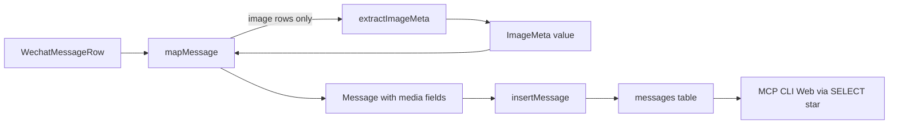
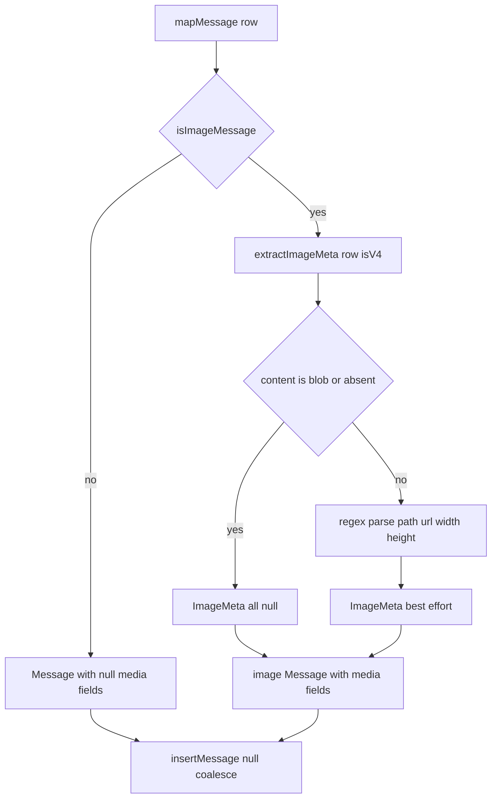
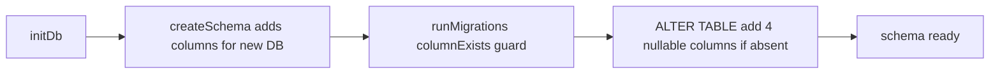

# Design Document

## Overview

**Purpose**: This feature ensures every image-related WeChat message is synced as an `image`-type record carrying whatever metadata (file path, URL, dimensions) the source database provides, across all WeChat schema versions.

**Users**: Anyone querying their local archive through MCP, CLI, or Web will see WeChat image messages classified correctly and enriched with available metadata, instead of losing them into the `other` bucket or seeing empty records.

**Impact**: Image-type detection for WeChat is already implemented and green (`tests/wechat-image.test.ts`). This design adds the missing half — metadata extraction and persistence. It introduces four nullable columns on `messages`, four optional fields on the shared `Message` interface, a pure extraction helper, and a single binding change in `insertMessage`. All changes are additive; non-image and non-WeChat message behavior is unchanged.

### Goals

- Extract file path, URL, and image dimensions from WeChat image messages when present (2.1, 2.2, 2.3).
- Persist that metadata so downstream surfaces receive enriched records without any interface change on their side.
- Keep extraction best-effort: absent metadata never fails a sync (2.4).
- Preserve existing type-detection and all non-image behavior exactly (4.1, 4.2, 4.3).

### Non-Goals

- Image file storage, download, retrieval, processing, or format conversion.
- Changes to MCP / CLI / Web query interfaces (they inherit new columns via existing `SELECT *`).
- Reworking WeChat type-detection logic (already implemented; only reused here).
- Adding an XML parser dependency or reopening the Type 49 classification decision.

## Boundary Commitments

### This Spec Owns

- Extraction of image metadata (`media_file_path`, `media_url`, `media_width`, `media_height`) from WeChat message rows.
- The four new nullable columns on the `messages` table and their forward migration.
- The four new optional fields on the shared `Message` interface.
- Wiring extraction into WeChat `mapMessage` for image-classified rows only.

### Out of Boundary

- Type detection of image messages (already implemented in `mapMessage`; treated as a fixed input here).
- Any file-system access to actual image assets.
- Downstream rendering or querying of the new columns (surfaces receive them transparently).
- Metadata extraction for non-image message types or other platforms.

### Allowed Dependencies

- `src/db.ts` (`Message` interface, `insertMessage`, `messages` schema) — the shared DB seam.
- `src/db-migrations.ts` (`columnExists`, `runMigrations`) — additive column migration.
- WeChat row types (`WechatMessageRow`) via type-only import to avoid a runtime cycle.
- No new npm dependencies.

### Revalidation Triggers

- Adding, renaming, or retyping any `media_*` column (touches `Message`, `insertMessage`, and every `SELECT *` consumer).
- Changing `insertMessage`'s binding strategy (affects all adapters).
- Extending `ImageMeta` to non-image media (would broaden the extraction contract).

## Architecture

### Existing Architecture Analysis

- Platform adapters call only `src/db.ts` exports; they never touch the schema directly. This feature honors that — WeChat's `sync.ts` gets metadata via a local helper and hands a fully-formed `Message` to `insertMessage`.
- `mapMessage` (`src/platforms/wechat/sync.ts:135`) already computes `isImageMessage` and sets `type: 'image'`. Extraction hooks in exactly where that flag is already true.
- `insertMessage` (`src/db.ts:149`) binds the whole `Message` object with `better-sqlite3` strict named-parameter binding. This is the one cross-cutting seam: new columns require the INSERT to null-coalesce the media fields so adapters that never set them keep working (see Data Models → Integration Seam).
- `getMessages` uses `SELECT *`, so `MessageRow` and every downstream surface inherit the new columns with zero interface change (Req 2 adjacent expectation).

### Architecture Pattern & Boundary Map



**Architecture Integration**:
- Selected pattern: pure-function extraction behind the existing adapter boundary. `extractImageMeta` is side-effect-free and independently testable.
- Domain boundaries: extraction logic lives in the WeChat adapter; persistence shape lives in `db.ts`. No shared ownership of either.
- Existing patterns preserved: adapters → `db.ts` only; flat typed columns; `columnExists`-guarded additive migrations; `:memory:` real-DB tests.
- New components rationale: `image-meta.ts` isolates XML/path parsing so `sync.ts` stays under the 200-line guideline and extraction is unit-testable.
- Dependency direction: `types (db.ts Message, ImageMeta)` → `db-migrations` → `db (schema, insertMessage)` → `image-meta` (pure) → `sync (mapMessage)`. Each layer imports only leftward; `image-meta` imports `WechatMessageRow` as a type-only import (erased at runtime, no cycle).

### Technology Stack

| Layer | Choice / Version | Role in Feature | Notes |
|-------|------------------|-----------------|-------|
| Data / Storage | `better-sqlite3-multiple-ciphers` (existing) | Four nullable `messages` columns + additive migration | Synchronous; strict named-param binding drives the `insertMessage` seam |
| Backend / Services | TypeScript 5 strict (existing) | `extractImageMeta` pure helper, `ImageMeta` type, `Message` field additions | No `any`; new fields typed `string \| null` / `number \| null` |
| Infrastructure / Runtime | Node 20 + `tsx` (existing) | No new runtime | No new npm dependency; regex-based extraction |

## File Structure Plan

### New Files
```
src/platforms/wechat/
└── image-meta.ts        # Pure extractImageMeta(row, isV4): ImageMeta + ImageMeta type

tests/
└── wechat-image-meta.test.ts   # Unit tests for extractImageMeta + insertMessage backward-compat
```

### Modified Files
- `src/db.ts` — add `media_file_path`, `media_url`, `media_width`, `media_height` (optional) to the `Message` interface; add the four nullable columns to the `messages` CREATE TABLE; update `insertMessage` to bind the media fields with `?? null` defaults.
- `src/db-migrations.ts` — add four `columnExists`-guarded `ALTER TABLE messages ADD COLUMN` statements in `runMigrations` for existing databases.
- `src/platforms/wechat/sync.ts` — in `mapMessage`, call `extractImageMeta(row, isV4)` for image rows and spread its fields into the returned `Message`; leave non-image rows untouched.

> Each file keeps one responsibility: `image-meta.ts` = parsing, `db.ts` = shape + persistence, `db-migrations.ts` = schema evolution, `sync.ts` = orchestration.

## Requirements Traceability

| Requirement | Summary | Components | Interfaces | Flows |
|-------------|---------|------------|------------|-------|
| 1.1–1.4 | Image type detection (Type 4/43/49, local_type 4) | `mapMessage` (existing) | `WechatMessageRow` → `Message.type` | Boundary Map |
| 2.1 | Persist file path when present | `extractImageMeta`, `insertMessage`, schema | `ImageMeta.media_file_path` | Extraction flow |
| 2.2 | Persist URL when present | `extractImageMeta`, `insertMessage`, schema | `ImageMeta.media_url` | Extraction flow |
| 2.3 | Persist width/height when present | `extractImageMeta`, `insertMessage`, schema | `ImageMeta.media_width/height` | Extraction flow |
| 2.4 | Missing metadata does not fail sync | `extractImageMeta` (returns nulls), `insertMessage` (null-coalesce) | `ImageMeta` all-optional | Extraction fallback |
| 3.1–3.3 | Consistent metadata across legacy + V4 | `extractImageMeta(row, isV4)` | `ImageMeta` (schema-agnostic output) | Extraction flow |
| 4.1–4.3 | Non-image / non-WeChat behavior unchanged | `mapMessage` guard, `insertMessage` binding | `Message` (additive fields) | Extraction fallback |

## System Flows



Key decisions: extraction runs only for image-classified rows; any non-string content (zstd blob flagged by `WCDB_CT_message_content=4`) or parse miss yields all-null metadata rather than an error (2.4). `insertMessage` binds `media_* ?? null` for every message regardless of platform, so a `Message` object without media keys inserts unchanged (4.1, 4.2).

## Components and Interfaces

| Component | Domain/Layer | Intent | Req Coverage | Key Dependencies (P0/P1) | Contracts |
|-----------|--------------|--------|--------------|--------------------------|-----------|
| `extractImageMeta` | WeChat adapter | Parse metadata from an image row, best-effort | 2.1, 2.2, 2.3, 2.4, 3.1, 3.2, 3.3 | `WechatMessageRow` type (P0) | Service |
| `Message` fields | DB / types | Carry media metadata through persistence | 2.1–2.3 | — | State |
| `insertMessage` | DB | Persist media fields with null-safe binding | 2.4, 4.1, 4.2 | `messages` schema (P0) | Service |
| `runMigrations` | DB | Add columns to existing databases | 2.1–2.3 | `columnExists` (P0) | Batch |
| `mapMessage` (mod) | WeChat adapter | Invoke extraction for image rows | 2.1–2.3, 4.3 | `extractImageMeta` (P0) | Service |

### WeChat Adapter

#### extractImageMeta

| Field | Detail |
|-------|--------|
| Intent | Return best-effort image metadata for a WeChat image row |
| Requirements | 2.1, 2.2, 2.3, 2.4, 3.1, 3.2, 3.3 |

**Responsibilities & Constraints**
- Pure, deterministic, side-effect-free. Given a row and schema flag, returns an `ImageMeta`.
- Owns all parsing of WeChat image content (legacy `Message`/`strContent` XML, V4 `message_content` path/XML/blob).
- Never throws: unparseable, blob, or absent content returns an `ImageMeta` with all fields `null` (2.4).
- Schema-agnostic output: identical `ImageMeta` shape for legacy and V4 (3.3).

**Dependencies**
- Inbound: `mapMessage` — calls it for image rows (P0).
- Outbound: none.
- External: none (regex only; no XML library).

**Contracts**: Service [x]

##### Service Interface
```typescript
export interface ImageMeta {
  media_file_path: string | null
  media_url: string | null
  media_width: number | null
  media_height: number | null
}

export function extractImageMeta(row: WechatMessageRow, isV4: boolean): ImageMeta
```
- Preconditions: `row` is an image-classified WeChat row (caller-guaranteed). `WechatMessageRow` imported via `import type` to avoid a runtime cycle with `sync.ts`.
- Postconditions: returns a fully-populated `ImageMeta`; every field is either a parsed value or `null`. Never throws.
- Invariants: no field is `undefined`; numeric fields are finite integers or `null`.

**Implementation Notes**
- Integration: `mapMessage` spreads the result into the returned `Message` for image rows; for non-image rows the media fields default to `null` in `insertMessage`.
- Validation: parse `cdnthumbwidth`/`cdnthumbheight` (and midimg fallbacks) to integers; treat a plain string as `media_file_path` when it is not XML; pull `cdnthumburl`/`cdnmidimgurl` as `media_url`.
- Risks: legacy `buildSchemaInfo` prefers `strContent` over `Message`; if image XML lives in the unselected column, metadata is `null` — acceptable under best-effort (2.4), flagged in `research.md`. Type 49 non-image payloads yield null metadata while remaining `image`-typed per Req 1.3.

#### mapMessage (modified)

| Field | Detail |
|-------|--------|
| Intent | Attach extracted metadata to image-type WeChat messages |
| Requirements | 2.1, 2.2, 2.3, 4.3 |

**Responsibilities & Constraints**
- Unchanged type-detection logic. When `isImageMessage` is true, call `extractImageMeta(row, isV4)` and spread its fields into the returned `Message`.
- When `isImageMessage` is false, omit media fields entirely (they resolve to `null` at persistence) — non-image behavior byte-for-byte unchanged (4.3).

**Contracts**: Service [x] (existing signature unchanged)

### DB Layer

#### insertMessage (modified)

| Field | Detail |
|-------|--------|
| Intent | Persist a `Message` including optional media fields, null-safe for all platforms |
| Requirements | 2.4, 4.1, 4.2 |

**Responsibilities & Constraints**
- The INSERT statement gains the four media columns. Because `better-sqlite3` uses strict named-parameter binding (missing key throws; `undefined` is not bindable), the bound object MUST map each media column to `msg.media_* ?? null`.
- Adapters that never set media keys (telegram, imessage, discord, slack, email, whatsapp) bind `null` and are unaffected (4.1, 4.2).
- `ON CONFLICT` clause is unchanged: media columns are not refreshed on re-sync (first insert wins; metadata is immutable per message).

**Contracts**: Service [x]

##### Service Interface
```typescript
// signature unchanged; internal binding changes
export function insertMessage(msg: Message): void
```
- Preconditions: `msg` conforms to `Message`; media fields optional.
- Postconditions: row persisted with media columns set to provided values or `null`.
- Invariants: no `undefined` reaches the driver.

## Data Models

### Logical Data Model

`Message` (and `MessageRow extends Message`) gain four optional fields; the `messages` table gains four nullable columns. No relationships, keys, or indexes change.

```typescript
export interface Message {
  // …existing fields unchanged…
  media_file_path?: string | null
  media_url?: string | null
  media_width?: number | null
  media_height?: number | null
}
```

### Physical Data Model

| Column | Type | Null | Notes |
|--------|------|------|-------|
| `media_file_path` | TEXT | yes | Local/relative image path when present (2.1) |
| `media_url` | TEXT | yes | CDN/thumbnail URL when present (2.2) |
| `media_width` | INTEGER | yes | Pixel width when present (2.3) |
| `media_height` | INTEGER | yes | Pixel height when present (2.3) |

- Fresh databases: columns added in `createSchema`'s `messages` DDL.
- Existing databases: `runMigrations` adds each column guarded by `columnExists` (idempotent, additive; no data rewrite). No index needed — these are payload fields, not filter keys, and no requirement asks to filter on them.

### Integration Seam (Data Contract)

The only cross-cutting contract is `insertMessage`'s binding: every `Message` — regardless of platform — is persisted with `media_* ?? null`. This is what makes the new columns safe to add without editing any other adapter. Flat typed columns (not JSON) keep the values directly readable by downstream `SELECT *` surfaces.

## Error Handling

### Error Strategy

- Extraction is total: `extractImageMeta` returns nulls instead of throwing on blob, absent, or malformed content (2.4). No try/catch is needed at the call site.
- Persistence: null-coalescing binding prevents `undefined`-binding failures. Existing per-table `try/catch` in `runBackfillImpl`/`runIncrementalImpl` continues to isolate row errors per chat.
- Migration: `columnExists` guards make column addition idempotent and safe to re-run.

### Monitoring

No new logging surface. Existing WeChat sync stderr/stdout counters are sufficient; a metadata-parse miss is a normal null outcome, not an error.

## Testing Strategy

### Unit Tests (`tests/wechat-image-meta.test.ts`)
- `extractImageMeta` returns file path from a legacy image XML/path string (2.1).
- `extractImageMeta` returns `media_url` from `cdnthumburl`/`cdnmidimgurl` when present (2.2).
- `extractImageMeta` returns integer `media_width`/`media_height` from `cdnthumbwidth`/`cdnthumbheight` (2.3).
- `extractImageMeta` returns all-null `ImageMeta` for absent content, a zstd blob (`WCDB_CT_message_content=4` / Buffer), and unparseable strings — without throwing (2.4, 3.1, 3.2).
- `extractImageMeta` produces the same `ImageMeta` shape for an equivalent legacy vs. V4 image row (3.3).

### Integration Tests (`:memory:` DB)
- `insertMessage` persists a WeChat image `Message` with populated media fields; `getMessages` returns them via `SELECT *` (2.1–2.3, MCP/CLI/Web parity).
- `insertMessage` persists a non-WeChat `Message` with no media keys set — inserts successfully with the four columns `NULL` (4.1, 4.2). This is the backward-compatibility regression guard for the named-param seam.
- `runMigrations` on a pre-feature schema adds the four columns idempotently (re-running is a no-op).

### Regression
- Existing `tests/wechat-image.test.ts` (16 cases) must remain green — type detection and `text: ''` behavior unchanged.

## Migration Strategy

Single additive forward migration; no data movement, no rollback data risk.



Rollback: columns are nullable and unused by prior code; leaving them in place is harmless if the feature is reverted. No down-migration required.
