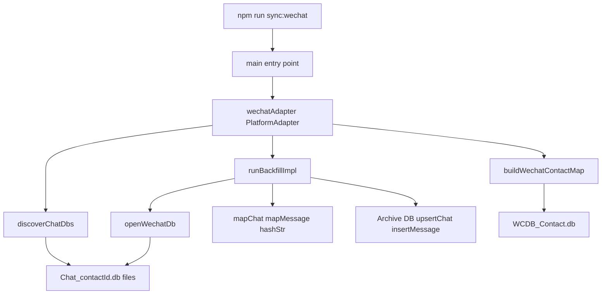

# Design Document — wechat-sync

## Overview

WeChat Sync reads the WeChat Mac app's local SQLite message databases, maps conversations and messages to the shared archive schema, and stores them under `platform = 'wechat'`. It extends the iMessage adapter pattern: discover files → open DB → map rows → upsert into archive. No new runtime dependencies are required; `better-sqlite3` and Node built-ins are sufficient.

The feature is macOS-only, read-only, and idempotent. It introduces two new source files (`src/platforms/wechat/sync.ts`, `src/platforms/wechat/contacts.ts`) plus minor additions to `types.ts` and `package.json`. No schema changes are needed.

### Goals

- Sync all WeChat text messages from the local Mac app DBs into the shared archive.
- Resolve contact display names from WeChat's own contacts database.
- Provide clear operator feedback for the two expected failure modes: Full Disk Access denied and encrypted databases.

### Non-Goals

- Media, image, audio, or file message extraction.
- WeChat Moments, WeChat Pay records.
- Windows WeChat support.
- Sending messages via WeChat.
- Changes to the MCP tool definitions or shared DB schema.

---

## Boundary Commitments

### This Spec Owns

- `src/platforms/wechat/` — all WeChat-specific code (discoverer, opener, contact resolver, row mappers, adapter, main entry point).
- The `'wechat'` string value added to the `Platform` union in `src/platforms/types.ts`.
- The `"sync:wechat"` script added to `package.json`.

### Out of Boundary

- The shared DB schema (`src/db.ts`) — consumed read/write but not modified.
- The `PlatformAdapter` interface (`src/platforms/types.ts`) — consumed but not modified.
- MCP tool filtering — WeChat messages become queryable via existing platform-scoped search automatically once stored.
- Any WeChat feature beyond text message backfill (media, real-time listener, sending).

### Allowed Dependencies

- `src/db.ts` — `upsertChat`, `insertMessage`, `initDb`, `Chat`, `Message` types.
- `src/platforms/types.ts` — `Platform`, `PlatformAdapter`.
- `better-sqlite3` (project dependency, v11+).
- Node built-ins: `node:fs`, `node:os`, `node:path`.

### Revalidation Triggers

- Changes to `Chat` or `Message` interfaces in `src/db.ts` — mappers must be updated.
- Changes to `PlatformAdapter` interface — adapter signature must be updated.
- Changes to `upsertChat` or `insertMessage` behaviour — idempotency guarantees may shift.
- WeChat app updates that change DB file layout, table names, or column names.

---

## Architecture

### Architecture Pattern & Boundary Map



**Dependency direction**: `types.ts` → `db.ts` → `wechat/contacts.ts` → `wechat/sync.ts` → entry point. No upward imports.

### Technology Stack

| Layer | Choice | Role | Notes |
|-------|--------|------|-------|
| Runtime | Node 20 / tsx | Execute sync script | Existing project toolchain |
| DB access | better-sqlite3 v11 | Open and query WeChat SQLite DBs | Already a project dependency |
| Filesystem | node:fs readdirSync / statSync | Recursive DB file discovery | Same as contacts.ts; no glob library needed |
| Types | TypeScript strict | Row types, ContactMap, adapter interface | Never use `any` |

---

## File Structure Plan

### New Files

```
src/platforms/wechat/
├── sync.ts       # discoverChatDbs, openWechatDb, hashStr, mapChat, mapMessage,
│                 # runBackfillImpl, wechatAdapter, main()
└── contacts.ts   # buildWechatContactMap — reads WCDB_Contact.db
tests/
└── wechat.test.ts  # Vitest: mock in-memory SQLite, unit + integration tests
```

### Modified Files

- `src/platforms/types.ts` — Add `'wechat'` to `Platform` union (one-line change).
- `package.json` — Add `"sync:wechat": "tsx src/platforms/wechat/sync.ts"` script.

---

## System Flows

### Full Backfill Sequence

```mermaid
sequenceDiagram
    participant CLI as npm run sync:wechat
    participant Adapter as wechatAdapter
    participant Disc as discoverChatDbs
    participant Cont as buildWechatContactMap
    participant Core as runBackfillImpl
    participant Opener as openWechatDb
    participant DB as Archive DB

    CLI->>Adapter: runBackfill()
    Adapter->>Disc: discoverChatDbs(containerPath)
    Note over Disc: ENOENT → exit with install message
    Note over Disc: EACCES → exit with FDA guidance
    Disc-->>Adapter: string[] chatDbPaths
    Adapter->>Cont: buildWechatContactMap(containerPath)
    Note over Cont: Finds WCDB_Contact.db; fallback to empty map
    Cont-->>Adapter: ContactMap
    Adapter->>Core: runBackfillImpl(chatDbPaths, contactMap)
    loop each chatDbPath
        Core->>Opener: openWechatDb(path)
        Note over Opener: SQLITE_NOTADB → warn + return null
        Opener-->>Core: Database | null
        Core->>DB: upsertChat(mapChat(...))
        loop each message row
            Core->>DB: insertMessage(mapMessage(...))
        end
    end
    Core-->>CLI: log summary
```

Key decisions: `discoverChatDbs` throws on container-level access errors (hard stop), but `openWechatDb` returns `null` on per-file errors (continue). `INSERT OR IGNORE` in `insertMessage` ensures idempotency.

---

## Requirements Traceability

| Requirement | Summary | Component | File |
|-------------|---------|-----------|------|
| 1.1 | Locate Chat_*.db files recursively | DB Discoverer | sync.ts |
| 1.2 | Missing container dir → install message + exit | DB Discoverer | sync.ts |
| 1.3 | FDA denied → guidance message + exit | DB Discoverer | sync.ts |
| 1.4 | Individual file error → warn + continue | DB Opener | sync.ts |
| 2.1 | Extract all rows from Chat_contactId table | WeChat Sync Core | sync.ts |
| 2.2 | Map MesSvrID, CreateTime, Message, Des to shared schema | Row Mappers | sync.ts |
| 2.3 | Store with platform = 'wechat'; add to Platform union | Row Mappers + types.ts | sync.ts, types.ts |
| 2.4 | One chat record per DB file | mapChat | sync.ts |
| 2.5 | Null Message → type = 'other' | mapMessage | sync.ts |
| 3.1 | Read m_nsUsrName → m_nsNickName from WCDB_Contact.db | Contact Resolver | contacts.ts |
| 3.2 | WCDB_Contact.db unavailable → raw contactId as name | Contact Resolver | contacts.ts |
| 3.3 | Resolved name as sender_name and chat name | mapChat, mapMessage | sync.ts |
| 4.1 | npm run sync:wechat | WeChat Adapter | package.json |
| 4.2 | No duplicates — INSERT OR IGNORE on (external_id, chat_id) | Sync Core | sync.ts + db.ts |
| 4.3 | New messages additive, existing records unchanged | Sync Core | sync.ts |
| 4.4 | Messages queryable via MCP platform filter | Platform type registration | types.ts |
| 5.1 | Attempt open without key (unencrypted path); no network calls | DB Opener | sync.ts |
| 5.2 | SQLITE_NOTADB → identify file, explain likely encryption, skip | DB Opener | sync.ts |
| 5.3 | All DB opens use readonly: true | DB Opener | sync.ts |

---

## Components and Interfaces

### Summary

| Component | Domain | Intent | Req Coverage | Contracts |
|-----------|--------|--------|-------------|-----------|
| DB Discoverer | Filesystem | Find Chat_*.db files; handle container-level errors | 1.1–1.4 | Batch |
| DB Opener | Filesystem | Open single WeChat DB read-only; handle encryption | 5.1–5.3, 1.4 | Service |
| Contact Resolver | Data | Build contactId→name map from WCDB_Contact.db | 3.1–3.3 | Service |
| Row Mappers | Data | Pure mapChat/mapMessage functions | 2.1–2.5, 3.3 | Service |
| WeChat Sync Core | Orchestration | Iterate all DBs; call mappers and upsert | 2.1, 4.2–4.3 | Batch |
| WeChat Adapter | Integration | PlatformAdapter impl; main() entry point | 4.1, 4.4 | Service |

---

### Filesystem Layer

#### DB Discoverer

| Field | Detail |
|-------|--------|
| Intent | Locate all `Chat_*.db` files under the WeChat container; surface container-level errors as hard stops |
| Requirements | 1.1, 1.2, 1.3 |

**Responsibilities & Constraints**
- Recursively traverses the container path and collects absolute paths of files matching `Chat_*.db`.
- Throws with a descriptive message on `ENOENT` (WeChat not installed) or `EACCES`/`EPERM` (Full Disk Access denied); caller exits with code 1.
- Does not open individual DB files — that is the DB Opener's responsibility.

**Contracts**: Batch [ x ]

##### Batch / Job Contract
- Trigger: called once per `runBackfill` invocation.
- Input: `containerPath: string` (defaults to `~/Library/Containers/com.tencent.xinWeChat/...`).
- Output: `string[]` absolute file paths.
- Idempotency: read-only filesystem scan; safe to call repeatedly.

```typescript
export function discoverChatDbs(containerPath: string): string[]
// Throws with human-readable message on ENOENT or EACCES at the container level.
// Returns [] if no Chat_*.db files found (WeChat installed but no synced conversations).
```

---

#### DB Opener

| Field | Detail |
|-------|--------|
| Intent | Open a single WeChat DB file read-only; handle encryption and per-file errors without aborting the full sync |
| Requirements | 1.4, 5.1, 5.2, 5.3 |

**Responsibilities & Constraints**
- Opens with `{ readonly: true }` — never writes to WeChat files (Req 5.3).
- On `SQLITE_NOTADB` (`'file is not a database'`): logs a warning identifying the file and noting likely SQLCipher encryption; returns `null`.
- On any other open error: logs a warning with the file path and error message; returns `null`.
- Caller (`runBackfillImpl`) skips `null` results and continues to the next file (Req 1.4).

**Contracts**: Service [ x ]

```typescript
export function openWechatDb(filePath: string): Database.Database | null
// Returns null and logs to stderr on any open failure.
// Caller must call .close() on non-null return values.
```

**Implementation Notes**
- `SQLITE_NOTADB` error message from `better-sqlite3`: `"file is not a database"`. Match on `e.message?.includes('file is not a database')`.
- Encryption key derivation for Mac WCDB requires process-memory introspection (no static formula). Decision: log the limitation and skip. See `research.md` for full rationale.

---

### Data Layer

#### Contact Resolver (`contacts.ts`)

| Field | Detail |
|-------|--------|
| Intent | Build a contactId → displayName map from WCDB_Contact.db; fall back gracefully |
| Requirements | 3.1, 3.2, 3.3 |

**Responsibilities & Constraints**
- Searches for `WCDB_Contact.db` recursively under `containerPath`; uses the first match found.
- Queries it for `m_nsUsrName` → `m_nsNickName` mappings.
- If the file is not found, not readable, or the query fails for any reason: logs a warning and returns an empty `ContactMap` (callers fall back to raw contactId — Req 3.2).
- Never writes to WCDB_Contact.db.

**Contracts**: Service [ x ]

```typescript
export type ContactMap = ReadonlyMap<string, string>

export function buildWechatContactMap(containerPath: string): ContactMap
// Returns empty map on any failure; logs warning to stderr.
```

---

#### Row Mappers

| Field | Detail |
|-------|--------|
| Intent | Pure functions: convert WeChat DB row types to shared Chat/Message schema |
| Requirements | 2.2, 2.3, 2.4, 2.5, 3.3 |

**Row Types**

```typescript
export interface WechatMessageRow {
  MesSvrID: number       // Server message ID → external_id (toString())
  CreateTime: number     // Unix timestamp in seconds (no epoch offset needed)
  Message: string | null // Text content; null for media/unsupported types
  Des: 0 | 1             // 0 = sent by current user, 1 = received
}
```

**Chat Mapper**

```typescript
export function hashStr(s: string): number
// FNV-1a 32-bit hash — same algorithm as iMessage's hashGuid; produces stable numeric chat ID.

export function extractContactId(filePath: string): string
// Extracts contactId from "…/Chat_<contactId>.db" → "<contactId>"

export function mapChat(contactId: string, contactMap: ContactMap): Chat
// chatId = hashStr(contactId)
// name = contactMap.get(contactId) ?? contactId
// type = contactId.endsWith('@chatroom') ? 'group' : 'private'
// platform = 'wechat'
```

**Message Mapper**

```typescript
export function mapMessage(
  row: WechatMessageRow,
  chatId: number,
  contactId: string,
  contactMap: ContactMap,
): Message
// external_id = row.MesSvrID.toString()
// sender_id = row.Des === 0 ? null : contactId
// sender_name = row.Des === 0 ? null : (contactMap.get(contactId) ?? contactId)
// text = row.Message ?? null
// type = row.Message ? 'text' : 'other'
// timestamp = row.CreateTime  (already Unix seconds)
// is_sender = row.Des === 0 ? 1 : 0
// reply_to_external_id = null  (WeChat DB does not expose reply chains in this table)
// platform = 'wechat'
```

---

### Orchestration Layer

#### WeChat Sync Core

| Field | Detail |
|-------|--------|
| Intent | Iterate over all discovered DB files; open, map, and upsert chats and messages |
| Requirements | 2.1, 4.2, 4.3 |

**Responsibilities & Constraints**
- Exported as `runBackfillImpl(chatDbPaths, contactMap)` with the DB path list injectable for testing.
- Derives `contactId` and `chatId` from each file path.
- Reads all rows from the `Chat_<contactId>` table.
- Calls `upsertChat` and `insertMessage` from `src/db.ts`; idempotency is guaranteed by `INSERT OR IGNORE` on `UNIQUE(external_id, chat_id)`.

**Contracts**: Batch [ x ]

```typescript
export async function runBackfillImpl(
  chatDbPaths: ReadonlyArray<string>,
  contactMap: ContactMap,
): Promise<void>
```

---

#### WeChat Adapter

| Field | Detail |
|-------|--------|
| Intent | Implement PlatformAdapter; provide main() entry point invoked by `npm run sync:wechat` |
| Requirements | 4.1, 4.4 |

```typescript
export const wechatAdapter: PlatformAdapter = {
  platform: 'wechat' as Platform,
  async runBackfill(_db: Database.Database): Promise<void> {
    // resolves containerPath, calls discoverChatDbs, buildWechatContactMap, runBackfillImpl
  },
  startListener(_db: Database.Database): void {},  // no-op — no real-time WeChat events
}
```

**Entry Point**

```typescript
async function main(): Promise<void>
// Calls initDb('./telegram.db'), then wechatAdapter.runBackfill(db)
// On error: process.exit(1)

if (require.main === module) {
  main().catch((err: unknown) => { console.error(err); process.exit(1) })
}
```

---

## Error Handling

### Error Strategy

All errors follow **graceful degradation at the file level, hard stop at the container level**. Container-level failures (missing install, FDA denied) prevent any useful work and exit immediately. Per-file failures (individual locked/corrupt/encrypted DB, missing contact DB) are logged and skipped so the rest of the sync completes.

### Error Categories and Responses

| Error | Category | Response | Requirement |
|-------|----------|----------|-------------|
| Container `ENOENT` | System | stderr: WeChat not installed; exit 1 | 1.2 |
| Container `EACCES`/`EPERM` | System | stderr: grant Full Disk Access in System Settings; exit 1 | 1.3 |
| Individual DB `SQLITE_NOTADB` | Encryption | stderr: identifies file, explains SQLCipher likelihood; skip file | 5.2 |
| Individual DB other open error | System | stderr: file path + error message; skip file | 1.4 |
| WCDB_Contact.db unavailable | System | stderr: warn; proceed with empty ContactMap | 3.2 |

### Monitoring

All diagnostic output goes to `stderr`; progress summary goes to `stdout` (mirrors iMessage pattern). No structured logging needed for this local tool.

---

## Testing Strategy

### Unit Tests (pure functions — in-memory, no filesystem)

- `hashStr` produces stable, non-zero output for known inputs.
- `extractContactId` correctly strips path prefix and `.db` suffix; handles `@chatroom` suffix.
- `mapChat`: group type for `@chatroom` contactIds; private type otherwise; name from contactMap with fallback to raw contactId.
- `mapMessage`: `is_sender = 1` when `Des = 0`; `is_sender = 0` when `Des = 1`; `type = 'other'` when `Message` is null; `timestamp` matches `CreateTime` directly (no offset).

### Integration Tests (in-memory SQLite mock WeChat DBs)

- `runBackfillImpl` with 2 mock Chat_*.db files (one private, one group) → correct chat and message records in the archive DB.
- Idempotency: running `runBackfillImpl` twice with same inputs yields identical records (no duplicates).
- Additive sync: running with a second batch of messages added to mock DB appends new messages without modifying old ones.
- Contact resolution: `buildWechatContactMap` returns display names for known contactIds; returns raw contactId for unknown ones.
- `openWechatDb` returns `null` and does not throw when given a file that triggers `SQLITE_NOTADB`.

### Error Path Tests

- `discoverChatDbs` throws with an actionable message when the container path does not exist.
- `buildWechatContactMap` returns an empty map when `WCDB_Contact.db` is absent.
