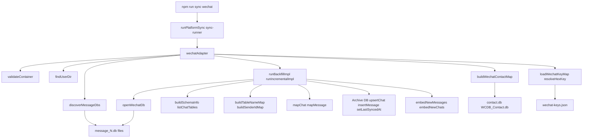
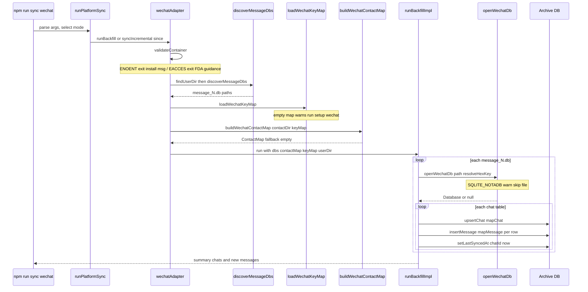
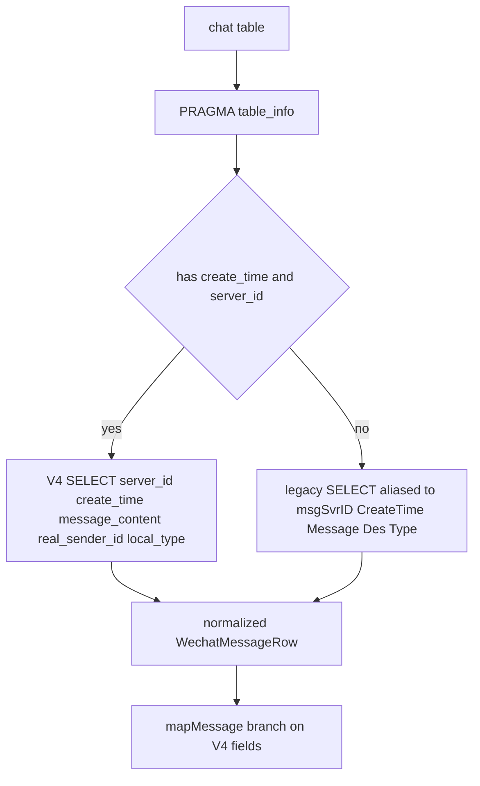

# Design Document : wechat-sync

## Overview

**Purpose**: WeChat Sync reads the WeChat Mac app's local SQLite message databases, maps conversations and messages to the shared archive schema, and stores them under `platform = 'wechat'` so they are searchable alongside every other platform.

**Users**: KhipuChat users on macOS who want their WeChat history in the local archive without any cloud involvement, queried through MCP, CLI, or the Web UI.

**Impact**: Adds a new platform adapter under `src/platforms/wechat/`. It consumes the existing DB seams (`upsertChat`, `insertMessage`, `setLastSyncedAt`) and the shared sync orchestration (`runPlatformSync`). It reads two WeChat storage generations: the legacy 3.x layout (`Chat_*` tables) and the current 4.x layout (numbered `message_N.db` files with `Msg_<md5>` tables and a `Name2Id` lookup). Encrypted (SQLCipher) databases are supported by loading a locally-extracted key map. No shared schema changes and no new runtime dependencies.

### Goals

- Sync all WeChat text messages from the local Mac app databases into the shared archive, covering both the 3.x and 4.x on-disk formats.
- Resolve contact display names from WeChat's own contact database.
- Support both plaintext and SQLCipher-encrypted databases using a locally-derived key, never transmitting key material off the machine.
- Provide `npm run sync:wechat` with idempotent full-backfill and per-chat incremental modes via the shared sync runner.
- Give clear operator feedback for the expected failure modes: WeChat not installed, Full Disk Access denied, missing/wrong decryption key, and per-file read errors.

### Non-Goals

- Media, image binary, audio, or file extraction (image *messages* are recorded as `type = 'image'` with empty text, but no media bytes are extracted).
- WeChat Moments, WeChat Pay records.
- Windows WeChat support.
- Sending messages via WeChat, or a real-time message listener.
- Changes to the MCP tool definitions or the shared DB schema.
- Bundling or performing key extraction inside the sync process (extraction is an external setup step).

---

## Boundary Commitments

### This Spec Owns

- `src/platforms/wechat/sync.ts` : discovery, key resolution, DB opening, schema detection, row mapping, backfill + incremental cores, the `PlatformAdapter`, and the `main()` entry point.
- `src/platforms/wechat/contacts.ts` : contact-name resolution across both contact-DB formats.
- `tests/wechat.test.ts` and `tests/wechat-image.test.ts` : unit, integration, and error-path coverage using in-memory SQLite.
- The `'wechat'` literal registered in the `Platform` union (`src/platforms/types.ts`).
- The `"sync:wechat"` and `"setup:wechat"` scripts in `package.json`.
- `scripts/setup-wechat.sh` : the local, opt-in key-extraction helper that produces `.wechat-keys.json`.

### Out of Boundary

- The shared DB schema and DB functions (`src/db.ts`) : consumed read/write, never modified.
- The `PlatformAdapter` interface (`src/platforms/types.ts`) : implemented, not changed (the optional `syncIncremental` hook already exists).
- The shared sync orchestration (`src/sync-runner.ts`) and embeddings indexing (`src/index-embeddings.ts`, `src/vec-db.ts`) : called, not owned.
- MCP tool filtering : WeChat messages become queryable through the existing platform-scoped search automatically once stored.
- Any WeChat capability beyond text-message archival (media bytes, sending, real-time listener).

### Allowed Dependencies

- `src/db.ts` : `initDb`, `getDb`, `upsertChat`, `insertMessage`, `setLastSyncedAt`, `Chat`, `Message` types.
- `src/sync-runner.ts` : `runPlatformSync`.
- `src/platforms/types.ts` : `Platform`, `PlatformAdapter`.
- `src/vec-db.ts` : `isIndexed`; `src/index-embeddings.ts` : `embedNewMessages`, `embedNewChats`.
- `better-sqlite3-multiple-ciphers` (project driver, SQLCipher-capable).
- Node built-ins: `node:fs`, `node:os`, `node:path`, `node:crypto`.
- Local file `.wechat-keys.json` (read-only) produced by the setup script.

### Revalidation Triggers

- Changes to `Chat` or `Message` interfaces in `src/db.ts` : mappers must be updated.
- Changes to `PlatformAdapter` (including the `syncIncremental` signature) : adapter must be updated.
- Changes to `upsertChat` / `insertMessage` idempotency behavior (`INSERT OR IGNORE` on `UNIQUE(external_id, chat_id)`) : idempotency guarantees shift.
- Changes to `runPlatformSync` incremental/`--force` semantics : mode selection shifts.
- WeChat app updates that change the container path, file layout, table naming, column names, SQLCipher parameters, or the salt/key format.
- Changes to the `.wechat-keys.json` schema written by `scripts/setup-wechat.sh`.

---

## Architecture

### Existing Architecture Analysis

WeChat Sync extends the established local-SQLite adapter pattern first introduced by iMessage: discover local DB files → open read-only → map rows → upsert into the archive. It preserves the platform-abstraction rules from steering:

- Adapters call `src/db.ts` exports only; they never touch the schema directly.
- Every adapter delegates state/mode selection to `runPlatformSync` in `src/sync-runner.ts`.
- The `Platform` union in `src/platforms/types.ts` is the single registration point for a new platform value.
- Files stay under the 200-line guideline; the adapter is split into `sync.ts` (pipeline) and `contacts.ts` (name resolution).

The one material deviation from the iMessage template is **two coexisting WeChat storage generations**. This is absorbed inside the adapter (schema detection + normalized SELECT) rather than leaking into shared infrastructure.

### Architecture Pattern & Boundary Map


```mermaid
graph TB
    CLI[npm run sync wechat]
    Runner[runPlatformSync sync-runner]
    Adapter[wechatAdapter]
    Validate[validateContainer]
    FindUser[findUserDir]
    Discover[discoverMessageDbs]
    Keys[loadWechatKeyMap resolveHexKey]
    Contacts[buildWechatContactMap]
    Core[runBackfillImpl runIncrementalImpl]
    Opener[openWechatDb]
    Schema[buildSchemaInfo listChatTables]
    Maps[buildTableNameMap buildSenderIdMap]
    Mapper[mapChat mapMessage]
    SharedDb[Archive DB upsertChat insertMessage setLastSyncedAt]
    Embed[embedNewMessages embedNewChats]
    MsgDbs[message_N.db files]
    ContactDb[contact.db WCDB_Contact.db]
    KeyFile[wechat-keys.json]

    CLI --> Runner
    Runner --> Adapter
    Adapter --> Validate
    Adapter --> FindUser
    Adapter --> Discover
    Adapter --> Keys
    Adapter --> Contacts
    Adapter --> Core
    Keys --> KeyFile
    Contacts --> ContactDb
    Discover --> MsgDbs
    Core --> Opener
    Opener --> MsgDbs
    Core --> Schema
    Core --> Maps
    Core --> Mapper
    Core --> SharedDb
    Core --> Embed
```

**Dependency direction**: `types.ts` → `db.ts` / `sync-runner.ts` / `vec-db.ts` → `wechat/contacts.ts` → `wechat/sync.ts` → `main()`. No upward imports. `contacts.ts` imports `resolveHexKey` from `sync.ts` (same module boundary), keeping key handling in one place.

### Technology Stack

| Layer | Choice / Version | Role in Feature | Notes |
|-------|------------------|-----------------|-------|
| Runtime | Node 20+ via `tsx` | Execute the sync script | Existing toolchain, no build step |
| DB access / decryption | `better-sqlite3-multiple-ciphers` v11 | Open WeChat SQLite DBs read-only; SQLCipher for encrypted DBs | Already the project driver; raw-key PRAGMAs |
| Filesystem | `node:fs` (`readdirSync`, `existsSync`, `accessSync`, `readFileSync`) | Container validation, DB discovery, key-file + salt reads | No glob dependency |
| Hashing | `node:crypto` `md5` | Reconstruct V4 `Msg_<md5(user_name)>` table names from `Name2Id` | V4 table naming only |
| Sync orchestration | `src/sync-runner.ts` | Incremental vs full mode, FTS + embeddings rebuild | Shared across all adapters |
| Key extraction (external) | `scripts/setup-wechat.sh` (Frida) | Produce `.wechat-keys.json` salt→key map | Opt-in; run once; out of the sync process |
| Types | TypeScript strict | Row/opts/adapter types | No `any` |

---

## File Structure Plan

### Directory Structure

```
src/platforms/wechat/
├── sync.ts       # Pipeline: discovery, key resolution, opener, schema detection,
│                 # V4 lookup maps, row mappers, backfill + incremental cores,
│                 # wechatAdapter, main()
└── contacts.ts   # buildWechatContactMap — resolves display names across
                  # contact.db (V4) and WCDB_Contact.db (legacy)

scripts/
└── setup-wechat.sh   # Opt-in Frida key extraction → writes .wechat-keys.json

tests/
├── wechat.test.ts        # Unit (pure fns) + integration (in-memory DBs) + error paths
└── wechat-image.test.ts  # Image-message type handling (type='image', empty text)
```

### Modified Files

- `src/platforms/types.ts` : `'wechat'` present in the `Platform` union (one literal).
- `package.json` : `"sync:wechat"` and `"setup:wechat"` scripts.
- `src/sync-all.ts` : `'wechat'` present in the serial platform list.

> `sync.ts` carries several cohesive responsibilities but stays close to the 200-line guideline by keeping each function single-purpose; contact resolution is split out into `contacts.ts`.

---

## System Flows

### Sync Sequence (backfill and incremental share this shape)


```mermaid
sequenceDiagram
    participant CLI as npm run sync wechat
    participant Runner as runPlatformSync
    participant Ad as wechatAdapter
    participant Disc as discoverMessageDbs
    participant Keys as loadWechatKeyMap
    participant Cont as buildWechatContactMap
    participant Core as runBackfillImpl
    participant Op as openWechatDb
    participant DB as Archive DB

    CLI->>Runner: parse args, select mode
    Runner->>Ad: runBackfill or syncIncremental since
    Ad->>Ad: validateContainer
    Note over Ad: ENOENT exit install msg / EACCES exit FDA guidance
    Ad->>Disc: findUserDir then discoverMessageDbs
    Disc-->>Ad: message_N.db paths
    Ad->>Keys: loadWechatKeyMap
    Note over Keys: empty map warns run setup wechat
    Ad->>Cont: buildWechatContactMap contactDir keyMap
    Cont-->>Ad: ContactMap fallback empty
    Ad->>Core: run with dbs contactMap keyMap userDir
    loop each message_N.db
        Core->>Op: openWechatDb path resolveHexKey
        Note over Op: SQLITE_NOTADB warn skip file
        Op-->>Core: Database or null
        loop each chat table
            Core->>DB: upsertChat mapChat
            Core->>DB: insertMessage mapMessage per row
            Core->>DB: setLastSyncedAt chatId now
        end
    end
    Core-->>CLI: summary chats and new messages
```

**Key decisions**:
- Container-level failures (`validateContainer`, no user dir, no message DBs) hard-stop the run; per-file failures (`openWechatDb` returns `null`, per-table read errors) are logged and skipped so the rest completes (Req 1.4).
- Mode selection is delegated to `runPlatformSync`. First run (no prior `last_synced_at`) is a full backfill; later runs read only rows newer than each chat's watermark. `--force` triggers full re-read plus FTS + embeddings rebuild.
- Incremental filtering is per-chat: `WHERE "<timeCol>" > <chatWatermark>`, where `timeCol` is `create_time` (V4) or `CreateTime` (legacy).

### Schema Detection and Mapping


```mermaid
graph TB
    Table[chat table] --> Info[PRAGMA table_info]
    Info --> Check{has create_time and server_id}
    Check -->|yes| V4[V4 SELECT server_id create_time message_content real_sender_id local_type]
    Check -->|no| V3[legacy SELECT aliased to msgSvrID CreateTime Message Des Type]
    V4 --> Row[normalized WechatMessageRow]
    V3 --> Row
    Row --> Map[mapMessage branch on V4 fields]
```

---

## Requirements Traceability

| Requirement | Summary | Components | Interfaces | Flows |
|-------------|---------|------------|------------|-------|
| 1.1 | Locate all message databases | DB Discoverer | `findUserDir`, `discoverMessageDbs` | Sync Sequence |
| 1.2 | Missing container → install message + exit | Container Validator | `validateContainer` (ENOENT) | Sync Sequence |
| 1.3 | FDA denied → Full Disk Access guidance + exit | Container Validator | `validateContainer` (permission) | Sync Sequence |
| 1.4 | Individual DB error → warn + continue | DB Opener | `openWechatDb` → `null`; caller skips | Sync Sequence |
| 2.1 | Extract all message records | Sync Core | `runBackfillImpl`, `runIncrementalImpl` | Sync Sequence |
| 2.2 | Map unique id, timestamp, text, direction | Row Mappers + Schema Detector | `mapMessage`, `buildSchemaInfo` | Schema Detection |
| 2.3 | Store with platform='wechat' | Row Mappers + type registration | `mapMessage`, `mapChat`, `Platform` union | — |
| 2.4 | One chat record per discovered DB table | Chat Mapper | `mapChat`, `upsertChat` | Sync Sequence |
| 2.5 | No-text messages stored as type='other' | Message Mapper | `mapMessage` (non-text branch) | Schema Detection |
| 3.1 | Read display names from contacts DB | Contact Resolver | `buildWechatContactMap` | Sync Sequence |
| 3.2 | Contacts DB unavailable → raw id fallback | Contact Resolver | empty map → caller falls back | Sync Sequence |
| 3.3 | Resolved display name as `sender_name` | Message Mapper | `mapMessage` + `MessageMapOpts.senderName` | Schema Detection |
| 4.1 | `npm run sync:wechat` | Adapter + scripts | `wechatAdapter`, `package.json` | — |
| 4.2 | No duplicate records on re-run | Sync Core + shared DB | `insertMessage` `INSERT OR IGNORE` | Sync Sequence |
| 4.3 | New messages additive, existing unchanged | Sync Core | per-chat `setLastSyncedAt` watermark | Sync Sequence |
| 4.4 | Queryable via MCP platform filter | type registration | `'wechat'` in `Platform` union | — |
| 5.1 | Attempt open locally; no network | Key Resolver + DB Opener | `loadWechatKeyMap`, `resolveHexKey`, `openWechatDb` | Sync Sequence |
| 5.2 | Clear error on decryption failure | DB Opener | `openWechatDb` `SQLITE_NOTADB` branch | Sync Sequence |
| 5.3 | Never write to WeChat DBs | DB Opener + Contact Resolver | `{ readonly: true }` on every open | — |

---

## Components and Interfaces

### Summary

| Component | Layer | Intent | Req Coverage | Key Dependencies | Contracts |
|-----------|-------|--------|--------------|------------------|-----------|
| Container Validator | Filesystem | Validate container; hard-stop with actionable errors | 1.2, 1.3 | `node:fs` (P0) | Service |
| DB Discoverer | Filesystem | Find user dir + `message_N.db` files | 1.1 | `node:fs` (P0) | Service |
| Key Resolver | Security | Load `.wechat-keys.json`; match key by DB salt | 5.1 | `node:fs` (P0) | Service |
| DB Opener | Filesystem | Open one DB read-only (plain or SQLCipher); handle errors | 1.4, 5.1, 5.2, 5.3 | driver (P0), Key Resolver (P0) | Service |
| Schema Detector | Data | Detect V3/V4; emit normalized SELECT + timeCol | 2.2 | driver (P0) | Service |
| V4 Lookup Maps | Data | `Msg_<md5>`→user_name and rowid→user_name from `Name2Id` | 2.2, 2.4 | `node:crypto` (P1) | Service |
| Row Mappers | Data | Pure `mapChat` / `mapMessage` | 2.2–2.5, 3.3 | `Chat`/`Message` (P0) | Service |
| Contact Resolver | Data | contactId→name across both contact-DB formats | 3.1, 3.2 | driver (P0), Key Resolver (P1) | Service |
| Sync Core | Orchestration | Iterate DBs/tables; open, map, upsert, watermark, embed | 2.1, 4.2, 4.3 | shared DB (P0), Sync Runner (P0) | Batch |
| WeChat Adapter | Integration | `PlatformAdapter` + `main()` | 4.1, 4.4 | Sync Runner (P0) | Service |

> All open operations use `{ readonly: true }`, satisfying Req 5.3 as a cross-cutting invariant.

---

### Filesystem Layer

#### Container Validator & DB Discoverer

| Field | Detail |
|-------|--------|
| Intent | Locate the WeChat user directory and its `message_N.db` files; surface container-level failures as hard stops |
| Requirements | 1.1, 1.2, 1.3 |

**Responsibilities & Constraints**
- `validateContainer` calls `fs.accessSync` on the container root; on `ENOENT` throws the "WeChat for Mac is not installed" message, on any other access error throws the Full Disk Access guidance message. The caller (`main` via `runPlatformSync`) exits non-zero.
- `findUserDir` returns the first `wxid_*` directory under `xwechat_files`, or `null` (adapter then throws "log in to WeChat first").
- `discoverMessageDbs` returns existing `db_storage/message/message_N.db` paths for `N = 0..11`. Does not open files.
- Container root default: `~/Library/Containers/com.tencent.xinWeChat/Data/Documents/xwechat_files`, overridable via `WECHAT_CONTAINER` (used by tests).

**Contracts**: Service

```typescript
export function resolveXwechatRoot(): string
export function validateContainer(containerRoot: string): void  // throws ENOENT / permission messages
export function findUserDir(xwechatRoot: string): string | null
export function discoverMessageDbs(userDir: string): string[]   // [] when none present
```

---

#### Key Resolver

| Field | Detail |
|-------|--------|
| Intent | Provide the SQLCipher key for a given DB file from a locally-extracted salt→key map; no network access |
| Requirements | 5.1 |

**Responsibilities & Constraints**
- `loadWechatKeyMap` reads `.wechat-keys.json` from the process CWD and returns a `Map<salt, hexKey>`; returns an empty map if the file is missing or unparseable (the adapter warns "run `npm run setup:wechat`").
- `resolveHexKey` reads the first 16 bytes of the target DB as the salt and returns the matching hex key, or `''` (open as plaintext).
- Purely local file reads; no credential leaves the machine (Req 5.1). Key *extraction* is performed out-of-process by `scripts/setup-wechat.sh`.

**Contracts**: Service

```typescript
export function loadWechatKeyMap(): Map<string, string>
export function resolveHexKey(filePath: string, keyMap: Map<string, string>): string  // '' = plaintext
```

**Implementation Notes**
- Integration: shared with `contacts.ts`, which imports `resolveHexKey` so contact DBs are decrypted identically.
- Risks: salt/key format is coupled to `setup-wechat.sh`; a change there is a revalidation trigger.

---

#### DB Opener

| Field | Detail |
|-------|--------|
| Intent | Open a single WeChat DB read-only, plaintext or SQLCipher, and degrade gracefully on failure |
| Requirements | 1.4, 5.1, 5.2, 5.3 |

**Responsibilities & Constraints**
- Opens with `{ readonly: true }` (Req 5.3). When a `hexKey` is present, sets `cipher='sqlcipher'`, `legacy=4`, then the raw key `key = "x'<hex>'"`.
- Probes with `PRAGMA user_version` to force decryption; a wrong key or a plaintext-vs-encrypted mismatch throws `SQLITE_NOTADB` ("file is not a database").
- On `SQLITE_NOTADB`: if no key was available, logs "encrypted (run `npm run setup:wechat`)"; if a key was tried, logs "wrong key or not a SQLCipher database". Returns `null` (Req 5.2).
- On any other error: logs file + message; returns `null`. Caller skips `null` and continues (Req 1.4).

**Contracts**: Service

```typescript
export function openWechatDb(filePath: string, hexKey: string): Database.Database | null
export function listChatTables(db: Database.Database): string[]  // Chat_% or Msg_% tables; [] on failure
// Caller must .close() any non-null return.
```

---

### Data Layer

#### Schema Detector & V4 Lookup Maps

| Field | Detail |
|-------|--------|
| Intent | Normalize the two WeChat storage generations to one row shape and resolve V4 identifiers |
| Requirements | 2.2, 2.4 |

**Responsibilities & Constraints**
- `buildSchemaInfo(db, tableName)` reads `PRAGMA table_info`. If `create_time` and `server_id` exist → V4 SELECT (`server_id, create_time, message_content, WCDB_CT_message_content, real_sender_id, local_type`) with `timeCol = 'create_time'`. Otherwise → legacy SELECT aliasing the best available columns to `msgSvrID, CreateTime, Message, Des, Type` with `timeCol = 'CreateTime'`.
- `buildTableNameMap(db)` reads `Name2Id WHERE is_session = 1` and maps `Msg_<md5(user_name)>` → `user_name` (V4 chat identity). Empty when `Name2Id` is absent (legacy).
- `buildSenderIdMap(db)` maps `Name2Id.rowid` → `user_name` for V4 `is_sender` detection. Empty when absent.

**Contracts**: Service

```typescript
interface SchemaInfo { selectCols: string; timeCol: string }  // internal to sync.ts
export function buildTableNameMap(db: Database.Database): Map<string, string>
export function buildSenderIdMap(db: Database.Database): Map<number, string>
```

**Implementation Notes**
- Table names are interpolated only from `sqlite_master`/`Name2Id`-derived values (not user input) and are always double-quoted; column lists are derived from `PRAGMA table_info`. No external SQL injection surface.

---

#### Row Mappers

| Field | Detail |
|-------|--------|
| Intent | Pure functions converting a normalized WeChat row to the shared `Chat`/`Message` schema |
| Requirements | 2.2, 2.3, 2.4, 2.5, 3.3 |

**Row Type** (union over both generations; V4 fields present only in 4.x):

```typescript
export interface WechatMessageRow {
  // Legacy (3.x)
  msgSvrID?: number | bigint
  MesSvrID?: number | bigint
  CreateTime?: number
  Message?: string | null
  strContent?: string | null
  Des?: 0 | 1
  isSend?: 0 | 1
  Type?: number
  MsgType?: number
  // WeChat 4.x
  server_id?: number | bigint
  create_time?: number
  message_content?: string | Buffer | null
  WCDB_CT_message_content?: number  // 0 = plain text, 4 = zstd blob (skipped)
  real_sender_id?: number
  local_type?: number
}

export interface MessageMapOpts {
  selfWxid?: string                        // V4 is_sender detection
  senderIdMap?: Map<number, string>        // rowid → wxid, V4
  senderName?: string | null               // Req 3.3: resolved counterparty name
}
```

**Chat Mapper**

```typescript
export function hashStr(s: string): number            // FNV-1a 32-bit, never 0
export function tableNameToChatId(t: string): number  // = hashStr(t)
export function extractSelfWxid(userDir: string): string   // strips "_<4hex>" suffix
export function mapChat(tableName: string, displayName: string, userName?: string): Chat
// external_id = tableName (stable per chat table); account = 'default'; platform = 'wechat'
// name = displayName; username = userName ?? null
// type = (userName ?? displayName).includes('@chatroom') ? 'group' : 'private'
```

**Message Mapper**

```typescript
export function mapMessage(row: WechatMessageRow, chatId: number, opts?: MessageMapOpts): Message
// isV4          = server_id !== undefined || create_time !== undefined
// external_id   = V4 ? String(server_id ?? `${chatId}_${create_time}`)
//                    : String(MesSvrID ?? msgSvrID ?? `${chatId}_${CreateTime}`)
// is_sender     = V4 ? (senderIdMap.get(real_sender_id) === selfWxid ? 1 : 0)   // default 0 if opts absent
//                    : (Des === 0 || isSend === 1 ? 1 : 0)
// text          = V4 ? (WCDB_CT_message_content === 0 ? extractWechat4Text(message_content) : null)
//                    : (Message ?? strContent ?? null)   // zstd blobs and images → no text
// type          = isImageMessage ? 'image' : (msgType === 1 && text ? 'text' : 'other')   // Req 2.5
// timestamp     = V4 ? create_time : CreateTime          // already Unix seconds
// sender_name   = is_sender === 1 ? null : (opts?.senderName ?? null)   // Req 3.3
// sender_id     = null; reply_to_external_id = null; platform = 'wechat'
```

**Responsibilities & Constraints**
- `extractWechat4Text` strips the `sender_wxid:\n` group-chat prefix and returns readable text; returns `null` for `Buffer` (zstd) content.
- Image detection: legacy `Type === 4`, V4 `local_type === 4`, or WeChat media types `43`/`49` → `type = 'image'` with empty text (no bytes extracted).
- **Req 3.3**: `sender_name` is set to the resolved counterparty display name for received messages (`is_sender = 0`) and left `null` for sent messages. The resolved name is supplied by the Sync Core via `MessageMapOpts.senderName`.

---

#### Contact Resolver (`contacts.ts`)

| Field | Detail |
|-------|--------|
| Intent | Build a `username → displayName` map across both WeChat contact-DB formats; fall back gracefully |
| Requirements | 3.1, 3.2, 3.3 |

**Responsibilities & Constraints**
- Prefers `contact.db` (V4) directly in the contact directory, decrypting via `resolveHexKey`; else searches recursively for legacy `WCDB_Contact.db` (plaintext).
- Probes tables in order (`contact`, `WCContact`, `Contact`, `Friend`). Resolves `username/nick_name` (V4, with `remark` preferred when non-empty) or `m_nsUsrName/m_nsNickName` (legacy, `m_nsRemark` preferred).
- On missing file, encryption without key, unknown schema, or query error: logs a warning and returns an empty map (callers fall back to `userName`, then the raw table name : Req 3.2).
- Opens read-only; never writes (Req 5.3).

**Contracts**: Service

```typescript
export type ContactMap = ReadonlyMap<string, string>
export function buildWechatContactMap(contactDir: string, keyMap?: Map<string, string>): ContactMap
// Empty map on any failure; logs to stderr.
```

---

### Orchestration Layer

#### Sync Core

| Field | Detail |
|-------|--------|
| Intent | Iterate discovered DBs and their chat tables; open, detect schema, map, upsert, watermark, and index |
| Requirements | 2.1, 4.2, 4.3 |

**Responsibilities & Constraints**
- `runBackfillImpl` and `runIncrementalImpl` take the DB path list, `ContactMap`, `keyMap`, and (optionally) `userDir`, keeping inputs injectable for tests.
- Per DB: resolve key, open (skip on `null`), build `tableNameMap` + `senderIdMap`, list chat tables.
- Per table: resolve `displayName` (`contactMap.get(userName) ?? userName ?? contactMap.get(tableName) ?? tableName`), `upsertChat`, then read rows via the schema-specific SELECT. Backfill applies a per-chat `WHERE timeCol > watermark` when a prior sync exists; incremental applies `WHERE timeCol > since`.
- Per row: `insertMessage(mapMessage(...))` (idempotent via `INSERT OR IGNORE`, Req 4.2). After each table, `setLastSyncedAt(chatId, now)` (Req 4.3) and, when the vector index exists, `embedNewMessages`/`embedNewChats`.
- Per-table read failures are caught and logged; the loop continues (Req 1.4).
- **Req 3.3**: the Sync Core passes the resolved counterparty display name into `MessageMapOpts.senderName` (both `runBackfillImpl` and `runIncrementalImpl` set `senderName: displayName` when building `tableOpts`).

**Contracts**: Batch

```typescript
export async function runBackfillImpl(
  messageDbs: ReadonlyArray<string>,
  contactMap: ContactMap,
  keyMap: Map<string, string>,
  userDir?: string,
): Promise<void>

export async function runIncrementalImpl(
  messageDbs: ReadonlyArray<string>,
  contactMap: ContactMap,
  keyMap: Map<string, string>,
  since: Date,
  userDir?: string,
): Promise<void>
```

- Trigger: invoked by the adapter through `runPlatformSync`.
- Idempotency: `INSERT OR IGNORE` on `UNIQUE(external_id, chat_id)`; re-runs never duplicate or delete records.
- Recovery: file- and table-level errors are isolated; a bad DB never aborts the whole run.

---

#### WeChat Adapter & Entry Point

| Field | Detail |
|-------|--------|
| Intent | Implement `PlatformAdapter`; wire the `npm run sync:wechat` entry point through the shared runner |
| Requirements | 4.1, 4.4 |

**Contracts**: Service

```typescript
export const wechatAdapter: PlatformAdapter = {
  platform: 'wechat',
  account: 'default',
  async runBackfill(_db): Promise<void>,          // validate → discover → keys → contacts → runBackfillImpl
  async syncIncremental(_db, since): Promise<void>, // same wiring → runIncrementalImpl
  startListener(_db): void {},                     // no-op: WeChat has no real-time listener
}

async function main(): Promise<void> {
  const db = initDb('./khipuchat.db')
  await runPlatformSync(wechatAdapter, db, process.argv)
}
// require.main === module → main().then(exit 0).catch(exit 1)
```

**Implementation Notes**
- Integration: `runPlatformSync` selects backfill vs incremental (and `--force`) and rebuilds FTS + embeddings, so the adapter contains no mode logic.
- Registration: `'wechat'` in the `Platform` union makes stored rows queryable through the existing MCP/CLI/Web platform filter with no query-layer changes (Req 4.4).

---

## Data Models

WeChat Sync introduces **no schema changes**; it writes existing `Chat` and `Message` rows.

### Logical Mapping

| Shared field | WeChat 3.x source | WeChat 4.x source |
|--------------|-------------------|-------------------|
| `chats.external_id` | `Chat_*` table name | `Msg_<md5>` table name |
| `chats.name` | contact display name → `userName` → table name | same fallback chain |
| `chats.type` | `@chatroom` → `group`, else `private` | same |
| `messages.external_id` | `MesSvrID`/`msgSvrID` | `server_id` |
| `messages.timestamp` | `CreateTime` (Unix s) | `create_time` (Unix s) |
| `messages.text` | `Message`/`strContent` | decoded `message_content` (plain only) |
| `messages.is_sender` | `Des`/`isSend` | `real_sender_id` → `Name2Id` vs `selfWxid` |
| `messages.type` | image types → `image`; text → `text`; else `other` | same |
| `messages.sender_name` | received → resolved name; sent → `null` | same |

### Integrity

- Idempotency key: `UNIQUE(external_id, chat_id)` enforced by `insertMessage` (`INSERT OR IGNORE`).
- Incremental watermark: `chats.last_synced_at` per chat, written after each table.
- No cascading deletes; sync is strictly additive (Req 4.3).

---

## Error Handling

### Error Strategy

**Hard stop at the container level; graceful degradation at the file/table level.** Failures that make all work impossible exit non-zero with actionable guidance; failures scoped to one DB, table, or contact source are logged and skipped so the remaining sync completes.

### Error Categories and Responses

| Error | Category | Response | Requirement |
|-------|----------|----------|-------------|
| Container `ENOENT` | System | stderr: WeChat for Mac not installed; exit non-zero | 1.2 |
| Container access denied | System | stderr: grant Full Disk Access in System Settings; exit non-zero | 1.3 |
| No `wxid_*` user dir / no message DBs | System | throw "log in to WeChat first"; exit non-zero | 1.1 |
| `.wechat-keys.json` missing/empty | Config | stderr: run `npm run setup:wechat`; continue (plaintext attempts) | 5.1 |
| DB `SQLITE_NOTADB`, no key | Encryption | stderr: file encrypted, run setup; skip file | 5.2 |
| DB `SQLITE_NOTADB`, key tried | Encryption | stderr: wrong key / not SQLCipher; skip file | 5.2 |
| DB other open error | System | stderr: file + message; skip file | 1.4 |
| Per-table read error | System | stderr: table + message; continue to next table | 1.4 |
| Contact DB missing/encrypted/unknown | System | stderr: names show as raw IDs; empty map | 3.2 |

### Monitoring

Diagnostics and per-file/per-chat progress go to `stderr`/`stdout`; a final summary reports chats processed and new messages imported. No structured logging for this local tool.

---

## Testing Strategy

### Unit Tests (pure functions, in-memory)

- `hashStr`: deterministic, positive, never `0`; distinct inputs differ.
- `mapChat`: `platform = 'wechat'`; `@chatroom` → `group`, else `private`; `external_id` = table name; `username` from `userName`.
- `mapMessage` (V3): `external_id` from `msgSvrID`/`MesSvrID`; `is_sender` from `Des`/`isSend`; `text` from `Message`/`strContent` incl. alias; `type = 'other'` when text null (2.5); `timestamp = CreateTime`; `reply_to_external_id = null`.
- `mapMessage` (V4): `is_sender` via `real_sender_id` + `senderIdMap` vs `selfWxid` (default `0` without opts); `external_id` from `server_id`; `timestamp = create_time`; text extracted from `message_content` string.
- `mapMessage` (Req 3.3): received messages carry the resolved `sender_name`; sent messages keep `sender_name = null`.

### Integration Tests (in-memory SQLite DBs)

- `runBackfillImpl` over ≥2 mock DBs (one private, one `@chatroom`) → correct chat + message rows in the archive DB.
- Idempotency: running `runBackfillImpl` twice with identical inputs yields no duplicate rows (4.2).
- Additive sync: appending rows and re-running imports only new messages, leaving prior rows unchanged (4.3).
- `buildWechatContactMap`: reads V4 `contact` (`username`/`nick_name`, `remark` preferred) and legacy `WCContact` schemas; returns names for known IDs.
- Image handling (`wechat-image.test.ts`): image-type rows stored as `type = 'image'` with empty text.

### Error Path Tests

- `validateContainer` throws the install-guidance message for a non-existent container path.
- `openWechatDb` returns `null` (no throw) for a file that triggers `SQLITE_NOTADB`.
- `buildWechatContactMap` returns an empty map (no throw) when no contact DB is present.

---

## Security Considerations

- **Read-only guarantee**: every `new Database(...)` uses `{ readonly: true }`; WeChat DB files are never written (Req 5.3).
- **Local-only key handling**: keys are read from `.wechat-keys.json` on the local filesystem and matched by DB salt; no key material, salt, or credential is transmitted anywhere (Req 5.1). Key *extraction* is an explicit, opt-in local step (`npm run setup:wechat`) performed outside the sync process.
- **Key file exposure**: `.wechat-keys.json` contains decryption keys in the working directory; it must be git-ignored and treated as a local secret. Loss of the file degrades gracefully to plaintext-only opens.
- **Secret-free logs**: diagnostics identify files by basename and never print key material.
